# [CyberDefenders - 3CX Supply Chain](https://cyberdefenders.org/blueteam-ctf-challenges/3cx-supply-chain/)
Created: 18/05/2024 14:06
Last Updated: 04/06/2024 08:30
* * *
>**Category**: Threat Intel
>**Tags**: Malware Analysis, APT, threat intel, 3CX Supply Chain
* * *
**Scenario:**
A large multinational corporation heavily relies on the 3CX software for phone communication, making it a critical component of their business operations. After a recent update to the 3CX Desktop App, antivirus alerts flag sporadic instances of the software being wiped from some workstations while others remain unaffected. Dismissing this as a false positive, the IT team overlooks the alerts, only to notice degraded performance and strange network traffic to unknown servers. Employees report issues with the 3CX app, and the IT security team identifies unusual communication patterns linked to recent software updates.

As the threat intelligence analyst, it's your responsibility to examine this possible supply chain attack. Your objectives are to uncover how the attackers compromised the 3CX app, identify the potential threat actor involved, and assess the overall extent of the incident. 

**Tools**:
- VirusTotal

* * *
## Questions
>Q1: Understanding the scope of the attack and identifying which versions exhibit malicious behavior is crucial for making informed decisions if these compromised versions are present in the organization. How many versions of 3CX running on Windows have been flagged as malware?

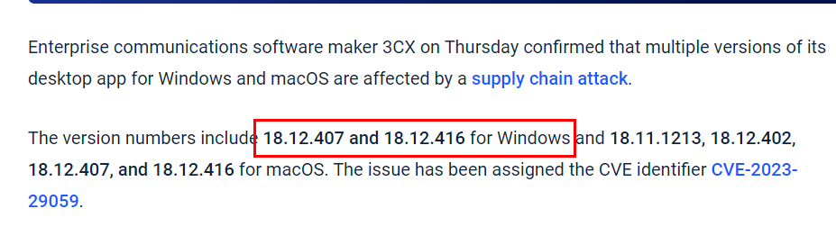
I did some research on this Supply Chain compromised and there are a lot of news, blogs, articles were made about this so pick one of them and you should be able to answer this question correctly (this image was taken from an article on [The Hacker News](https://thehackernews.com/2023/03/3cx-supply-chain-attack-heres-what-we.html))
```
2
```

>Q2: A supply chain attack targets a third-party vendor to gain unauthorized access to an organization's systems. The attacker compromises the vendor’s software or hardware supply chain, injecting malware or other malicious code that undermines the security of organizations using the vendor’s products. What's the UTC creation time of the .msi malware?

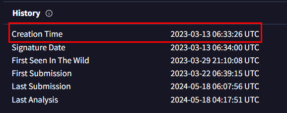
calculate file hash and search it on [VirusTotal](https://www.virustotal.com/gui/file/59e1edf4d82fae4978e97512b0331b7eb21dd4b838b850ba46794d9c7a2c0983/details) or you can upload it directly (since it will calculate a hash and searching through their record of this file anyway)
Then go to Details tab to grab Creation Time from this section
```
2023-03-13 06:33:26 UTC
```

* This question was supposed to ask for how many dropped files but since its impossible to find an actual answer as time files, more re-scan will be made and file dropped number will be changed so prop to CyberDefenders Team for adjusting this problem!
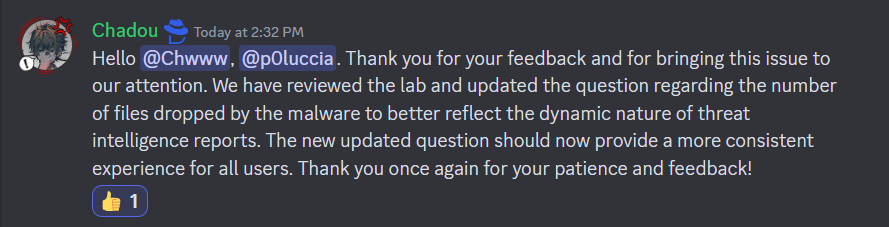

>Q3: Executable files (.exe) are frequently used as primary or secondary malware payloads, while dynamic link libraries (.dll) often load malicious code or enhance malware functionality. Analyzing files deposited by the Microsoft Software Installer (.msi) is crucial for identifying malicious files and investigating their full potential. Which malicious DLLs were dropped by the .msi file?

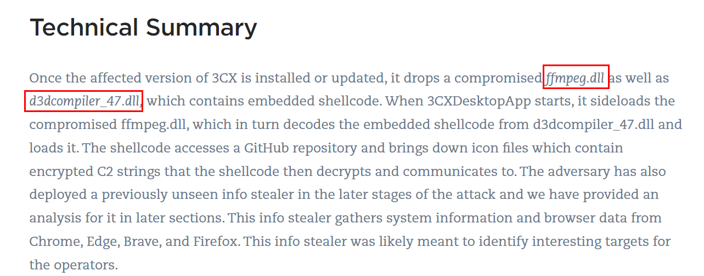
Every articles and blogs talking about them so you can just copy one of them to answer this question (This image was taken from a blog from [Qualys](https://blog.qualys.com/vulnerabilities-threat-research/2023/04/03/3cxdesktopapp-backdoored-in-a-suspected-lazarus-campaign))
```
ffmpeg.dll d3dcompiler_47.dll
```

>Q4: Recognizing the persistence techniques used in this incident is essential for current mitigation strategies and future defense improvements. What is the MITRE sub-technique ID employed by the .msi files to load the malicious DLL?

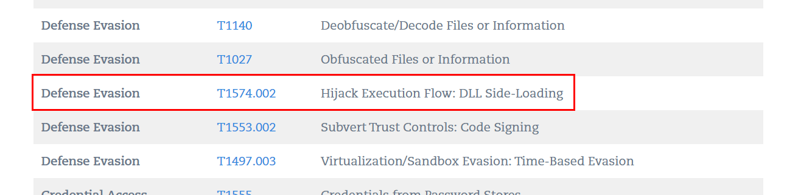
Luckily a blog made by [Qualys](https://blog.qualys.com/vulnerabilities-threat-research/2023/04/03/3cxdesktopapp-backdoored-in-a-suspected-lazarus-campaign) have MITRE TID Mapping section, we know its dll side loading so it has to be this one
```
T1574.002
```

>Q5: Recognizing the malware type (threat category) is essential to your investigation, as it can offer valuable insight into the possible malicious actions you'll be examining. What is the malware family of the two malicious DLLs?

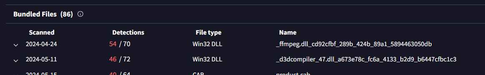
Now we are back to VirusTotal and we will take a look at both files here
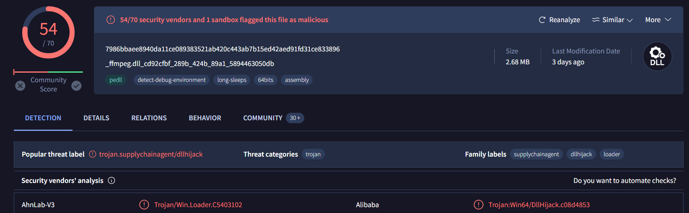
[ffmpeg.dll](https://www.virustotal.com/gui/file/7986bbaee8940da11ce089383521ab420c443ab7b15ed42aed91fd31ce833896) is a trojan
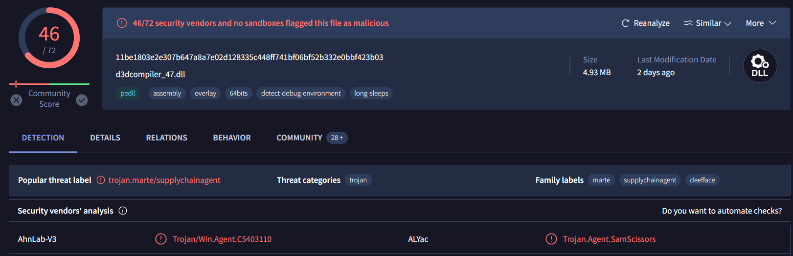
[d3dcompiler_47.dll](https://www.virustotal.com/gui/file/11be1803e2e307b647a8a7e02d128335c448ff741bf06bf52b332e0bbf423b03/detection) is also a trojan
```
trojan
```

>Q6: As a threat intelligence analyst conducting dynamic analysis, it's vital to understand how malware can evade detection in virtualized environments or analysis systems. This knowledge will help you effectively mitigate or address these evasive tactics. What is the MITRE ID for the virtualization/sandbox evasion techniques used by the two malicious DLLs?

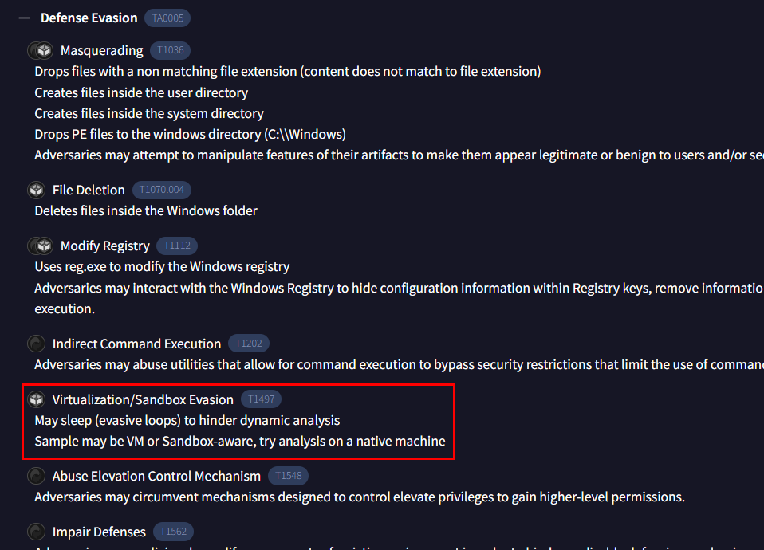
On Behavior tab of msi file and under of MITRE ATT&CK Tactics and Techniques, you will obtain MITRE there
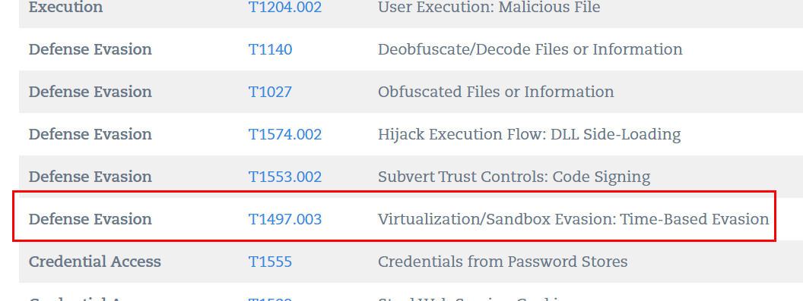
Or just from this blog made by [Qualys](https://blog.qualys.com/vulnerabilities-threat-research/2023/04/03/3cxdesktopapp-backdoored-in-a-suspected-lazarus-campaign) (just cut sub-technique ID out to match answer-format)
```
T1497
```

>Q7: When conducting malware analysis and reverse engineering, understanding anti-analysis techniques is vital to avoid wasting time. Which hypervisor is targeted by the anti-analysis techniques in the ffmpeg.dll file?

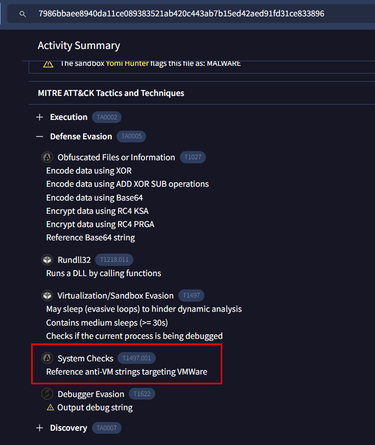
Go to [ffmpeg.dll](https://www.virustotal.com/gui/file/7986bbaee8940da11ce089383521ab420c443ab7b15ed42aed91fd31ce833896) behavior tab, under of MITRE ATT&CK Tactics and Techniques then you will see which hybervisor that was targeted by this dll file
```
VMWare
```

>Q8: Identifying the cryptographic method used in malware is crucial for understanding the techniques employed to bypass defense mechanisms and execute its functions fully. What cryptographic protocol is used for encryption by the ffmpeg.dll file?

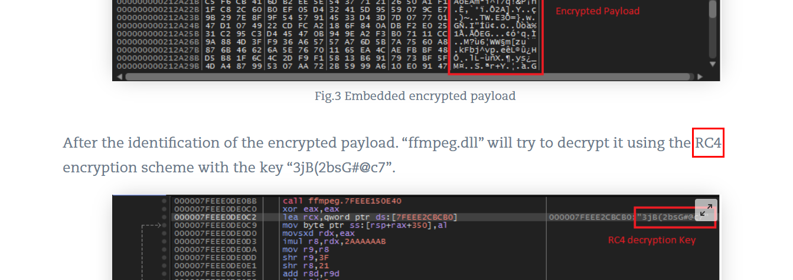
It was RC4
```
RC4
```

>Q9: As an analyst, you've recognized some TTPs involved in the incident, but identifying the APT group responsible will help you search for their usual TTPs and uncover other potential malicious activities. Which group is responsible for this attack?

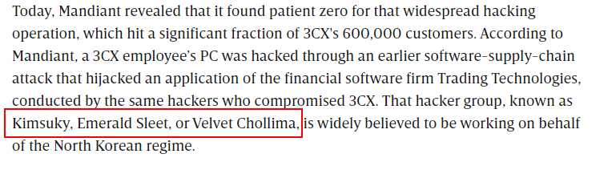
Wired posted an [article](https://www.wired.com/story/3cx-supply-chain-attack-times-two/) about this which believe that North Korea nation-stated hacker group response for this attack
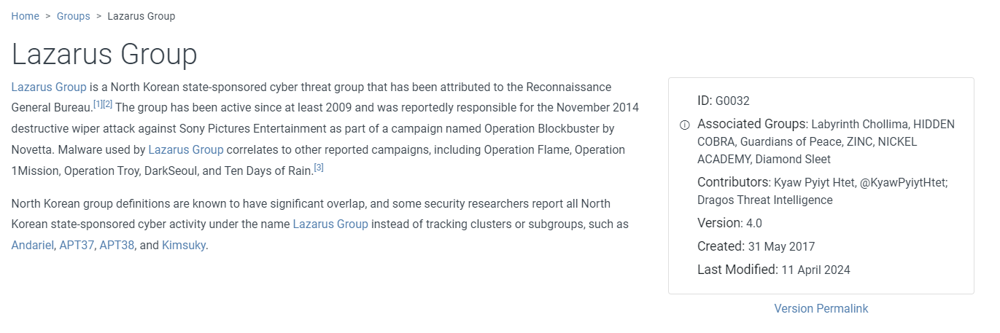
This group also known as Lazarus group
```
Lazarus
```

* * *
