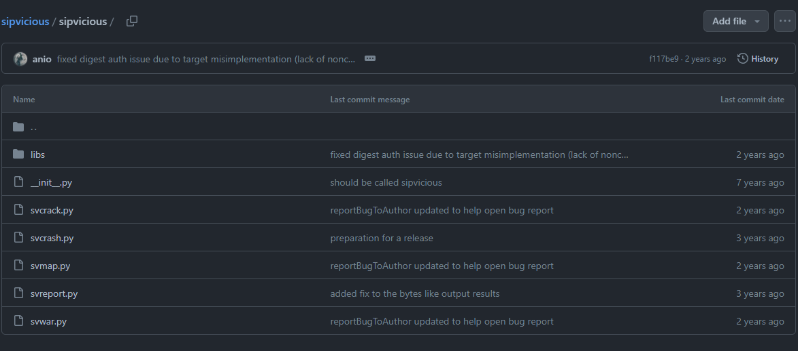
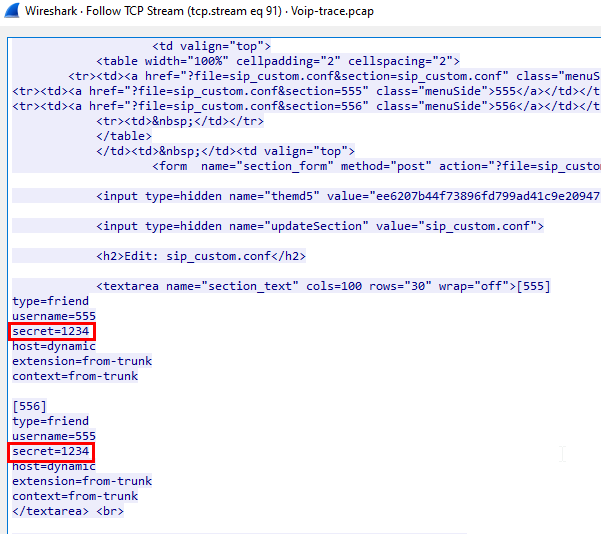
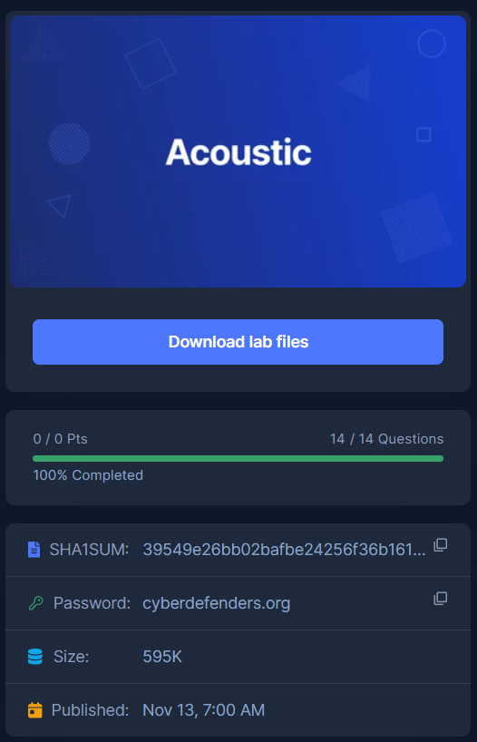

# [CyberDefenders - Acoustic](https://cyberdefenders.org/blueteam-ctf-challenges/acoustic/)
Created: 14/03/2024 10:49
Last Updated: 14/03/2024 14:55
* * *
>Category: Network Forensics
>Tags: Network, RTP, SIP, VoIP, T1123, T1046, T1190
* * *
This lab takes you into the world of voice communications on the internet. VoIP is becoming the de-facto standard for voice communication. As this technology becomes more common, malicious parties have more opportunities and stronger motives to control these systems to conduct nefarious activities. This challenge was designed to examine and explore some of the attributes of the SIP and RTP protocols. 

**Lab Files**:
- "*log.txt*" was generated from an unadvertised, passive honeypot located on the internet such that any traffic destined to it must be nefarious. Unknown parties scanned the honeypot with a range of tools, and this activity is represented in the log file.
   - The IP address of the honeypot has been changed to "honey.pot.IP.removed". In terms of geolocation, pick your favorite city.
   - The MD5 hash in the authorization digest is replaced with "MD5_hash_removedXXXXXXXXXXXXXXXX"
   - Some octets of external IP addresses have been replaced with an "X"
   - Several trailing digits of phone numbers have been replaced with an "X"
   - Assume the timestamps in the log files are UTC.
- "*Voip-trace.pcap*" was created by honeynet members for this forensic challenge to allow participants to employ network analysis skills in the VOIP context.

As a soc analyst, analyze the artifacts and answer the questions.

**Tools**:
- [BrimSecurity](http://www.brimsecurity.com/)
- [Wireshark](https://www.wireshark.org/)
* * *
## Questions
> Q1: What is the transport protocol being used?

I started this by opened pcap file on wireshark

And the first package is SIP packet then a lot of HTTP packets came after

I opened Protocol Statistics and found that there are a lot of UDP packets

And after reading about SIP protocol from https://www.nextiva.com/blog/sip-protocol.html

I was sure that udp is the answer of this question
```
udp
```

> Q2: The attacker used a bunch of scanning tools that belong to the same suite. Provide the name of the suite.

I followed UDP stream of the first SIP packet I found

There is some string that caught my eyes rightway so I went to google to find out what is it

Luckily, It is a tool used to VoIP security testing

Here is the github repo I found, https://github.com/EnableSecurity/sipvicious
```
sipvicious
```

> Q3: What is the User-Agent of the victim system? 

Answer still on my first udp stream

```
Asterisk PBX 1.6.0.10-FONCORE-r40
```

> Q4: Which tool was only used against the following extensions: 100,101,102,103, and 111?

So I went to sipvicious github 

then found that there are 5 python scripts that could be use to test VoIP

Fortunately, I went to `svcrack.py` first cuz on the Register function there is an attempt to make a request to VoIP server

And I also found that this `makeRequest` function was imported from `siphelper.py`


Then after compare each of different part of the request from this script and on wireshark, there are match so This is the one
```
svcrack.py
```

> Q5: Which extension on the honeypot does NOT require authentication?

I got my answer from `sip` filter

I found that other extensions got 401 Unauthorized back but the first extension got 200 OK back without using any credentials 

```
100
```

> Q6: How many extensions were scanned in total?

I took some hints on this question and found that the attacker used `svwar.py` then I went to read the description of this script

Its an extension line scanner, so it makes sense that attacker will use this tool to bruteforce and find the existence of extension lines this honeypot has 

This script also use `makeRequest` function and has similar context

I opened `log.txt` to find if I can use some search to find anything and I saw that I could use `Contact: sip:` to find out how many extension lines the attacker tried 

So I used this python script to read `log.txt` then put all starts with `Contact: sip:` to a new file

After I ran the script, I also found that there are duplicates and the first contact was from `svcrack.py` so I can cut that out

And I also saw the pattern that all contacts with `@honey.pot` are the one I was looking for 

So I did just that and got the answer
```
2652
```

> Q7: There is a trace for a real SIP client. What is the corresponding user-agent? (two words, once space in between)

I asked ChatGPT to write me a script to read `log.txt` and put all unique `User-Agent` into a list then print the list out later

There are 2 user-agents, the bottom one is the answer
```
Zoiper rev.6751
```

> Q8: Multiple real-world phone numbers were dialed. What was the most recent 11-digit number dialed from extension 101?

I had no clue about this question so I clicked for a hint and found that I needed to do soem research about how SIP works


I read the above diagram along with [Wiki](https://en.wikipedia.org/wiki/Session_Initiation_Protocol) so I finally got that the phone number will be sent with INVITE request

I found 4 INVITE requests on `log.txt` and the most recent one is this
```
00112524021
```

> Q9: What are the default credentials used in the attempted basic authentication? (format is username:password)

Now I went back to wireshark

I saw that on the GET `/mint` request came with Authentication Required so I could find the answer from this kind of request 

Which I finally got the answer, when the Status 301 was there I knew that the authentication was successful.
```
maint:password
```

> Q11: Which codec does the RTP stream use? (3 words, 2 spaces in between)

I searched on google how Codec look like

And I also found this [website](https://sonary.com/content/what-is-a-codec-and-why-is-it-important-for-voip/) explained about Codec which is very helpful

I came back to wireshark using filter `rtp` then Payload Type is the codec i was looking for
```
ITU-T G.711 PCMU
```

> Q12: How long is the sampling time (in milliseconds)?

On the website that I read while finding the answer for previous question, there is also an explaination about sampling rate which directly involved with this question

So from the explaination, 1 second happened 8000 times if sampling rate is 8000Hz

I also found codec this RTP was used and it got 8000Hz or 8kHz

Next I learned that wireshark has a tool for VoIP which can be access by Telephony > VoIP Calls (First Option) > Play Stream (At the bottom)

On this window, you can see that sampling rate of this call is 8000Hz

So I did some more researched on how to calculate sampling time in milisecond which is
`Sampling time = 1/sample rate in kHz` then `1 / 8 = 0.125`
```
0.125
```

> Q13: What was the password for the account with username 555?

I was too focused on SIP but couldn't find anything and used Find Packet on wireshark

and found that there is a config file for SIP was requested and it contained credentials 

```
1234
```

> Q14: Which RTP packet header field can be used to reorder out of sync RTP packets in the correct sequence?

I read RTP wiki and found that sequence number and timestamp could be used for that 

But the answer is timestamp
```
timestamp
```

> Q15: The trace includes a secret hidden message. Can you hear it?

on VoIP Calls, play it 

When you reached there, you will hear the secret code
```
mexico
```


* * *
