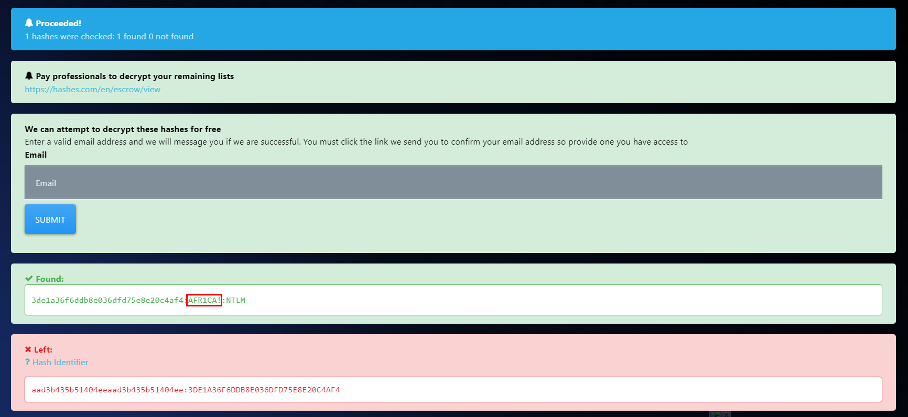

# [CyberDefenders - AfricanFalls](https://cyberdefenders.org/blueteam-ctf-challenges/africanfalls/)
Created: 02/05/2024 00:35
Last Updated: 13/06/2024 08:47
* * *
>Category: Endpoint Forensics
>Tags: Disk Forensic, Eric Zimmerman's Tools, FTK Imager, Autopsy, Mimikatz, ShellBags Explorer, BrowsingHistoryView, WinPrefetchView, Metdata Extractor, Rifiuti2, Tor, T1005
* * *
John Doe was accused of doing illegal activities. A disk image of his laptop was taken. Your task as a soc analyst is to analyze the image and understand what happened under the hood.

**Tools**:
- [FTK Imager](https://accessdata.com/product-download/ftk-imager-version-4-5)
- [Autopsy](https://www.autopsy.com/download/)
- [rifiuti2](https://abelcheung.github.io/rifiuti2/)
- [Browsing History View](https://www.nirsoft.net/utils/browsing_history_view.html)
- [WinPrefetchView](https://www.nirsoft.net/utils/win_prefetch_view.html)
- [ShellBagsExplorer](https://f001.backblazeb2.com/file/EricZimmermanTools/ShellBagsExplorer.zip)
- [mimikatz](https://github.com/gentilkiwi/mimikatz/wiki)
- [Metdata Extractor](http://exif.regex.info/exif.cgi)
- [Online Hash Crack](https://www.onlinehashcrack.com/)
- [NTLM Hash](https://hashes.com/en/decrypt/hash)
* * *
## Questions
> Q1: What is the MD5 hash value of the suspect disk?


An evidence file was created using FTK Imager, which came with log file that also has MD5 checksum
```
9471e69c95d8909ae60ddff30d50ffa1
```

> Q2: What phrase did the suspect search for on 2021-04-29 18:17:38 UTC? (three words, two spaces in between)

Windows Search is the first thing that came in mind but I didn't find any artifact

But there are several browsers installed on this system, the first one we gonna look at is Chrome History so if user searching something on Google, it will be logged in `History` file

Using ChromeHistoryView from NirSoft to parse all data

Go to Options then check for "Show Time In GMT" then sort by "Visited On", you will find the exact time and keyword that was used to search on Google
```
password cracking lists
```

> Q3: What is the IPv4 address of the FTP server the suspect connected to?

	
After doing some recon on suspected disk I found that FireZilla was installed on this system so I went to `Roaming\FileZilla` to grab `recentservers.xml` which store an information about the lastest server FileZilla was connected to
```
192.168.1.20
```

> Q4: What date and time was a password list deleted in UTC? (YYYY-MM-DD HH:MM:SS UTC)


A file that was deleted supposed to be in Recycle Bin so I went to Recycle Bin then after figure it out which SID associated with John Doe, I finally found the password list that was deleted

$I file is metadata of the actual file that will be created when a file is deleted so we will copy it date and change it to UTC
```
2021-04-29 18:22:17 UTC
```

> Q5: How many times was Tor Browser ran on the suspect's computer? (number only)


Prefetch is an artifact that was created when a program is loading then it can be fetch later faster and the one we're looking for is `tor.exe.*.pf` but I didn't find any of it, only the installer which could mean that Tor only got installed but not launch even once

We can also export prefetch folder and use PECmd from EZ Tools Suite to parse all prefetchs with this command `PECmd -d \Prefetch --json prefetch.json`

Use Timeline Explorer from EZ Tools Suite to open an output from PECmd and find for Tor executable file and There is no result

Only TOR that was found is the installer 
```
0
```

> Q6: What is the suspect's email address?

I did not find any outlook artifact or any ost file 

but luckily on Chrome Browser History, user visited protonmail and it also logged an email of suspicious email 
```
dreammaker82@protonmail.com
```

> Q7: What is the FQDN did the suspect port scan?

On John Doe's Desktop, I found nmap/zenmap shortcut which mean user using this tool to conduct port scan activity but sadly I do not know any artifact related to port scanning

I took a hint and found that PowerShell History can be used to solve this challenge which you can see that user conducted port scanning using PowerShell and the only Domain that was scanned is `dfir.science`
```
dfir.science
```

> Q8: What country was picture "20210429_152043.jpg" allegedly taken in?


After searching through user directory, I found several images inside Contact folder 

Use Exiftool to display metadata of this image which also have GPS Coordinate when this image was taken then we can use https://www.gps-coordinates.net/ to find out where it is

```
Zambia
```

> Q9: What is the parent folder name picture "20210429_151535.jpg" was in before the suspect copy it to "contact" folder on his desktop?

The artifact related to folder change is ShellBags that stored inside HKCU `UsrClass.dat` hive

Export it

Then use ShellBags Explorer to parse registry hive(don't forget to hold SHIFT to parse dirty hive) then you can see that only directory related to Picture is Camera from LG Q7  

I went back to an image and using Exiftool, we can see Camera model that shooting this image

And it's manufacture so to put it simply, user took photos using this camera and then plugged in to this system which all images was transferred to Contact folder
```
Camera
```

> Q10: A Windows password hashes for an account are below. What is the user's password? Anon:1001:aad3b435b51404eeaad3b435b51404ee:3DE1A36F6DDB8E036DFD75E8E20C4AF4:::


Using [Hashes.com](https://hashes.com/en/decrypt/hash) we got a password for this user
```
AFR1CA!
```

> Q11: What is the user "John Doe's" Windows login password?

First we need to dump NTML hash from this disk and a tool we will use to dump is mimikatz which is a the popular tool for credential dumping using by sevaral hackers and APTs 

We also need to export SAM and SYSTEM hives

Then executed mimikatz then using this command `lsadump::sam /system:SYSTEM /sam:SAM` to dump NTLM hashes

We got one

Using hashes.com to de-hash
```
ctf2021
```


* * *
