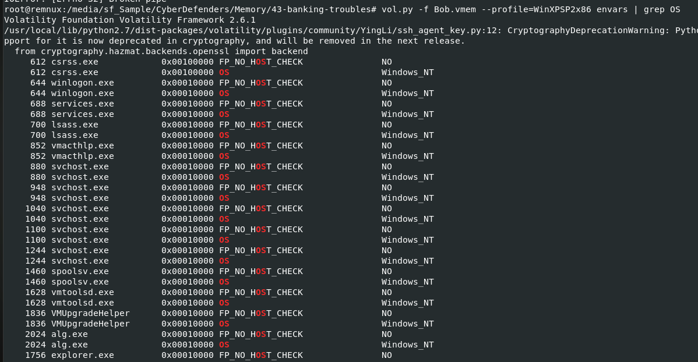
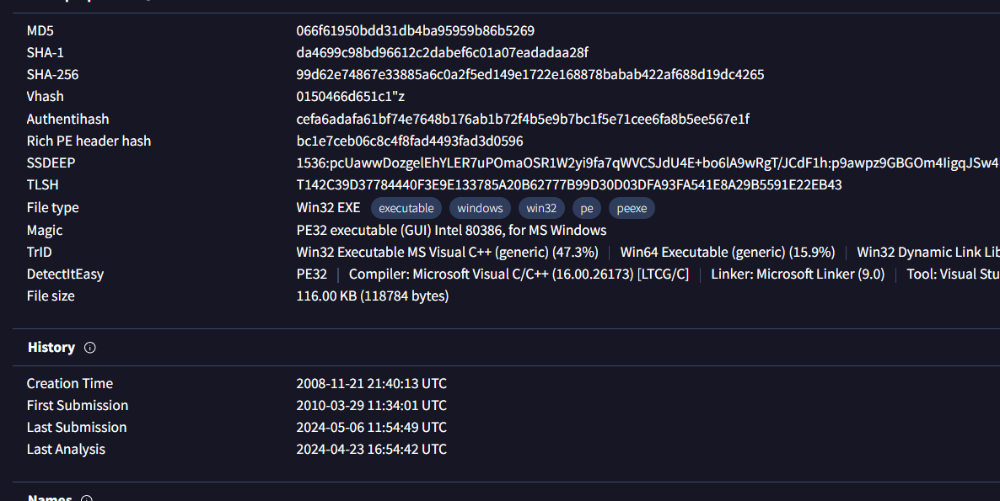

# [CyberDefenders - BankingTroubles](https://cyberdefenders.org/blueteam-ctf-challenges/bankingtroubles/)
Created: 23/05/2024 21:29
Last Updated: 24/05/2024 09:08
* * *
>Category: Endpoint Forensics
>Tags: Memory Forensic, Volatility, Didier Stevens Suite, T1565, T1071, T1140, T1203, T1112, T1059.007, T1204, T1566.001
* * *
Company X has contacted you to perform forensics work on a recent incident that occurred. One of their employees had received an e-mail from a co-worker that pointed to a PDF file. Upon opening, the employee did not notice anything; however, they recently had unusual activity in their bank account.

The initial theory is that a user received an e-mail, containing an URL leading to a forged PDF document. Opening that document in Acrobat Reader triggers a malicious Javascript that initiates a sequence of actions to take over the victim's system.

Company X was able to obtain a memory image of the employee's virtual machine upon suspected infection and asked you as a security blue team analyst to analyze the virtual memory and provide answers to the questions.

**Supportive Tools**:
- [PDF-Tools](https://blog.didierstevens.com/programs/pdf-tools/)
- [Malfind](https://github.com/volatilityfoundation/volatility/wiki/Command-Reference-Mal)
- [libemu](http://libemu.carnivore.it/)
- [Volatility](https://github.com/volatilityfoundation/volatility)
- [Strings](https://linux.die.net/man/1/strings)
- [Foremost](https://linux.die.net/man/1/foremost)
- [Hexdump](https://linux.die.net/man/1/hexdump)
- [Firebug](https://blog.getfirebug.com/)
- [Objdump](https://linux.die.net/man/1/objdump)
* * *
## Questions
> Q1: What was the local IP address of the victim's machine?


First I used imageinfo to determine which profile to use and its WinXPSP2x86

next I tried to use netscan which didn't support this profile so I used `vol.py -f Bob.vmem --profile=WinXPSP2x86 connections` instead then you can see local IP address of this machine
```
192.168.0.176
```

> Q2: What was the OS environment variable's value?


We can use envars plugin to display a process's environment variables then combined with grep like this `vol.py -f Bob.vmem --profile=WinXPSP2x86 envars | grep OS`
```
Windows_NT
```

> Q3: What was the Administrator's password?


There are 2 ways we can proceed with this question either with lsadump or hashdump but hashdump should be more accurate and faster so I used `vol.py -f Bob.vmem --profile=WinXPSP2x86 hashdump`


Then we can use `john --wordlist=/usr/share/wordlists/rockyou.txt admin_hash` to crack NTLM hash 
```
PASSWORD
```

> Q4: Which process was most likely responsible for the initial exploit?


I used `vol.py -f Bob.vmem --profile=WinXPSP2x86 pstree` to list all processes first then according to the scenario, acrobat reader process likely to be the one that responsible for this and as you can see that it was a process spawned under firefox so user might opened an email from Firefox then use Acrobat reader to open it
```
AcroRd32.exe
```

> Q5: What is the extension of the malicious file retrieved from the process responsible for the initial exploit?

It is obviously PDF
```
pdf
```

> Q6: Suspicious processes opened network connections to external IPs. One of them starts with "2". Provide the full IP.


back to connections plugin, you can see that processes that contacted this IP address is firefox and acrobat reader
```
212.150.164.203
```

> Q7: A suspicious URL was present in process svchost.exe memory. Provide the full URL that points to a PHP page hosted over a public IP (no FQDN).


I used `strings Bob.vmem | grep -Ei "http.*php|php.*http"` and let it scroll for a while until I saw this then I stopped which was the right choice
```
http://193.104.22.71/~produkt/9j856f_4m9y8urb.php
```

> Q8: Extract files from the initial process. One file has an MD5 hash ending with "528afe08e437765cc". When was this file first submitted for analysis on VirusTotal?


Lets dump that process with `vol.py -f Bob.vmem --profile=WinXPSP2x86 memdump --pid=1752 --dump-dir /tmp/outfile/`, It will take quite a while here

Then we will have to use foremost to recover those files from this dump process

After foremost finished, go to output directory and read `audit.txt` then we can see how many files were extracted and look like we only have 7 pdf files here

md5hash all of them then pipe to grep, you will get a file (I renamed it, in case I forgot)

After searched in hash on VirusTotal, go to Details and History to grab the First Submission for an answer
```
2010-03-29 19:31:45
```

> Q9: What was the PID of the process that loaded the file PDF.php?

of course, Its an acrobat process
```
1752
```

> Q10: The JS includes a function meant to hide the call to function eval(). Provide the name of that function.


I used peepdf and we can see that it was embbeded with Javascript and the encoded part is in object 1054

For some reason, peepdf-3 is not working for me 

*After struggling for a while, It has to be Python2 only, same for peepdf-3 which couldn't be used

So I used `python2 /usr/local/bin/pdf-parser.py --raw -o 1054 -f malicious_pdf.pdf -d malicious.js` to dump malicious Javascript to a new file instead


But after you got a file, use `js-beautify malicious.js > beautify_malicious.js` to beautify JS script to make it easier to read

eval is in this weird function
```
HNQYxrFW
```

> Q11: The payload includes 3 shellcodes for different versions of Acrobat reader. Provide the function name that corresponds to Acrobat v9.


We will use js-patched to deobfuscated the code and we need to add closing bracket to JS script file first then use `js-patched beautify_malicious.js`, it will triggered an error but what we really want is `eval.100.log`

You can see that there are conditions to check for number
On the last function, if its lower than 9 it will triggered this function so this function is checking for Acrobat version
```
XiIHG
```

> Q12: Process winlogon.exe hosted a popular malware that was first submitted for analysis at VirusTotal on 2010-03-29 11:34:01. Provide the MD5 hash of that malware.


First I used malfind to find if winlogon were also detected, which it is

Grab it pid and dump it using `vol.py -f Bob.vmem --profile=WinXPSP2x86 malfind --pid=644 -D /tmp/outfile/winlogon/` and look like we got 6 different winlogon dump files here


Instead of manually search all of them on VirusTotal, I read this [write-up](https://forensicskween.com/ctf/cyberdefenders/bankingtroubles/)  and found that we can use clamav to scan for a malware from these files which leaves us with only 1 file identifies as [Zeusbot](https://blogs.blackberry.com/en/2020/04/threat-spotlight-zeus-infostealer-trojan)

Confirming its maliciousness and history on VirusTotal, we can confirmed it was the right one 
```
066f61950bdd31db4ba95959b86b5269
```

> Q13: What is the name of the malicious executable referenced in registry hive '\WINDOWS\system32\config\software', and is variant of ZeuS trojan?


From this [blog](https://blogs.blackberry.com/en/2020/04/threat-spotlight-zeus-infostealer-trojan), we know that Zeus bot added an executable file `sdra64.exe` (which is an answer of this question) to winlogon key

To legitimately solve this question, We have to use hivelist plugin to find virtual address of software hive (`vol.py -f Bob.vmem --profile=WinXPSP2x86 hivelist`)

Then we can use `vol.py -f Bob.vmem --profile=WinXPSP2x86 printkey -o 0xe1526748 -K 'Microsoft\Windows NT\CurrentVersion\Winlogon'`  to print value of this key

```
sdra64.exe
```

> Q14:The shellcode for Acrobat v7 downloads a file named e.exe from a specific URL. Provide the URL. 


I confirmed that this file existed on the memory image with `vol.py -f Bob.vmem --profile=WinXPSP2x86 filescan | grep "e.exe"` 


I remembered that there are other urls that kept appearing from `strings Bob.vmem | grep -Ei "http.*php|php.*http"` output, which is the correct answer for this question

```
http://search-network-plus.com/load.php?a=a&st=Internet Explorer 6.0&e=2
```

> Q15: The shellcode for Acrobat v8 exploits a specific vulnerability. Provide the CVE number.


I didn't know where to start since Zeus exploited so many Acrobat CVEs from time to time ([Ref](https://www.bitdefender.com/blog/hotforsecurity/scanned-documents-spreading-zbot/)) so I checked for hint and it told me to use [jsunpack-n](https://github.com/urule99/jsunpack-n) but for some reason (again) probably due to my remnux is the lastest version but jsunpack-n lastest update is 9 years ago, it didn't work for me 

I checked for another hint and used Google which finally lead me to an answer of this question
```
CVE-2008-2992
```


* * *

Special Thanks to these write-up which leads me to solved this lab and learned a lot of new things
- https://mmox.me/posts/writeups/bankingtroubles-memory-image-forensics/
- https://forensicskween.com/ctf/cyberdefenders/bankingtroubles/
- https://medium.com/@cyberforensicator57/cyberdefenders-org-banking-troubles-ctf-walkthrough-plus-xavier-memory-analysis-framework-intro-ac6b20cc0206