# [CyberDefenders - BlackEnergy](https://cyberdefenders.org/blueteam-ctf-challenges/blackenergy/)
Created: 24/05/2024 17:48
Last Updated: 12/06/2024 07:40
* * *
>Category: Endpoint Forensics
>Tags: Memory Forensic, Volatility, T1093.004, T1055.001
* * *
**Scenario**:
A multinational corporation has been hit by a cyber attack that has led to the theft of sensitive data. The attack was carried out using a variant of the BlackEnergy v2 malware that has never been seen before. The company's security team has acquired a memory dump of the infected machine, and they want you, as a soc analyst, to analyze the dump to understand the attack scope and impact.
* * *
## Questions
> Q1: Which volatility profile would be best for this machine?

By using volatility 2 imageinfo plugin `vol.py -f CYBERDEF-567078-20230213-171333.raw imageinfo`, it will suggest that 2 profiles but the one we will use will be "WinXPSP2x86"
```
WinXPSP2x86
```

> Q2: How many processes were running when the image was acquired?

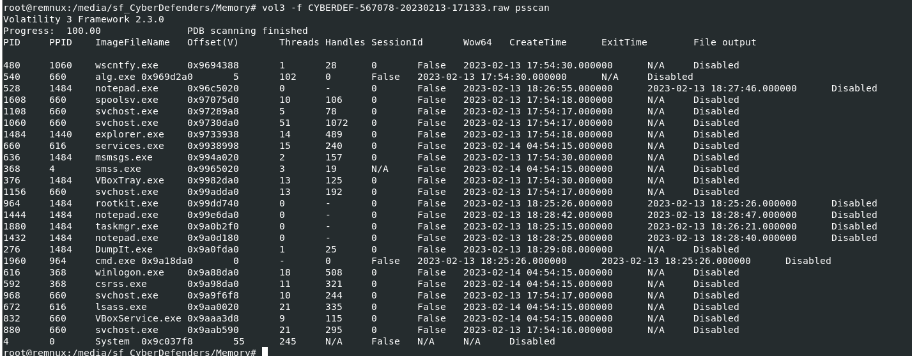
by running `vol3 -f CYBERDEF-567078-20230213-171333.raw psscan`, we can see that there are 25 processes and 6 processes were already exited which leave us with 19 processes that still running
```
19
```

> Q3: What is the process ID of cmd.exe?

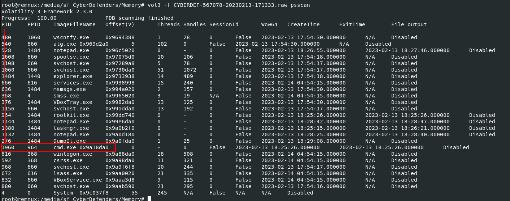
```
1960
```

> Q4: What is the name of the most suspicious process?

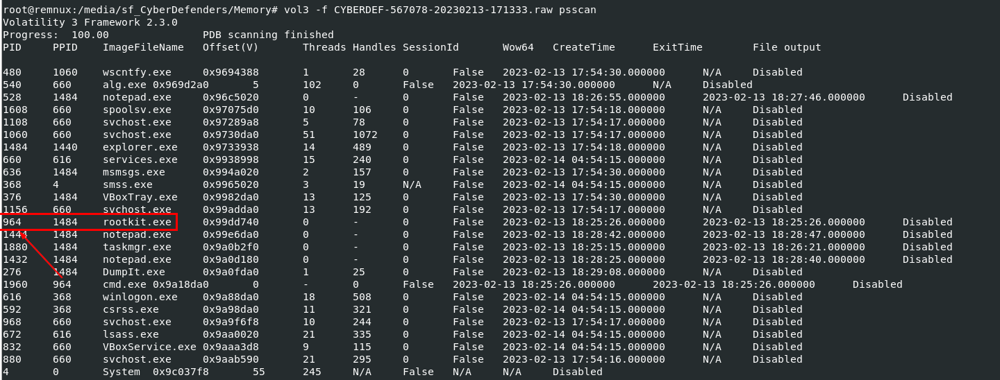
Well.. Its self-explanatory here
```
rootkit.exe
```

> Q5: Which process shows the highest likelihood of code injection?

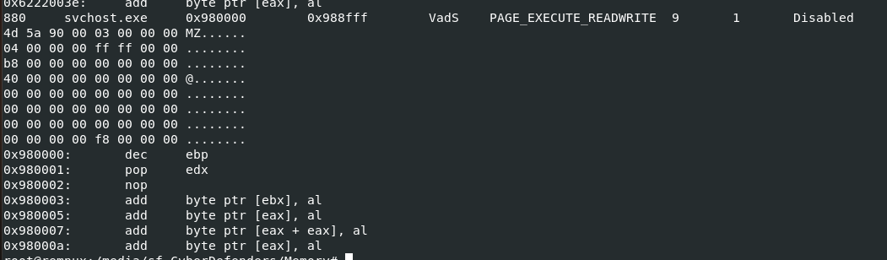
malfind plugin will help us find that process so I used `vol3 -f CYBERDEF-567078-20230213-171333.raw windows.malfind` then after scanning is completed, there are a lot of winlogon.exe found and this svchost.exe that caught my eyes has "MZ.." in it so I'll look into this process first

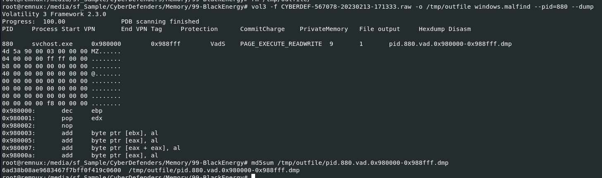
Lets dump it using with `vol3 -f CYBERDEF-567078-20230213-171333.raw -o /tmp/outfile windows.malfind --pid=880 --dump` then use md5sum to calculate file hash then search it on VirusTotal
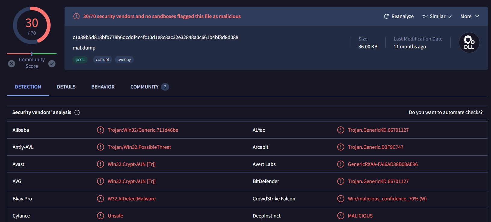
As expected this process is indeed malicious

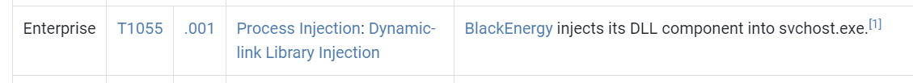
And if its really BlackEnergy malware then it made sense why it has to be this process
```
svchost.exe
```

> Q6: There is an odd file referenced in the recent process. Provide the full path of that file.

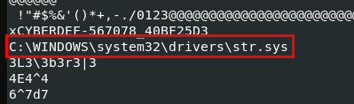
I used `strings /tmp/outfile/pid.880.vad.0x980000-0x988fff.dmp` to find any path hidden in this files and there is one
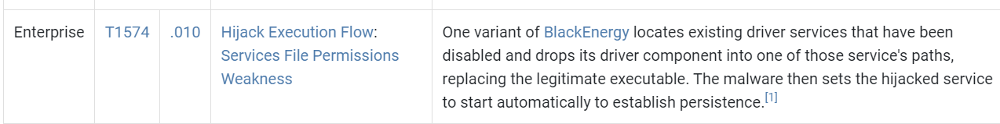
Probably for persistence
```
C:\WINDOWS\system32\drivers\str.sys
```

> Q7: What is the name of the injected dll file loaded from the recent process?

For a plugin that detected dll injection, I would recommend you to read this [blog](https://imphash.medium.com/windows-process-internals-a-few-concepts-to-know-before-jumping-on-memory-forensics-part-2-4f45022fb1f8) which is very helpful and informative for this question

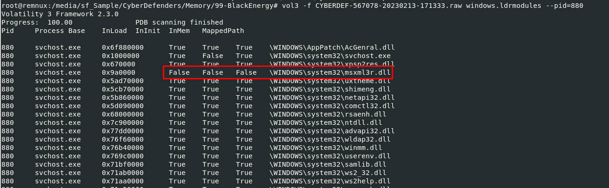
So lets do this `vol3 -f CYBERDEF-567078-20230213-171333.raw windows.ldrmodules --pid=880` then we will find the only one dll that does not mapped for all 3 
```
msxml3r.dll
```

> Q8: What is the base address of the injected dll?

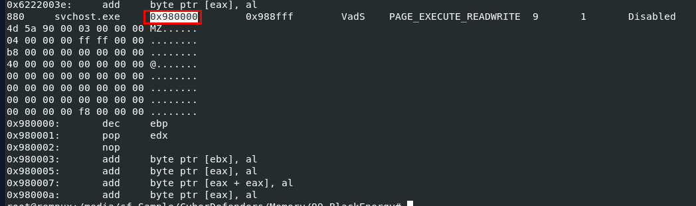
We can get this by using malfind and the base address could be found here
```
0x980000
```


You can read more about this malware [here](https://attack.mitre.org/software/S0089/)

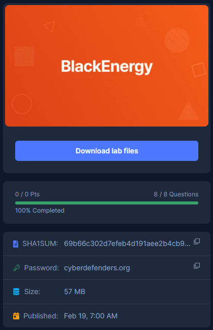
* * *
