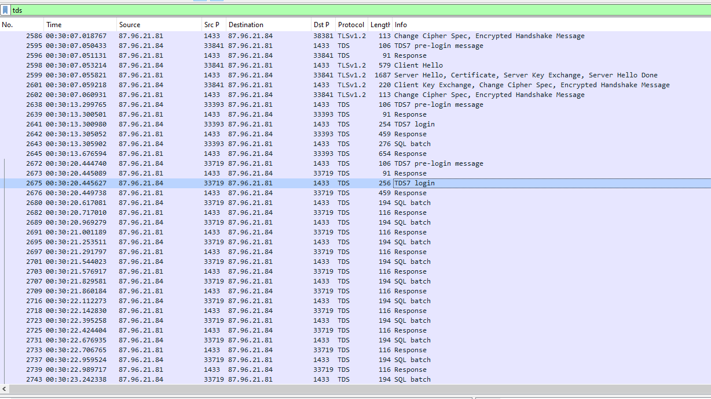
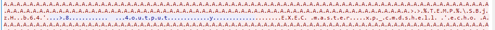
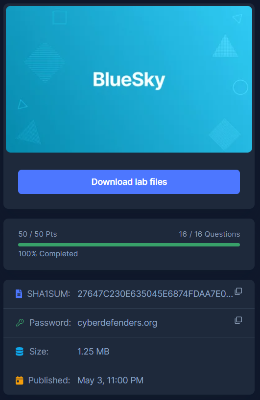

# [CyberDefenders - BlueSky Ransomware](https://cyberdefenders.org/blueteam-ctf-challenges/bluesky-ransomware/)
Created: 18/05/2024 15:49
Last Updated: 19/05/2024 01:30
* * *
>**Category**: Network Forensics
>**Tags**: Wireshark, PCAP, Event Logs, ransomware, NetworkMiner
* * *
**Scenario:**
As a cybersecurity analyst on SecureTech's Incident Response Team, you're tackling an urgent case involving a high-profile corporation that suspects a sophisticated cyber attack on its network. The corporation, which manages critical data across various industries, has experienced a ransomware attack, leading to the encryption of files and an immediate need for expert assistance to mitigate the damages and investigate the breach.

Your role in the team is to conduct a detailed analysis of the evidence to determine the extent and nature of the attack. Your objective is to identify the tactics, techniques, and procedures (TTPs) used by the threat actor to help your client contain the threat and restore the integrity of their network.

**Tools**:
- Wireshark
- Network Miner
- Windows Event Viewer
- Event Log Explorer
- VirusTotal
- CyberChef

* * *
## Questions
Before taking on this challenge you should know a little bit (or more) about this ransomware first and Thodex pretty much sum up everything about malware [here](https://www.thodex.com/ransomware/bluesky/) 

>Q1: Knowing the source IP of the attack allows security teams to respond to potential threats quickly. Can you identify the source IP responsible for potential port scanning activity?


To make life easy, I used NetworkMiner for this question then I realized there are over 1000+ sessions were captured on this pcap file so I went to it and sort out S. port 

then I realized that "87.96.21.84" was likely to conduct port scanning activity on  "87.96.21.81"


The same result could obviously be seen on Wireshark too
```
87.96.21.84
```

>Q2: During the investigation, it's essential to determine the account targeted by the attacker. Can you identify the targeted account username?


NetworkMiner caught one credential which was from TDS protocol (a protocol that MSSQL Server used) both username and password can be used as an answer from this question and next question


Or you can inspect this TDS7 login packet to get both answer
```
sa
```


If we filtered TDS protocol on WireShark, we can see that there are several login attempts which look like a bruteforce attack to gain access to SQL Server (Notice those handshake, likely most of communication will be encrypted so PREPARE for some noises!)

After scrolling down, I found SQL Batch here so lets dig it

Well its pretty noisy as expected but we can still see that an attacker used xp_cmdshell to executed command on this remoted system

[xp_cmdshell](https://learn.microsoft.com/en-us/sql/relational-databases/system-stored-procedures/xp-cmdshell-transact-sql?view=sql-server-ver16) is a built-in Microsoft SQL Server procedure that allow to users to execute operating system commands directly from within the SQL Server environment

And that is how an attacker will successfully deploy any command they pleased 

Even though it was noisy we can still see that an attacker echo base64 strings into a file end with ".b64" which likely to be decoded and executed later at the end 

We don't have to be too stubborn to read and decode all of that "yet"

NetworkMiner already did the thing for us

Go to Paremeters tab, you can see that a lot of SQL queried were made start by showing advanced option then made change to enable xp_cmdshell

And here we are with pure queries without those noises!

Our only problem is to copy all of them and making some sense! 

After reading though some of them without decoding, I found that there is also a vbs script was created in Temp folder to decode base64 in `%TEMP%\SBjzH.b64` and save it to `%TEMP%\LkUYP.exe`

Confirmed by ChatGPT

>Q3: We need to determine if the attacker succeeded in gaining access. Can you provide the correct password discovered by the attacker?
```
cyb3rd3f3nd3r$
```

>Q4: Attackers often change some settings to facilitate lateral movement within a network. What setting did the attacker enable to control the target host further and execute further commands?

From previous question, we already dig deep enough into that but we can obtain this information on event log file too

I used [hayabusa](https://github.com/Yamato-Security/hayabusa) for this one (`hayabusa csv-timeline -f BlueSkyRansomware.evtx`) and the result from this command show us that there are several failed logon attempt to MSSQL Server as expected from our previous investigation on WireShark and there is one XPCmdshell Option Change which is a high alert one (We will keep PowerShell for next question)


We can totally see that it was changed after those failed logon 
```
xp_cmdshell
```

>Q5: Process injection is often used by attackers to escalate privileges within a system. What process did the attacker inject the C2 into to gain administrative privileges?

From previous hayabusa result about PowerShell, i did more research about this topic and found this report published by [theDFIRreport](https://thedfirreport.com/2023/12/04/sql-brute-force-leads-to-bluesky-ransomware/) and I regretted that I didn't do this faster cuz it tells us everything we need to know to solve this challenge

So after obtained clues from this report, now it making sense that an executable we found on Q2 is likely to be a Cobalt Strike beacon 

I went back to WireShark and confirmed that there is a connection was established after TDS communication (SQL Batch) was completed

Back to Hayabusa, we can see that this tool caught this process injection activity and you can see that this winlogon process has MSFConsole as a hostname which should be obvious at this point
```
winlogin.exe
```

>Q6: Following privilege escalation, the attacker attempted to download a file. Can you identify the URL of this file downloaded?


Scrolling down after Encrypted communication, We finally found something we can get our hand of.


An attacker downloaded `checking.ps1` from his python server 

```
http://87.96.21.84/checking.ps1
```

According to [The DFIR Report](https://thedfirreport.com/2023/12/04/sql-brute-force-leads-to-bluesky-ransomware/) this script was used to perform
- Admin privilege check
- OS check
- disable PowerShell Warning
- Check if a connection to C2 server is reachable
- Attempt to download `kallen.ps1` which is a mimikatz powershell version but this part was not seen in a script we inspected on Wireshark
- Disable Anti-Virus solutions from various vendors if have the right privilege 
 
- If SYSTEM privilege obtained, then drop another powershell script named `del.ps1` and create a task named `\Microsoft\Windows\MUI\LPupdate` which will run `del.ps1` every 4 hours and also download and execute another powershell script name `ichigo-lite.ps1` 

- If SYSTEM privilege is not obtained, it will also  drop another powershell script named `del.ps1` but will create a task named `Optimize Start Menu Cache Files-S-3-5-21-2236678155-433529325-1142214968-1237` which will run `del.ps1` every 3 hours

Lets examine `del.ps1` 

It check for these tools which can be used to conduct malware analysis and found any suspicious activities that was being conduct by an attacker and if it found any of them, it will kill it.

Lets examine `ichigo-lite.ps1`

Well.. It does a lot of things so lets break it down
- It downloads and executes `Invoke-PowerDump.ps1` which allowed an attacker to dump all user NTLM hash as SYSTEM and save it in `hashes.txt`

- It also downloads and executes `Invoke-SMBExec.ps1` which allowed an attacker to execute any command using SMB
- It downloads a list of target hosts from a remote server as `extracted_hosts.txt` 
- It uses the extracted username and password hash to execute commands on each target host using the `Invoke-SMBExec`. (It still unclear what commands are being used but in my opinion, it just to prove which username and password hash could be used then a malware will be sent to those hosts using SMBExec later)

- Lastly, it will download an executable file to ProgramData folder which is likely to be BlueSky Ransomware itself


I think we got everything we need to know now, lets continue with the rest 

>Q7: Understanding which group Security Identifier (SID) the malicious script checks to verify the current user's privileges can provide insights into the attacker's intentions. Can you provide the specific Group SID that is being checked?


We know what `checking.ps1` have this SID and with a little explanation from ChatGPT, its pretty clear why it needs need SID to proceed with other processes
```
S-1-5-32-544
```

>Q8: Windows Defender plays a critical role in defending against cyber threats. If an attacker disables it, the system becomes more vulnerable to further attacks. What are the registry keys used by the attacker to disable Windows Defender functionalities? Provide them in the same order found.


Go to StopAV function inside `checking.ps1`, you will find these keys that associated with Windows Defender directly
```
DisableAntiSpyware,DisableRoutinelyTakingAction,DisableRealtimeMonitoring,SubmitSamplesConsent,SpynetReporting
```

>Q9: Can you determine the URL of the second file downloaded by the attacker?
```
http://87.96.21.84/del.ps1
```

>Q10: Identifying malicious tasks and understanding how they were used for persistence helps in fortifying defenses against future attacks. What's the full name of the task created by the attacker to maintain persistence?
```
\Microsoft\Windows\MUI\LPupdate
```

>Q11: According to your analysis of the second malicious file, what is the MITRE ID of the tactic the file aims to achieve?


`del.ps1` aimed to kill those tools to hide what happening to a system so it has to be Defense Evasion


```
TA0005
```

>Q12: What's the invoked PowerShell script used by the attacker for dumping credentials?
```
Invoke-PowerDump.ps1
```

>Q13: Understanding which credentials have been compromised is essential for assessing the extent of the data breach. What's the name of the saved text file containing the dumped credentials?
```
hashes.txt
```

>Q14: Knowing the hosts targeted during the attacker's reconnaissance phase, the security team can prioritize their remediation efforts on these specific hosts. What's the name of the text file containing the discovered hosts?
```
extracted_hosts.txt
```

>Q15: After hash dumping, the attacker attempted to deploy ransomware on the compromised host, spreading it to the rest of the network through previous lateral movement activities using SMB. You’re provided with the ransomware sample for further analysis. By performing behavioral analysis, what’s the name of the ransom note file?


NetworkMiner already calculated filehash for me so I can just search this hash on [VirusTotal](https://www.virustotal.com/gui/file/3e035f2d7d30869ce53171ef5a0f761bfb9c14d94d9fe6da385e20b8d96dc2fb) directly

This ransomware is from Conti family, use this as an answer for next question

Go to Behavior tab and scroll down to Files Dropped section, you got the pattern now
```
# DECRYPT FILES BLUESKY #
```

>Q16: In some cases, decryption tools are available for specific ransomware families. Identifying the family name can lead to a potential decryption solution. What's the name of this ransomware family?
```
Conti
```


* * *
