# [CyberDefenders - Brave](https://cyberdefenders.org/blueteam-ctf-challenges/brave/)
Created: 15/06/2024 21:03
Last Updated: 16/06/2024 01:14
* * *
>Category: Endpoint Forensics
>Tags: Memory Forensic, Volatility, Brave, T1041, T1204, T1071.001, T1003, T1083, T1082
* * *
A memory image was taken from a seized Windows machine. As a security blue team analyst, analyze the image and answer the provided questions.

**Tools**:
- [Volatility 3](https://github.com/volatilityfoundation/volatility3)
- [CertUtil](https://docs.microsoft.com/en-us/windows-server/administration/windows-commands/certutil)
- [HxD](https://mh-nexus.de/en/hxd/)
* * *
## Questions
> Q1: What time was the RAM image acquired according to the suspect system? (YYYY-MM-DD HH:MM:SS)

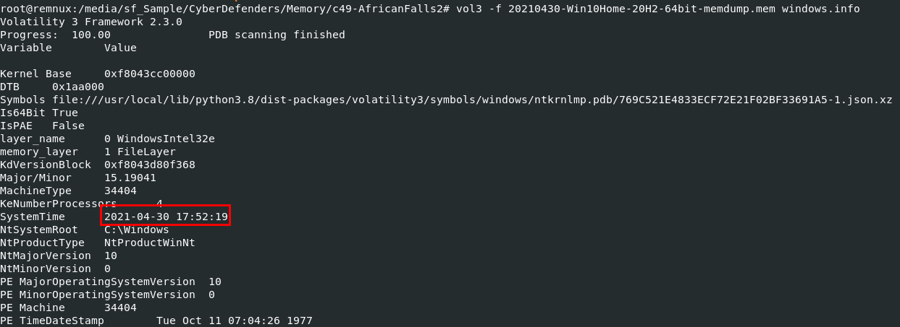

We will use `vol3 -f 20210430-Win10Home-20H2-64bit-memdump.mem windows.info` to display system information including system time when this memory dump was captured

```
2021-04-30 17:52:19
```

> Q2: What is the SHA256 hash value of the RAM image?

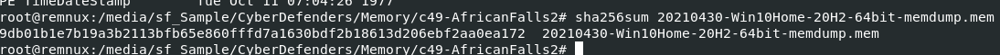

Use your hash calculator to calculate filehash and if you're on linux distro then use `sha256sum 20210430-Win10Home-20H2-64bit-memdump.mem`

```
9db01b1e7b19a3b2113bfb65e860fffd7a1630bdf2b18613d206ebf2aa0ea172
```

> Q3: What is the process ID of "brave.exe"?

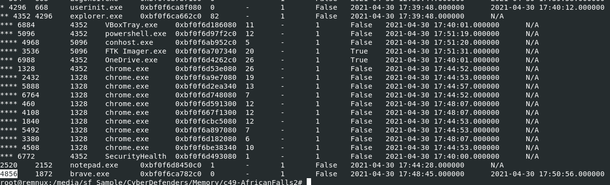

Easily done with `vol3 -f 20210430-Win10Home-20H2-64bit-memdump.mem windows.pstree > pstree.txt`

Why piping it to text file? 

because I want to keep an output from pstree plugin in a text file so we can review it later and you can see that there is only 1 `brave.exe` process that already exited

```
4856
```

> Q4: How many established network connections were there at the time of acquisition? (number)

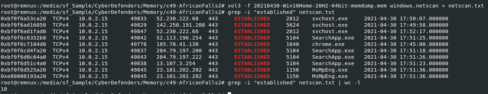

First off, we will use `vol3 -f 20210430-Win10Home-20H2-64bit-memdump.mem windows.netscan > netscan.txt` to list all network connection and send it to a text file

so we can use `grep -i "established" netscan.txt | wc -l` to count all established connections

```
10
```

> Q5: What FQDN does Chrome have an established network connection with?

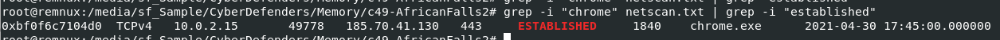

get an IP address that chrome established connection to

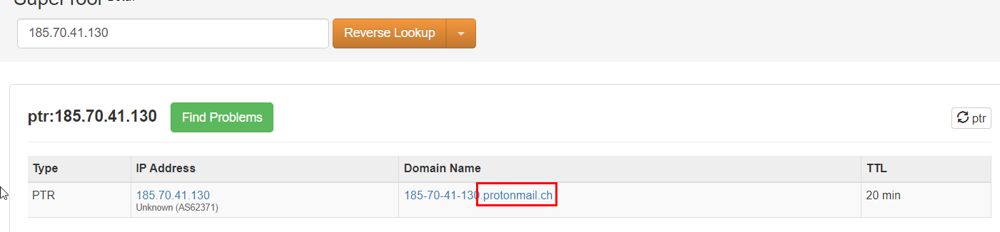

Then put it in [Reverse IP lookup tool](https://mxtoolbox.com/SuperTool.aspx?action=ptr%3a185.70.41.130&run=toolpage) which we can see that this IP address belongs to protonmail

```
protonmail.ch
```

> Q6: What is the MD5 hash value of process executable for PID 6988?

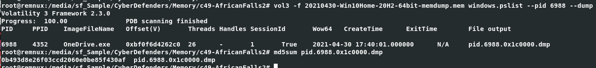

Lets dump this process with `vol3 -f 20210430-Win10Home-20H2-64bit-memdump.mem windows.pslist --pid 6988 --dump` then use `md5sum` to calculate file hash

```
0b493d8e26f03ccd2060e0be85f430af
```

> Q7: What is the word starting at offset 0x45BE876 with a length of 6 bytes?

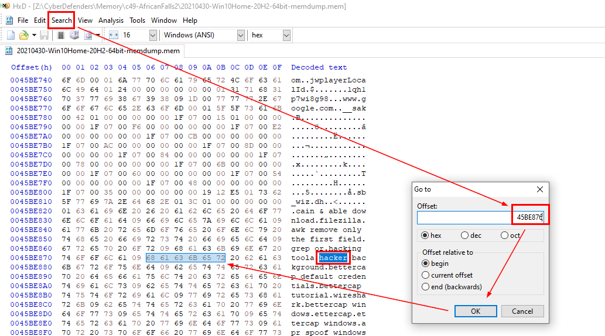

I switched to FlareVM that has HxD installed then after opened this memory dump with HxD, Click "Search" > "Go to" > Put an offset inside Offset box > "Ok"

Then we will see the word "hacker" perfectly matches what we're looking for

```
hacker
```

> Q8: What is the creation date and time of the parent process of "powershell.exe"? (YYYY-MM-DD HH:MM:SS)

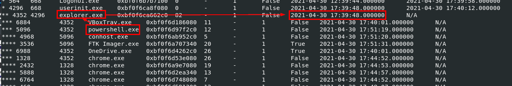

Go back to our pstree text file, we can see that powershell process was spawned under explorer process so we will have to get create time of `explorer.exe` process 

```
2021-04-30 17:39:48
```

> Q9: What is the full path and name of the last file opened in notepad?

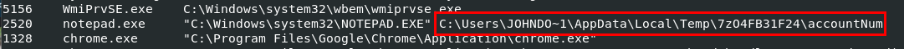

We will try `vol3 -f 20210430-Win10Home-20H2-64bit-memdump.mem windows.cmdline` first because normally when we opened a file with notepad, notepad process will be executed with a path of that file.

And it worked just fine

```
C:\Users\JOHNDO~1\AppData\Local\Temp\7zO4FB31F24\accountNum
```

> Q10: How long did the suspect use Brave browser? (hh:mm:ss)

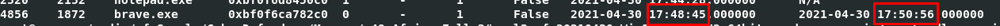

If you thought that the time between process creation and process end time might be the answer, sadly its incorrect

So we will shift our focus to UserAssist key that store an information about how many times each application were launched and duration that were used.


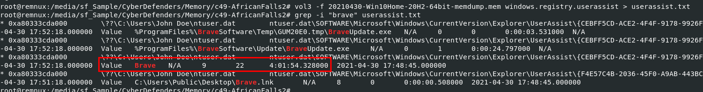

So we will use `vol3 -f 20210430-Win10Home-20H2-64bit-memdump.mem windows.registry.userassist > userassist.txt && grep -i "brave" userassist.txt` to save an output to text file and find any "brave" string within this text file, we will see that Brave were running for 4 hours!

```
04:01:54
```

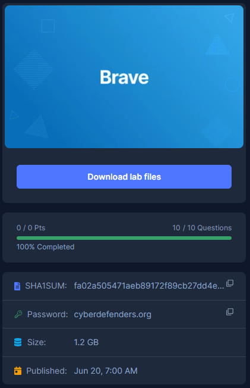
* * *
