# [CyberDefenders - DeepDive](https://cyberdefenders.org/blueteam-ctf-challenges/deepdive/)
Created: 11/06/2024 22:07
Last Updated: 12/06/2024 22:15
* * *
>Category: Endpoint Forensics
>Tags: Memory Forensic, Process Injection, Volatility, T1059, T1204, T1564.001, T1055
* * *
**Scenario**
You have given a memory image for a compromised machine. As a security blue team analyst Analyze the image and figure out attack details.

**Tools**
- [Volatility 2](https://github.com/volatilityfoundation/volatility)

**Resources**
- https://www.geoffchappell.com/studies/windows/km/ntoskrnl/api/ob/inc/header/infomask.htm
 
* * *
## Questions
> Q1: What profile should you use for this memory sample?

First I'll use `vol.py -f banking-malware.vmem kdbgscan`  to identifying kernel structures which make imageinfo plugin a lot easier to determine which profile to use 

Because when running imageinfo plugin, it will also used result from kdbgscan to determine the most suitable profile for us

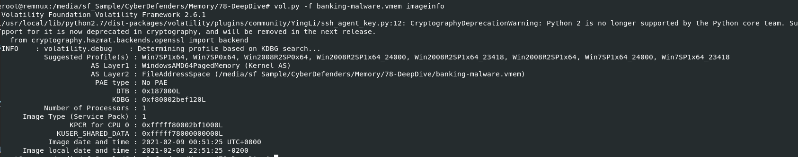

And the result shows sevaral profiles, normally first profile should be the one that I will be used but not on this lab so apparently we need to figure it out which one of this is the most suitable one

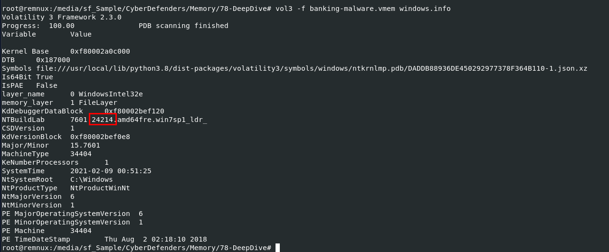

I used volatility 3 to help me scan for Windows information, you can see that it found build of this OS that is 24214 but we didn't have this exact profile from previous scan so the most suitable one should be 24000 build profile which is the closest build to 24214

```
Win7SP1x64_24000
```

> Q2: What is the KDBG virtual address of the memory sample?

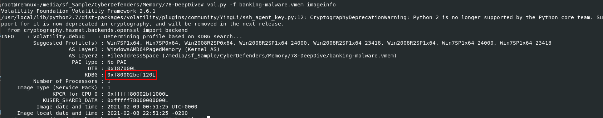

We can find this from result of imageinfo plugin

```
0xf80002bef120
```

> Q3: There is a malicious process running, but it's hidden. What's its name?

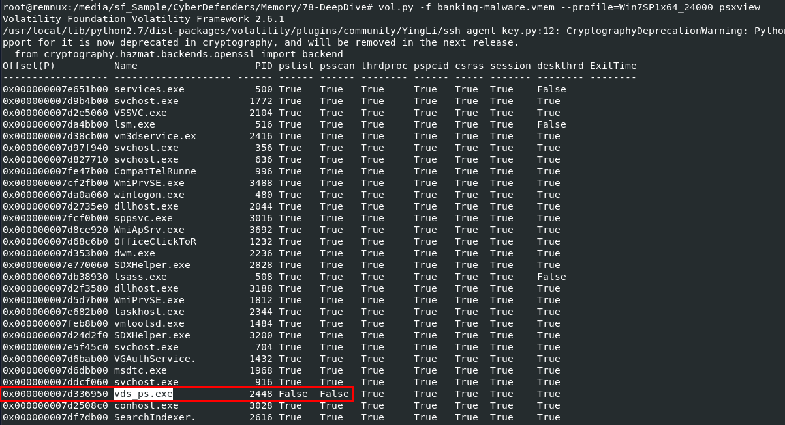

To find hidden process, it mean it was hidden from pslist and psscan so we need to use `vol.py -f banking-malware.vmem --profile=Win7SP1x64_24000 psxview` to find it which you can see that only 1 process that couldn't be find with both plugins

```
vds_ps.exe
```

> Q4: What is the physical offset of the malicious process?
```
0x000000007d336950
```

> Q5: What is the full path (including executable name) of the hidden executable?

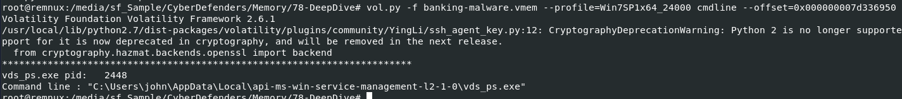

We can use filescan or `vol.py -f banking-malware.vmem --profile=Win7SP1x64_24000 cmdline --offset=0x000000007d336950` for this question

```
C:\Users\john\AppData\Local\api-ms-win-service-management-l2-1-0\vds_ps.exe
```

> Q6: Which malware is this?

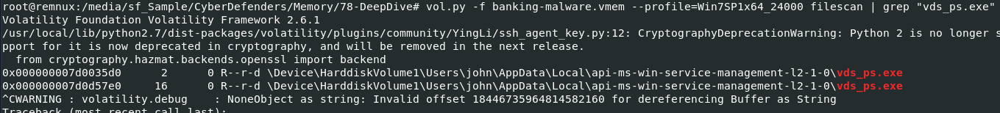

Seem like using filescan (`vol.py -f banking-malware.vmem --profile=Win7SP1x64_24000 filescan | grep "vds_ps.exe"`) on previous question would be the best choice so we can use offset to dump this file rightaway

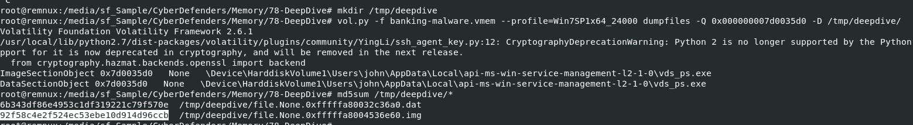

After got an offset of this file, use `vol.py -f banking-malware.vmem --profile=Win7SP1x64_24000 dumpfiles -Q 0x000000007d0035d0 -D /tmp/deepdive/` to dump it then we can see that we got 2 files from dumpfiles plugin but the one that will be flagged as malicious by VirusTotal is the `.img` file
 
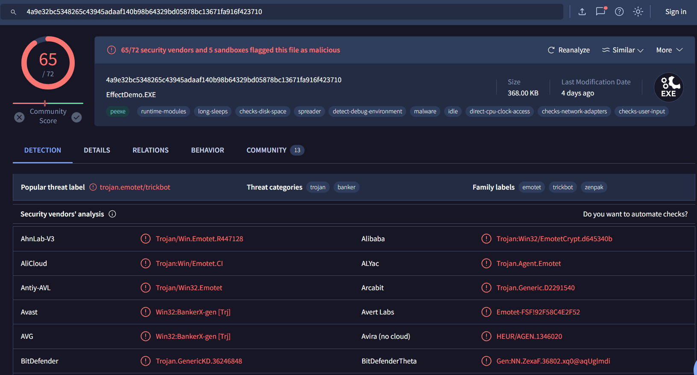

it is EMOTET

```
Emotet
```

> Q7: The malicious process had two PEs injected into its memory. What's the size in bytes of the Vad that contains the largest injected PE? Answer in hex, like: 0xABC

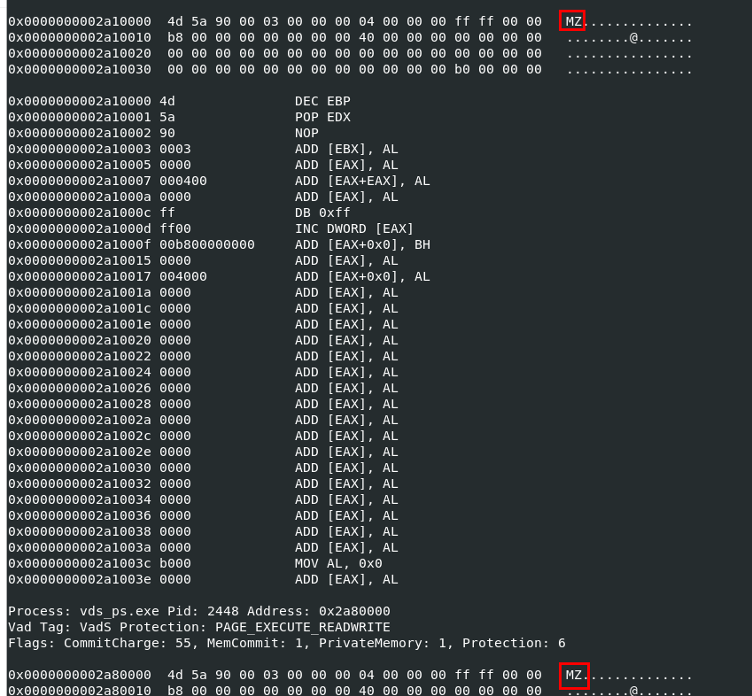

First we need to use `vol.py -f banking-malware.vmem --profile=Win7SP1x64_24000 malfind --offset=0x000000007d336950` to find all PE that were injected by this process, results return with 3 different memory address but only 2 have the sign of injection that is 4d5a (MZ) - the magic number of an executable file (exe)

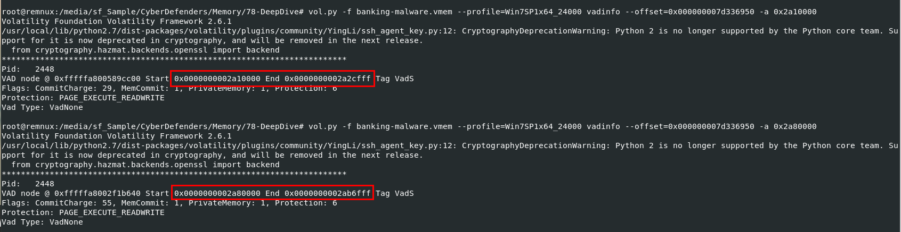

Copy both address that use vadinfo given offset of emotet process and address of injected PE to get the end of each injected PE in memory

- `vol.py -f banking-malware.vmem --profile=Win7SP1x64_24000 vadinfo --offset=0x000000007d336950 -a 0x2a10000`

- `vol.py -f banking-malware.vmem --profile=Win7SP1x64_24000 vadinfo --offset=0x000000007d336950 -a 0x2a80000`

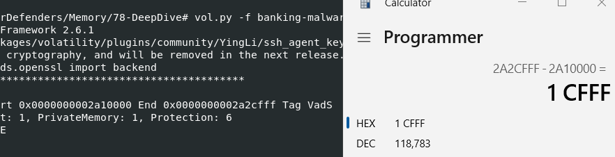
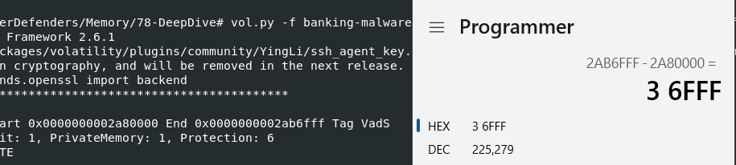

After got start and end address of both then we can use calculator to calculate which one is the largest 

```
0x36fff
```

> Q8: This process was unlinked from the ActiveProcessLinks list. Follow its forward link. Which process does it lead to? Answer with its name and extension

**Understanding ActiveProcessLinks**
`ActiveProcessLinks` is a doubly linked list used by the Windows operating system to keep track of all active processes. Each process has a structure known as the `EPROCESS` (Executive Process), which contains various fields, including `ActiveProcessLinks`. This field is used to link each process to the next and previous process in the list, forming a circular list of all active processes. 

To put it simply, we just need to find process ID next to emotet process ID

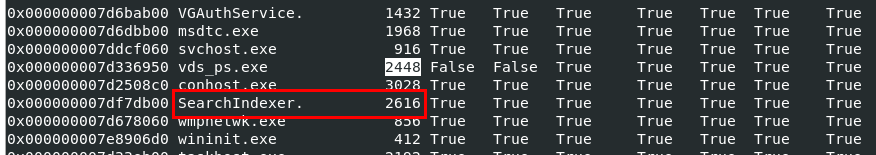

This process has the next closest process ID to emotet process ID which should be this one 

```
SearchIndexer.exe
```

> Q9: What is the pooltag of the malicious process in ascii? (HINT: use volshell)

a pool tag is a four-character identifier that is associated with a memory allocation in the system's kernel memory pools. Each kernel-mode memory allocation (from the paged or non-paged pool) is tagged with a pool tag

Which we need to use `vol.py -f banking-malware.vmem --profile=Win7SP1x64_24000 volshell` to interactively interact with this memory dump like WinDbg

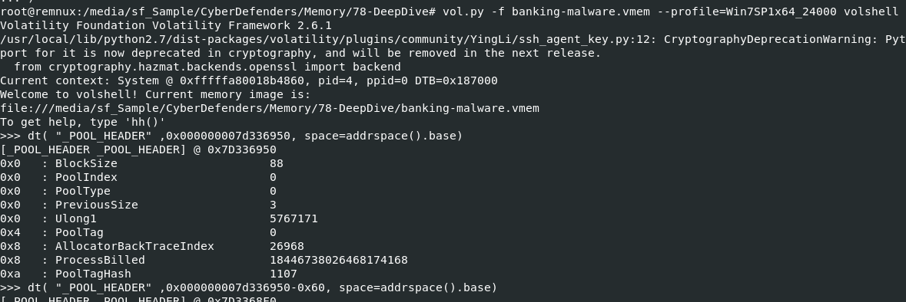

Next I used `dt( "_POOL_HEADER" ,0x000000007d336950, space=addrspace().base)` to display `POOL_HEADER` of this emotet process based on its offset but as you can see that PoolTag of this offset is 0 which mean we didn't give the right offset 

To be honest, This question is way too ahead of my leauge so I had some write-up to fully understand this but thats the point of all challenges right? its all about learning new things!

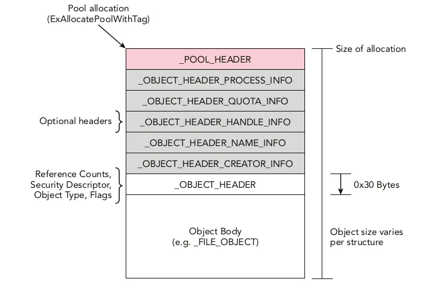

Here is the paged pool allocation diagram I found on this [write-up](https://medium.com/@sky__/memory-udom-x-m455-ctf-2023-writeup-a97e573f583d), what we want is PoolTag inside `_POOL_HEADER` and physical offset we got from psxview is `EPROCESS` object inside `Object Body` on this diagram

So we need to subtract by 0x30 to reach `_OBJECT_HEADER` Then lets use `dt("_OBJECT_HEADER", 0x000000007d336950-0x30, space=addrspace().base)` to identify where we're right now

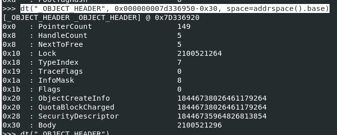

we know for sure that it should be optional headers after `_OBJECT_HEADER`,  but doesn't mean all 5 optional headers should be presented at the same time  but rather one that used for the purpose of this allocation so to find an answer we should take a look at InfoMask which is represented used optional header

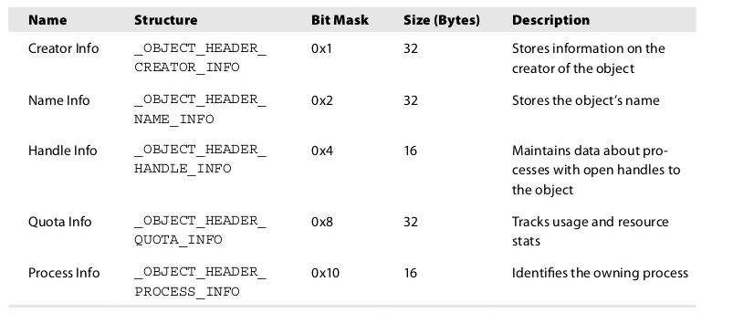

According from the table, its `_OBJECT_HEADER_QUOTA_INFO` which has a size of 32 bytes translated to 0x20

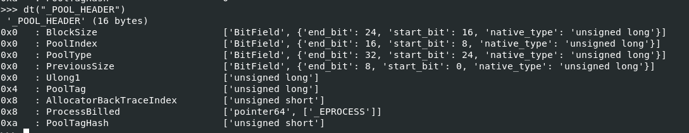

But its not there yet to find an actual PoolTag, we need to subtract with 0x10 to account for alignment or other kernel-level metadata that ensures the structures are correctly aligned in memory to be able to pinpoint at `POOL_HEADER` correctly

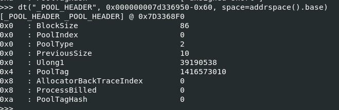

At the end we will have `dt("_POOL_HEADER", 0x000000007d336950-0x60, space=addrspace().base)` to print out pooltag in demical for us

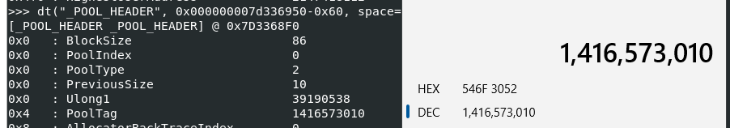

Convert to HEX

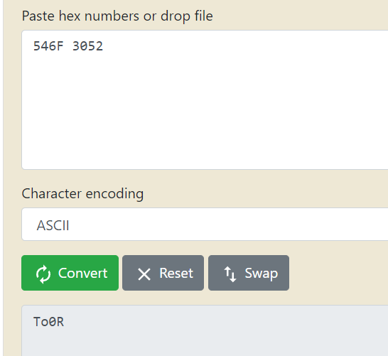

Then convert HEX to ASCII but its not the final form yet, we still need to reverse it because of the endian

```
R0oT
```

> Q10: What is the physical address of the hidden executable's pooltag? (HINT: use volshell)

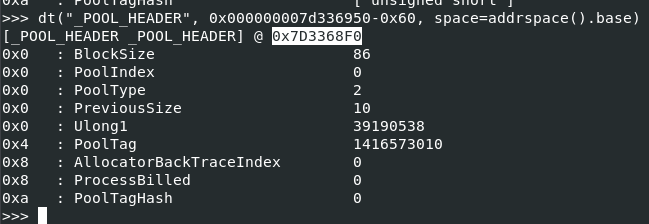

We need to add 4 bytes to this address because The PoolTag is an unsigned long (4 bytes) starting at offset 0x4 within the `_POOL_HEADER` structure. To access the PoolTag directly, we calculate its address by adding the offset where PoolTag is stored (0x4) to the base address of the` _POOL_HEADER`

```
0x7D3368F4
```


* * *
