# [CyberDefenders - DumpMe](https://cyberdefenders.org/blueteam-ctf-challenges/dumpme/)
Created: 05/06/2024 01:42
Last Updated: 13/06/2024 12:48
* * *
>Category: Endpoint Forensics
>Tags: Memory Forensics, Volatility, DFIR, T1071, T1027, T1106, T1059
* * *
**Scenario**:
A SOC analyst took a memory dump from a machine infected with a meterpreter malware. As a Digital Forensicators, your job is to analyze the dump, extract the available indicators of compromise (IOCs) and answer the provided questions.

**Tools**:
- [Volatility 2](https://github.com/volatilityfoundation/volatility)
- [sha1sum](https://en.wikipedia.org/wiki/Sha1sum)
* * *
## Questions
> Q1: What is the SHA1 hash of Triage-Memory.mem (memory dump)?

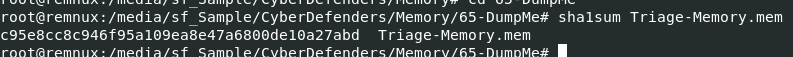

We can use `sha1sum Triage-Memory.mem` to generate sha1hash of this memory dump

```
c95e8cc8c946f95a109ea8e47a6800de10a27abd
```

> Q2: What volatility profile is the most appropriate for this machine? (ex: Win10x86_14393)

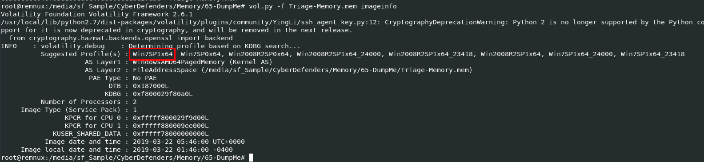

To determine what the suitable profile, we need to use `vol.py -f Triage-Memory.mem imageinfo` and the first profile on the leftmost is the most appropriate one

```
Win7SP1x64
```

> Q3: What was the process ID of notepad.exe?

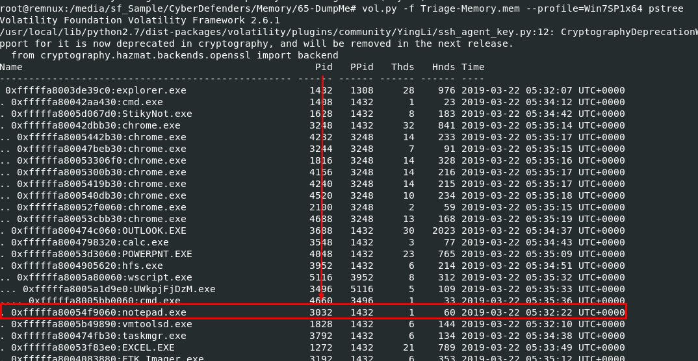

We can use pstree for this (`vol.py -f Triage-Memory.mem --profile=Win7SP1x64 pstree`) and we can see that aside from notepad, there are other suspicious processes on this machine when it was dumped 

```
3032
```

> Q4: Name the child process of wscript.exe.

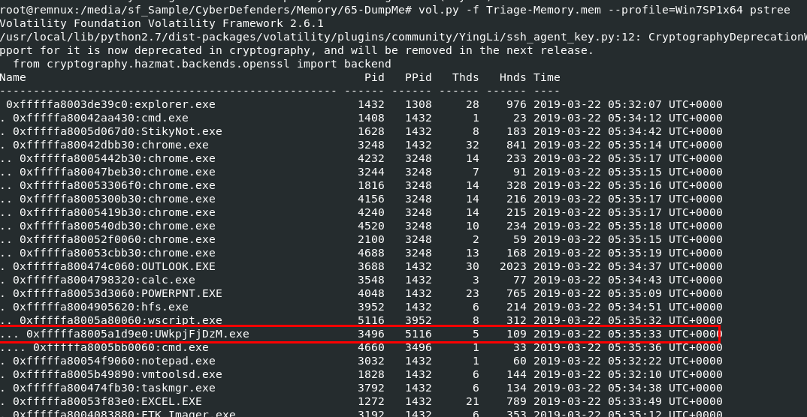

```
UWkpjFjDzM.exe
```

> Q5: What was the IP address of the machine at the time the RAM dump was created?

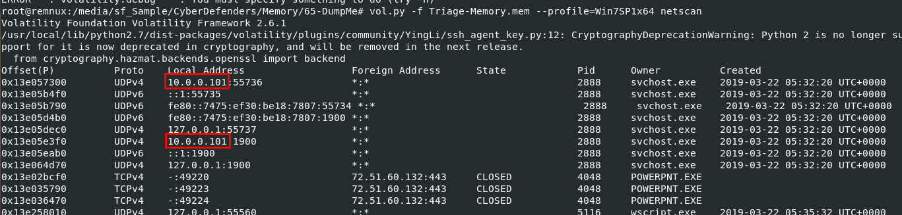

Use netscan plugin for this (`vol.py -f Triage-Memory.mem --profile=Win7SP1x64 netscan`)

```
10.0.0.101
```

> Q6: Based on the answer regarding the infected PID, can you determine the IP of the attacker?

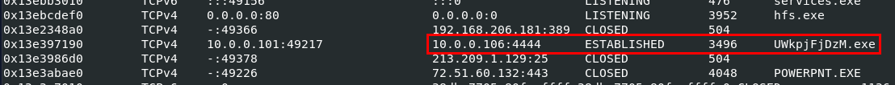
from netscan plugin output, we can see that the most suspicious we found on Q4 established a connection to `10.0.0.106` on port 4444 which look like a meterpreter reverse shell

```
10.0.0.106
```

> Q7: How many processes are associated with VCRUNTIME140.dll?

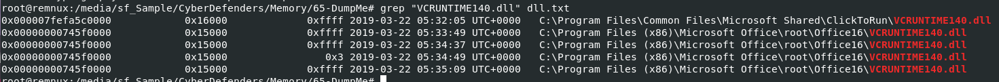

We can use dlllist plugin and pipe to grep for this but we won't know which process loads this dll 

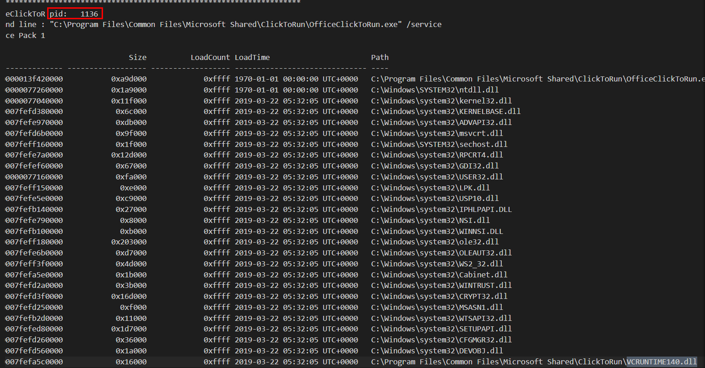

then we can use `vol.py -f Triage-Memory.mem --profile=Win7SP1x64 dlllist > dll.txt` and search for all unique pid that loaded this dll

```
5
```

> Q8: After dumping the infected process, what is its md5 hash?

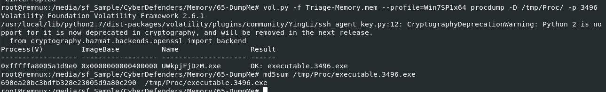

We need to dump this process using `vol.py -f Triage-Memory.mem --profile=Win7SP1x64 procdump -D /tmp/Proc/ -p 3496` then use `md5sum` to generate MD5 hash

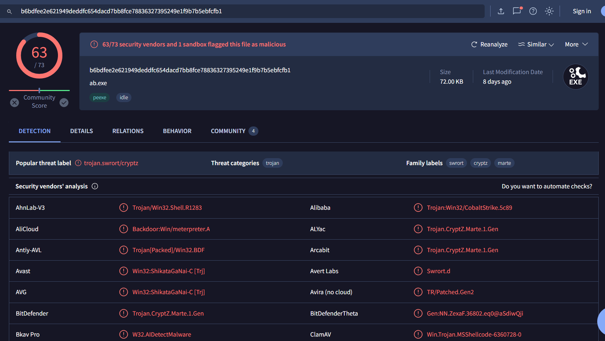

Searched on VirusTotal, which confirmed my hypothisis about meterpreter

```
690ea20bc3bdfb328e23005d9a80c290
```

> Q9: What is the LM hash of Bob's account?

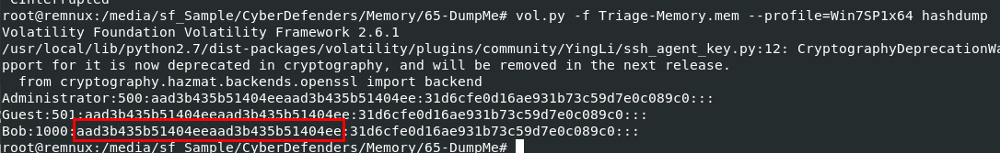

We will use `vol.py -f Triage-Memory.mem --profile=Win7SP1x64 hashdump` to dump NTLM hash and the first hash (on the middle field) is the LM hash

```
aad3b435b51404eeaad3b435b51404ee
```

> Q10: What memory protection constants does the VAD node at 0xfffffa800577ba10 have?

There is a resource that worth diving into if you're curious what is VAD - [The VAD tree: A process-eye view of physical memory](https://www.sciencedirect.com/science/article/pii/S1742287607000503) by Brendan Dolan-Gavitt

Then we will use `vol.py -f Triage-Memory.mem --profile=Win7SP1x64 vadinfo > vadinfo.txt` to dump all vadinfo plugin output to a file so we can search later (we have to do this because there are too much to handle)

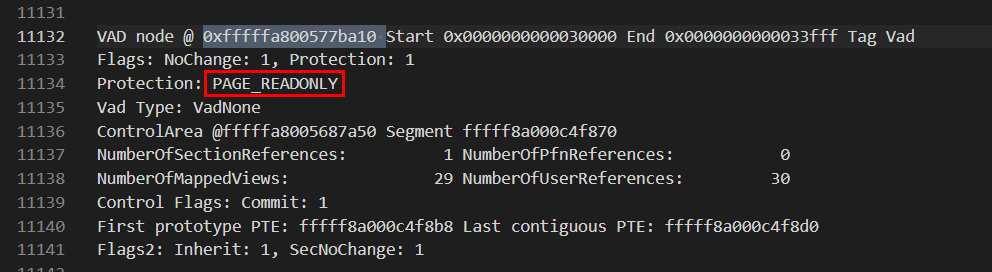

Then we will have its memory protection

```
PAGE_READONLY
```

> Q11: What memory protection did the VAD starting at 0x00000000033c0000 and ending at 0x00000000033dffff have?

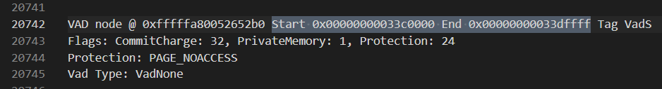
```
PAGE_NOACCESS
```

> Q12: There was a VBS script that ran on the machine. What is the name of the script? (submit without file extension)

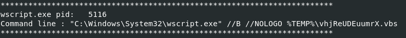

I used filescan plugin and found nothing so I used `vol.py -f Triage-Memory.mem --profile=Win7SP1x64 cmdline` then we can see that wscript was used to execute this suspicious vbs script

```
vhjReUDEuumrX
```

> Q13: An application was run at 2019-03-07 23:06:58 UTC. What is the name of the program? (Include extension)

I searched for prefetch plugin but look like we don't have that yet but we still have shimcache plugin which can be used as well 

- If you don't know what Shimcache is, [This blog](https://medium.com/@mehrnoush/shimcache-amcache-forensic-analysis-99a8a9733772) provides a well-explained overview.

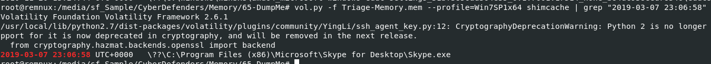

I used `vol.py -f Triage-Memory.mem --profile=Win7SP1x64 shimcache | grep "2019-03-07 23:06:58"` to search for any executable file that was executed at this timestamp

```
Skype.exe
```

> Q14: What was written in notepad.exe at the time when the memory dump was captured?

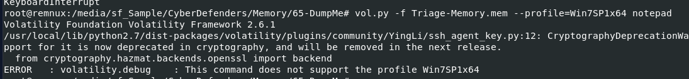

I tried notepad plugin but look like this profile was not suitable for it

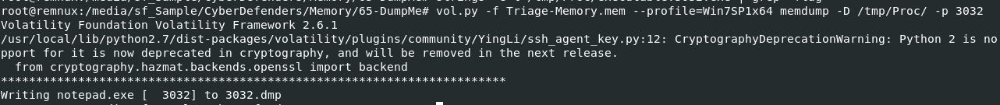

So we have to dump it using `vol.py -f Triage-Memory.mem --profile=Win7SP1x64 memdump -D /tmp/Proc/ -p 3032`, at first I dumpped notepad process but later found out that it was useless since it won't have notepad cache 

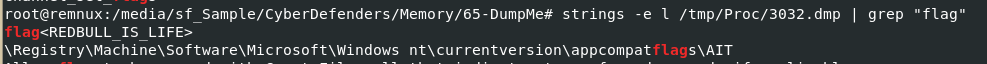

Then we will have to use `strings -e l /tmp/Proc/3032.dmp | grep "flag"` to find a flag, YES I CHECKED FOR HINT BECAUSE IT WAS TOO MUCH INFORMATION OVERLOAD

```
flag<REDBULL_IS_LIFE>
```

> Q15: What is the short name of the file at file record 59045?

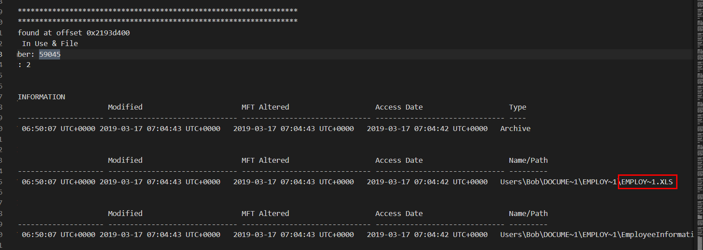

We will use `vol.py -f Triage-Memory.mem --profile=Win7SP1x64 mftparser > MFT.txt` to parse all MFT entries to a file (since I didn't know how to specify just only 1 entry)

```
EMPLOY~1.XLS
```

> Q16: This box was exploited and is running meterpreter. What was the infected PID?

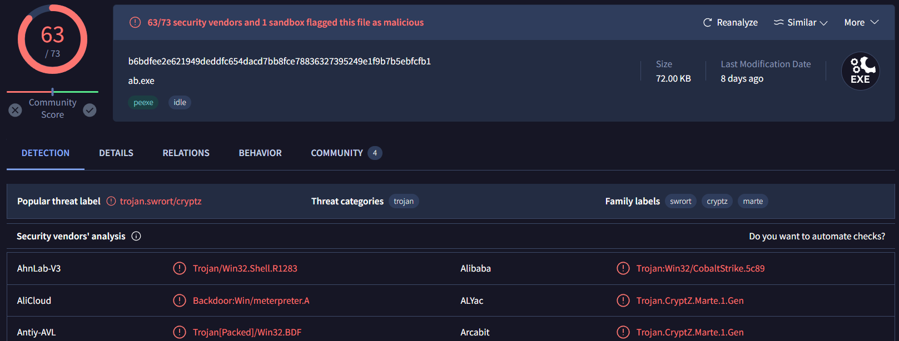
Remember which process I searched its hash on VirusTotal?

```
3496
```

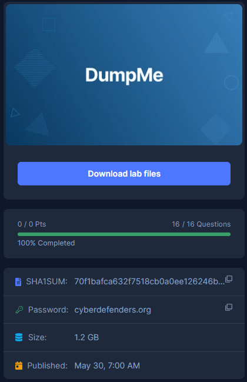
* * *
