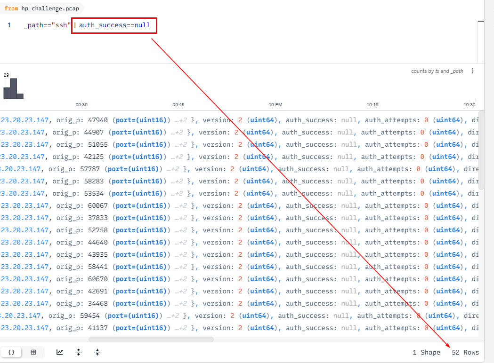

# [CyberDefenders - EscapeRoom](https://cyberdefenders.org/blueteam-ctf-challenges/escaperoom/)
Created: 29/05/2024 18:55
Last Updated: 30/05/2024 19:48
* * *
>Category: Network Forensics
>Tags: PCAP, Wireshark, Linux, Network, T1066, T1014, T1071, T1110, T1548, T1547.001, T1059
* * *
**Scenario**:
You as a soc analyst belong to a company specializing in hosting web applications through KVM-based Virtual Machines. Over the weekend, one VM went down, and the site administrators fear this might be the result of malicious activity. They extracted a few logs from the environment in hopes that you might be able to determine what happened.
This challenge is a combination of several entry to intermediate-level tasks of increasing difficulty focusing on authentication, information hiding, and cryptography. Participants will benefit from entry-level knowledge in these fields, as well as knowledge of general Linux operations, kernel modules, a scripting language, and reverse engineering. Not everything may be as it seems. Innocuous files may turn out to be malicious so take precautions when dealing with any files from this challenge.

**Helpful Tools**:
- [Wireshark](https://www.wireshark.org/)
- [NetworkMiner](https://www.netresec.com/?page=networkminer)
- [BrimSecurity](https://www.brimdata.io/download/)
- [UPX](https://upx.github.io/)
- [IDA](https://www.hex-rays.com/ida-pro/ida-disassembler/)
* * *
## Questions
> Q1: What service did the attacker use to gain access to the system?

We got 1 pcap file and 3 log files on this challenge

So I'll start with pcap file first since other logs wouldn't have the answer of this question

After opened pcap file with Wireshark, First thing that caught by eyes immediately after opened evidence pcap file is SSH protocol 

So I checked out the Protocol statistics

This page showed that there are SSH and HTTP protocols that I could investigate on this PCAP file 
So now I can assume that the attacker is 23.20.23.147 judging from the destination port of SSH is 22


```
ssh
```

> Q2: What attack type was used to gain access to the system?(one word)

Still on the Wireshark, I shifted my focus on the right and saw there is a pattern of communications happened constantly

So I came back to the Info of SSH packages

I found that after client offer new keys to the server, something happened and then the connection cut off (looking at FIN, ACK flag) and then after that user tried to make a connection to the server again

It happened for a while before they finally got a real conversation.

So I think this is bruteforce attack on SSH to gain unauthorized access on the server

But I didn't think Wireshark is enough so I used Zui Desktop Application from Brim to visualize and made everything look simple

The first filter I made is ssh as you can see that there are a lot of SSH auth attempt so It is indeed bruteforce attack

```
bruteforce
```

> Q3: What was the tool the attacker possibly used to perform this attack?

I didn't know how to obtain this answer from the evidence file but I knew that hydra and medusa could do SSH bruteforce and when I tried to answer, Hydra is the right answer
```
hydra
```

> Q4: How many failed attempts were there?


From this query, There are 54 attempts on SSH bruteforce attack, 2 of them got succcess and the rest which got null value are failed attempts

So to confirmed the answer, I putted more filter on auth_success==null

And the result showed 52 is the total number of failed attempts as expected
```
52
```

> Q5: What credentials (username:password) were used to gain access? Refer to shadow.log and sudoers.log.


Lets use john to bruteforce all possible passwords in shadow file here (`john --wordlist=/usr/share/wordlists/rockyou.txt shadow.log`), after a while we have this 3 users and the one that match the answer format it manager user
```
manager:forgot
```

> Q6: What other credentials (username:password) could have been used to gain access also have SUDO privileges? Refer to shadow.log and sudoers.log.


From sudoers file, we can see that manager and sean are in admin group that may gain root privilege so the other user is sean
```
sean:spectre
```

> Q7: What is the tool used to download malicious files on the system?


Filtered by HTTP, we can see that all of HTTP requests have Wget as user-agent 

Its wget without a doubt here since its only 1 user-agent that so obvious
```
wget
```

> Q8: How many files the attacker download to perform malware installation?


Lets take a look at rest_mime_types so we can see which types of file that were requests sorting by time, first one is an executable file, second is an object and third is shellscript while the rest are bmp images

first 3 files were requested almost at the same time and it took a while before the rest were being requested
```
3
```

> Q9: What is the main malware MD5 hash?


Lets examine first 3 files first, I used Network Miner since its automatically detected files for us 

Check file details to obtain hash

First file is confirmed to be a malware while second file identified as a rootkit on VirusTotal, then the first should be main file and rootkit purpose is still unknown (probably for persistence and evade detection? since we already know that malware could abused sudo privilege as manager user in admin group)
```
772b620736b760c1d736b1e6ba2f885b
```

> Q10: What file has the script modified so the malware will start upon reboot?


After examined a shell script, we can see that this script aims to maintain persistent of the first file which was renamed to `mail` from `1` then grant execution privilege to `/var/mail/mail` and writes a script to `rc.local` that will be executed every system boot 
```
/etc/rc.local
```

> Q11: Where did the malware keep local files?
```
/var/mail/
```

> Q12: What is missing from ps.log?


From here we can see that `mail` was supposed to be executed in the background and rootkit (second file) was moved and renamed to `sysmon.ko`, generates modules dependency information for the current kernel, add rootkit to `/etc/modules` to be loaded automatically when boot then you can also see it sleeps for a sec before hide process id of `mail` before removing this shell script

We didn't see malicious process that was supposed to be running from a shell script we just examined 
```
/var/mail/mail
```

> Q13: What is the main file that used to remove this information from ps.log?

Its rootkit file that was renamed
```
sysmod.ko
```

> Q14: Inside the Main function, what is the function that causes requests to those servers?


I used Detect It Easy to see if this malware can be decompiled and look like we need to unpack it first

Using upx to unpack then put it in Detect It Easy again, we can see that its an ELF linux executable file as expected

Open it in decompiler like Ghidra / IDA Pro or Cutter and navigate to main function, we can see that there is a function named "requestFile" which likely to be the one responsible for other file requests

Which it is
```
requestFile
```

> Q15: One of the IP's the malware contacted starts with 17. Provide the full IP.


```
174.129.57.253
```

> Q16: How many files the malware requested from external servers?


We know that first 3 files were used for malware installation
```
9
```

> Q17: What are the commands that the malware was receiving from attacker servers? Format: comma-separated in alphabetical order


when receive something from a server, it often check the value first and the first one I found is in "decryptMessage" function

Which translate to NOP (No operation)

Look like we will eventually found both on "processMessage" function

Translate to RUN
```
NOP,RUN
```


* * *
