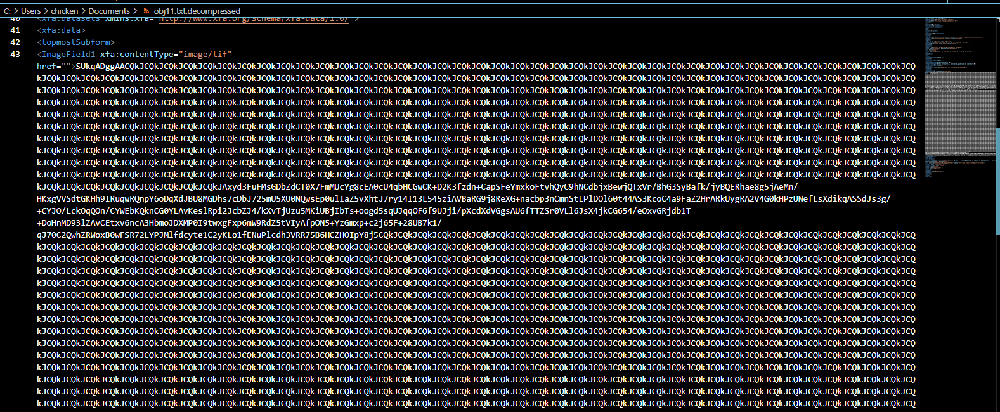

# [CyberDefenders - GetPDF](https://cyberdefenders.org/blueteam-ctf-challenges/getpdf/)
Created: 22/06/2024 19:13
Last Updated: 23/06/2024 00:47
* * *
>Category: Malware Analysis
>Tags: PDF, Macro, CVEs, Exploit, Wireshark, NetworkMiner, de4js, JavaScript, scdbg, T1203, T1071, T1189
* * *
**Scenario**:
PDF format is the de-facto standard in exchanging documents online. Such popularity, however, has also attracted cyber criminals in spreading malware to unsuspecting users. The ability to generate malicious pdf files to distribute malware is a functionality that has been built into many exploit kits. As users are less cautious about opening PDF files, the malicious PDF file has become quite a successful attack vector.
The network traffic is captured in lala.pcap contains network traffic related to a typical malicious PDF file attack, in which an unsuspecting user opens a compromised web page, which redirects the user’s web browser to a URL of a malicious PDF file. As the PDF plug-in of the browser opens the PDF, the unpatched version of Adobe Acrobat Reader is exploited and, as a result, downloads and silently installs malware on the user’s machine.

As a soc analyst, analyze the PDF and answer the questions.

**Supportive resources**:
- [PDF format structure](https://resources.infosecinstitute.com/topic/pdf-file-format-basic-structure/)
- [Portable document format](https://web.archive.org/web/20220113130243/https://www.adobe.com/content/dam/acom/en/devnet/pdf/pdfs/PDF32000_2008.pdf)

**Helpful Tools**:
- [de4js](https://lelinhtinh.github.io/de4js/)
- [pdfid](https://github.com/Rafiot/pdfid)
- [pdfparser](https://github.com/smalot/pdfparser)
- [peepdf](https://github.com/jesparza/peepdf)
- [PDFStreamDumper](https://github.com/dzzie/pdfstreamdumper)
- [WireShark](https://www.wireshark.org/download.html)
- [tshark](https://www.wireshark.org/docs/man-pages/tshark.html)
- [scdbg](http://sandsprite.com/blogs/index.php?uid=7&pid=152)
- [NetworkMiner](https://www.netresec.com/?page=NetworkMiner)
* * *
## Questions
> Q1: How many URL path(s) are involved in this incident?


To make it easy, lets do this inside NetworkMiner and go to DNS tab then we can see DNS query to 1 url that should be the one, we're looking for


There are not much communications were captured so it would be easier to move to wireshark 


It we filtered for HTTP protocol then we can see there are 6 different url involved in this incident

```
6
```

> Q2: What is the URL which contains the JS code?


Open pcap file with Wireshark then inspect each conversation to find which URL has JS code inside


Which you can see that this URL has very suspicious obfuscated JavaScript inside script tag 

```
http://blog.honeynet.org.my/forensic_challenge/
```

> Q3: What is the URL hidden in the JS code?


We can make this script look a little more readable by using https://beautifier.io/


Then we will use https://playcode.io/empty_javascript to play with this JS and we can see that one the line 24 is the one that execute payload so lets confirm it with `console.log(GaDemee)` , now it confirmed that `GaDemee` is `eval()` function then the argument inside should be the command that will be executed 


We can see that it inserts an iframe into the document, which loads content from the specified URL.

```
http://blog.honeynet.org.my/forensic_challenge/getpdf.php
```


Which you can see that after this page was requested, URL that we found was requested and then it will redirect to download another pdf file

> Q4: What is the MD5 hash of the PDF file contained in the packet?


Go to NetworkMiner to get the hash of pdf file we found earlier

```
659cf4c6baa87b082227540047538c2a
```

> Q5: How many object(s) are contained inside the PDF file?


We can see on wireshark that this pdf file contains JS so we will go to NetworkMiner to find this file that was assembled automatically when we opened pcap file on NetworkMiner


Then open pdf file with PDFStreamDumper, we will see how many objects contains within this pdf file

```
19
```

> Q6: How many filtering schemes are used for the object streams?


It will be easier to find them on Wireshark so after reviewing this conversation, we can see that there are 4 filters that were applied to these object streams

```
4
```

> Q7: What is the number of the 'object stream' that might contain malicious JS code?


We can easily obtain an answer here, its an object 5

```
5
```


So lets examine this JS on PDFStreamDumper


According to ChatGPT, this JS code will scan for annotations and look for strings which will eventually decoded and execute as shellcode

> Q8: Analyzing the PDF file. What 'object-streams' contain the JS code responsible for executing the shellcodes? The JS code is divided into two streams. Format: two numbers separated with ','. Put the numbers in ascending order


First we will need to find all annotations which will be scanned by JS code and we will find it on object 3

We can see that it reference to object 6 and object 8 


Which object 6 leads us to object 7 


And object 7 contains very long hex string and another thing that we could see right away is a lot of same pattern that repeating itself so this might need a little bit of cleansing before it could be useful


Now back to object 8 which will lead us to object 9


And it contains long strings that needed to be process 


But from both object, we didn't see any pattern relatively closed to ` var arr = $S.split(/U_155bf62c9aU_7917ab39/);` which will be splited yet so after searching other object, object 10 contains long string which this pattern


So now to sum up what we have found, look like JS code will gets the content of the object 10 and removes the `U_155bf62c9aU_7917ab39` string from it, so we will have to remove this string first and try to make some senses of it


Then we will use `sed 's/U_155bf62c9aU_7917ab39//g' obj10.txt | xxd -r -p` to remove unwanted string from object 10 and output it as human-readable text


Put it in https://beautifier.io/, then we will see it get content of object 9 and replace specific strings with `%` and then concatenate with object 7 that will be replaced by specific strings with `%` too and then lastly it will be executed by `eval()` 

Now it is confirmed that object 7 and 9 are the shellcodes that was divided

```
7,9
```

> Q9: The JS code responsible for executing the exploit contains shellcodes that drop malicious executable files. What is the full path of malicious executable files after being dropped by the malware on the victim machine?


To get full JS script that will launch shellcode we will use `sed 's/X_17844743X_170987743/%/g' obj9.txt | xxd -r -p > shellcode.js && sed 's/89af50d/%/g' obj7.txt | xxd -r -p >> shellcode.js` then we will have `shellcode.js` which have combined 2 shellcode from both object back to one 


Which you can see that look like there are several types of payload for each executable that could be used here which are
- `calc.exe`
- `freecell.exe`
- `notepad.exe`
- `cmd.exe`


To find out, we need to pick one of them to try out with shellcode debugger and the result should not be different since the only different is which executable that will be launched


Then after emulate how this shellcode work with shellcode debugger, we can see that it will download file from specific url and execute it


Here is the result from `notepad.exe` payload, look like there is a little bit different between both payload which is URL to download an executable file but in the end, it will be downloaded to the same path and execute it

```
c:\WINDOWS\system32\a.exe
```

> Q10: The PDF file contains another exploit related to CVE-2010-0188. What is the URL of the malicious executable that the shellcode associated with this exploit drop?


Now we're back to wireshark and we can see that another executable file which is not matched what we found from 4 payloads from above


We still have object 11 that we didnot pay any attention to it until now


This look quite messy so we will dump it first (Right click -> Save As)


It is zlib compressed data, now it makes sense why it looks so messy


Now go back to PDFStreamDumper then go to "Tools -> Zlib Decompress_File" and select the file that we dumped earlier


Now we have XML document



This look like a payload encoded with base64 so I did some research on this vulnerability and find out that we are in the right track

- [Adobe Reader PDF - LibTiff Integer Overflow Code Execution](https://www.exploit-db.com/exploits/11787)


Now put these base64 inside CyberChef and to make a shellcode, we need to use "From Base64 -> To Hex -> Remove whitespace" 


Save it as a file then use shellcode debugger to get the answer

```
http://blog.honeynet.org.my/forensic_challenge/the_real_malware.exe
```

> Q11: How many CVEs are included in the PDF file?

Turn out each payloads are designed for each vulnerability so lets find each one of them by searching on your search engine and we have to pick a line that might indicates that vulnerability


Lets start with `calc.exe` payload, we will use this line to search 


So this payload was here to exploit [CVE-2009-4324 Adobe Doc.media.newPlayer Use After Free Vulnerability](https://www.exploit-db.com/exploits/16623)


Next is `freecell.exe` payload, this variable seem unique enough to be searched


and it landed us with [CVE-2008-2992 Adobe Reader Javascript Printf Buffer Overflow Exploit](https://www.exploit-db.com/exploits/7006)


Third one is `notepad.exe` payload


That leads us to [CVE-2007-5659 Adobe Collab.collectEmailInfo() Buffer Overflow](https://www.exploit-db.com/exploits/16674)


And lastly, `cmd.exe` payload


Which leads us to [CVE-2009-0927 Adobe Collab.getIcon() Buffer Overflow](https://www.exploit-db.com/exploits/16681)

Now if we count the fifth vulnerability we found on previous task, it will be 5 vulnerabilities in total!

```
5
```


It could be 6 since Exploits_Scan from PDFStreamDumper found this one on object 5 too but we're good now


* * *