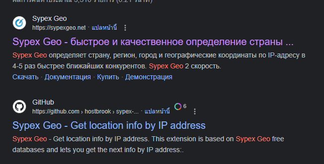

# [CyberDefenders - GrabThePhisher](https://cyberdefenders.org/blueteam-ctf-challenges/grabthephisher/)
Created: 27/02/2024 16:02
Last Updated: 27/02/2024 16:25
* * *
>Category: Threat Intel
>Tags: kit, osint, phishing, threat intel, T1567, T1016, T1566.003
* * *
**Scenario**:
An attacker compromised a server and impersonated https://pancakeswap.finance/, a decentralized exchange native to BNB Chain, to host a phishing kit at https://apankewk.soup.xyz/mainpage.php. The attacker set it as an open directory with the file name "pankewk.zip". 

Provided the phishing kit, you as a soc analyst are requested to analyze it and do your threat intel homework.
* * *
## Questions
> Q1: Which wallet is used for asking the seed phrase?

Here are the directory of the kit after decompressed 

There is a metamask which should be the answer of this question
```
metamask
```

For those who wonders what's Metamask?
There you go


> Q2: What is the file name that has the code for the phishing kit?


Inside the metamask folder, there is a php file 
```
metamask.php
```

> Q3: In which language was the kit written?


Its a php script to retrieve geolocation data based on the user IP address then extract Country, City out of it then it construct a message then send it to Telegram Bot using API 

After that it also log data it receive from a form to `/log/log.txt` by appending it 

```
php
```

> Q4: What service does the kit use to retrieve the victim's machine information?


```
sypex geo
```

> Q5: How many seed phrases were already collected?

For those who doesn't know what is the Wallet Seed Phase, here the explaination

I went to where the log where created and then opened it

Looking at the content it seems like a wallet seed phases

```
3
```

> Q6: Write down the seed phrase of the most recent phishing incident?

Since the log were written by appending the recent one must be the lastest
```
father also recycle embody balance concert mechanic believe owner pair muffin hockey
```

> Q7: Which medium had been used for credential dumping?

By looking at the code, the telegram it is

```
telegram
```

> Q8: What is the token for the channel?


```
5457463144:AAG8t4k7e2ew3tTi0IBShcWbSia0Irvxm10
```

> Q9: What is the chat ID of the phisher's 
channel?


```
5442785564
```

> Q10: What are the allies of the phish kit developer?

There is a comment on this script and there is a name too

```
j1j1b1s@m3r0
```

> Q11: What is the full name of the Phish Actor?

Since it's a Telegram API then I started reading [documentation](https://core.telegram.org/bots/api#available-methods) to interact with this API
And I found this getChat method that can retrieve information about the user

So I used this command
`wget https://api.telegram.org/bot5457463144:AAG8t4k7e2ew3tTi0IBShcWbSia0Irvxm10/getChat?chat_id=5442785564` on the cmd and got the answer

```
Marcus Aurelius
```

> Q12: What is the username of the Phish Actor? 


```
pumpkinboii
```


* * *