# [CyberDefenders - Hammered](https://cyberdefenders.org/blueteam-ctf-challenges/hammered/)
Created: 03/05/2024 22:58
Last Updated: 10/06/2024 21:43
* * *
>Category: Endpoint Forensics
>Tags: Linux Forensics, WebServer, Log Analysis, Apache2, Honeypot, T1016, T1110.001, T1601, T1136, T1059
* * *
**Challenge files**:
- kern.log
- auth.log
- daemon.log
- dmesg
- apache2

This challenge takes you into the world of virtual systems and confusing log data. In this challenge, as a soc analyst figure out what happened to this webserver honeypot using the logs from a possibly compromised server.
* * *
## Questions
> Q1: Which service did the attackers use to gain access to the system?

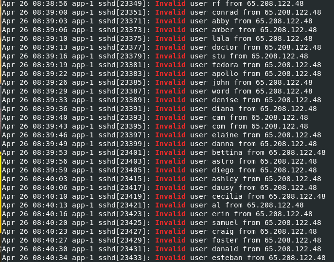

I used `grep "Invalid" auth.log` first to determine if there were brute force attempts that were logged on authentication log and look like we have the answer right away since sshd is a service than handle SSH 

```
ssh
```

> Q2: What is the operating system version of the targeted system? (one word)

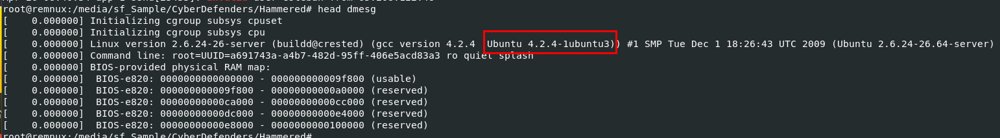

By print out content of `dmesg` file, we can determine which version of OS that generated these logs

```
4.2.4-1ubuntu3
```

> Q3: What is the name of the compromised account?

From earlier we know that there are bruteforce attempt on SSH so after determined valid user then attackers will continue to bruteforce for password

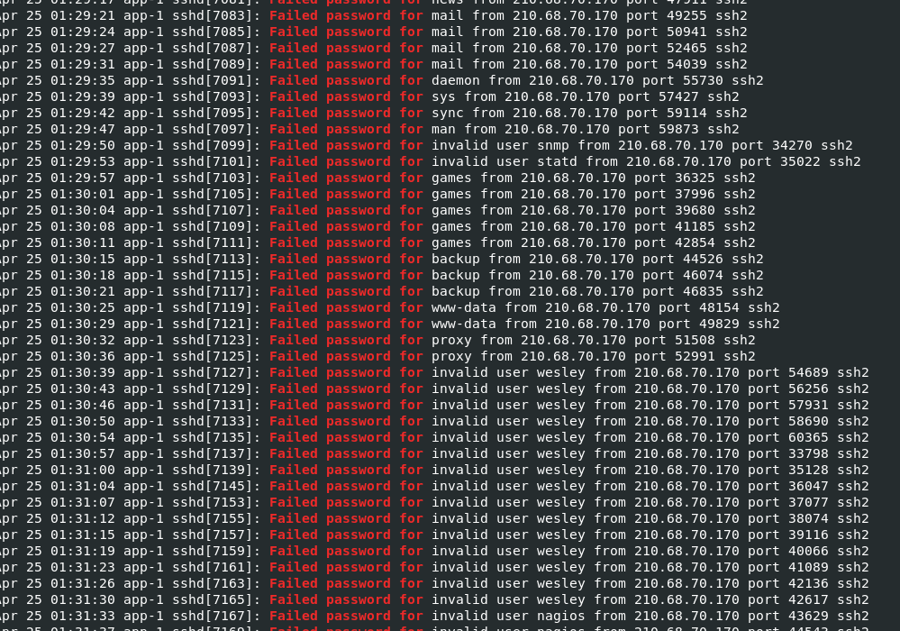

So I used `grep "Failed password for" auth.log` to find which user that got bruteforced and stand out

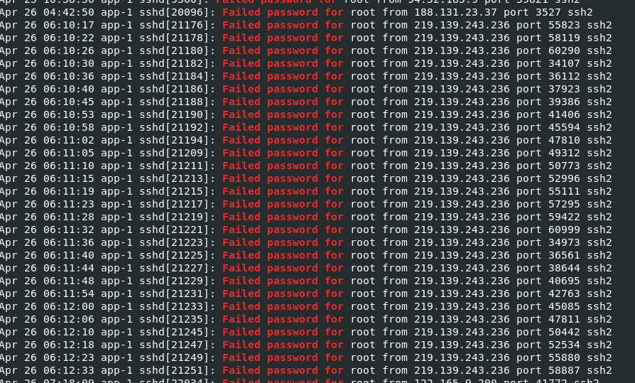

Which is "root"

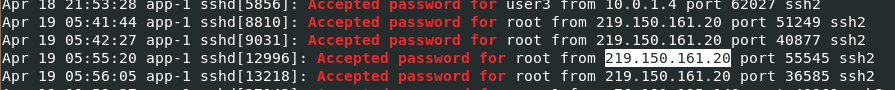

I used `grep "Accepted password for" auth.log` to confirm that the IP address that bruteforced for root user was successful.

```
root
```

> Q4: Consider that each unique IP represents a different attacker. How many attackers were able to get access to the system?

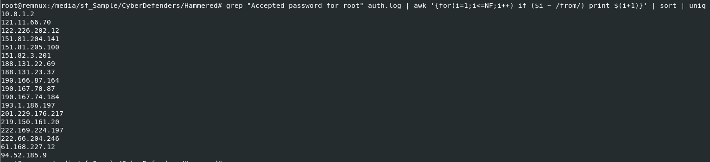

First we need to get all IP addresses that have many occurrences authentication successfully as root with `grep "Accepted password for root" auth.log | awk '{for(i=1;i<=NF;i++) if ($i ~ /from/) print $(i+1)}' | sort | uniq > /tmp/ham/suclog`

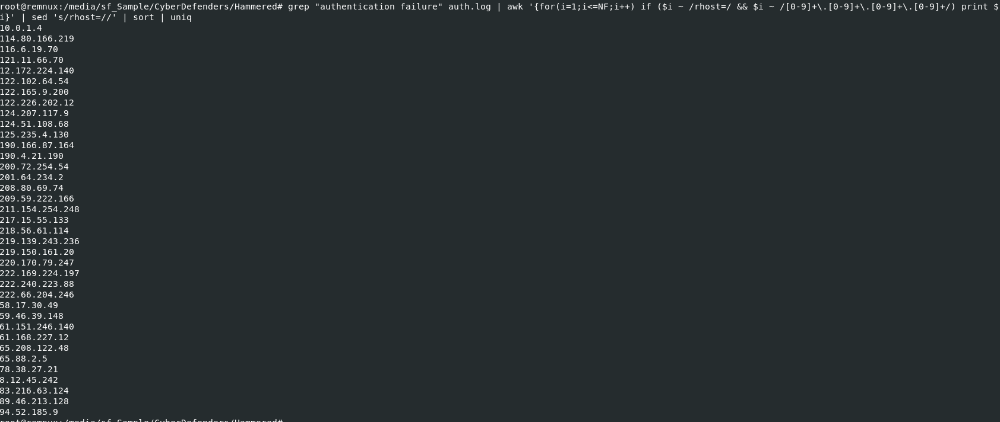

Then we will use `grep "authentication failure" auth.log | awk '{for(i=1;i<=NF;i++) if ($i ~ /rhost=/ && $i ~ /[0-9]+\.[0-9]+\.[0-9]+\.[0-9]+/) print $i}' | sed 's/rhost=//' | sort | uniq > /tmp/ham/faillogin` to get all IP addresses that were unsuccessful to authenticate.

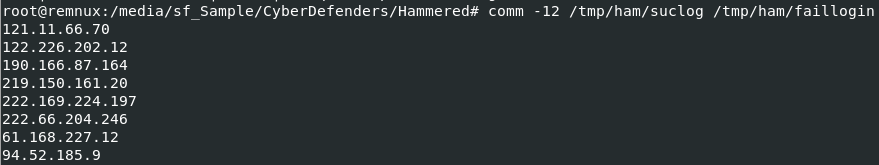

Then compare them with `comm -12 /tmp/ham/suclog /tmp/ham/faillogin > /tmp/ham/comm1` then we will have IP addresses that were successfully logged in as root but also have some authentication failure.

```
#!/bin/bash

# Path to the auth.log file
LOG_FILE="/tmp/ham/auth.log"

# Path to the file containing IP addresses
IP_LIST="/tmp/ham/comm1"

# Temporary file to store the results
RESULTS="/tmp/auth_failure_counts.txt"

# Ensure the results file is empty
> $RESULTS

# Loop through each IP address in the IP_LIST file
while IFS= read -r IP; do
  if [[ $IP =~ ^[0-9]+\.[0-9]+\.[0-9]+\.[0-9]+$ ]]; then
    # Count the number of "authentication failure" occurrences for the IP
    COUNT=$(grep "authentication failure" "$LOG_FILE" | grep -o "rhost=$IP" | wc -l)
    # Append the count to the results file
    echo "$IP: $COUNT" >> $RESULTS
  fi
done < "$IP_LIST"

# Display the results
cat $RESULTS
```

I asked ChatGPT to write me a bash script to count all number of authentication failure of each IP addresses we got earlier

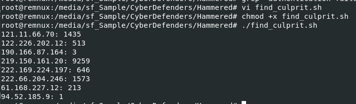
Then we're down to 6 IP addresses

```
6
```

> Q5: Which attacker's IP address successfully logged into the system the most number of times?

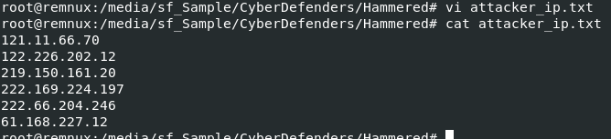

We already got 6 IP addresses and we need to search on successfully logged in for each IP address

```
#!/bin/bash

# Path to the auth.log file
LOG_FILE="/tmp/ham/auth.log"

# Path to the file containing attacker IP addresses
IP_LIST="/tmp/ham/attacker_ip.txt"

# Loop through each IP address in the IP_LIST file
while IFS= read -r IP; do
  if [[ $IP =~ ^[0-9]+\.[0-9]+\.[0-9]+\.[0-9]+$ ]]; then
    # Count the number of "Accepted password for root" occurrences for the IP
    COUNT=$(grep "Accepted password for root" "$LOG_FILE" | grep -o "from $IP" | wc -l)
    # Print the count for the IP address
    echo "$IP: $COUNT"
  fi
done < "$IP_LIST"
```

So I told ChatGPT to write me another script to do them all at once

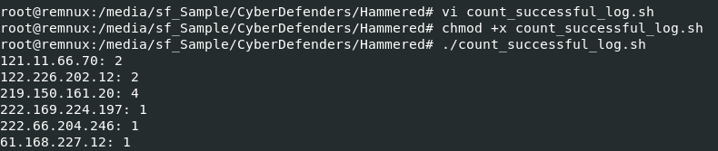

Here is the result

```
219.150.161.20
```

> Q6: How many requests were sent to the Apache Server?

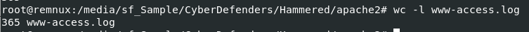

Each line on access log mean each request so we can use `wc -l www-access.log` to count and we will have number of all requests sent to Apache Server

```
365
```

> Q7: How many rules have been added to the firewall?

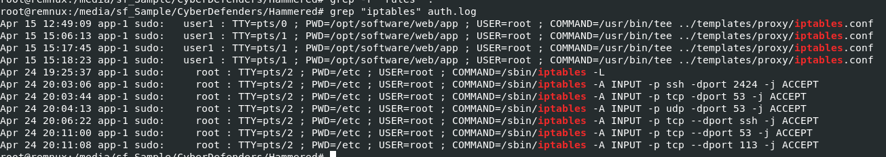

iptables is the command-line tool to manage firewall rules on Linux and we can also used `grep "iptables" auth.log` to filter out all `iptables` commands there were executed  

```
6
```

> Q8: One of the downloaded files to the target system is a scanning tool. Provide the tool name.

dpkg log file records information about package installations, upgrades, and removals performed using `dpkg`.

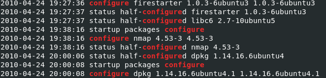

There are a lot to read so I used `grep "configure" dpkg.log` to search for something that related to scanning and I found nmap here so it has to be this one

```
nmap
```

> Q9: When was the last login from the attacker with IP 219.150.161.20? Format: MM/DD/YYYY HH:MM:SS AM

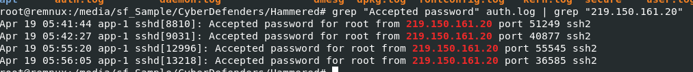

Lets use `grep "Accepted password" auth.log | grep "219.150.161.20"` to find all successful logged on from this IP address and pick the latest one to answer

```
04/19/2010 05:56:05 AM
```

> Q10: The database displayed two warning messages, provide the most important and dangerous one.

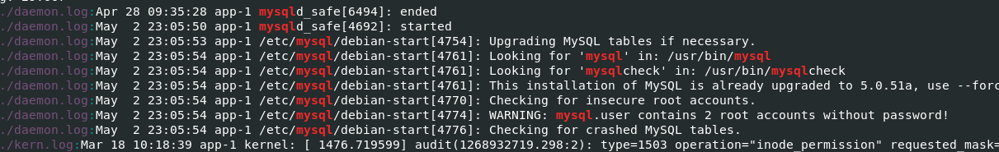

First off, I used `grep "mysql" .` to find anything related to mysql database and I found that `daemon.log` has sevaral WARNING messages for mysql

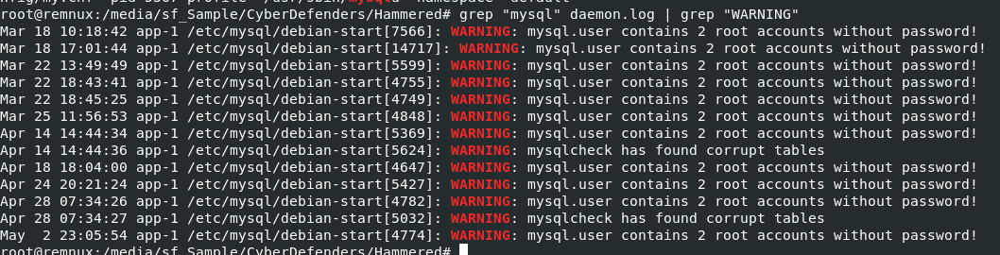

So next we can use `grep "mysql" daemon.log | grep "WARNING"` to filter for all warning messages from mysql

Which you can see that 2 root accounts without password is pretty much the most dangerous one here

```
mysql.user contains 2 root accounts without password!
```

> Q11: Multiple accounts were created on the target system. Which one was created on Apr 26 04:43:15?

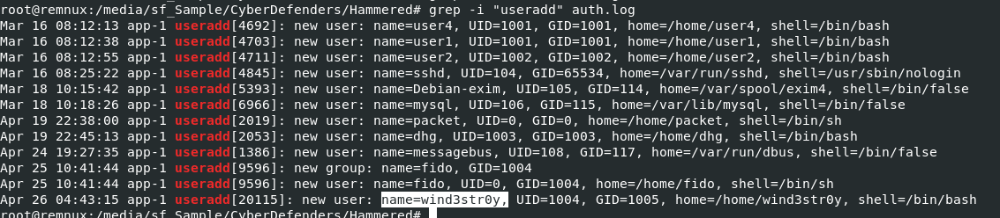

We will use `grep -i "useradd" auth.log` to find for all `useradd` command from authentication log and look like the timestamp to find which one was created at the same time as question's timestamp

```
wind3str0y
```

> Q12: Few attackers were using a proxy to run their scans. What is the corresponding user-agent used by this proxy?

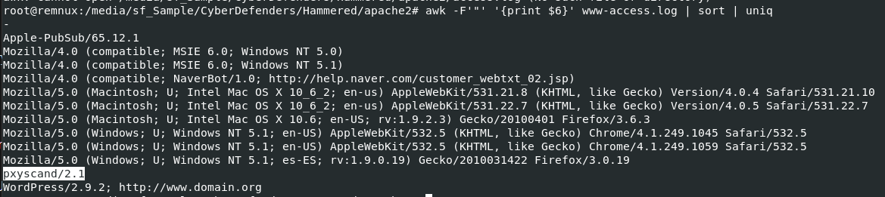

Lets use `awk -F'"' '{print $6}' www-access.log | sort | uniq` to display all unique user-agent from `access.log` then we can see a special user-agent related to proxy scanner

```
pxyscand/2.1
```


* * *
