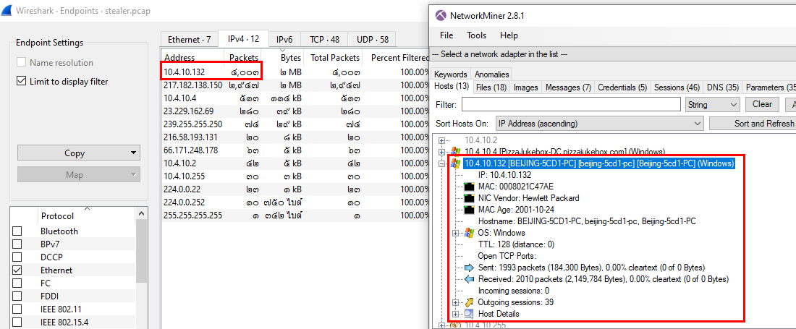
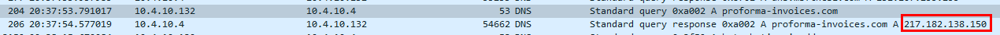
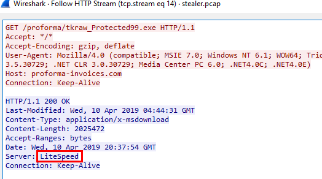

# [CyberDefenders - HawkEye](https://cyberdefenders.org/blueteam-ctf-challenges/hawkeye/)
Created: 15/03/2024 12:59
Last Updated: 26/06/2024 08:24
* * *
>Category: Network Forensics
>Tags: PCAP, Wireshark, NetworkMiner, BRIM, VirusTotal, T1048, T1071, T1056.001, T1016, T1027, T1204, T1566.002
* * *
**Scenario**:
An accountant at your organization received an email regarding an invoice with a download link. Suspicious network traffic was observed shortly after opening the email. As a SOC analyst, investigate the network trace and analyze exfiltration attempts.

**Tools**:
- [Wireshark](https://www.wireshark.org/)
- [BrimSecurity](https://www.brimdata.io/)
- [Apackets](https://apackets.com/)
- [MaxMind Geo IP](https://wiki.wireshark.org/HowToUseGeoIP#:~:text=MaxMind%20produces%20databases%20and%20software,information%20for%20an%20IP%20address.)
- [VirusTotal](https://www.virustotal.com/gui/)
* * *
## Questions
> Q1: How many packets does the capture have?

Open pcap file in wireshark to answer this question

```
4003
```

> Q2: At what time was the first packet captured?

Inspect first packet to answer this question

```
2019-04-10 20:37:07 UTC
```

> Q3: What is the duration of the capture?

To answer this question, Go to Statistics > Capture File Properties 

```
01:03:41
```

> Q4: What is the most active computer at the link level?

To answer this question, Go to Statistics > Endpoints

Go to Ethernet then sort out for the highest packets
```
00:08:02:1c:47:ae
```

> Q5: Manufacturer of the NIC of the most active system at the link level?

To answer this question, Go to Tools > MAC Address Blocks then search for MAC address

Alternatively, You can use NetworkMiner

```
Hewlett-Packard
```

> Q6: Where is the headquarter of the company that manufactured the NIC of the most active computer at the link level?

Its OSINT time, just search for "HP HQ location"

```
Palo Alto
```

> Q7: The organization works with private addressing and netmask /24. How many computers in the organization are involved in the capture?

To answer this question, Go to Statistics > Endpoints

Go to IPv4, you can see that there are 4 private IP addresses on 10.4.10.0/24 and 10.4.10.255 is the broadcast address so there are 3 computers in the organization are involved in the capture

Alternatively, you can also get the answer from NetworkMiner

```
3
```

> Q8: What is the name of the most active computer at the network level?

Still on Endpoints window, then sort for the highest packets then use NetworkMiner to find this host

```
BEIJING-5CD1-PC
```

> Q9: What is the IP of the organization's DNS server?


Filtered by `dns`, you can see that all DNS queries sent to 10.4.10.4
```
10.4.10.4
```

> Q10: What domain is the victim asking about in packet 204?

You can use filter for a specific frame but this question ask for domain so `dns` filter can still be used

```
proforma-invoices.com
```

> Q11: What is the IP of the domain in the previous question?


As you can see that DNS server responded back in packet 206
```
217.182.138.150
```

> Q12: Indicate the country to which the IP in the previous section belongs.

OSINT time again, using [IPLocation](https://www.iplocation.net/ip-lookup), we can easily obtain the answer

```
France
```

> Q13: What operating system does the victim's computer run?


On NetworkMiner, I found that there is a suspicious exe file downloaded by a private IP address so I assumed this is the victim

I went to this host's Browser User-agent to find the answer
```
Windows NT 6.1
```

> Q14: What is the name of the malicious file downloaded by the accountant?

As I found on previous question, I retrieved the hash of that suspicious exe file then searched on [VirusTotal](https://www.virustotal.com/gui/file/62099532750dad1054b127689680c38590033fa0bdfa4fb40c7b4dcb2607fb11)

Its a hawkeye keylogger, so that's the answer
```
tkraw_Protected99.exe
```

> Q15: What is the md5 hash of the downloaded file?
```
71826ba081e303866ce2a2534491a2f7
```

> Q16: What software runs the webserver that hosts the malware?


On NetworkMiner, It caught web server banner which is LiteSpeed

You can also used wireshark and followed TCP stream when victim downloaded the malware
```
LiteSpeed
```

> Q17: What is the public IP of the victim's computer?


Go to Host Details on NetworkMiner

Alternatively, you can also see that there is a website to ask for a public IP address 

Which was contacted by victim machine

Then you can use wireshark to obtain the answer
```
173.66.146.112
```

> Q18: In which country is the email server to which the stolen information is sent?


I filtered for Simple Mail Transfer Protocol on Wireshark then I obtained an IP address of this SMTP server

With the help of IPLocation, I finally obtained the correct answer

Alternatively, you can also get an IP address with user credential in plaintext from NetworkMiner
```
United States
```

> Q19: Analyzing the first extraction of information. What software runs the email server to which the stolen data is sent?


Followed the tcp stream of SMTP communication, you can see what software is running on the first response of the server
```
Exim 4.91
```

> Q20: To which email account is the stolen information sent?


On the SMTP stream, we can see that this email was used to send information
```
sales.del@macwinlogistics.in
```

> Q21: What is the password used by the malware to send the email?

You can copy password from NetworkMiner directly or you can decode base64 password from SMTP stream

```
Sales@23
```

> Q22: Which malware variant exfiltrated the data? 


Still on the SMTP stream, I found this base64 encoded text are subjects and content that was sent to the SMTP server so If decoded, I could get some clues

After decoded, we can see that this malware stated its name and family along with the infected system information on the subject
```
Reborn v9
```

> Q23: What are the bankofamerica access credentials? (username:password)


```
roman.mcguire:P@ssw0rd$
```

> Q24: Every how many minutes does the collected data get exfiltrated?

I noticed that malware had to authenticate to SMTP server everytime to send data again so I used `AUTH` command as a filter to obtain the answer

As you can see every authentication has 10 minutes time-interval so thats the answer
```
10
```


* * *
