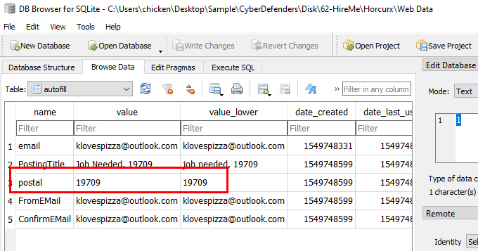

# [CyberDefenders - HireMe](https://cyberdefenders.org/blueteam-ctf-challenges/hireme/)
Created: 30/04/2024 22:01
Last Updated: 01/05/2024 12:38
* * *
>Category: Endpoint Forensics
>Tags: Disk Forensic, Eric Zimmerman's Tools, FTK Imager, Autopsy, Registry, LECmd, Registry Explorer, RegRipper, AccessData, T1204, T1071, T1003, T1016, T1083, T1082
* * *
Karen is a security professional looking for a new job. A company called "TAAUSAI"  offered her a position and asked her to complete a couple of tasks to prove her technical competency. As a soc analyst Analyze the provided disk image and answer the questions based on your understanding of the cases she was assigned to investigate.

**Tools**:
- [FTK Imager](https://accessdata.com/product-download/ftk-imager-version-4-5)
- [Autopsy](https://www.autopsy.com/download/)
- [RegistryExplorer](https://f001.backblazeb2.com/file/EricZimmermanTools/RegistryExplorer_RECmd.zip)
- [LEcmd](https://f001.backblazeb2.com/file/EricZimmermanTools/LECmd.zip)
- [Regripper](https://github.com/keydet89/RegRipper3.0)
- [OST Viewer](https://www.sysinfotools.com/recovery/ost-file-viewer.php)
* * *
## Questions
> Q1: What is the administrator's username?

Lets open evidence file on FTK Imager

As you can see that this evidence file have 2 partitions, one is C drive and the other one have RECYCLE.BIN

And the only user we found on this evidence is Karen which should be an admin of this system too
```
Karen
```

> Q2: What is the OS's build number?


Go to `Windows\System32\config`, you will find `SOFTWARE` hive there then export it and open with any tool that can inspect `HKLM\SOFTWARE\Microsoft\WindowsNT\CurrentVersion` which holds an information about SYSTEM INFORMATION

```
16299
```

> Q3: What is the hostname of the computer?

In the same directory, Export `SYSTEM` hive so we can parse `HKLM\SYSTEM\ControlSet001\Control\ComputerName\ComputerName` to get hostname

```
TOTALLYNOTAHACK
```

> Q4: A messaging application was used to communicate with a fellow Alpaca enthusiest. What is the name of the software?

An answer of this question can be found using registry too, go back to `SOFTWARE` hive then `HKLM\SOFTWARE\Windows\CurrentVersion\App Paths` which holds information about all application paths installed on a system

You can see that only skype is the messaging application here(outlook is emailing application).
```
Skype
```

> Q5: What is the zip code of the administrator's post?

Windows does not store ZIP code of a user but I found chrome artifacts on this evidence file too which mean that user could save her own zip code in autofill then she doesn't have to keep typing the same information everytime she visits different websites

Go to `Appdata\Local\Google\Chrome\User Data\Default`, you will find `Web Data` there, export it and use DB Browser for SQLite to open this database file

Query data from `autofill` table, There it is
```
19709
```

> Q6: What are the initials of the person who contacted the admin user from TAAUSAI?


There is an ost(Offline Outlook Data File) file which used to store and synchronize copy of user mailbox information on local system, export it and use any OST File Viewer you have to open it 

You can read about more about this file [here](https://support.microsoft.com/en-us/office/introduction-to-outlook-data-files-pst-and-ost-222eaf92-a995-45d9-bde2-f331f60e2790)

I used [Kernel OST Viewer](https://www.nucleustechnologies.com/ost-viewer.html) free version then go to Inbox to find all inbox mails, there are several mails from Alpaca Activists claiming to recruit Karen to his org and he also wrote his name on recruting mail too 
```
MS
```

> Q7: How much money was TAAUSAI willing to pay upfront?


Continue reading mail from Alpaca Activists, you will find an answer 
```
150000
```

> Q8: What country is the admin user meeting the hacker group in?


Alpaca Activists gave Karen location in Latitude and Longtitude, go to https://www.gps-coordinates.net/ and insert both values to find an address

Which is in Egypt
```
Egypt
```

> Q9: What is the machine's timezone? (Use the three-letter abbreviation)

Back to `SYSTEM` hive to find an information about timezone in `HKLM\SYSTEM\ControlSet001\Control\TimeZoneInformation`

```
UTC
```

> Q10: When was AlpacaCare.docx last accessed?

Alpaca Activists finally sent Karen an attachment but no where to be found on C drive so we have to look for other partition, inside RECYCLE.BIN

There is it
```
03/17/2019 09:52 PM
```

> Q11: There was a second partition on the drive. What is the letter assigned to it?

Every document files that was opened using Microsoft Office, Windows will create a shortcut file due to Recent File feature that will make user access recent opened document file easier

You can export LNK file to analyze it but for me This is already enough, I still can read file path from FTK Imager 
```
A
```

> Q12: What is the answer to the question Company's manager asked Karen?

Go back to OST File Viewer

You can see that there is some challenge that manager gave Karen

Which Karen solved it

Since this is a replied mail, you can scroll down a little bit to see the message that was replied
```
TheCardCriesNoMore
```

> Q13: What is the job position offered to Karen? (3 words, 2 spaces in between)


When Karen solved this challenge, Manager offered her entry level cyber security analyst
```
cyber security analyst
```

> Q14: When was the admin user password last changed?

Now time to grab `SAM` hive

go to `SAM\Domains\Account\Users`, you can see the time that Karen changed her password
```
03/21/2019 19:13:09
```

> Q15: What version of Chrome is installed on the machine?

I clicked for hint this time and found that an answer lying in `WOW6432Node\Microsoft\Windows\CurrentVersion\Uninstall`, so i did some [research](https://learn.microsoft.com/en-us/windows/win32/msi/uninstall-registry-key) and found that most of softwares installed on Windows, it will also created uninstaller and keep file path and properties inside this registry

```
72.0.3626.121
```

> Q16: What is the HostUrl of Skype?


An answer lying on alternate data stream (ADS) of Skype executable file
Here are resources you can read to understand what is ADS 
- https://insights.sei.cmu.edu/blog/using-alternate-data-streams-in-the-collection-and-exfiltration-of-data/
- https://www.forensicfocus.com/articles/dissecting-ntfs-hidden-streams/

To put it simply, it used to store meta-information about the file

Check `Zone.Identifier`, you will see HostURL there
```
https://download.skype.com/s4l/download/win/Skype-8.41.0.54.exe
```

> Q17: What is the domain name of the website Karen browsed on Alpaca care that the file AlpacaCare.docx is based on?


Lets download document file and examine it

I do not want to open a file so I have to use another way to get a hyperlink, luckily there is a way 
By decompress DOCX file and open `document.xml` which store document properties and contents of this document

I copied content and used CyberChef to beatufiy XML for me which you can see that hyperlink is also there
```
palominoalpacafarm.com
```


* * *
