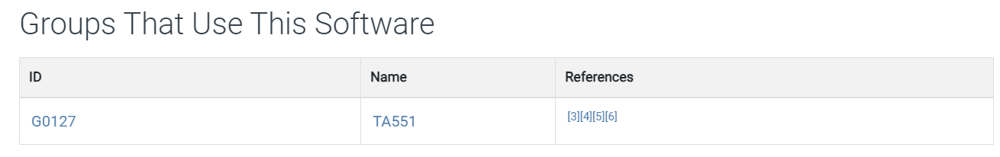

# [CyberDefenders - IcedID](https://cyberdefenders.org/blueteam-ctf-challenges/icedid/)
Created: 08/10/2024 13:27
Last Updated: 08/10/2024 21:37
* * *
>**Category**: Threat Intel
* * *
**Scenario:**
A cyber threat group was identified for initiating widespread phishing campaigns to distribute further malicious payloads. The most frequently encountered payloads were IcedID. You have been given a hash of an IcedID sample for the purpose of analyzing and monitoring the activities of this advanced persistent threat (APT) group.

**Tools**:
- [VirusTotal](https://www.virustotal.com/gui/)
- [malpedia](https://malpedia.caad.fkie.fraunhofer.de/)
- [X](https://x.com/)

* * *
## Questions
>Q1: What is the name of the file associated with the given hash?

This challenge only provided us with 1 hash so we can start by submit this on VirusTotal and go to "Details" which also keep tracks of file name of this hash

  
Answer

<pre><code>document-1982481273.xlsm</code></pre>

>Q2: Can you identify the filename of the gif file that was deployed?

Now we can go to "Relations" tab, which we can see that there is 1 filename keep getting requests from multiple domains.

Go to Dropped Files section and we can see that gif file is also a malicious file and its actually malicious dll file (second payload) after this xlsm macro was opened by a user.

  
Answer

<pre><code>3003.gif</code></pre>

>Q3: How many domains does the malware look to download the additional payload file in Q2?

Count all domains hosting this gif file then we will have 5 different domains in total.

  
Answer

<pre><code>5</code></pre>

>Q4: What is the MD5 hash of the executable in Q2 downloaded from metaflip.io?

This part is a little bit tricky here since this domain communicated with a lot of malicious files (all different hashes)

Which I lost 20 attempts before getting it right.. so how did I get the right answer?

I looked back at the tool recommended on this lab that included X so I searched on [X about this ioc](https://x.com/JRoosen/status/1376994339281309699)

Which I found that Joe Roosen actually posted this IOC on X at 31st March 2021

He also included [any.run](https://app.any.run/tasks/fe428f01-7d47-4123-9c65-d86f7fcd281a) and [tria.ge](https://tria.ge/210330-gbdr6k9jxx) report that we can follow and find out more about how this malware operated on these sandboxes.

Then I fellow to any.run report then found that this report send HTTP GET request to metaflip.io to download malicious executable in Q2

Click the "executable" Content of HTTP Request then we will have MD5 of this file right here

  
Answer

<pre><code>964a0015332ec2cc13ab12b8d85f29ff</code></pre>

>Q5: From the domains mentioned in Q3, a DNS registrar was predominantly used by the threat actor to host their harmful content, enabling the malware's functionality. Can you specify the Registrar INC?

Go back to VirusTotal then we will see that there is only 1 registrar INC that matches answer format which is NameCheap that let anyone hosting there domain in reasonable price so many threat actors use this to register their C2.

  
Answer

<pre><code>NAMECHEAP</code></pre>

>Q6: Could you specify the threat actor linked to the sample provided?

For this one, I went to MITRE ATT&CK and searched for [IcedID](https://attack.mitre.org/software/S0483/) software and after scrolling down to find out which group using this software then we can see that there is only 1 group which is TA551.

Which is also known as [Gold Cabin](https://attack.mitre.org/groups/G0127/)

  
Answer

<pre><code>GOLD CABIN</code></pre>

>Q7: In the Execution phase, what function does the malware employ to fetch extra payloads onto the system?

This one, we have to dig into [tria.ge](https://tria.ge/210330-gbdr6k9jxx) report then we can see that it used this function from Windows API to download `3003.gif` from 5 different domains.

  
Answer

<pre><code>URLDownloadToFile</code></pre>

* * *