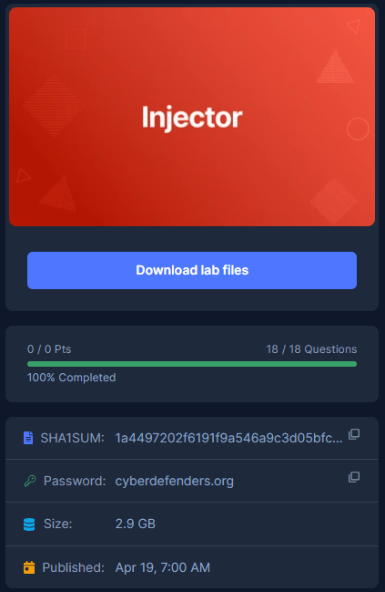

# [CyberDefenders - Injector](https://cyberdefenders.org/blueteam-ctf-challenges/injector/)
Created: 18/06/2024 18:56
Last Updated: 19/06/2024 21:44
* * *
>Category: Endpoint Forensics
>Tags: Memory Forensic, Disk Forensic, Volatility, FTK Imager, Autopsy, Registry Explorer, RegRipper, R-Studio, T1059.003, T1136.001, T1548, T1222, T1083, T1016, T1100, T1190
* * *
A company’s web server has been breached through their website. Our team arrived just in time to take a forensic image of the running system and its memory for further analysis.

As a soc analyst, you are tasked with mounting the image to determine how the system was compromised and the actions/commands the attacker executed.

Tools:
- [R-Studio](https://www.r-studio.com/)
- [FTK Imager](https://accessdata.com/products-services/forensic-toolkit-ftk/ftkimager)
- [Autopsy](https://www.sleuthkit.org/autopsy/)
- [Volatility](https://github.com/volatilityfoundation/volatility)
- [Registry Explorer](https://f001.backblazeb2.com/file/EricZimmermanTools/RegistryExplorer_RECmd.zip)
- [RegRipper](https://github.com/keydet89/RegRipper3.0)
* * *
## Questions
> Q1: What is the computer's name?


An easiest way to obtain computer name in my opinion is to use RegRipper on Software registry hive which can be found at `C:\Windows\System32\config`  


Open an output file from RegRipper and search for "ComputerName"

```
WIN-L0ZZQ76PMUF
```

> Q2: What is the Timezone of the compromised machine? Format: UTC+0 (no-space)


Still on result from software hive, this time search for TimeZone which you will see that this machine is using PST which can be either UTC-7 or UTC-8 but "ActiveTimeBias" telling us that it uses UTC-7 

```
UTC-7
```

> Q3: What was the first vulnerability the attacker was able to exploit?


I found xampp folder which mean web server was hosting by xampp then we can go to `\apache\logs` for `access.log` 


We can see that this web server was hosting dvwa (damn vulnerable web application) which is an application designed to be exploited and learn about multiple vulnerabilities and then you can see that first vulnerability that was exploited is XSS (cross-site scripting)

```
xss
```

> Q4: What is the OS build number?


Go back to an output file from Software hive and search for "winver", you will eventually see this build version of this Windows server 

```
6001
```

> Q5: How many users are on the compromised machine?


This time we're going to use RegRipper on SAM registry hive for user information which you can see that Administrator (Normal user account) and Guest (Which is disabled) account are built-in account are still there


But the other 2 users were created around the same time which mean it could be created by threat actor

But thats 4 users in total

```
4
```

> Q6: What is the webserver package installed on the machine?


```
xampp
```

> Q7: What is the name of the vulnerable web app installed on the webserver?
```
dvwa
```

> Q8: What is the user agent used in the HTTP requests sent by the SQL injection attack tool?


Go back to `access.log` then search for `/vulnerabilities/sqli/` which we will eventually see an sqlmap was used to exploit sqli vulnerability on this website

```
sqlmap/1.0-dev-nongit-20150902
```

> Q9: The attacker read multiple files through LFI vulnerability. One of them is related to network configuration. What is the filename?


Search for `/vulnerabilities/fi` then we will see that `hosts` file was read by exploiting local file inclusion vulnerability

```
hosts
```

> Q10: The attacker tried to update some firewall rules using netsh command. Provide the value of the type parameter in the executed command?


After determine which profile to use for a given memory dump then we can proceed with `vol.py -f memdump.mem --profile=Win2008SP1x86 pstree` to list process tree and you can see that there are 2 cmd process that looking out of place here


So we can use `vol.py -f memdump.mem --profile=Win2008SP1x86 consoles` to display console log when cmd commands were executed which we can see that `netsh` was used to make remotedesktop available 

```
remotedesktop
```

> Q11: How many users were added by the attacker?


Remember 2 users that we suspected to be added by threat actor? seem like that is the case here even through we didn't find second one here but timeline tells us it was 2 users

```
2
```

> Q12: When did the attacker create the first user?
```
2015-09-02 09:05:06 UTC
```

> Q13: What is the NThash of the user's password set by the attacker?


We can get this easiliy by using `vol.py -f memdump.mem --profile=Win2008SP1x86 hashdump` 

```
817875ce4794a9262159186413772644
```

> Q14: What is The MITRE ID corresponding to the technique used to keep persistence?


There is no doubt that it is T1136.001

```
T1136.001
```

> Q15: The attacker uploaded a simple command shell through file upload vulnerability. Provide the name of the URL parameter used to execute commands?


File upload vulnerability on web server often exploited by uploading webshell in php script so we just have to find for any php script that take an argument into a parameter which eventuallly lead us to `phpshell.php` which take argument to `cmd` paremeter to execute

```
cmd
```

> Q16: One of the uploaded files by the attacker has an md5 that starts with "559411". Provide the full hash.


uploaded file should be at `\xampp\htdocs\DVWA\` which we can see there are 2 files inside `webshells.zip`


`webshell.php` md5 hash start with "559441" so we can copy the rest to answer this question

```
5594112b531660654429f8639322218b
```

> Q17: The attacker used Command Injection to add user "hacker" to the "Remote Desktop Users" Group. Provide the IP address that was part of the executed command?


Lets assume that this command injection spawned cmd process so we have to dump memory of this process with `vol.py -f memdump.mem --profile=Win2008SP1x86 memdump -p 1972 -D .` then use `strings 1972.dmp | grep -i "hacker"` to find for anything related to this user and we got lucky that this cmd process is the one that responsible for this activity

```
192.168.56.102
```

> Q18: The attacker dropped a shellcode through SQLi vulnerability. The shellcode was checking for a specific version of PHP. Provide the PHP version number?


Go back to `access.log` and tried to find a packet that might indicate shellcode and look like we got one here


By inspecting this payload, we can see that it was started by `0x` which mean its hex encoded 


Convert back to ASCII then we can see its check for php version lower than 4.1.0


We can put this in PHP beautifier and learn how this shell code works

```
4.1.0
```


* * *
