# [CyberDefenders - Insider](https://cyberdefenders.org/blueteam-ctf-challenges/insider/) 
Created: 05/03/2024 13:30
Last Updated: 02/04/2024 08:30
* * *
>Category: Endpoint Forensics
>Tags: Disk, Linux, FTK, Kali, T1496, T1059, T1005, T1003
* * *
**Scenario**:
After Karen started working for 'TAAUSAI,' she began to do some illegal activities inside the company. 'TAAUSAI' hired you as a soc analyst to kick off an investigation on this case.

You acquired a disk image and found that Karen uses Linux OS on her machine. Analyze the disk image of Karen's computer and answer the provided questions.

**Tools**:
- [FTK Imager](https://accessdata.com/product-download/ftk-imager-version-4-5)
* * *
## Questions
> Q1: What distribution of Linux is being used on this machine?

I opened the evidence file using FTK Imager
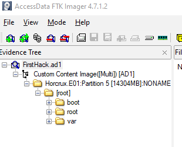
And look like only root user, boot and var directories are presented here
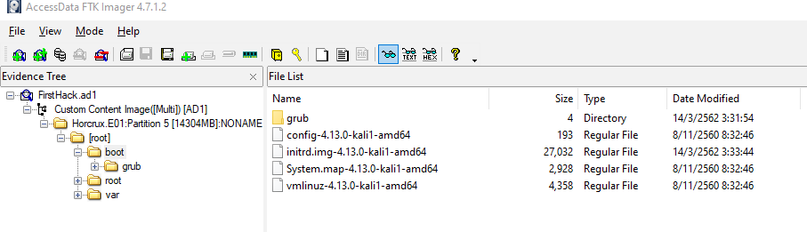
Under boot directory, We can see that this evidence file was captured from kali linux system
```
kali
```

> Q2: What is the MD5 hash of the apache access.log?

Go to `/var/log/apache2` then we can see there is access.log file which has 0 size there
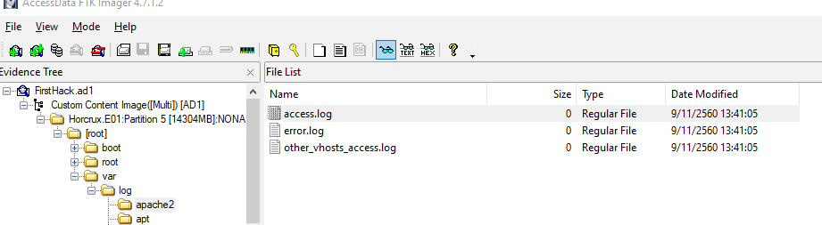
Export File Hash List to csv file then open it to see the MD5 of this log file
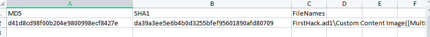
```
d41d8cd98f00b204e9800998ecf8427e
```

> Q3: It is believed that a credential dumping tool was downloaded? What is the file name of the download?

When user download files, The destination could be custom but the default directory is `~/Download` so go to `/root/Downloads` then the downloaded file is still there
```
mimikatz_trunk.zip
```

> Q4: There was a super-secret file created. What is the absolute path?

When file was created then user might be the one who did it and the lastest 1000 commands of that user will be logged on `~/.bash_history` so I checked out `/root/.bash_history`, we can see that user created a supersecret file on Desktop directory
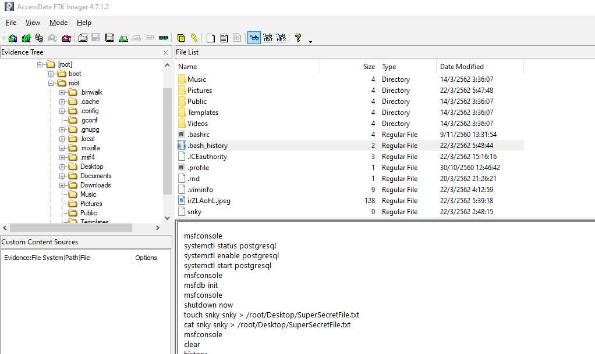
```
/root/Desktop/SuperSecretFile.txt
```

> Q5: What program used didyouthinkwedmakeiteasy.jpg during execution?

Still on `.bash_history`, after scrolling there is a command used with this jpg file which is [binwalk](https://github.com/ReFirmLabs/binwalk) probably to find secret message or secret file inside of this image
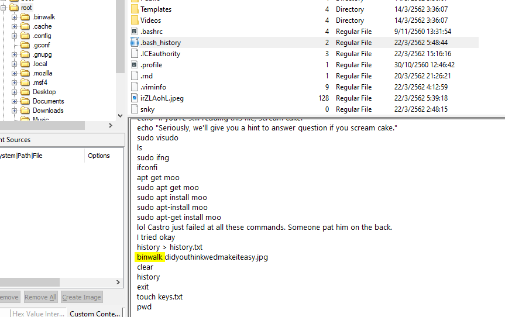
```
binwalk
```

> Q6: What is the third goal from the checklist Karen created?

On Desktop, there is a file named Checklist and all the goal of this machine's user could be found here
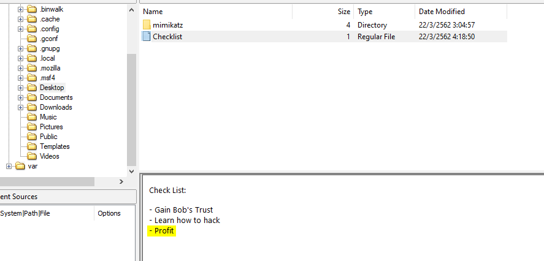
```
profit
```

> Q7: How many times was apache run?

We can check the log files at `/var/log/apache2`, Now since all the log files have 0 size that mean user didn't run apache at all
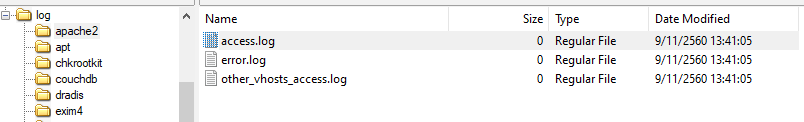
```
0
```

> Q8: It is believed this machine was used to attack another. What file proves this?

On `/root` directory, there is an image file which is a screenshot of windows system and flag is presented in this image, maybe user used this machine to play CTF and tried to root the flag 
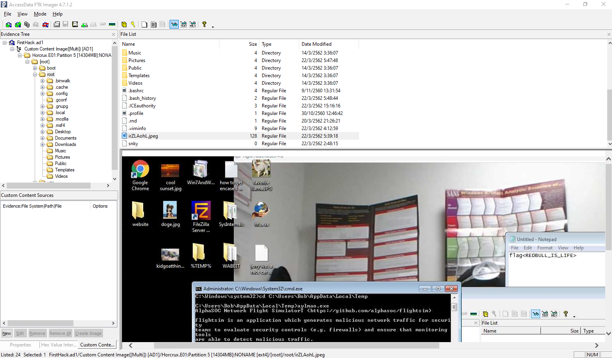

```
irZLAohL.jpeg
```

> Q9: Within the Documents file path, it is believed that Karen was taunting a fellow computer expert through a bash script. Who was Karen taunting?

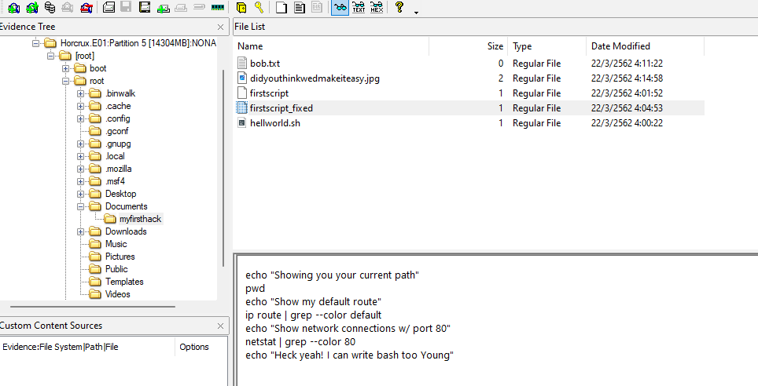
You can get an answer from `firstscript_fixed`  
```
Young
```

> Q10: A user su'd to root at 11:26 multiple times. Who was it?

When user tried to authenticate, it will be logged at `\var\log\auth.log` so I went there and found that Karen used switch user command (`su`) from root to postgres multiple times at 11:26
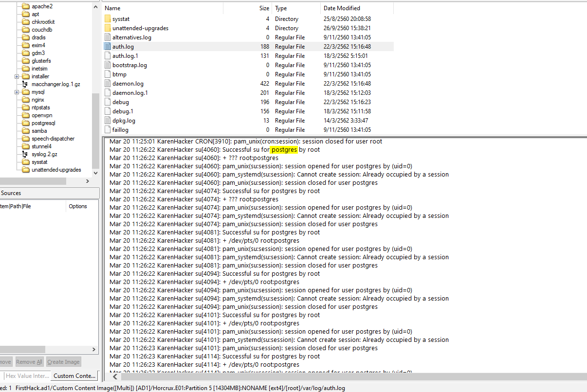

```
postgres
```

> Q11: Based on the bash history, what is the current working directory?

The lastest change directory command (`cd`) destination is `../Documents/myfirsthack` and the above of it tells us that its in user root's directory
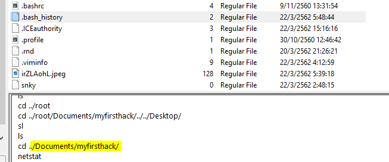
```
/root/Documents/myfirsthack
```

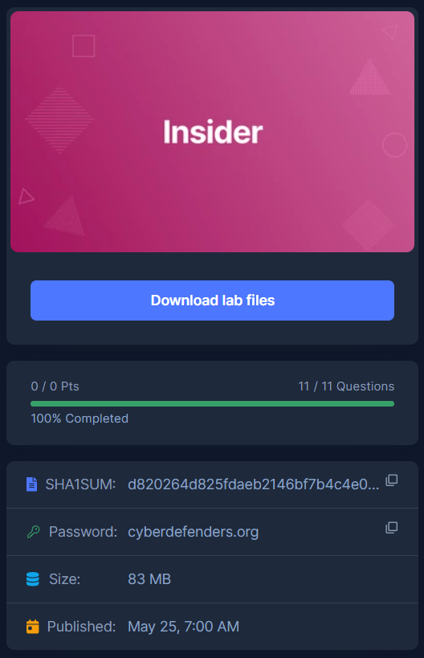
* * *