# [CyberDefenders - MalDoc101](https://cyberdefenders.org/blueteam-ctf-challenges/maldoc101/)
Created: 21/06/2024 20:48
Last Updated: 21/06/2024 21:39
* * *
>Category: Malware Analysis
>Tags: Malicious Document, Macro, OLEDUMP, CyberChef, Strings, VirusTotal, T1105, T1059
* * *
It is common for threat actors to utilize living off the land (LOTL) techniques, such as the execution of PowerShell to further their attacks and transition from macro code. This challenge is intended to show how you can often times perform quick analysis to extract important IOCs. The focus of this exercise is on static techniques for analysis.

As a security blue team analyst, analyze the artifacts and answer the questions.

**Suggested Tools**:
- REMnux Virtual Machine (remnux.org)
- Terminal/Command prompt w/ Python installed
- [Oledump](https://blog.didierstevens.com/programs/oledump-py/)
- Text editor
* * *
## Questions
> Q1: Multiple streams contain macros in this document. Provide the number of highest one.

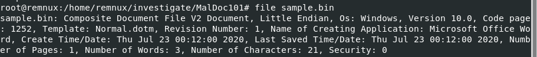

We can a sample which whish is Microsoft Document Macro even though it was named `sample.bin`

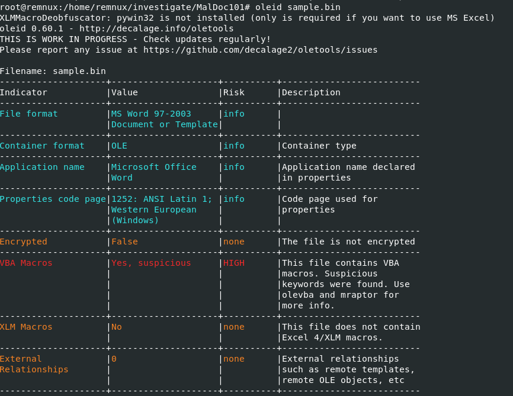

I always make sure to use `oleid` first to identify VBA Macros within any document files which there is so we can proceed with `olevba` to dump all macros embbed on this file

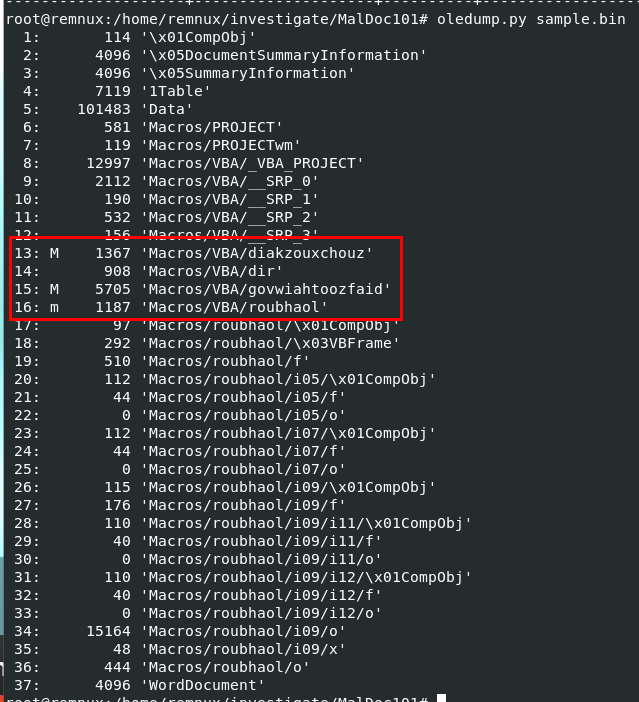

But to answer this question, we need to use `oledump.py` which you can see that there are 3 objects that contain macros and the highest one is stream 16

```
16
```

> Q2: What event is used to begin the execution of the macros?

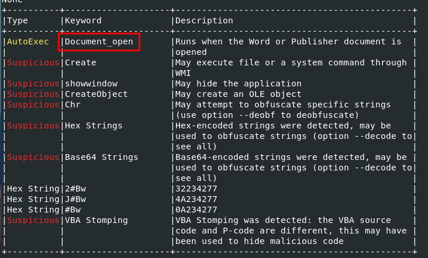

Using `olevba` then we can see that this tool already detect which event reponsisble for execution of macros

```
Document_Open
```

> Q3: What malware family was this maldoc attempting to drop?

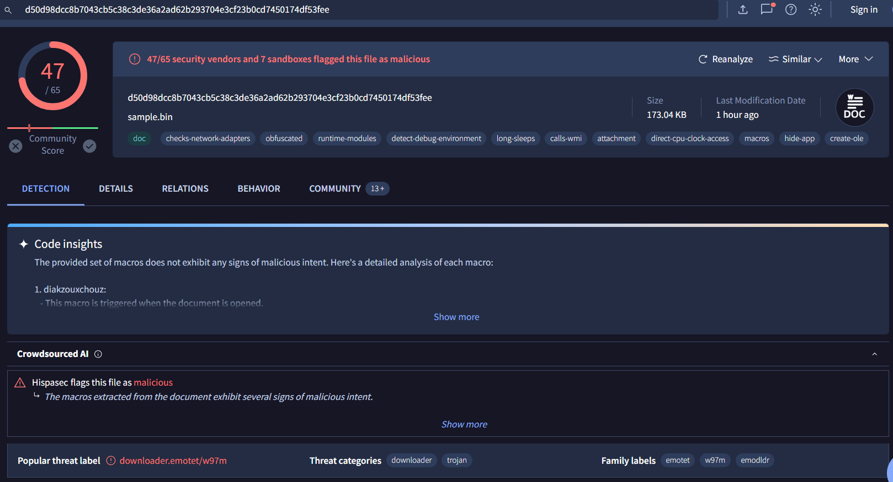

Using `md5sum` or other hash generator then search it on VirusTotal

```
emotet
```

> Q4: What stream is responsible for the storage of the base64-encoded string?

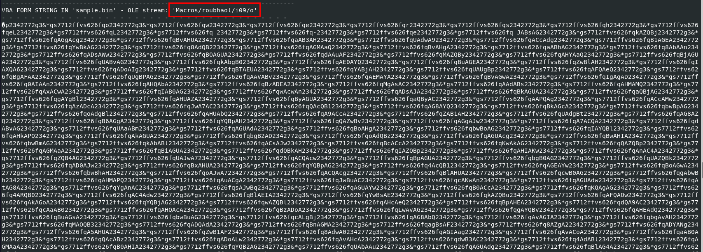

After dumping all macros with `olevba`, we can see that there is an object that contains there large and weird base64 encoding strings

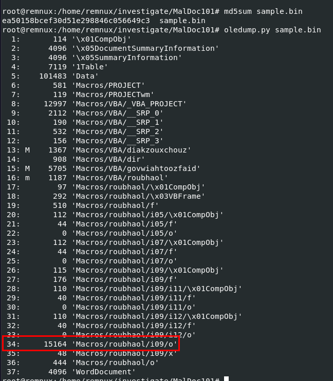

Go back to `oledump.py` and identify stream of this object

```
34
```

> Q5: This document contains a user-form. Provide the name?

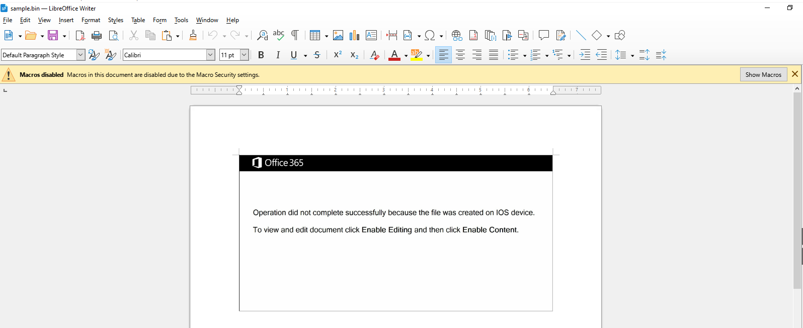

lets open this maldoc on LibreOffice which macro is turn off by default so we donot have to worry about it

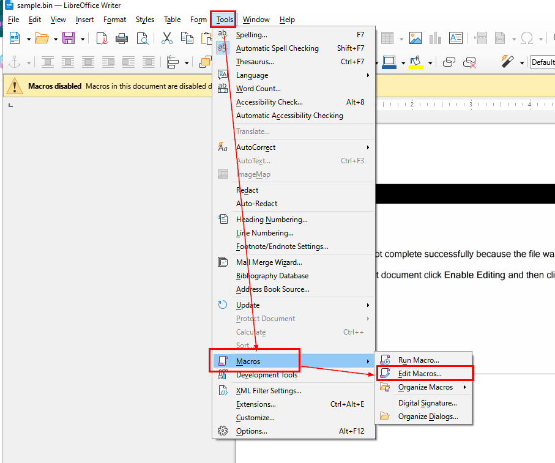

Then go to "Tools" > "Macros" > "Edit Macros..." to edit/view all macros on this document file

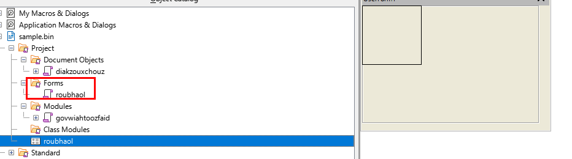

Which we will see the name of user-form inside this document

```
roubhaol
```

> Q6: This document contains an obfuscated base64 encoded string; what value is used to pad (or obfuscate) this string?

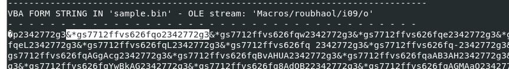

there are these weird string that keep repeating so we need to remove them to get an actual base64 encoded string that was intended to be executed

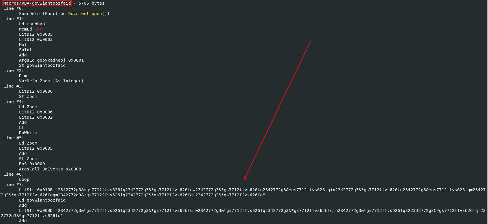

Go back to `olevba` result, we can see which object responsible for removing these padding and executing malicious code

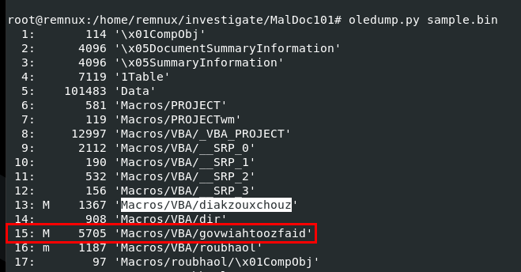

Use `oledump.py` again to find which stream match this object name

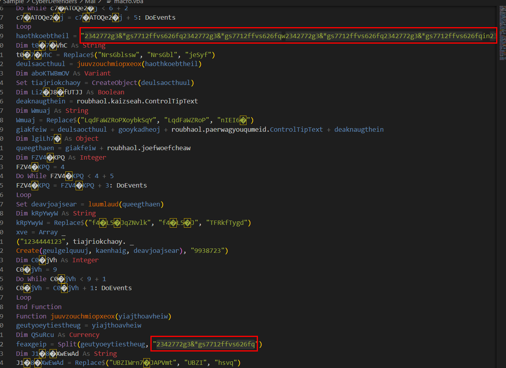

Then we will use `oledump.py -s 15 --vbadecompresscorrupt sample.bin > macro.vba` to dump this object into a file with VBA decompression to analyze which you can see from an above that this string is a pattern to be removed

```
2342772g3&*gs7712ffvs626fq
```

> Q7: What is the program executed by the base64 encoded string?

Lets dump object that store base64 encoded string to a file with `oledump.py -s 34 -d sample.bin > sample.b64`

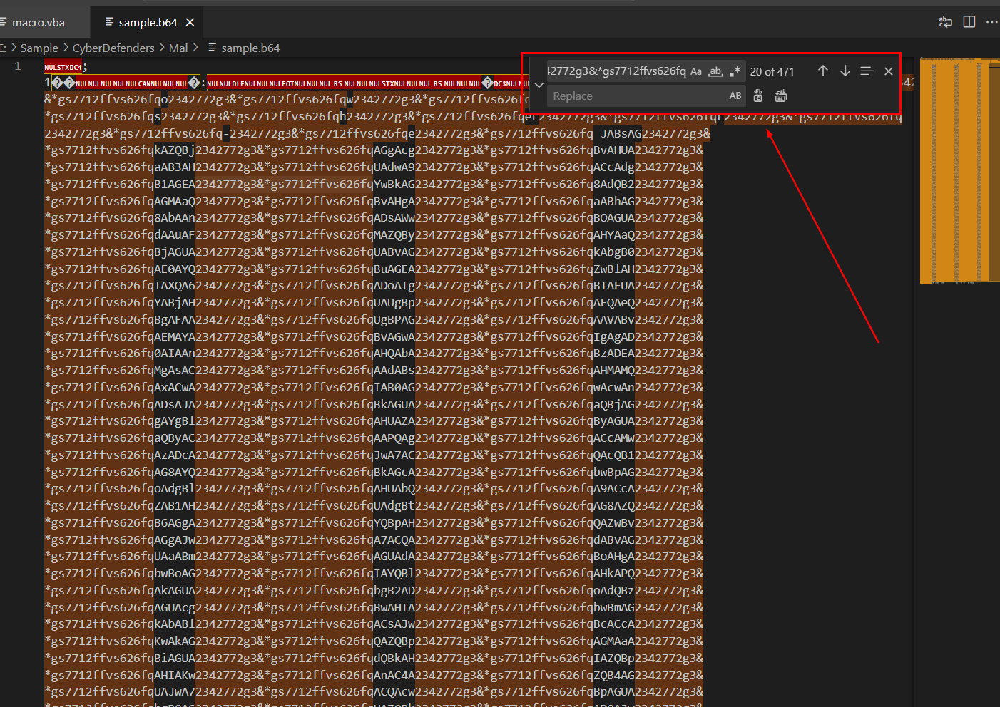
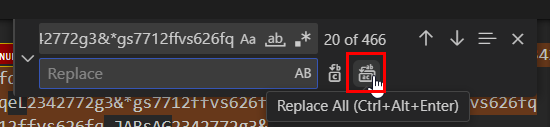

Then use find and replace function to remove all strings that match the pattern we found earlier

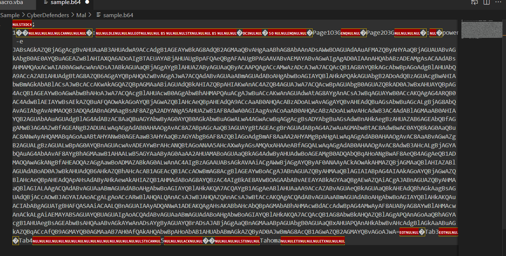

Now after removing padding strings, we come down to this and as you can see we need to do a little bit of manual work to remove unrelated data

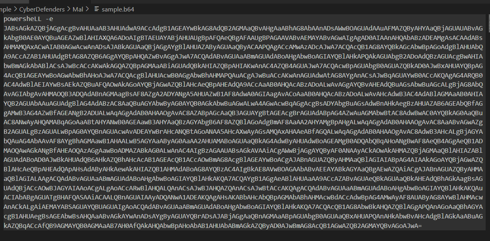

Now we can see that it is a powershell command to execute this base64 encoded string

```
powershell
```

> Q8: What WMI class is used to create the process to launch the trojan?

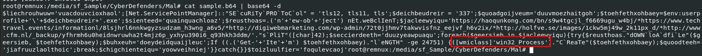

Decode base64 string then we will see that `win32_Process` is used here

```
win32_Process
```

> Q9: Multiple domains were contacted to download a trojan. Provide first FQDN as per the provided hint.

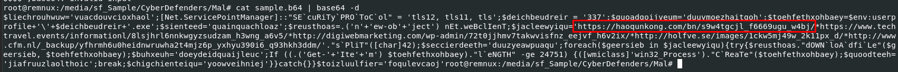
```
haoqunkong.com
```

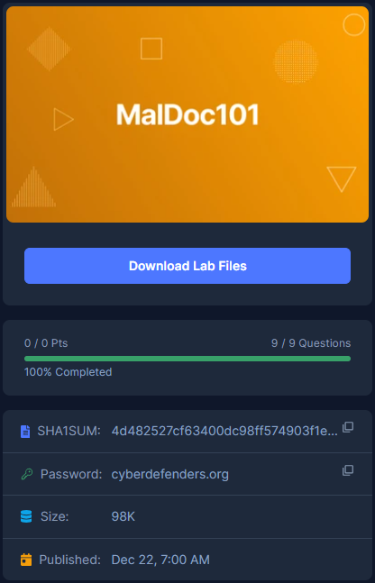
* * *
