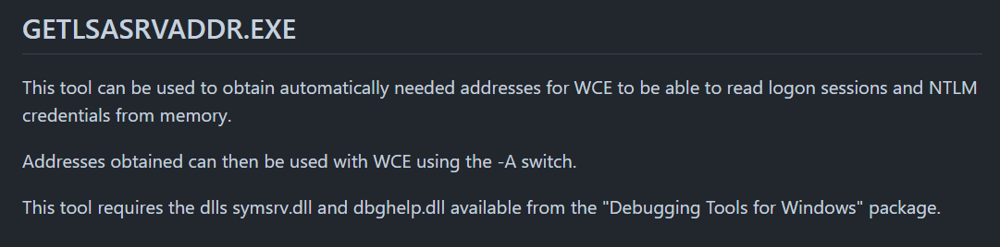
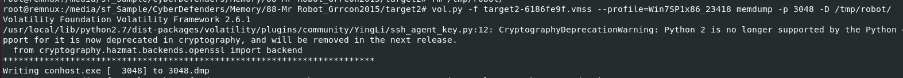
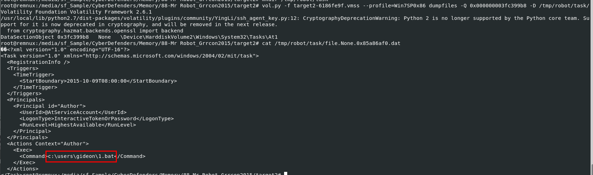
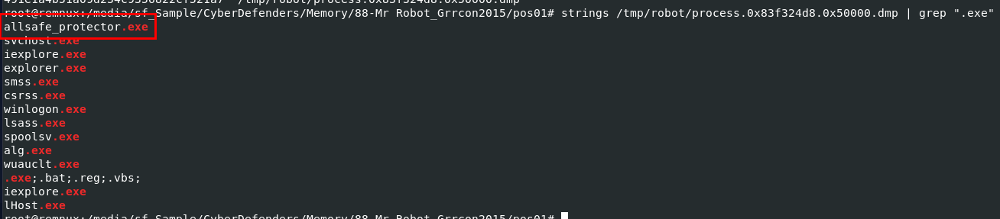

# [CyberDefenders - MrRobot](https://cyberdefenders.org/blueteam-ctf-challenges/mrrobot/)
Created: 05/06/2024 19:35
Last Updated: 08/06/2024 16:47
* * *
>Category: Endpoint Forensics
>Tags: Memory Forensic, Phishing, RAT, Volatility, R-Studio, T1048, T1005, T1016, T1003.002, T1055, T1060, T1204, T1566.001, T1021
* * *
**Scenario**:
An employee reported that his machine started to act strangely after receiving a suspicious email for a security update. The incident response team captured a couple of memory dumps from the suspected machines for further inspection. Analyze the dumps and help the SOC analysts team figure out what happened!

**Tools**:
- [Volatility2](https://github.com/volatilityfoundation/volatility)
- [Volatility3](https://github.com/volatilityfoundation/volatility)
- [Rstudio](https://www.r-studio.com/)
* * *
## Questions
> Q1: Machine:Target1 What email address tricked the front desk employee into installing a security update?


First we need to determine which volatility profile we should use on this memory dump then after determine which profile to use then we're good to fo


I started off with `vol.py -f Target1-1dd8701f.vmss --profile=Win7SP1x86_23418 pstree` to find if there any outlook process or email client process that were running while this memory dump was taken and there is


Then I used `vol.py -f Target1-1dd8701f.vmss --profile=Win7SP1x86_23418 handles -p 3196 | grep "File"` to find if there is any files that we can dump like ost files or cache files and you can see that there are ost files that we can dump from this memory dump


Lets dump all ost files using `vol.py -f Target1-1dd8701f.vmss --profile=Win7SP1x86_23418 dumpfiles -n -u -r ost$ -D /tmp/robot`


`find . -type f -exec pffexport -m all -f all "{}" \;`

I found this command from some write-ups which is really useful, it will find all PST and OST files used by Microsoft Outlook and use pffexport to extract data from these files and lastly we will have a directory that is an output from pffexport


Find for Headers then we will have an email of suspected sender


```
th3wh1t3r0s3@gmail.com
```

> Q2: Machine:Target1 What is the filename that was delivered in the email?


Read `Message.html` we can see a file was sent as url for user to download this file from his browser

```
AnyConnectInstaller.exe
```

> Q3: Machine:Target1 What is the name of the rat's family used by the attacker?


Lets find this file with `vol.py -f Target1-1dd8701f.vmss --profile=Win7SP1x86_23418 filescan | grep "AnyConnectInstaller.exe"` then we will have bunch of them here


I dumpped one of them with `vol.py -f Target1-1dd8701f.vmss --profile=Win7SP1x86_23418 dumpfiles -Q 0x000000003e0bc5e0 -D /tmp/robot/` then generate md5 hash to search on VirusTotal


We will have dat and image files, both of them are malicious but there are the same malware since we dumpped from the same physical address


I had to go to Community tab to finally figure out that it is XtreamRAT

```
XTREMERAT
```

> Q4: Machine:Target1 The malware appears to be leveraging process injection. What is the PID of the process that is injected?


Go to Shell Commands and Processes Injected section under Behavior tab then we can see that a legitimate process like iexplore is the target of this process injection


I used `vol.py -f Target1-1dd8701f.vmss --profile=Win7SP1x86_23418 pstree` to identify its pid of this process

```
2996
```

> Q5: Machine:Target1 What is the unique value the malware is using to maintain persistence after reboot?


I found this on Registry Keys Set then we can see that it was set persistence under sevaral registry keys under the name of MrRobot which is a name of a show and theme of this lab

```
MrRobot
```

> Q6: Machine:Target1 Malware often uses a unique value or name to ensure that only one copy runs on the system. What is the unique name the malware is using?

I recommened you to read this - [Malware Detection Avoidance through Mutexes](https://www.grin.com/document/1138722) to understand how mutex will prevent the same malware from being executed again if it already executed on the same system


So we will have to find for mutex created from this malware under Behavior tab then we will have this `fsociery0.dat` which is the one we're looking for 


Or we can use `vol.py -f Target1-1dd8701f.vmss --profile=Win7SP1x86_23418 handles -p 2996 | grep -i "mutant"` to find mutex from memory dump directly

```
fsociety0.dat
```

> Q7: Machine:Target1 It appears that a notorious hacker compromised this box before our current attackers. Name the movie he or she is from.

I guessed it was MrRobot but I was wrong now I need to take a hint which tell me to use R-studio so lets do it


Then we can see that zerocool user was there when this memory dump was captured


Which is from Hackers movie

```
hackers
```

> Q8: Machine:Target1 What is the NTLM password hash for the administrator account?


Used `vol.py -f Target1-1dd8701f.vmss --profile=Win7SP1x86_23418 hashdump` to dump both LM and NTLM hashes of all users it could catch on this machine

Then the rightest one is the NTLM while the middle is LM

```
79402b7671c317877b8b954b3311fa82
```

> Q9: Machine:Target1 The attackers appear to have moved over some tools to the compromised front desk host. How many tools did the attacker move?


Eariler from pstree plugin, I found that cmd process were running so I used `vol.py -f Target1-1dd8701f.vmss --profile=Win7SP1x86_23418 consoles` to look into which commands that were executed on cmd and look like an attacker have these 4 exe files but look like 4 is not the right answer so we need to look into each one of them


`nbtscan.exe` is NETBIOS nameserver scanner


`Rar.exe` is winrar executable to compress and decompress files


but `wce.exe` and `getlsasrvaddr.exe` are from found on the same github repo so we can count them as 1 tool


`wce.exe` can be used for acitivity related to authentication on Windows sytem



while `getlsasrvaddr.exe` is used to get lsas process virtual address as it names imply 

```
3
```

> Q10: Machine:Target1 What is the password for the front desk local administrator account?


An attacker used `wce.exe` to "Dump cleartext passwords stored by the digest authentication package" so we also obtained cleartext password of front desk local admin here

```
flagadmin@1234
```

> Q11: Machine:Target1 What is the std create data timestamp for the nbtscan.exe tool?


Used `vol.py -f Target1-1dd8701f.vmss --profile=Win7SP1x86_23418 mftparser | grep -i "nbtscan"` to find a timestamp from MFT directly

```
2015-10-09 10:45:12 UTC
```

> Q12: Machine:Target1 The attackers appear to have stored the output from the nbtscan.exe tool in a text file on a disk called nbs.txt. What is the IP address of the first machine in that file?


Find physical address with filescan then dump it to display content inside of it 
```
10.1.1.2
```

> Q13: Machine:Target1 What is the full IP address and the port was the attacker's malware using?


Used `vol.py -f Target1-1dd8701f.vmss --profile=Win7SP1x86_23418 netscan | grep -i "iexplore"` to display connection associated with iexplore process only

```
180.76.254.120:22
```

> Q14: Machine:Target1 It appears the attacker also installed legit remote administration software. What is the name of the running process?


From pstree plugin output, we also see that Teamviewer was also running on this system

```
TeamViewer.exe
```

> Q15: Machine:Target1 It appears the attackers also used a built-in remote access method. What IP address did they connect to?


used netscan plugin again then find for microsoft built-in remote access tool then we have this `mstsc.exe` which used for RDP connection

```
10.1.1.21
```

> Q16: Machine:Target2 It appears the attacker moved latterly from the front desk machine to the security admins (Gideon) machine and dumped the passwords. What is Gideon's password?


We will also need to determine volatility profile for this memory dump which we can use the same profile we just used from previous dump


Used `vol.py -f target2-6186fe9f.vmss --profile=Win7SP1x86_23418 pstree` then we can see outlook and cmd were running 


I'm interested by cmd so I used `vol.py -f target2-6186fe9f.vmss --profile=Win7SP1x86_23418 consoles` and we can see that an attacker used `wce.exe` to dump cleartext password of Gideon to `w.tmp`


Next we will use `vol.py -f target2-6186fe9f.vmss --profile=Win7SP1x86_23418 filescan | grep -i "w.tmp"` to find physical address of this file to dump


Then dump it with `vol.py -f target2-6186fe9f.vmss --profile=Win7SP1x86_23418 dumpfiles -Q 0x000000003fcf2798 -D /tmp/robot/`

```
t76fRJhS
```

> Q17: Machine:Target2 Once the attacker gained access to "Gideon," they pivoted to the AllSafeCyberSec domain controller to steal files. It appears they were successful. What password did they use?


From console history,we can see that an attacker used rar to compress a file with password


Lets ChatGPT explain each arguments for us

```
123qwe!@#
```

> Q18: Machine:Target2 What was the name of the RAR file created by the attackers?
```
crownjewlez.rar
```

> Q19: Machine:Target2 How many files did the attacker add to the RAR archive?


We need to dump process that was used to create rar archive, first lets grab this PID



Then use `vol.py -f target2-6186fe9f.vmss --profile=Win7SP1x86_23418 memdump -p 3048 -D /tmp/robot/` 


we all know that this archive aims to archive all text file inside crownjewel directory so I will use `strings -el /tmp/robot/3048.dmp | grep "crownjewel" | grep ".txt"` to find those text files and it worked like a champ


```
3
```

> Q20: Machine:Target2 The attacker appears to have created a scheduled task on Gideon's machine. What is the name of the file associated with the scheduled task?


You can use R-studio to navigate to `'\Windows\System32\Tasks\'` and find for suspicious schedule task but if you're using volatilty like me then we will use `vol.py -f target2-6186fe9f.vmss --profile=Win7SP0x86 filescan | grep '\\Windows\\System32\\Tasks\\'` to list all files inside task directory and this `At1` task looking out of place for me



So I dumped it with `vol.py -f target2-6186fe9f.vmss --profile=Win7SP0x86 dumpfiles -Q 0x000000003fc399b8 -D /tmp/robot/task/` then we can see it was set to execute a bat script, so this one is the task we're looking for

```
1.bat
```

> Q21: Machine:POS What is the malware CNC's server?


This memory dump is still using the same profiles as other 2


From other memory dumps we know that a process that was injected is `iexplore.exe` so we will use `vol.py -f POS-01-c4e8f786.vmss --profile=Win7SP0x86 netscan` and looking for `iexplore`

```
54.84.237.92
```

> Q22: Machine:POS What is the common name of the malware used to infect the POS system?


Lets use `vol.py -f POS-01-c4e8f786.vmss --profile=Win7SP0x86 malfind -p 3208 -D /tmp/robot/` to dump it, we can see that it has 4d5a or MZ as magic number which mean its an executable file we're looking for


Search it hash on VirusTotal then we will have its common name

```
Dexter
```

> Q23: Machine:POS In the POS malware whitelist. What application was specific to Allsafecybersec?



I used strings and grep to use for exe then we can see that this exe file looking out of place here and turn out its the file we're looking for 

```
allsafe_protector.exe
```

> Q24: Machine:POS What is the name of the file the malware was initially launched from?


I used strings to search for C2 server from memory dump directly then we can see that suspicious file url was sent to POS with email 

```
allsafe_update.exe
```


* * *
