# [CyberDefenders - NintendoHunt](https://cyberdefenders.org/blueteam-ctf-challenges/nintendohunt/)
Created: 15/06/2024 13:48
Last Updated: 15/06/2024 20:49
* * *
>Category: Endpoint Forensics
>Tags: Memory Forensics, Volatility, T1055.012, T1027
* * *
**Scenario**:
You have been hired as a soc analyst to investigate a potential security breach at a company. The company has recently noticed unusual network activity and suspects that there may be a malicious process running on one of their computers. Your task is identifying the malicious process and gathering information about its activity.

**Tools**:
- [Volatility 2](https://www.volatilityfoundation.org/)
* * *
## Questions
> Q1: What is the process ID of the currently running malicious process?

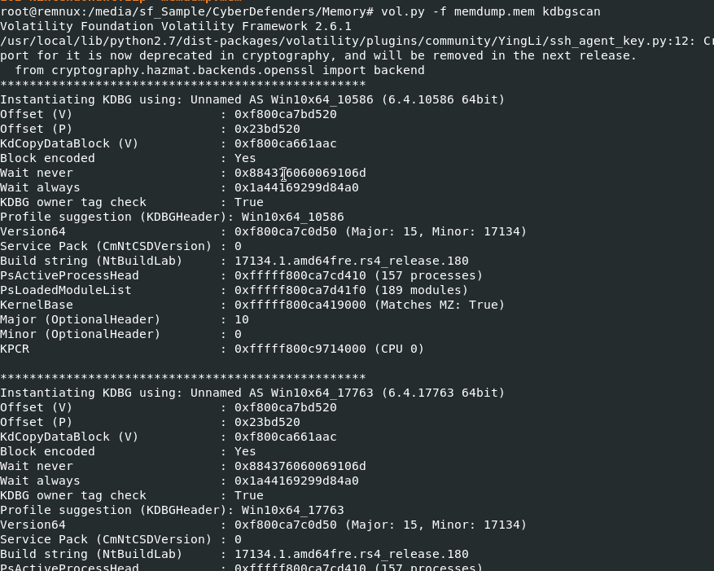

If you want to use volatility 2 for this memory dump then First, we need to determine which profile to use with kdbgscan and imageinfo plugin

But... problem is it took a long time to find suitable profile for us so knowing that this memory dump was captured from Windows system is enough for us to investigate this using volatility 3

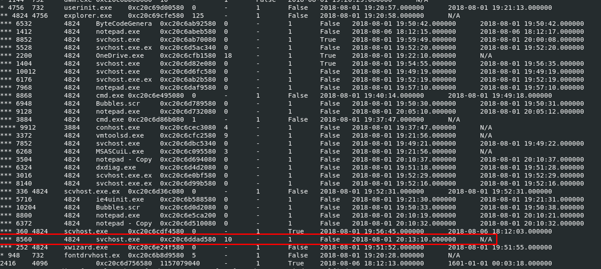

So we will use `vol3 -f memdump.mem pstree` to display process tree from this memory dump, which you can see that it should be impossible for svchost processes to be child process of `explorer.exe` which made them totally suspicious 

To get the currently running one, we need to look for svchost process that does not have Exit Time

```
8560
```

> Q2: What is the md5 hash hidden in the malicious process memory?

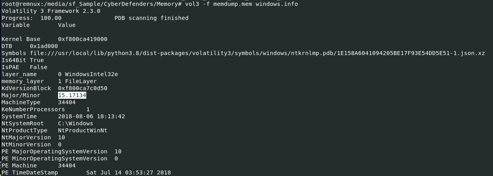

To properly perform process dump properly, I need to go back to volatility 2 so I used  `vol3 -f memdump.mem windows.info` to help me determine which profile to use from unfinished kdbgscan of mine 

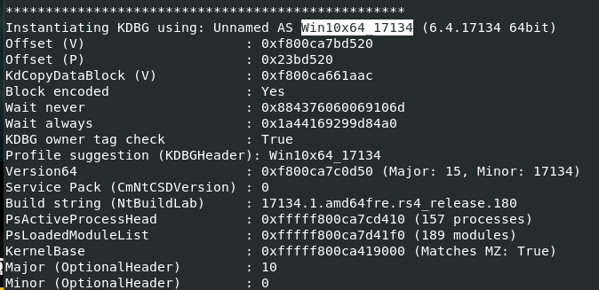

And look like "Win10x64_17134" is the most suitable profile 

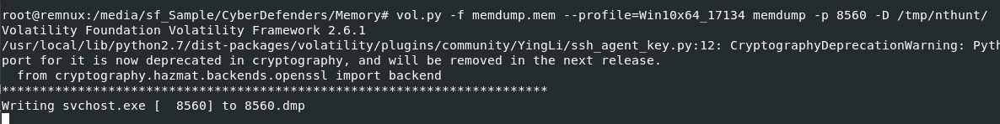

Then after we got the suitable profile, lets use `vol.py -f memdump.mem --profile=Win10x64_17134 memdump -p 8560 -D /tmp/nthunt/` to dump memory dump this process

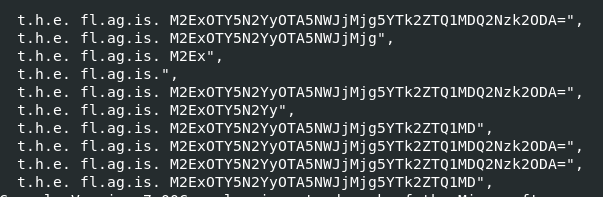

I tried using strings with several regex to find possible md5 inside but turns out it was encoded with base64 so I couldn't find using md5 regex

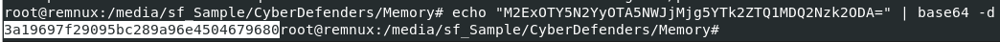

Now we can get an answer using `echo "M2ExOTY5N2YyOTA5NWJjMjg5YTk2ZTQ1MDQ2Nzk2ODA=" | base64 -d"` command 

```
3a19697f29095bc289a96e4504679680
```

> Q3: What is the process name of the malicious process parent?
```
explorer.exe
```

> Q4: What is the MAC address of this machine's default gateway?

We might want to look at keys under `HKEY_LOCAL_MACHINE\SOFTWARE\Microsoft\Windows NT\CurrentVersion\NetworkList\Signatures\Unmanaged` that serves a specific purpose related to network configuration and profile management in Windows.

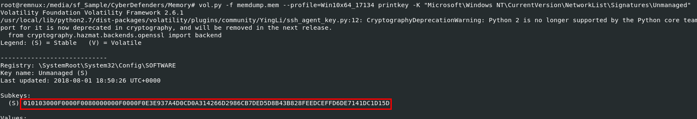

First we need to get any subkey on this key by using `vol.py -f memdump.mem --profile=Win10x64_17134 printkey -K "Microsoft\Windows NT\CurrentVersion\NetworkList\Signatures\Unmanaged"` and now we can dig deeper into this subkey

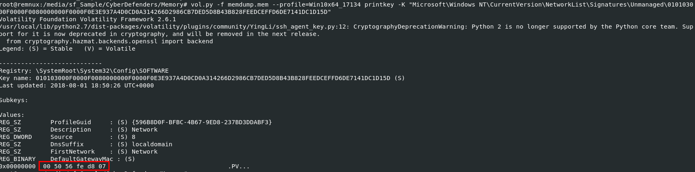

Lets proceed with `vol.py -f memdump.mem --profile=Win10x64_17134 printkey -K "Microsoft\Windows NT\CurrentVersion\NetworkList\Signatures\Unmanaged\010103000F0000F0080000000F0000F0E3E937A4D0CD0A314266D2986CB7DED5D8B43B828FEEDCEFFD6DE7141DC1D15D"` which will print out MAC address of the default gateway here

```
00:50:56:fe:d8:07
```

> Q5: What is the name of the file that is hidden in the alternative data stream?

Alternate Data Streams (ADS) are a feature of the NTFS (New Technology File System) used by Windows. They allow files to contain more than one stream of data, essentially providing a way to store additional information associated with a file in a hidden manner which make it a turning point for bad actors to hide the presence of a secret or malicious file inside the file record of an innocent file.

You can read more about this on [Alternate Data Streams Overview Blog published by SANS](https://www.sans.org/blog/alternate-data-streams-overview/)

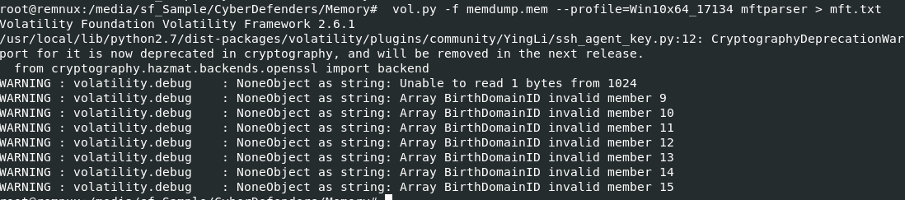

First, we will use `vol.py -f memdump.mem --profile=Win10x64_17134 mftparser > mft.txt` to pipe all output from mftparser to a file so we didn't have to rescan everything to find what we want.

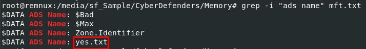

We can use `grep -i "ads name" mft.txt` to get all ADS name from mftparser output and you can see that there is a suspicious text file there

```
yes.txt
```

> Q6: What is the full path of the browser cache created when the user visited "www.13cubed.com" ?

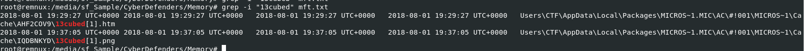

We will use `grep -i "13cubed" mft.txt` to find all files that have "13cubed" matches and there are 2 files return from this command

First one is htm file which is the file we want 

```
C:\Users\CTF\AppData\Local\Packages\MICROS~1.MIC\AC\#!001\MICROS~1\Cache\AHF2COV9\13cubed[1].htm
```


* * *
