# [CyberDefenders - Obfuscated](https://cyberdefenders.org/blueteam-ctf-challenges/obfuscated/)
Created: 23/06/2024 01:41
Last Updated: 23/06/2024 20:22
* * *
>Category: Malware Analysis
>Tags: Malicious Document, Backdoor, OLEDUMP, CMDWatcher, JavaScript, T1140, T1059.007, T1204, T1566.001
* * *
**Scenario**
During your shift as a SOC analyst, the enterprise EDR alerted a suspicious behavior from an end-user machine. The user indicated that he received a recent email with a DOC file from an unknown sender and passed the document for you to analyze.

**Tools**
1. [CmdWatcher](https://www.kahusecurity.com/posts/cmd_watcher_updated.html)
2. [oledump](https://blog.didierstevens.com/programs/oledump-py/)
3. [sha256sum](https://linux.die.net/man/1/sha256sum)
* * *
## Questions
> Q1: What is the sha256 hash of the doc file?

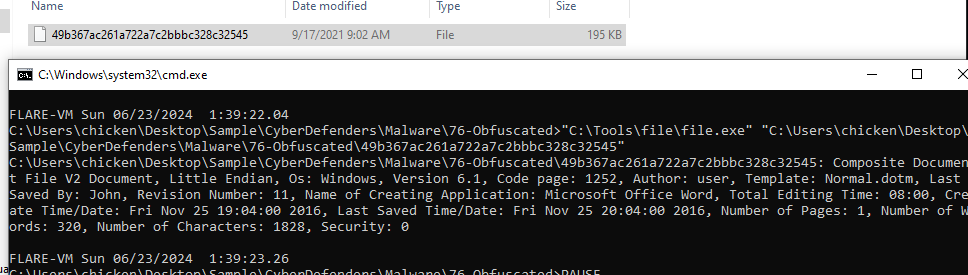

After confirmed that we got the right file then we can proceed with your hash generation tool to obtain the answer

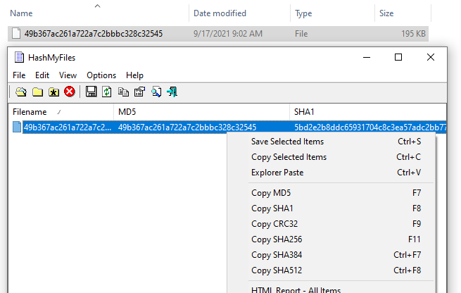

```
ff2c8cadaa0fd8da6138cce6fce37e001f53a5d9ceccd67945b15ae273f4d751
```

> Q2: Multiple streams contain macros in this document. Provide the number of lowest one.

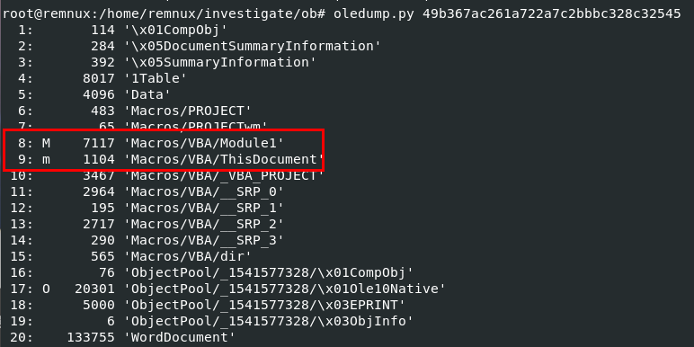

By using `oledump.py` then you can see that there are macros in object 8 and 9 and also have OLE stream within object 17 too

```
8
```

> Q3: What is the decryption key of the obfuscated code?

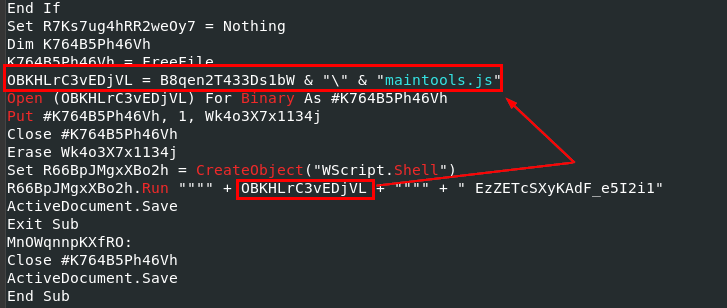

I tried to dump macros with `olevba --deob 49b367ac261a722a7c2bbbc328c32545`, you can see that I used `--deob` because it was obfuscated then we can see this weird string will be pass down to `maintools.js` via `wscript`

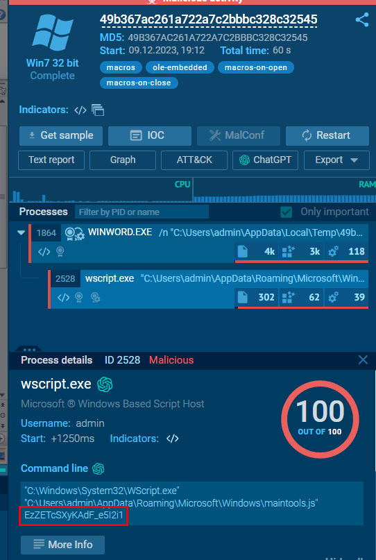

Lets search file hash of this document file on any.run then we will see that it was actually passed to `maintools.js` as expected

```
EzZETcSXyKAdF_e5I2i1
```

> Q4: What is the name of the dropped file?
```
maintools.js
```

> Q5: This script uses what language?
```
JScript
```

> Q6: What is the name of the variable that is assigned the command-line arguments?

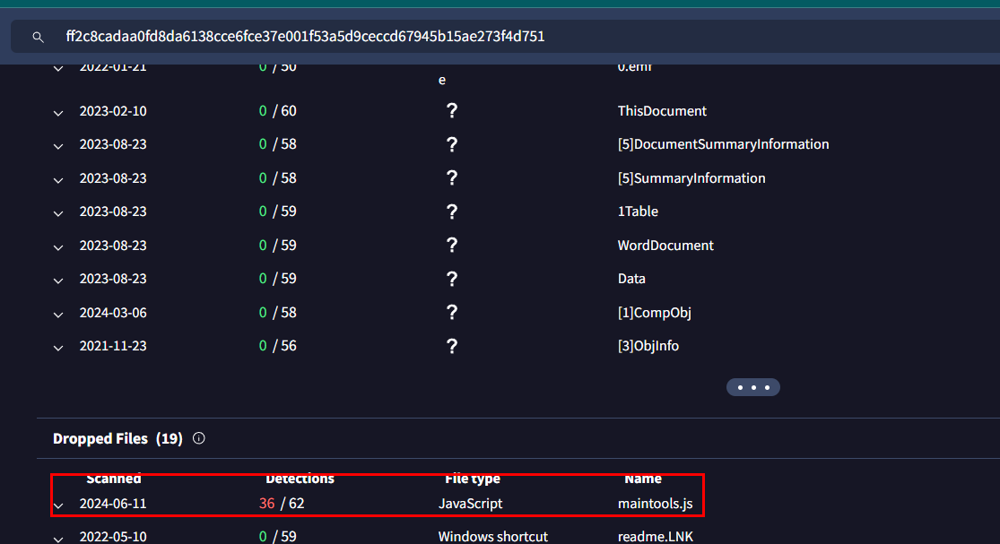

First, we will need to get `maintools.js` to analyze locally so we will go to VirusTotal of this malicious document file and go to Relation tab under Dropped Files section

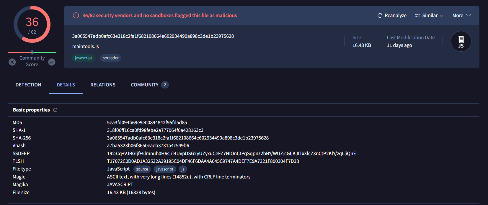

Grab file hash from this [page](https://www.virustotal.com/gui/file/3a065547adb0afc63e318c2fa1f682108664e602934490a898c3de1b23975628/details) then search it on any.run

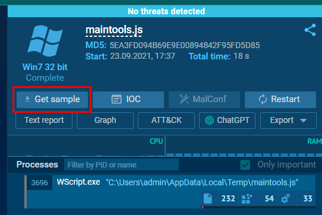

After we found this script on any.run, click "Get sample" to download a file in zip

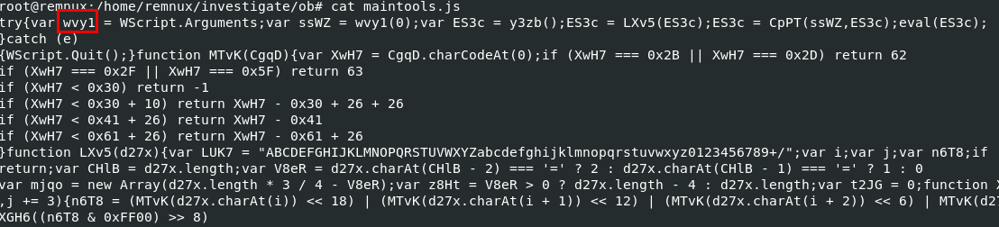

after extracted file, then we can see that `wvy1` variable will be assigned a value from wscript argument that we found earlier

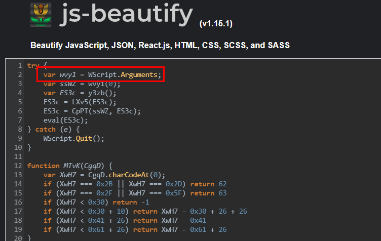

We can use https://beautifier.io/ to beautify JS code from this file and make our analysis a little bit easier

```
wvy1
```

> Q7: How many command-line arguments does this script expect?
```
1
```

> Q8: What instruction is executed if this script encounters an error?

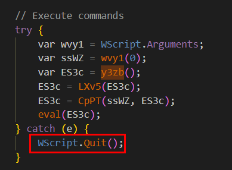

This script using `try` and `catch(e)` to execute a script which mean any errors that occurs will be handled by `catch(e)` and it will quit wscript that was running this script

```
WScript.Quit()
```

> Q9: What function returns the next stage of code (i.e. the first round of obfuscated code)?

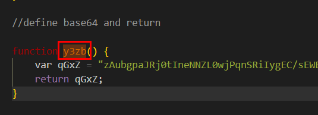

There is a very long base64 string declaration inside this function and it will return this value when this function was called  

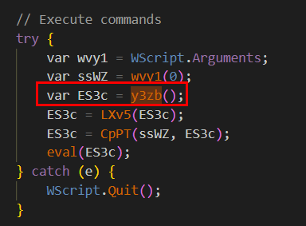

Which will be called here and assigned to `ES3c` variable which will be passed to other 2 functions before execute with `eval`

```
y3zb
```

> Q10: The function LXv5 is an important function, what variable is assigned a key string value in determining what this function does?

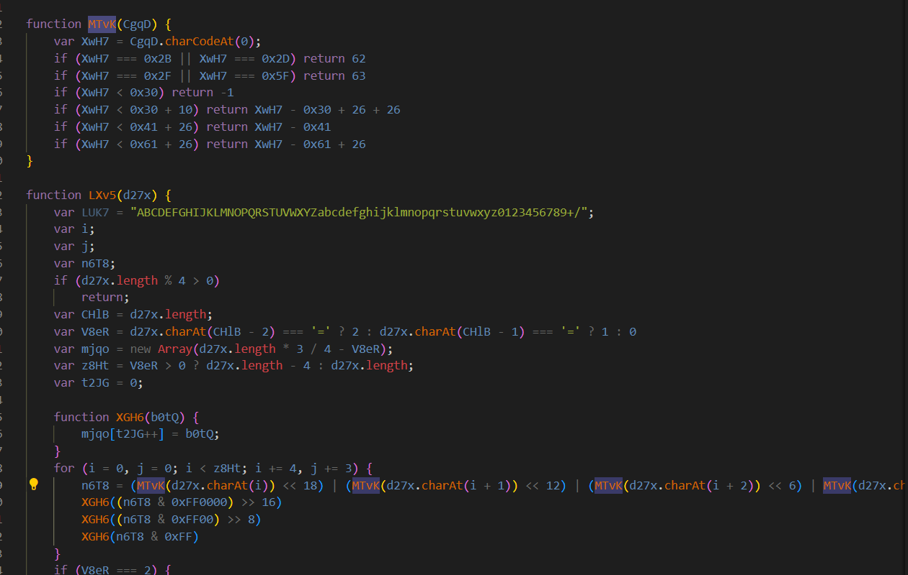

We can see that `LXv5` and `MTvK` function are used to decode base64 to binary then it will be handles by `CpPT` function later

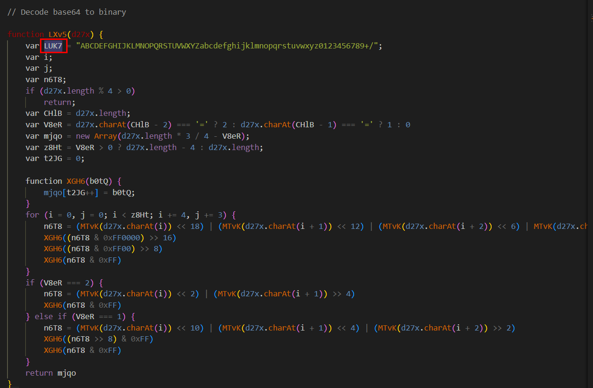

Here is an indicator that telling us it decoding base64 string

```
LUK7
```

> Q11: What encoding scheme is this function responsible for decoding?
```
base64
```

> Q12: In the function CpPT, the first two for loops are responsible for what important part of this function?

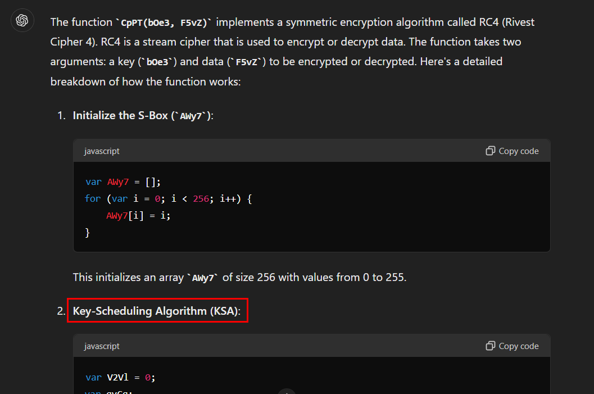

We know that `LXv5` and `MTvK` function are used to decode base64 to binary but what about `CpPT` that will handle this binary to executable command? ChatGPT got our back and it telling us how this can be possible by using RC4 cipher to convert it back to respective script

```
Key-Scheduling Algorithm
```

> Q13: The function CpPT requires two arguments, where does the value of the first argument come from?

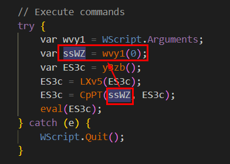

First argument that this function required is a key for RC4 and we already know where it comes from

```
command-line argument
```

> Q14: For the function CpPT, what does the first argument represent?
```
key
```

> Q15: What encryption algorithm does the function CpPT implement in this script?
```
rc4
```

> Q16: What function is responsible for executing the deobfuscated code?

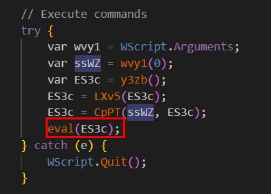
```
eval
```

> Q17: What Windows Script Host program can be used to execute this script in command-line mode?

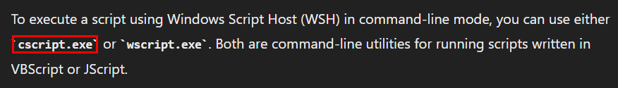
```
cscript.exe
```

> Q18: What is the name of the first function defined in the deobfuscated code?

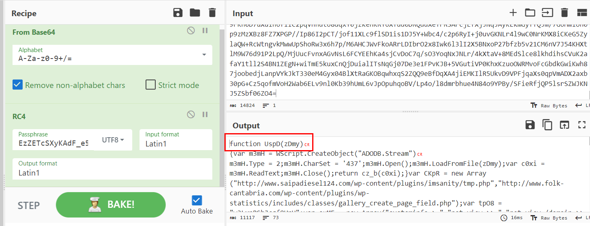

Using CyberChef to decode base64 and then decrypt those messy binary to respective script with RC4 with a key we got which we can see the first function is called `UspD` and it responsible for create an ADODB.Stream object and read a file

```
UspD
```

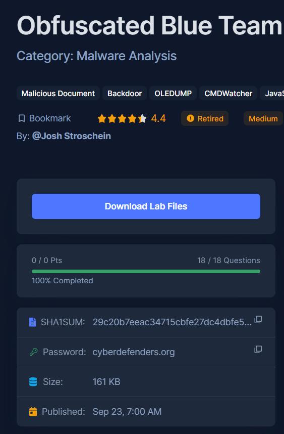
* * *
