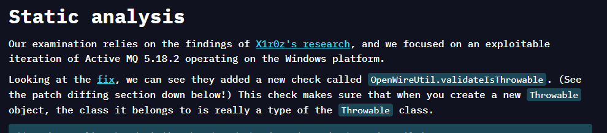

# [CyberDefenders - OpenWire](https://cyberdefenders.org/blueteam-ctf-challenges/openwire/)
Created: 06/03/2024 11:30
Last Updated: 06/03/2024 13:10
* * *
>Category: Network Forensics
>Tags: Wireshark, PCAP, CVEs
* * *
**Scenario**:
During your shift as a tier-2 SOC analyst, you receive an escalation from a tier-1 analyst regarding a public-facing server. This server has been flagged for making outbound connections to multiple suspicious IPs. In response, you initiate the standard incident response protocol, which includes isolating the server from the network to prevent potential lateral movement or data exfiltration and obtaining a packet capture from the NSM utility for analysis. Your task is to analyze the pcap and assess for signs of malicious activity.

**Tools**:
- Wireshark

* * *
## Questions
> Q1: By identifying the C2 IP, we can block traffic to and from this IP, helping to contain the breach and prevent further data exfiltration or command execution. Can you provide the IP of the C2 server that communicated with our server?

First thing I like to do after open pcap file is to check out Protocol Hierarchy Statistics, It gives me clue which direction I should focus on

There are TLS, OpenWire and HTTP

TLS is hard to investigate so I went to HTTP first and I hit jackpot on my first TCP stream

As we can see that ProcessBuilder method is used to execute commands, which download a file from HTTP server called `docker` then give it executable permission and execute it

After did some research, This is [Apache ActiveMQ](https://www.trendmicro.com/en_us/research/23/k/cve-2023-46604-exploited-by-kinsing.html) vulnerability (CVE-2023-46604) which is a RCE vulnerability

*You can read detailed analysis and POC [here](https://www.vicarius.io/vsociety/posts/apache-activemq-rce-cve-2023-46604?source=post_page-----65aa41a651b1--------------------------------)

So now we know that 146.190.21.92 is a simple python server and it is the answer of this question but then I opened Conversations Statistics to check how many IP addresses were captured on this pcap

The result showed 4 different IP address, 146.190.21.92 is the simple python server, 128.199.52.72 is a server that hosted file to be downloaded then 1 of those 2 has to be our server IP address

```
146.190.21.92
```

> Q2: Initial entry points are critical to trace back the attack vector. What is the port number of the service the adversary exploited?

I deleted all the filter and focus on the connection before the HTTP request was made and I confirmed that 134.209.197.3 is our server and it was connected from the simple python server at port 61616 so this is the answer

```
61616
```

> Q3: Following up on the previous question, what is the name of the service found to be vulnerable?

```
Apache ActiveMQ
```

> Q4: The attacker's infrastructure often involves multiple components. What is the IP of the second C2 server?

As the payload was used to download a file from HTTP server, that's the second C2 server.
```
128.199.52.72
```

> Q5: Attackers usually leave traces on the disk. What is the name of the reverse shell executable dropped on the server?

I followed the stream of a file that was downloaded and found that its an ELF file so this fits the question completely

```
docker
```

> Q6: What Java class was invoked by the XML file to run the exploit?

```
java.lang.ProcessBuilder
```

> Q7: To better understand the specific security flaw exploited, can you identify the CVE identifier associated with this vulnerability?

```
CVE-2023-46604
```

> Q8: What is the vulnerable Java method and class that allows an attacker to run arbitrary code? (Format: Class.Method)

After reading this [blog](https://www.vicarius.io/vsociety/posts/apache-activemq-rce-cve-2023-46604?source=post_page-----65aa41a651b1--------------------------------) carefully, The answer is right there on Static analysis part of this blog


```
BaseDataStreamMarshaller.createThrowable
```


* * *
