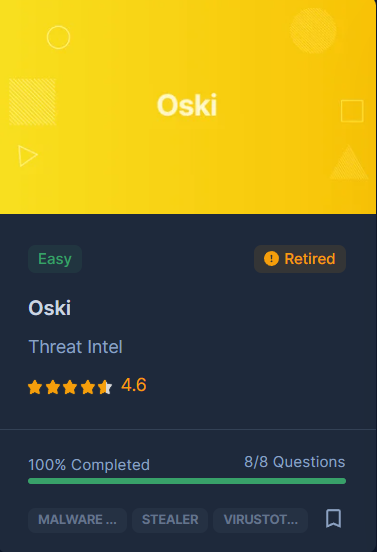

# [CyberDefenders - Oski](https://cyberdefenders.org/blueteam-ctf-challenges/oski/)
Created: 08/10/2024 13:35
Last Updated: 08/10/2024 23:53
* * *
>**Category**: Threat Intel
>**Tags**: Initial Access, Execution, Defense Evasion, Credential Access, Command and Control, Exfiltration
* * *
**Scenario:**
The accountant at the company received an email titled "Urgent New Order" from a client late in the afternoon. When he attempted to access the attached invoice, he discovered it contained false order information. Subsequently, the SIEM solution generated an alert regarding downloading a potentially malicious file. Upon initial investigation, it was found that the PPT file might be responsible for this download. Could you please conduct a detailed examination of this file?

**Tools**:
- VirusTotal
- Any.Run

* * *
## Questions
>Q1: To better categorize and comprehend the behavior and intent of this potential malware, it's essential to identify its family. What is the malware family name for the malicious executable found within the PPT?

This lab provided us with a hash so we can search it on VirusTotal which we can see that Crowdsourced IDS rules detected this file as [Stealc](https://www.hyas.com/blog/caught-in-the-act-stealc-the-cyber-thief-in-c) malware family which renowned for using legitimate dll to exfiltrate files, confidential information and cryptocurrency wallet from infected host.

  
Answer

<pre><code>stealc</code></pre>

>Q2: Determining the creation time of the malware can provide insights into its origin. When was the malware creation time?

Go to "Details" tab and we will find creation time of this file in "History" section right here

  
Answer

<pre><code>2022-09-28 17:40:46 UTC</code></pre>

>Q3: Identifying the command and control (C2C) server that the malware communicates with can help trace back to the attacker. Which C2C server does the malware in the PPT file communicate with?

We know that this malware used legitimate dll for extracting and exfiltrate data so we have to find other url that not hosted those file but an endpoint that receive these crucial information of infected host which we already found one right here. 

  
Answer

<pre><code>http://171.22.28.221/5c06c05b7b34e8e6.php</code></pre>

>Q4: Identifying the initial actions of the malware post-infection can provide insights into its primary objectives. What is the first library that the malware requests post-infection?

This malware will request for multiple dll files but according to [this any.run report](https://app.any.run/tasks/d55e2294-5377-4a45-b393-f5a8b20f7d44), this dll is the first one that got request from C2

  
Answer

<pre><code>sqlite3.dll</code></pre>

>Q5: Upon examining the malware, it appears to utilize the RC4 key for decrypting a base64 string. What is the specific RC4 key used by this malware?

Any.run also detected malware configuration of this file so we can click here to open "Malware configuration" window.

And here we can see C2 url and RC keys of this malware.

  
Answer

<pre><code>5329514621441247975720749009</code></pre>

>Q6: Identifying an adversary's techniques can aid in understanding their methods and devising countermeasures. Which MITRE ATT&CK technique are they employing to steal a user's password?

As we already know that stealc is known for exfiltrate files, passwords and cryptocurrency wallets but which MITRE ATT&CK technique is used? we got 2 candidates from any.run right here.

To confirm this, I opened one of POST request sending to C2 server and since this is base64 encoded so we can easily decode this ourselves easily.

We can see that it sent browser's artifacts that contain passwords back to C2 so there is no doubt that it has to be [T1555 : Credentials from Password Stores](https://attack.mitre.org/techniques/T1555/)

  
Answer

<pre><code>T1555</code></pre>

>Q7: Malwares may delete files left behind by the actions of their intrusion activity.Which directory or path does the malware target for deletion?

Take a look at process tree, we can see that there is CMD process spawned under malware process which will timeout for 5 second before delete the malware executable file and other dll inside ProgramData folder altogether. 

  
Answer

<pre><code>C:\ProgramData</code></pre>

>Q8: Understanding the malware's behavior post-data exfiltration can give insights into its evasion techniques. After successfully exfiltrating the user's data, how many seconds does it take for the malware to self-delete?

  
Answer

<pre><code>5</code></pre>

* * *
