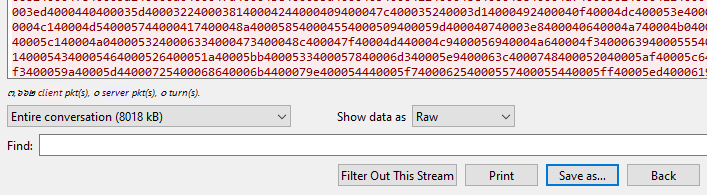

# [CyberDefenders - PacketMaze](https://cyberdefenders.org/blueteam-ctf-challenges/packetmaze/)
Created: 14/03/2024 15:10
Last Updated: 14/03/2024 16:02
* * *
>Category: Network Forensics
>Tags: PCAP, Wireshark, Network, SMB
* * *
As a soc analyst working for a security service provider, you have been tasked with analyzing a packet capture for a customer's employee whose network activity has been monitored for a while -possible insider.

**Tools**:
- [BrimSecurity](https://www.brimsecurity.com/)
- [suricatarunner](https://github.com/brimsec/build-suricata/releases/tag/v5.0.3-brim1)
- [suricata.rules](https://download.cyberdefenders.org/BlueYard/misc/suricata.zip)
- [NetworkMiner](https://www.netresec.com/?page=networkminer)
- [WireShark](https://www.wireshark.org/)
- [MAC lookup](https://macaddress.io/)
* * *
## Questions
> Q1: What is the FTP password?


I filtered out by `ftp` and I already found the answer

Follow the stream for easy copy paste
```
AfricaCTF2021
```

> Q2: What is the IPv6 address of the DNS server used by 192.168.1.26? (####::####:####:####:####)


Filter by `dns` and I found the IP address that the question wanted but to find the IPv6 I needed to get MAC address and used that as a filter

There it is
```
fe80::c80b:adff:feaa:1db7
```

> Q3: What domain is the user looking up in packet 15174?

Apply `frame.number == 15174` this for packet 15174

```
www.7-zip.org
```

> Q4: How many UDP packets were sent from 192.168.1.26 to 24.39.217.246?

I used `ip.src==192.168.1.26 && ip.dst==24.39.217.246 &&udp` 

You can count and read the displayed number 
```
10
```

> Q5: What is the MAC address of the system being investigated in the PCAP?”

IP `192.168.1.26` should be the system that being investigated so just inspected Ethernet II should be enough

```
c8:09:a8:57:47:93
```

> Q6: What was the camera model name used to take picture 20210429_152157.jpg ?


Using Find Packet, I found that this image was uploaded to FTP server

You can follow TCP stream and got the answer directly but if you didn't sure then

Export image out then use exiftool to read metadata

```
LM-Q725K
```

> Q7: What is the server certificate public key that was used in TLS session: da4a0000342e4b73459d7360b4bea971cc303ac18d29b99067e46d16cc07f4ff?


Used this filter `tls.handshake.session_id == da4a0000342e4b73459d7360b4bea971cc303ac18d29b99067e46d16cc07f4ff` then inspected TLS Server Key Exchange then you will find public key there
```
04edcc123af7b13e90ce101a31c2f996f471a7c8f48a1b81d765085f548059a550f3f4f62ca1f0e8f74d727053074a37bceb2cbdc7ce2a8994dcd76dd6834eefc5438c3b6da929321f3a1366bd14c877cc83e5d0731b7f80a6b80916efd4a23a4d
```

> Q8: What is the first TLS 1.3 client random that was used to establish a connection with protonmail.com?


Find Packet using protonmail then on Client Hello, you can inspect and get the answer there
```
24e92513b97a0348f733d16996929a79be21b0b1400cd7e2862a732ce7775b70
```

> Q9: What country is the MAC address of the FTP server registered in? (two words, one space in between)


Filter by `ftp` then the destination port 21 is the FTP server then copied MAC address and went to MAClookup to find the company address

its in US so the answer is full name of the US
```
United States
```

> Q10: What time was a non-standard folder created on the FTP server on the 20th of April? (hh:mm)


Searched by `ftp-data` then followed the stream, there is 1 directory that is not standard directory
```
17:53
```

> Q11: What domain was the user connected to in packet 27300?


filtered by `frame.number == 27300`, we can see that IP 172.67.162.206 was the destination for this connection so I used this IP address and used `dns.a == 172.67.162.206` to find the dns response if it really exists on this pcap

And its exist
```
dfir.science
```


* * *
