# [CyberDefenders - PhishStrike](https://cyberdefenders.org/blueteam-ctf-challenges/phishstrike/)
Created: 08/10/2024 13:20
Last Updated: 08/10/2024 18:16
* * *
>**Category**: Threat Intel
>**Tactics**: Initial Access, Execution, Command and Control, Impact
* * *
**Scenario:**
As a cybersecurity analyst for an educational institution, you receive an alert about a phishing email targeting faculty members. The email, appearing from a trusted contact, claims a $625,000 purchase and provides a link to download an invoice.

Your task is to investigate the email using Threat Intel tools. Analyze the email headers and inspect the link for malicious content. Identify any Indicators of Compromise (IOCs) and document your findings to prevent potential fraud and educate faculty on phishing recognition.

**Tools**:
- Email Header Analyzer
- URLHaus
- URLScan.io
- VirusTotal
- MalwareBazaar

* * *
## Questions
>Q1: Identifying the sender's IP address with specific SPF and DKIM values helps trace the source of the phishing email. What is the sender's IP address that has an SPF value of softfail and a DKIM value of fail?

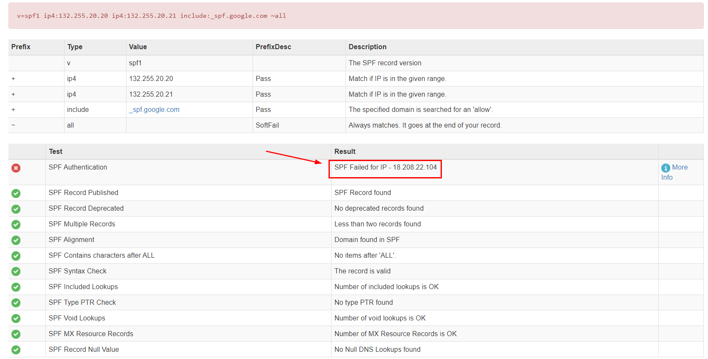

This challenge gave us an eml file to investigate so we could use a [Email Head Analysis from mxtoolbox](https://mxtoolbox.com/Public/Tools/EmailHeaders.aspx?huid=be63323c-1ba9-49f2-8fe8-5715ea19d031) to help us analyze headers of this mail which we can see that SPF Authentication failed during test and we have IP of the sender right there.

  
Answer

<pre><code>18.208.22.104</code></pre>

>Q2: Understanding the return path of the email helps in tracing its origin. What is the return path specified in this email?

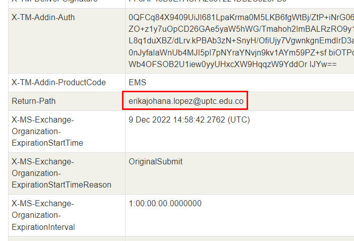

Scroll down for a bit or search for "Return-Path" then we will have an email address that will receive a reply if target decided to contact back

  
Answer

<pre><code>erikajohana.lopez@uptc.edu.co</code></pre>

>Q3: Identifying the source of malware is critical for effective threat mitigation and response. What is the IP address hosting the malicious file associated with malware distribution?

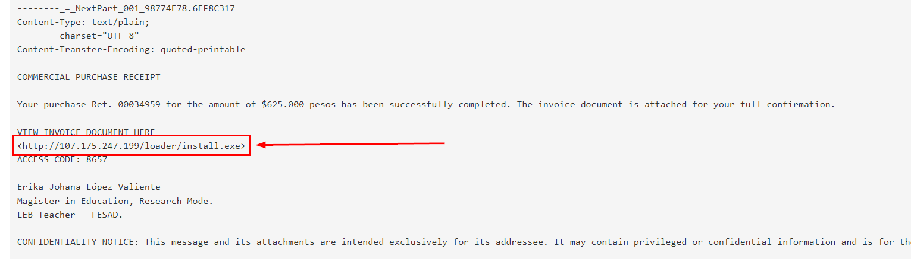
Its time to look at the content of this email, we can see that malicious attachment was sent as URL for a target to download malicious exe file

  
Answer

<pre><code>107.175.247.199</code></pre>

>Q4: Determining which malware exploits system resources to mine cryptocurrencies helps prioritize threat response. The malicious URL distributes multiple types of malware. What is the malware family used for cryptocurrency mining?

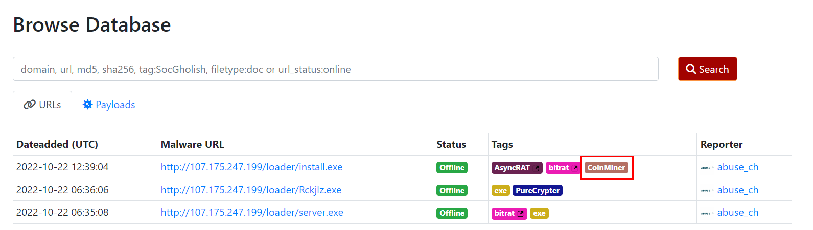

We can use an IP address found in previous question to search in [urlhaus](https://urlhaus.abuse.ch/browse.php?search=107.175.247.199) and it will return 4 different types of malware including the one that would use for cryptocurrency mining right here

  
Answer

<pre><code>CoinMiner</code></pre>

>Q5: Understanding the registry entries added to the auto-run key by malware is crucial for identifying its persistence mechanisms. According to the analysis of BitRAT, what is the executable name in the first value added to the registry auto-run key?

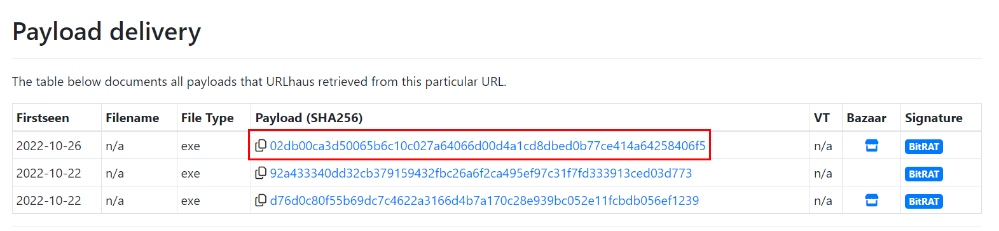
Lets dig into the [last one](https://urlhaus.abuse.ch/url/2381638/) with bitrat tag which we can see that this url were used to deliver 3 different payloads so in this case, I will grep the latest one to analyze first.

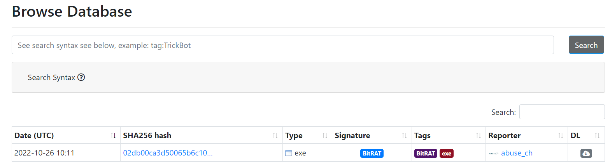

Next, I searched on [MalwareBazaar](https://bazaar.abuse.ch/browse/) with the hash we got (`sha256:02db00ca3d50065b6c10c027a64066d00d4a1cd8dbed0b77ce414a64258406f5`) then we will see that there is one record of this hash right here.

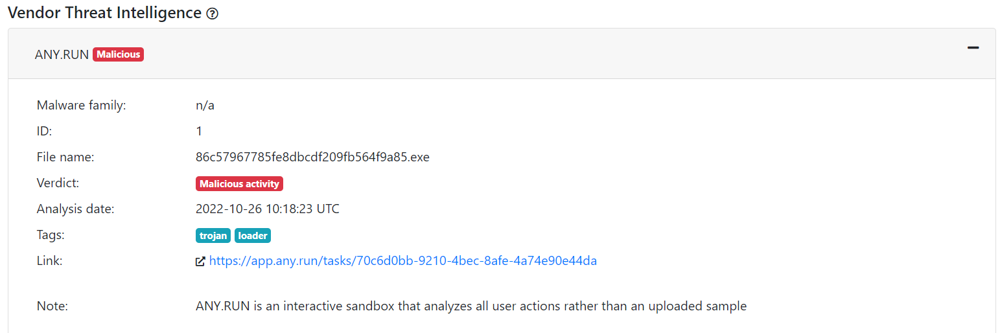

Upon clicking into the returned record, I found that there is [any.run public report](https://app.any.run/tasks/70c6d0bb-9210-4bec-8afe-4a74e90e44da/) already analyzed this malware so I fellow it.

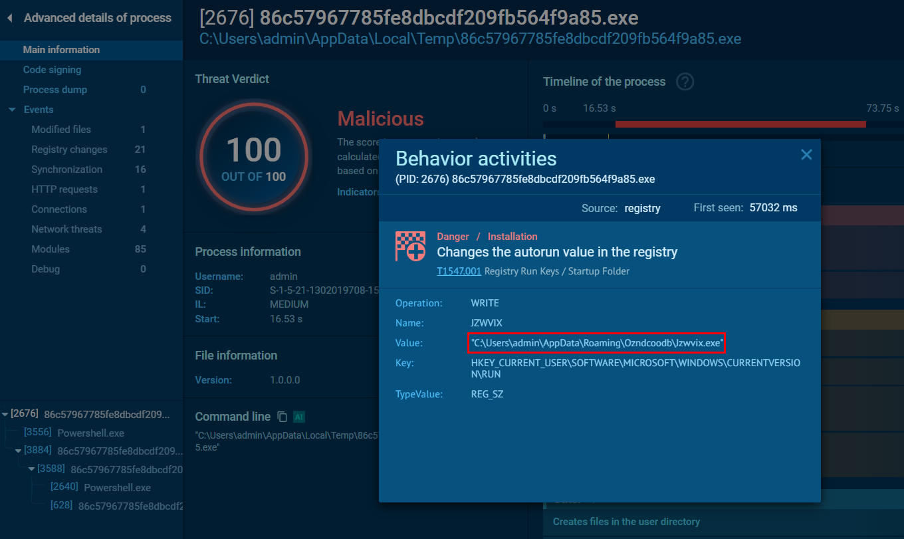

Which I found that after this payload got executed, it will drop another executable file and add it to auto-run key

  
Answer

<pre><code>Jzwvix.exe</code></pre>

>Q6: Introducing a delay in malware execution can help evade detection mechanisms. What is the delay (in seconds) caused by the PowerShell command according to the BitRAT analysis?

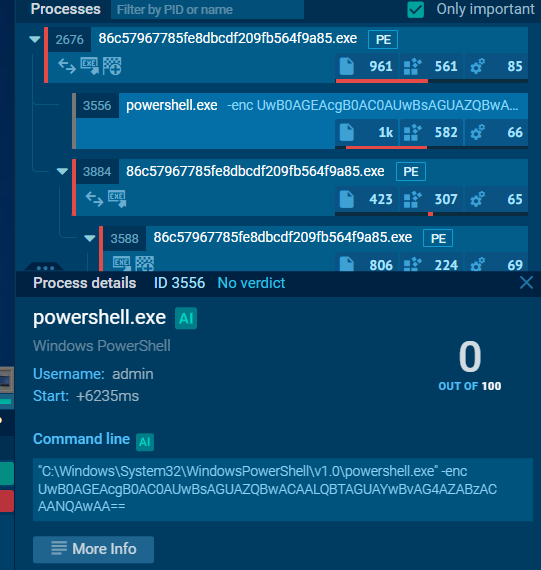
Looking at process tree, there are 2 PowerShell commands got executed so it encoded with base64

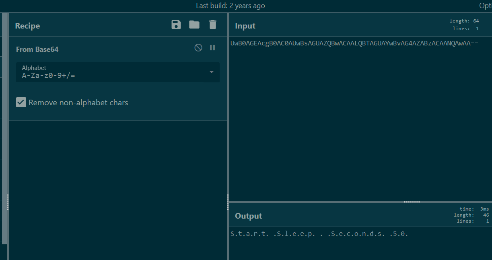

After decoding it, we can see that it will delay for 50 seconds with this command.

  
Answer

<pre><code>50</code></pre>

>Q7: Analyzing the HTTP requests made by malware helps in identifying its communication patterns. What is the HTTP request used by the loader to retrieve the BitRAT malware?

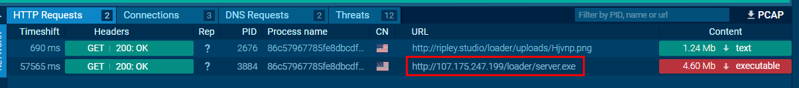

Lets take a look at HTTP Requests section then we can see that there is one HTTP request asked for another executable file (another payload)

  
Answer

<pre><code>http://107.175.247.199/loader/server.exe</code></pre>

>Q8: Identifying the SHA-256 hash of files downloaded by a malicious URL aids in tracking and analyzing malware activities. According to the BitRAT analysis, what is the SHA-256 hash of the second file downloaded and added to autorun keys?

Lets track what happened after initial payload was executed

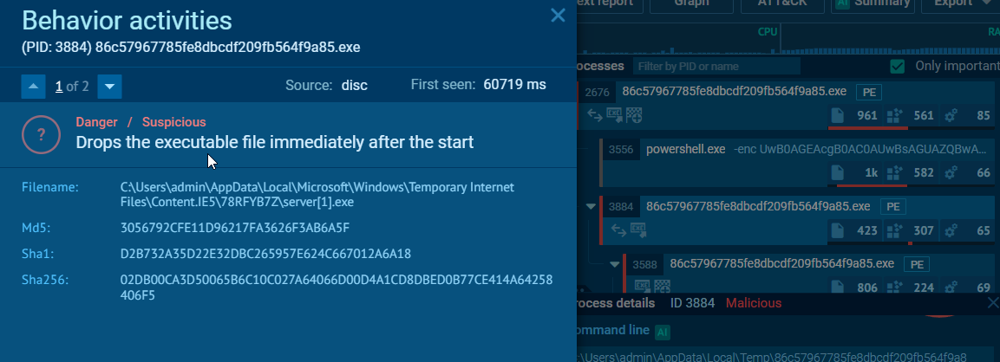

After `Jzwvix.exe` was added to registry key and got executed then it sleep for 90 seconds then downloaded another payload (`server.exe`), added it to auto-run registry key and executed it.

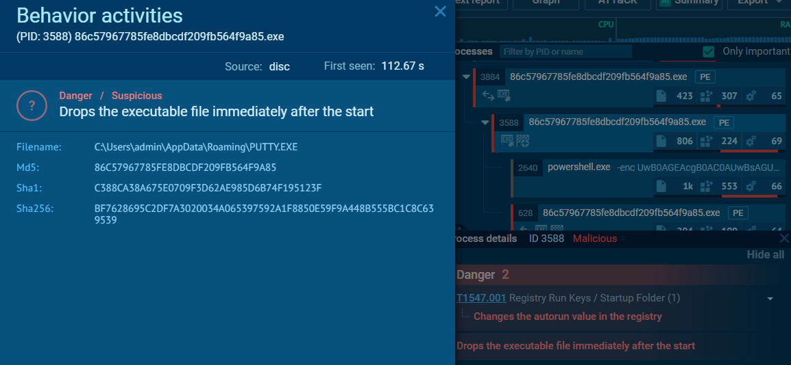

Next, `PUTTY.exe` dropped and also added to auto-run registry key, sleep for 90 seconds then executed to drop another payload.

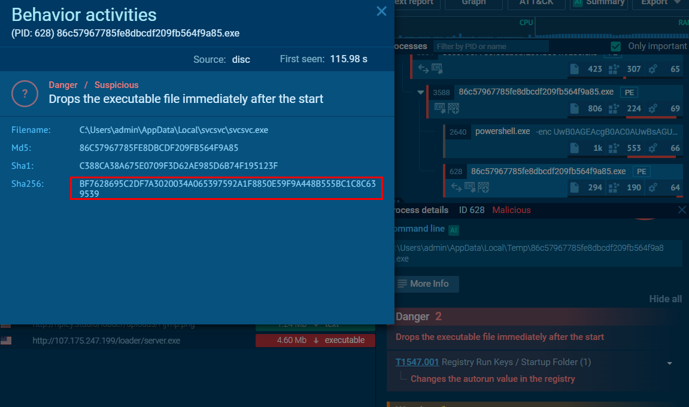

But upon inspecting its hash, It got the same hash as `PUTTY.exe` and also added to auto-run registry key.

  
Answer

<pre><code>BF7628695C2DF7A3020034A065397592A1F8850E59F9A448B555BC1C8C639539</code></pre>

>Q9: Tracking the command and control (C2) domains used by malware is essential for detecting and blocking malicious activities. What is the C2 domain used by the BitRAT malware?

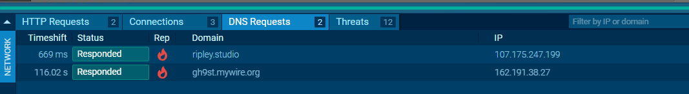
There are 2 domains where contacted from this report 

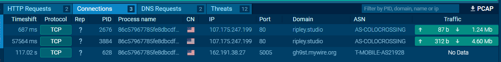
One is sending and receiving traffic and other one didn't send any traffic at all but the one that is the answer of this question is the latter one.

  
Answer

<pre><code>gh9st.mywire.org</code></pre>

>Q10: Understanding the methods malware uses for exfiltrating data is crucial for detecting and preventing data breaches. According to the AsyncRAT analysis, what is the Telegram Bot ID used by the malware to exfiltrate stolen data?

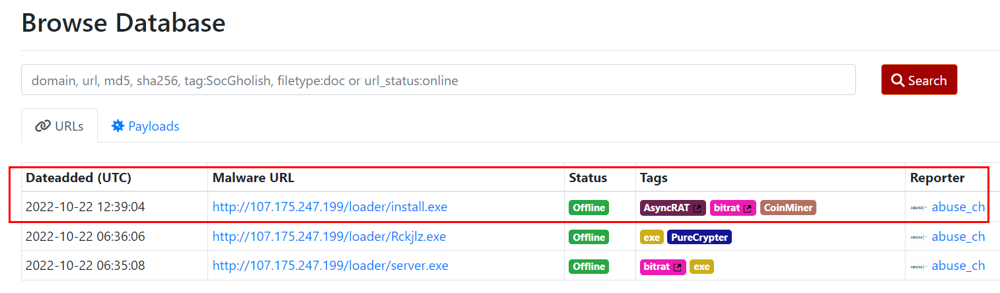

Lets go back to urlhaus but this time, we will have to change our objective to the first record on this list.

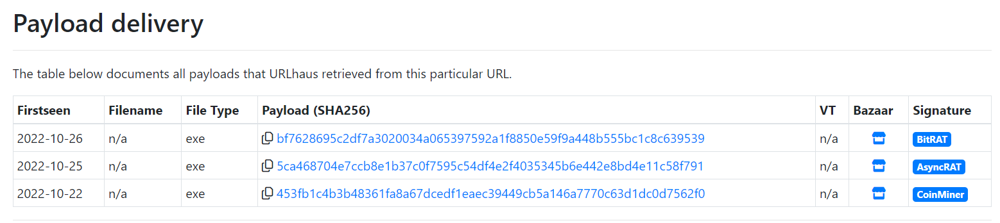

This record delivered 3 payloads and the one we are looking for is the AsyncRAT one.

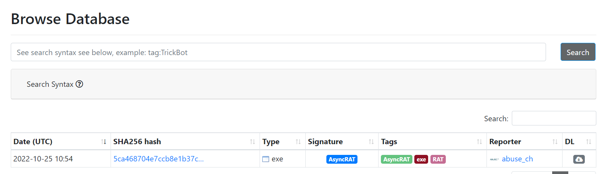

I tried to find relevant records and public reports using `sha256:5ca468704e7ccb8e1b37c0f7595c54df4e2f4035345b6e442e8bd4e11c58f791` but I found nothing that linked to telegram  bot so I need to change the platform.

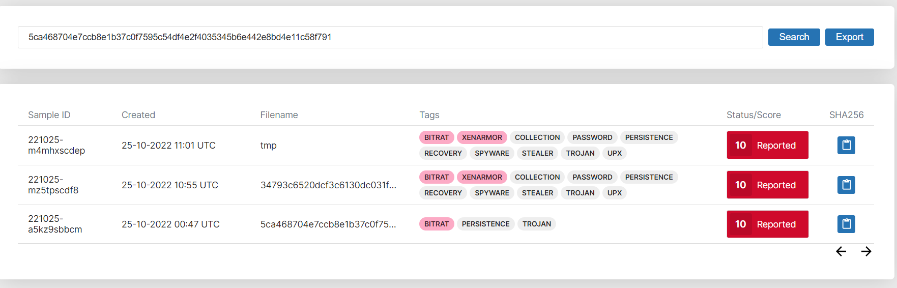

Another popular free malware sandbox I could think of is Recorded Future Triage which we can see that there are 3 records of this hash on this platform at the time I searched this.

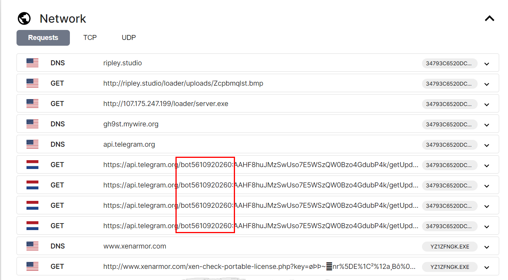

Which I eventually found the telegram bot ID right [here](https://tria.ge/221025-mz5tpscdf8/behavioral2)

  
Answer

<pre><code>bot5610920260</code></pre>

>Q11: Understanding the specific URLs requested by malware is essential for disrupting its communication channels and mitigating its activities. According to the CoinMiner analysis, what is the URL requested by the CoinMiner malware sample?

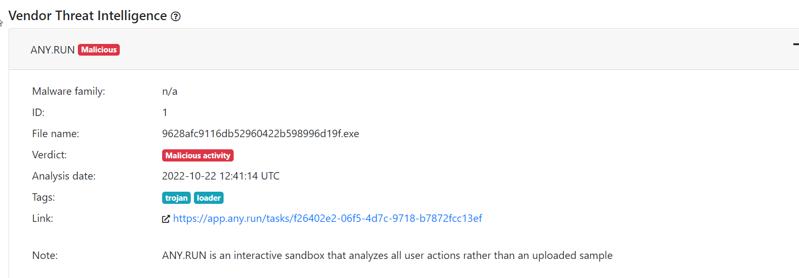

Lets grab the hash from urlhaus and search it on [any.run](https://app.any.run/tasks/f26402e2-06f5-4d7c-9718-b7872fcc13ef).

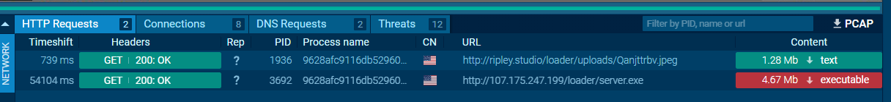
Which we can see that beside from first C2 that contacted for executable payload, another request was made to get an image file from this url.

  
Answer

<pre><code>http://ripley.studio/loader/uploads/Qanjttrbv.jpeg</code></pre>

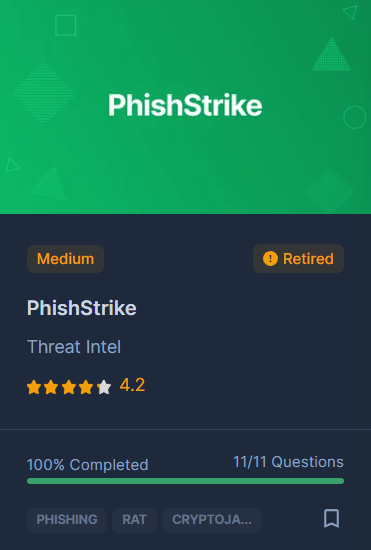
* * *
