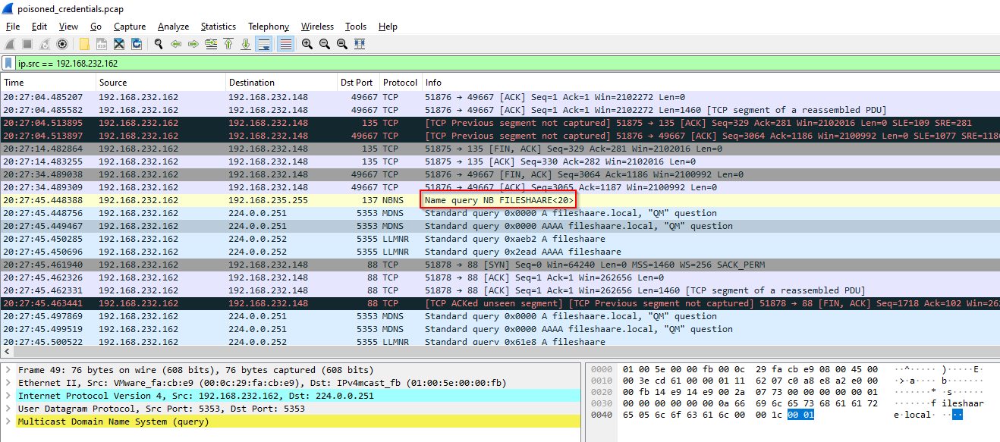
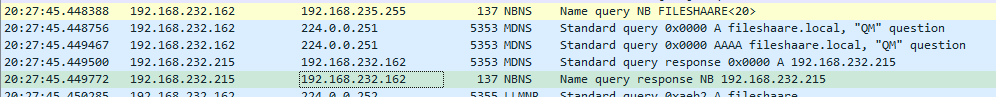
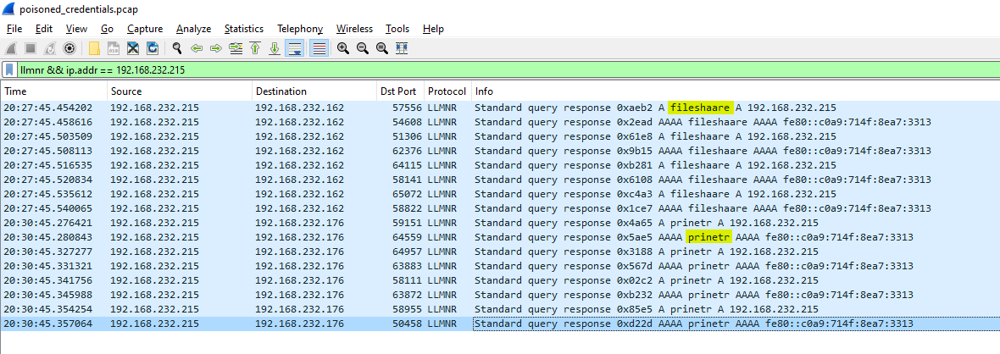
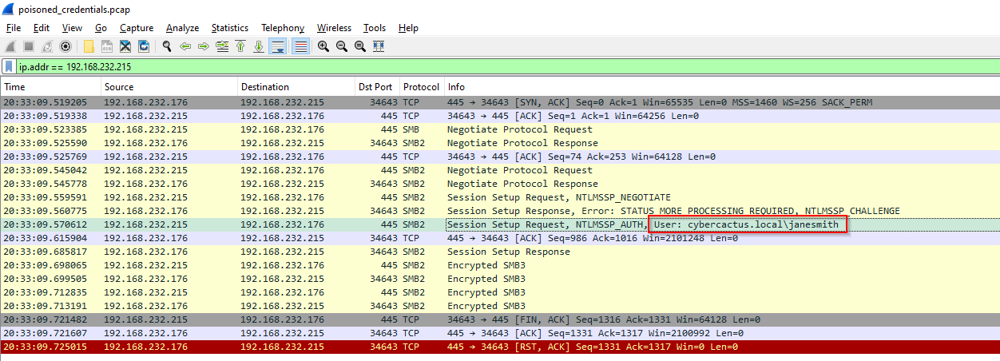
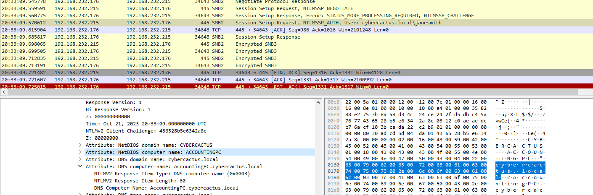
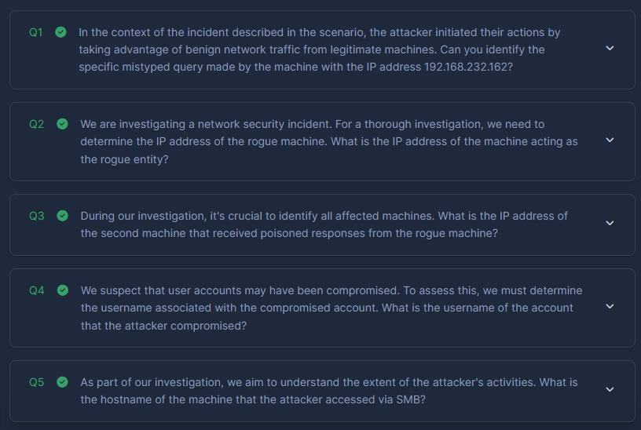

# [CyberDefenders - PoisonedCredentials](https://cyberdefenders.org/blueteam-ctf-challenges/poisonedcredentials/) 
Created: 20/02/2024 12:30
Last Updated: 20/02/2024 12:53
* * *
>**Category**: Network Forensics
>**Tags**: PCAP, Wireshark, Credentials
* * *

**Scenario**:
Your organization's security team has detected a surge in suspicious network activity. There are concerns that LLMNR (Link-Local Multicast Name Resolution) and NBT-NS (NetBIOS Name Service) poisoning attacks may be occurring within your network. These attacks are known for exploiting these protocols to intercept network traffic and potentially compromise user credentials. Your task is to investigate the network logs and examine captured network traffic.

**Tools**: Wireshark
* * *
First I didn't know what is NBT-NS/LLMNR poisoning and even their purposes, So i did some request and found 2 resources that I think will help reader of this write-up understand the basic concept of this kind of attack
- [Red Team Notes - LLMNR/NBT-NS Poisoning and Relay](https://dmcxblue.gitbook.io/red-team-notes/untitled-1/llmnr-nbt-ns-poisoning-and-relay)
- [TCM Security - LLMNR Poisoning and How to Prevent It](https://tcm-sec.com/llmnr-poisoning-and-how-to-prevent-it/)

Then after understands what happening, lets answer all the questions

## Questions
> Q1: In the context of the incident described in the scenario, the attacker initiated their actions by taking advantage of benign network traffic from legitimate machines. Can you identify the specific mistyped query made by the machine with the IP address 192.168.232.162?


This IP address made a NBNS query for the mistyped of fileshare 
```
fileshaare
```

> Q2: We are investigating a network security incident. For a thorough investigation, we need to determine the IP address of the rogue machine. What is the IP address of the machine acting as the rogue entity?


There is one address that sent the previous NBNS response back to 192.168.232.162

This IP was not just responsed with 1 query but 2 of them which are `fileshaare` and `prineter` from the different IP addresses.
```
192.168.232.215
```

> Q3: During our investigation, it's crucial to identify all affected machines. What is the IP address of the second machine that received poisoned responses from the rogue machine?
```
192.168.232.176
```

> Q4: We suspect that user accounts may have been compromised. To assess this, we must determine the username associated with the compromised account. What is the username of the account that the attacker compromised?


Since I already knew that 192.168.232.215 is an attacker, I made a query based of it and found the SMB2 session setup request packet with the username
```
janesmith
```

> Q5: As part of our investigation, we aim to understand the extent of the attacker's activities. What is the hostname of the machine that the attacker accessed via SMB?


The answer could be found on SMB2 > Session Setup Request (0x01) > Security Blob > GSS-API Generic Security Service Application Program Interface > negTokenTarg > NTLM Secure Service Provider > NTLM Response > NTLMv2 Response
```
ACCOUNTINGPC
```

<div align=center>



</div>

* * *