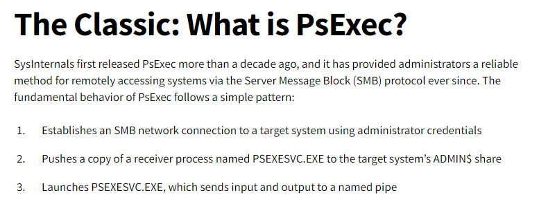
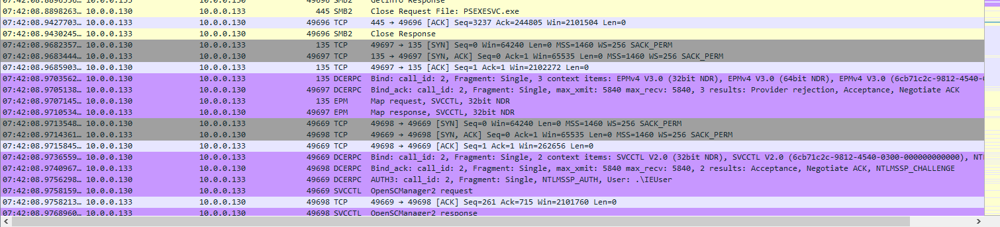
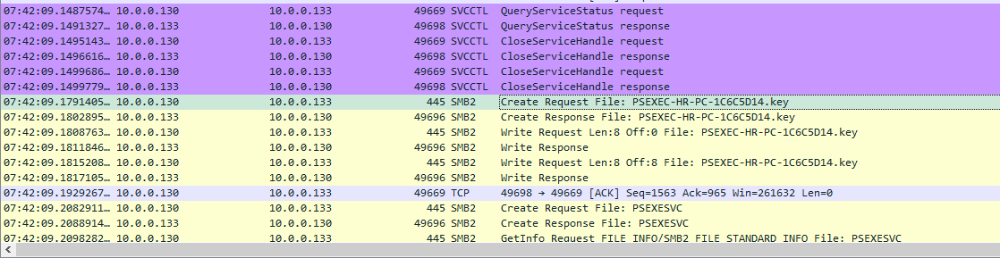
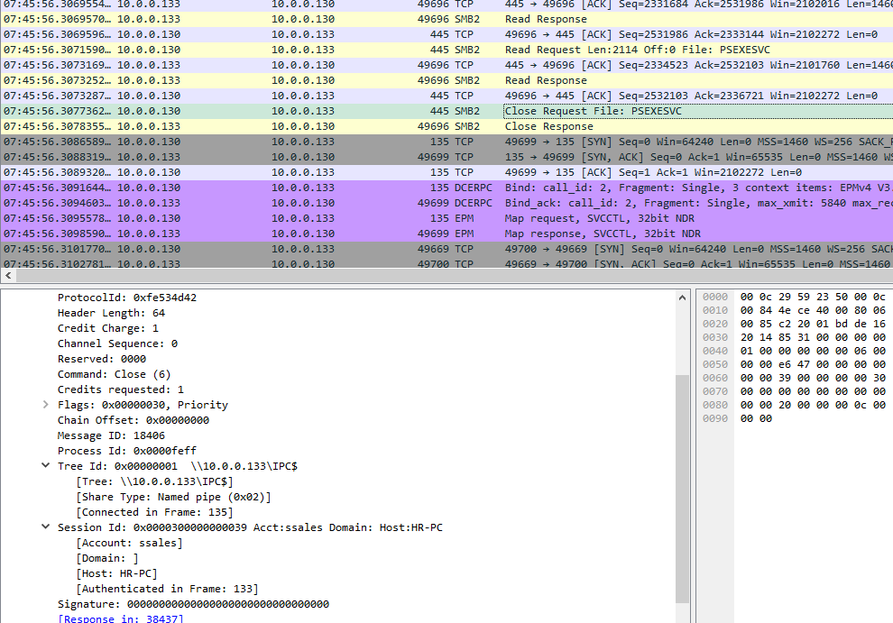
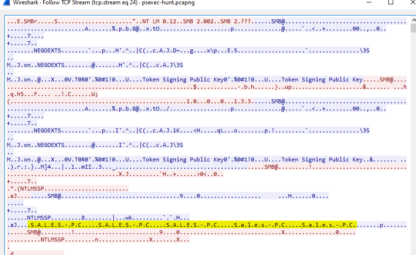
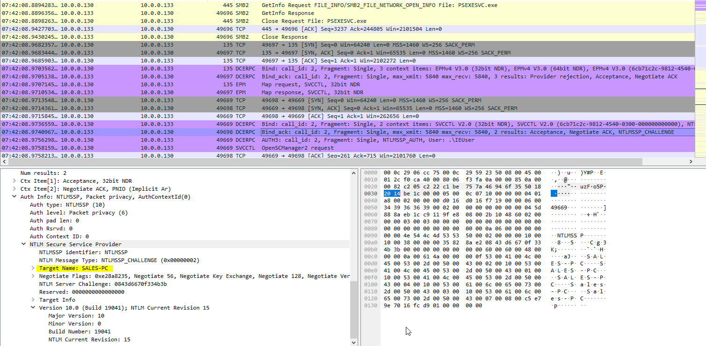
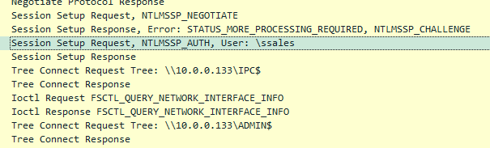
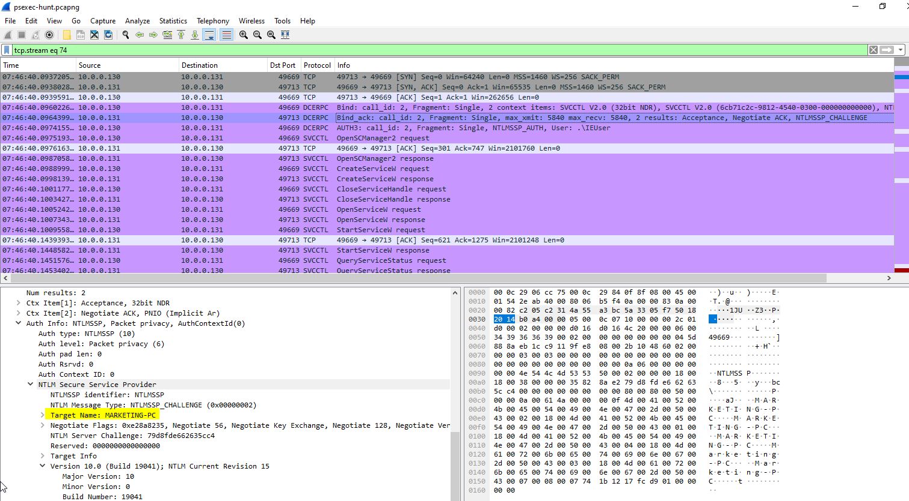

# [CyberDefenders - PsExec Hunt](https://cyberdefenders.org/blueteam-ctf-challenges/psexec-hunt/)
Created: 21/02/2024 09:34
Last Updated: 21/02/2024 10:55
* * *
>**Category**: Network Forensics
>**Tags**: Wireshark, PCAP, NetworkMiner, PSExec, Windows
* * *
**Scenario**:
Our Intrusion Detection System (IDS) has raised an alert, indicating suspicious lateral movement activity involving the use of PsExec. To effectively respond to this incident, your role as a SOC Analyst is to analyze the captured network traffic stored in a PCAP file.

**Tools**: Wireshark
* * *
If you don't know what is PsExec, it's a tool from sysinternals suite that help remote user execute a command to a system.

You can read more info about this tool [here](https://learn.microsoft.com/en-us/sysinternals/downloads/psexec)

And there are two more resource that I think they're very useful
- [Blog written by Fabian Mendoza on aboutdfir.com](https://aboutdfir.com/the-key-to-identify-psexec/) 
- [Blog by Red Canary](https://redcanary.com/blog/threat-hunting-psexec-lateral-movement/)

## Questions
> Q1: In order to effectively trace the attacker's activities within our network, can you determine the IP address of the machine where the attacker initially gained access?


The information from the above, DCERPC, EPM and SVCCTL that will also be captured if PsExec is executed and `.key` file will also be generated, there are the indicators, I know where to look for

Here after PsExec was successfully written, The attacker immediately used it


`.key` file also be generated on HR-PC

PSEXECSVC was also created on `\\10.0.0.133\IPC$` which mean the attacker also used this network share beside `ADMIN$`

```
10.0.0.130
```

> Q2: To fully comprehend the extent of the breach, can you determine the machine's hostname to which the attacker first pivoted?


I knew that the attacker already used PsExec but I didn't know where to find the answer but in the end, Follow TCP Stream worked.
```
SALES-PC
```

And I found out later that it could be seen on DCERPC packet

> Q3: After identifying the initial entry point, it's crucial to understand how far the attacker has moved laterally within our network. Knowing the username of the account the attacker used for authentication will give us insights into the extent of the breach. What is the username utilized by the attacker for authentication?


On SMB2 packet, I saw that `ssales` user was the account of this session
```
ssales
```

> Q4: After figuring out how the attacker moved within our network, we need to know what they did on the target machine. What's the name of the service executable the attacker set up on the target?
```
PSEXESVC
```

> Q5: We need to know how the attacker installed the service on the compromised machine to understand the attacker's lateral movement tactics. This can help identify other affected systems. Which network share was used by PsExec to install the service on the target machine?
```
ADMIN$
```

> Q6: We must identify the network share used to communicate between the two machines. Which network share did PsExec use for communication?
```
IPC$
```

> Q7: Now that we have a clearer picture of the attacker's activities on the compromised machine, it's important to identify any further lateral movement. What is the machine's hostname to which the attacker attempted to pivot within our network?

<div align=center>


</div>

```
MARKETING-PC
```

<div align=center>


</div>

* * *