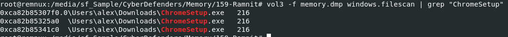

# [CyberDefenders - Ramnit](https://cyberdefenders.org/blueteam-ctf-challenges/ramnit/)
Created: 26/05/2024 17:08
Last Updated: 09/10/2024 00:17
* * *
>Category: Endpoint Forensics
>Tags: Volatility, Memory
* * *
**Scenario**:
Our intrusion detection system has alerted us to suspicious behavior on a workstation, pointing to a likely malware intrusion. A memory dump of this system has been taken for analysis. Your task is to analyze this dump, trace the malware’s actions, and report key findings. This analysis is critical in understanding the breach and preventing further compromise.

**Tools**:
- Volatility 3
* * *
## Questions
> Q1: We need to identify the process responsible for this suspicious behavior. What is the name of the suspicious process?

After examined result of `vol3 -f memory.dmp windows.pstree`, we can see that ChromeSetup process should be the most suspicious one right there

  
Answer

<pre><code>ChromeSetup.exe</code></pre>

> Q2: To eradicate the malware, what is the exact file path of the process executable?

We can archive this by using `vol3 -f memory.dmp windows.filescan | grep "ChromeSetup"`, We know Users folder has to be in C drive so this is how we got the full path of an executable file.

  
Answer

<pre><code>C:\Users\alex\Downloads\ChromeSetup.exe</code></pre>

> Q3: Identifying network connections is crucial for understanding the malware's communication strategy. What is the IP address it attempted to connect to?

By using netscan plugin like this `vol3 -f memory.dmp -o /tmp/ windows.netscan | grep "Chrome"`, we can get any IP address that suspicious process communicated with.

  
Answer

<pre><code>58.64.204.181</code></pre>

> Q4: To pinpoint the geographical origin of the attack, which city is associated with the IP address the malware communicated with?

using IPlocation, we can determine the owner of any IP address and in this case its from Hong kong

  
Answer

<pre><code>Hong Kong</code></pre>

> Q5: Hashes provide a unique identifier for files, aiding in detecting similar threats across machines. What is the SHA1 hash of the malware's executable?

We got virtual address of an executable files, from filescan plugin then we can use `vol3 -f memory.dmp -o /tmp/ windows.dumpfiles --virtaddr 0xca82b85325a0` to dump that files out

We got 2 files, the second one is the answer one

  
Answer

<pre><code>b9921cc2bfe3b43e457cdbc7d82b849c66f119cb</code></pre>

> Q6: Understanding the malware's development timeline can offer insights into its deployment. What is the compilation timestamp of the malware?

Searching file hash we got earlier on VirusTotal and Go to Details tab -> History 

  
Answer

<pre><code>2019-12-01 08:36:04</code></pre>

> Q7: Identifying domains involved with this malware helps in blocking future malicious communications and identifying current possible communications with that domain in our network. Can you provide the domain related to the malware?

On VirusTotal, Go to Relations then you will have this domain flagged as malicious

  
Answer

<pre><code>dnsnb8.net</code></pre>

* * *