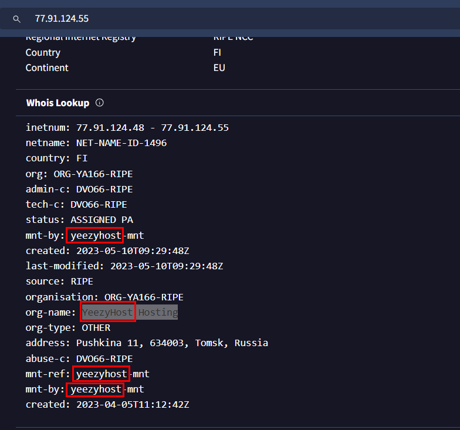

# [CyberDefenders - Red Stealer](https://cyberdefenders.org/blueteam-ctf-challenges/red-stealer/)
Created: 08/06/2024 13:24
Last Updated: 08/06/2024 14:59
* * *
>**Category**: Threat Intel
>**Tags**: Threat Intel, VirusTotal, Redline, Whois, ThreatFox, MalwareBazaar, T1047, T1053, T1129, T1547.001, T1134, T1027, T1112, T1222, T1497.001, T1012, T1057, T1082, T1083, T1005, T1119, T1489, T1529
* * *
**Scenario:**
You are part of the Threat Intelligence team in the SOC (Security Operations Center). An executable file has been discovered on a colleague's computer, and it's suspected to be linked to a Command and Control (C2) server, indicating a potential malware infection.

Your task is to investigate this executable by analyzing its hash. The goal is to gather and analyze data that is beneficial to other SOC members, including the Incident Response team, in order to efficiently respond to this suspicious behavior.

**Tools**:
- Whois
- VirusTotal
- MalwareBazaar
- ThreatFox

* * *
## Questions
>Q1: Categorizing malware allows for a quicker and easier understanding of the malware, aiding in understanding its distinct behaviors and attack vectors. What's the identified malware's category?


We got only SHA-256 to work with so we shall start this by search it on VirusTotal


Which landed us with RedLine Stealer and it identified as trojan

```
trojan
```

>Q2: Clear identification of the malware file name facilitates better communication among the SOC team. What's the file name associated with this malware?


Go to Names section under Details tabs then we will have a name of this file

```
Wextract
```

>Q3: Knowing the exact time the malware was first seen can help prioritize actions. If the malware is newly detected, it may warrant more urgent containment and eradication efforts compared to older, well-known threats. Can you provide the UTC timestamp of first submission of this malware on VirusTotal?


Go to History section under Details tab

```
2023-10-06 04:41:50 UTC
```

>Q4: Understanding the techniques used by malware helps in strategic security planning. What is the MITRE ATT&CK technique ID for the malware's data collection from the system before exfiltration?


Go to MITRE ATT&CK Tactices and Techniques then go for Collection tactic then we will have this Data from Local System technique which is the correct answer of this question

```
T1005
```

>Q5: Following execution, what domain name resolution is performed by the malware?


Go to DNS Resolutions under Behavior tab, we will see a lot of DNS Resolutions but the correct one is facebook.com

```
facebook.com
```

>Q6: Once the malicious IP addresses are identified, network security devices such as firewalls can be configured to block traffic to and from these addresses. Can you provide the IP address and destination port the malware communicates with?


Under IP Traffic section, we will see this weird TCP connection with not common port


So I searched this IP address on VirusTotal which shows us that this IP adress is C2 address of many stealer malware including AMADEY and REDLINE

```
77.91.124.55:19071
```

>Q7: If a hosting service is frequently used for malicious activities, security teams can implement a strict filtering rules for all traffic to and from the IPS belonging to that hosting provider. What hosting service does the identified IP belong to?



Go to Whois Lookup under Details of this C2 ip address then we will have org that owned this IP address

```
YeezyHost
```

>Q8: YARA rules are designed to identify specific malware patterns and behaviors. What's the name of the YARA rule created by "Varp0s" that detects the identified malware?


Go to MalwareBazaar and search for SHA-256 hash then go to YARA Signatures which have several YARA rules that triggered by this malware being listed that including YARA rules created by "Varp0s"

```
detect_Redline_Stealer
```

>Q9: Understanding which malware families are targeting the organization helps in strategic security planning for the future and prioritizing resources based on the threat. Can you provide the different malware alias associated with the malicious IP address?


Search for Redline stealer on ThreatFox Database then you will have Malware alias of redline stealer

```
RECORDSTEALER
```

>Q10: By identifying the malware's imported DLLs, we can configure security tools to monitor for the loading or unusual usage of these specific DLLs. Can you provide the DLL utilized by the malware for privilege escalation?


Back to VirusTotal of redline stealer malware, Go to Imports section under Details section

Show how capable of each dll then you will have this dll have many functionality about privilege

```
ADVAPI32.dll
```


* * *
