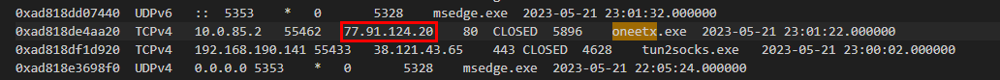

# [CyberDefenders - RedLine](https://cyberdefenders.org/blueteam-ctf-challenges/redline/) 
Created: 05/03/2024 14:43
Last Updated: 05/03/2024 16:13
* * *
>Category: Endpoint Forensics
>Tags: Redline, Volatility, NIDS, Network Intrusion Detection System, T1055
* * *
**Scenario**:
As a member of the Security Blue team, your assignment is to analyze a memory dump using Redline and Volatility tools. Your goal is to trace the steps taken by the attacker on the compromised machine and determine how they managed to bypass the Network Intrusion Detection System "NIDS". Your investigation will involve identifying the specific malware family employed in the attack, along with its characteristics. Additionally, your task is to identify and mitigate any traces or footprints left by the attacker.

**Tools**:
- [Volatility](https://www.volatilityfoundation.org/26)
* * *
## Questions
> Q1: What is the name of the suspicious process?

I started using volalitity3 with `windows.pslist` plugin but I was overwhelmed with too many processes, So I used `windows.malfind` plugin to narrow things down for me

Which lead me to these 2 suspicious processes but there is only 1 process that is the answer of this question so I came back to `windows.pslist` plugin and then save the output to text file to find relationship between processes of these 2 processes (if you're working on Linux, use `grep`)

I started with `smartscreen.exe`

This process shared parent process with multiple processes

And its parent process is `svchost.exe`

Then I did some research about this research and found that this process is legitimate Windows software called [Windows SmartScreen](https://www.file.net/process/smartscreen.exe.html) a cloud based antimalware and anti-phishing software
So Its understandable that malfind found this suspicious and now we got `oneetx.exe` that is one and only suspicious process here.

```
oneetx.exe
```

> Q2: What is the child process name of the suspicious process?

Since 5896 is the process ID of `oneetx.exe` then I searched this process ID on my text file and found that `rundll32.exe` is a child process of this suspicious process

It also means that this suspicious process has dynamic link library (dll) file that came with it so it spawn `rundll32.exe` to execute that dll file.


And if you used `windows.pstree` plugin, We can also see that the suspicious process was executed from Temp folder
```
rundll32.exe
```

> Q3: What is the memory protection applied to the suspicious process memory region?

Back to `windows.malfind` plugin

We can see that this process has everything it needed, memory region should be both readable and writable, allowing it to be used for storing executable code and data.
```
PAGE_EXECUTE_READWRITE
```

> Q4: What is the name of the process responsible for the VPN connection?

I used `windows.netscan` plugin to find that which process made a connection to the internet (external)

These processes showed up, Then `tun2socks.exe` look like the VPN process the most so I did some research on this and I was right! [tun2socks](https://www.file.net/process/tun2socks.exe.html) is the one, I was looking for
 but when I submitted, Its not this process 

So I went back to `pstree` to find the parent process

Which is `Outline.exe`, and this process has `explorer.exe` as a parent process so It might got executed by user from Windows Explorer

```
Outline.exe
```

> Q5: What is the attacker's IP address?

From `windows.netscan` plugin I used eariler, and I knew which process is suspicious so I searched by using process name and found it

```
77.91.124.20
```

> Q6: Based on the previous artifacts. What is the name of the malware family?

I used `windows.dumpfiles.DumpFiles` plugin to extract process into an executable file first

Then I renamed it, and generated file hash to search on VirusTotal


[VirusTotal](https://www.virustotal.com/gui/file/8d5d5bbdccb82a10ac28e2779ba0821f12da3e1f08f03ec467ce213a6fccf38c) told me its a Mars Stealer but I also got IP address to search then

This IP address was used by RedLine so Its RedLine Stealer
```
RedLine Stealer
```

> Q7: What is the full URL of the PHP file that the attacker visited?

I didn't know which plugin to use but since I already got the IP address so I used strings and filter out all the rest and looking for the attacker IP address

And found it
```
http://77.91.124.20/store/games/index.php
```

> Q8: What is the full path of the malicious executable?

I already got the answer from `pstree` plugin

```
C:\Users\Tammam\AppData\Local\Temp\c3912af058\oneetx.exe
```


* * *