# [CyberDefenders - Seized](https://cyberdefenders.org/blueteam-ctf-challenges/seized/)
Created: 05/06/2024 04:48
Last Updated: 05/06/2024 20:15
* * *
>Category: Endpoint Forensics
>Tags: Memory Forensic, Volatility, Rootkit, CentOS, CyberChef, T1063, T1053
* * *
**Instructions**:
- Uncompress the lab (pass: **cyberdefenders.org**), investigate this case, and answer the provided questions.
- Use the [latest version of Volatility](https://github.com/volatilityfoundation/volatility), place the attached Volatility profile "**Centos7.3.10.1062.zip**" in the following path *volatility/volatility/plugins/overlays/linux*.
* * *
Using Volatility, utilize your memory analysis skills as a security blue team analyst to Investigate the provided Linux memory snapshots and figure out attack details.

**Supportive Tools**:
- [Volatility](https://github.com/volatilityfoundation/volatility)
- [CyberChef](https://gchq.github.io/CyberChef/)
- [grep](https://www.cyberciti.biz/faq/howto-use-grep-command-in-linux-unix/)
* * *
## Questions
> Q1: What is the CentOS version installed on the machine?

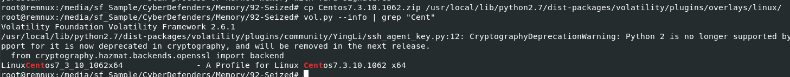
First we need to import volatility profile by moving profile provided by this lab to plugin/overlays/linux then we're good to go

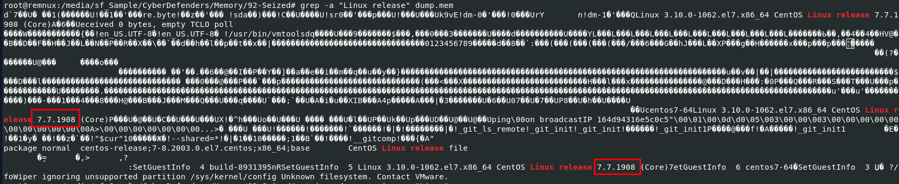

I tried using linux_banners plugin but it didn't work so we will have to use `grep -a "Linux release" dump.mem` which is the old school way to obtain Linux Distro version from memory dump

```
7.7.1908
```

> Q2: There is a command containing a strange message in the bash history. Will you be able to read it?

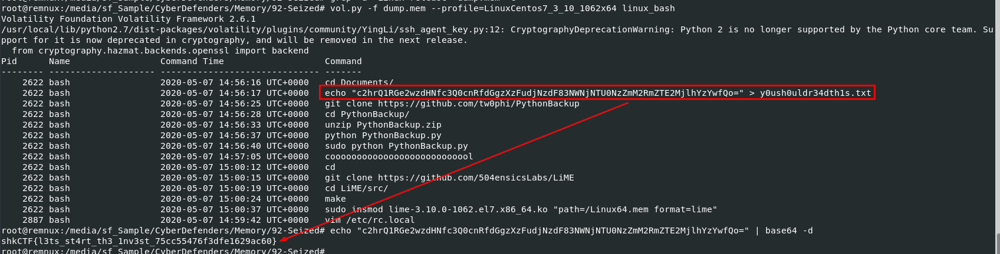

We will use `vol.py -f dump.mem --profile=LinuxCentos7_3_10_1062x64 linux_bash` to display bash history stored on this memory dump which we can see that there is a flag in base64 encoded here and there are 2 git clone command, 1 is PythonBackup which look like a python script to create a snapshot and later is LiME (Linux Memory Extractor) 

```
shkCTF{l3ts_st4rt_th3_1nv3st_75cc55476f3dfe1629ac60}
```

> Q3: What is the PID of the suspicious process?

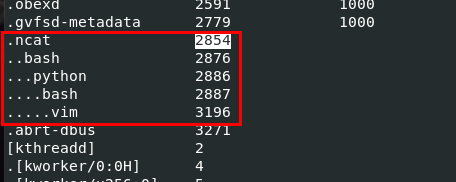

We will use `vol.py -f dump.mem --profile=LinuxCentos7_3_10_1062x64 linux_pstree` to display process tree so we can see them in whole picture and the result shows us really interesting story

It means that netcat was used to established a connection to the attacker, likely to be a reverse shell then a bash process under python was likely to be shell stabilizer created with python so the attacker will have more stable and functional interactive shell which lead to vim process 

```
2854
```

> Q4: The attacker downloaded a backdoor to gain persistence. What is the hidden message in this backdoor?

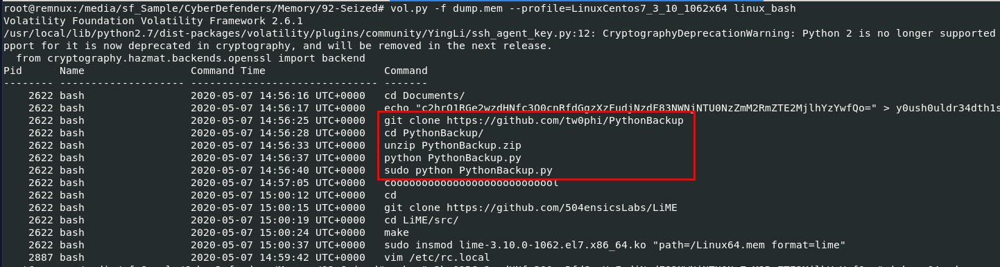

We will need to go to this github repo and find hidden message inside of it

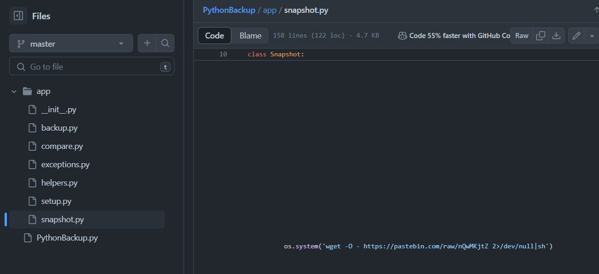

This wget system execution was found on `snapshot.py`

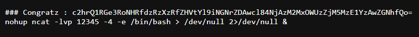

Followed it then we will have second flag in base64 and this backdoor which will run netcat in the background to open port 12345 and if a connection was established to this port then it will have bash shell to interact with this system 

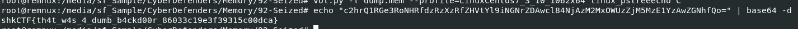

```
shkCTF{th4t_w4s_4_dumb_b4ckd00r_86033c19e3f39315c00dca}
```

> Q5: What are the attacker's IP address and the local port on the targeted machine?

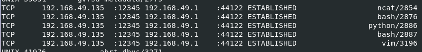

Using `vol.py -f dump.mem --profile=LinuxCentos7_3_10_1062x64 linux_netstat` then wait..... for a while then we will have these connections as we should expected port 12345 to establish a connection to an attacker IP address

```
192.168.49.1:12345
```

> Q6: What is the first command that the attacker executed?

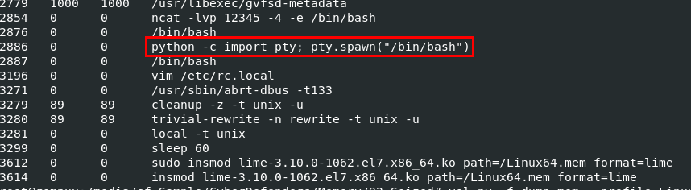

Using `vol.py -f dump.mem --profile=LinuxCentos7_3_10_1062x64 linux_psaux` then we can see that I was right about shell stabilizer 

```
python -c import pty; pty.spawn("/bin/bash")
```

> Q7: After changing the user password, we found that the attacker still has access. Can you find out how?

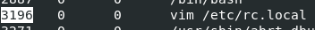
The attacker used vim to edit `/etc/rc.local` which will be executed by system at the end of boot sequence so the attacker might established another backdoor here

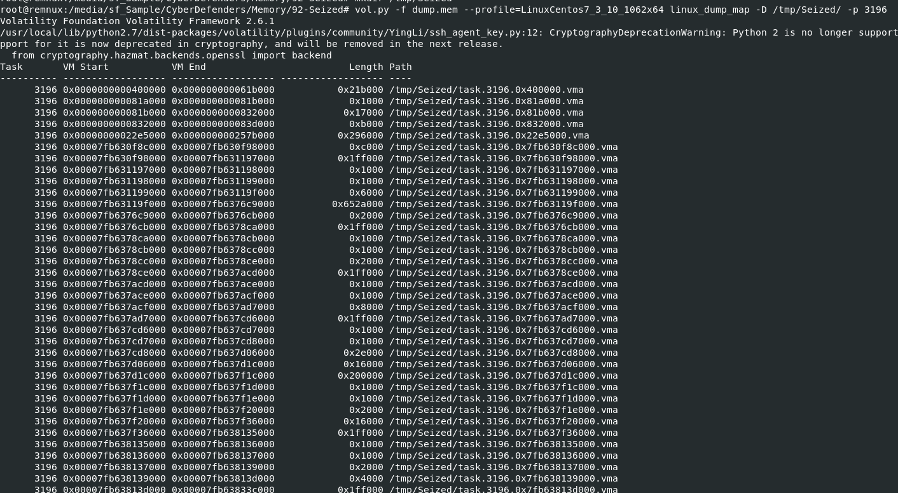

Lets dump it with `vol.py -f dump.mem --profile=LinuxCentos7_3_10_1062x64 linux_dump_map -D /tmp/Seized/ -p 3196`, then we will have a lot to look for

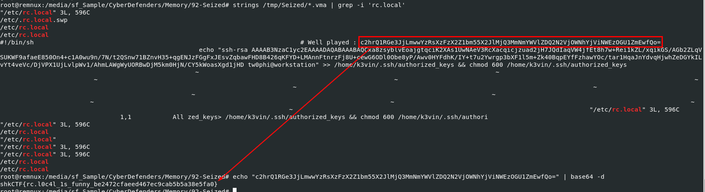

Use `strings /tmp/Seized/*.vma | grep -i 'rc.local'`, then we will have this third flag and a clue about other persistence mechanism that an attacker added to `rc.local` which is added his SSH public key to k3vin user authorized key directory so an attacker can still use ssh to connect to this machine after chaning user password 

```
shkCTF{rc.l0c4l_1s_funny_be2472cfaeed467ec9cab5b5a38e5fa0}
```

> Q8: What is the name of the rootkit that the attacker used?

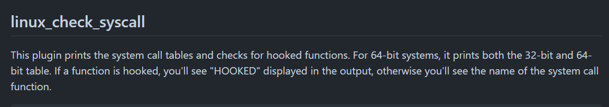

We will have to use this plugin and find for HOOKED in symbol field 

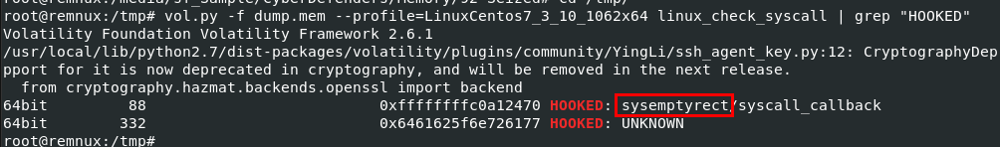

Using `vol.py -f dump.mem --profile=LinuxCentos7_3_10_1062x64 linux_check_syscall | grep "HOOKED"` then we will have the name of this rootkit

```
sysemptyrect
```

> Q9: The rootkit uses crc65 encryption. What is the key?

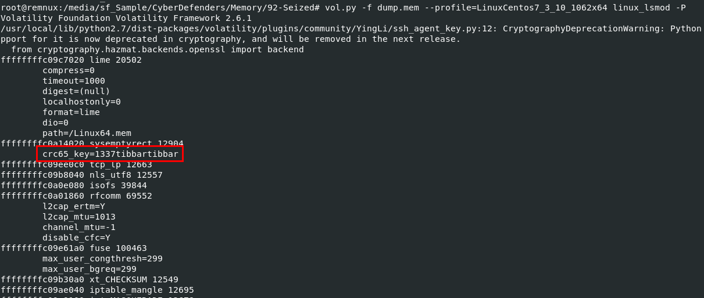

We will have to use `vol.py -f dump.mem --profile=LinuxCentos7_3_10_1062x64 linux_lsmod -P` to print lists of loaded kernel modules with parameter then we will have this crc65_key loaded under rootkit 

```
1337tibbartibbar
```

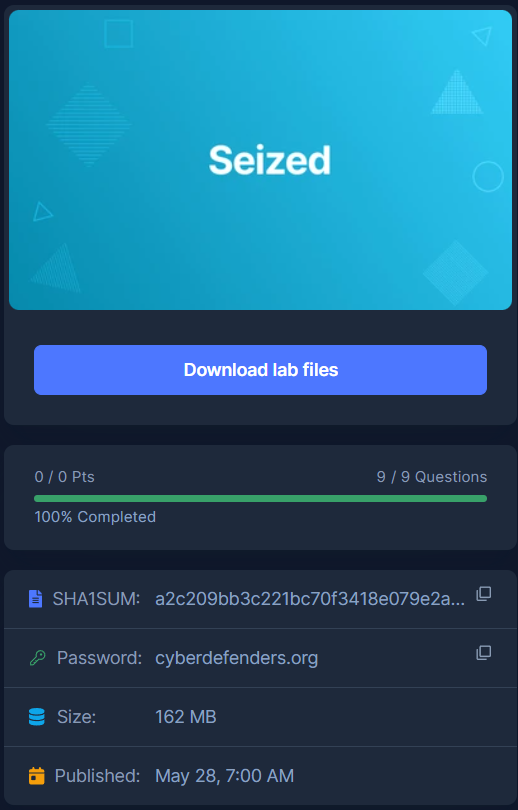
* * *
