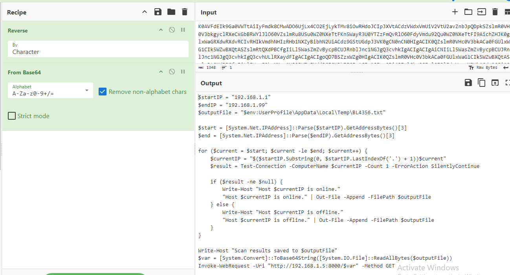

# [CyberDefenders - SpottedInTheWild](https://cyberdefenders.org/blueteam-ctf-challenges/spottedinthewild/)
Created: 28/05/2024 19:39
Last Updated: 28/05/2024 23:38
* * *
>Category: Endpoint Forensics
>Tags: Windows, Event Logs, Windows Forensics
* * *
**Scenario**:
You are part of the incident response team at FinTrust Bank. This morning, the network monitoring system flagged unusual outbound traffic patterns from several workstations. Preliminary analysis by the IT department has identified a potential compromise linked to an exploited vulnerability in WinRAR software.

As an incident responder, your task is to investigate this compromised workstation to understand the scope of the breach, identify the malware, and trace its activities within the network.

**Tools**:
- Arsenal Image Mounter
- SQLite Viewer
- Eric Zimmerman Tools
- NTFS Log Tracker
- Registry Explorer
- Event Log Explorer
- Strings
- CyberChef
* * *
## Questions
> Q1: In your investigation into the FinTrust Bank breach, you found an application that was the entry point for the attack. Which application was used to download the malicious file?


After opened disk image with FTK Imager, I found a telegram download folder inside Administrator Download's folder which have rar file in it and inside that rar file is a fake pdf file but its actually a cmd executable file that got me thinking about Winrar RCE 0-day that was the talk of the internet year ago
```
telegram
```

> Q2: Finding out when the attack started is critical. What is the UTC timestamp for when the suspicious file was first downloaded?


To make life easier, I'll process MFT file with `MFTECmd.exe -f .\166-SpottedInTheWild\$MFT --csv .\166-SpottedInTheWild\MFTOut` then I can search for specific files later

Same with Prefetch files `PECmd.lnk -d .\166-SpottedInTheWild\prefetch --csv .\166-SpottedInTheWild\PreOut`


But the artifact that will really help us solve this question is Jump List

Using JumpList Explorer, you can see when this file was created (well we can also get the same result from MFT artifact)
```
2024-02-03 07:33:20
```

> Q3: Knowing which vulnerability was exploited is key to improving security. What is the CVE identifier of the vulnerability used in this attack?


it was [Win-rar RCE 0 days](https://www.mcafee.com/blogs/other-blogs/mcafee-labs/exploring-winrar-vulnerability-cve-2023-38831/) 
```
CVE-2023-38831
```

> Q4: In examining the downloaded archive, you noticed a file in with an odd extension indicating it might be malicious. What is the name of this file?


```
SANS SEC401.pdf .cmd
```

> Q5: Uncovering the methods of payload delivery helps in understanding the attack vectors used. What is the URL used by the attacker to download the second stage of the malware?


We couldn't read content inside malicious file directly since it was obfuscated but using strings, we can still see something 

I also searched file hash on any.run and lucky for me, many people already tested this file on this platform 

You can see that after cmd was executed, bitsadmin was used to download an "image" file

Then use certutil to decode it to zip file

Then suddenly, a powershell script was executed so another zip file probably exploit the same vulnerability to execute malicious powershell script inside of it
```
http://172.18.35.10:8000/amanwhogetsnorest.jpg
```

> Q6: To further understand how attackers cover their tracks, identify the script they used to tamper with the event logs. What is the script name?


powershell script from previous question is not the right answer so I used strings again then I can see other powershell script that look like it was designed to do something to event logs
```
Eventlogs.ps1
```

> Q7: Knowing when unauthorized actions happened helps in understanding the attack. What is the UTC timestamp for when the script that tampered with event logs was run?


We got the time that a zip file was downloaded so I opened an output from MFTECmd then we can see that a fake image file, normal.zip, 3 powershell scripts and a bat file were created after cmd file was executed 

Created didn't mean it was executed so I have to find the timestamp when powershell was executed so I opened timeline file from PECmd result which you can see many powershell was executed 

(I tried all of them but no hit)

After digging some rabbit holes than I realized, how about Powershell event log?
There it is!

We finally got a timestamp which proved its execution time
```
2024-02-03 07:38:01
```

> Q8: We need to identify if the attacker maintained access to the machine. What is the command used by the attacker for persistence?


After a powershell scripts were created and executed, at the same time a schedule task was also created

This task will run bat script every 3 minutes
```
schtasks /create /sc minute /mo 3 /tn "whoisthebaba" /tr C:\Windows\Temp\run.bat /RL HIGHEST
```

> Q9: To understand the attacker's data exfiltration strategy, we need to locate where they stored their harvested data. What is the full path of the file storing the data collected by one of the attacker's tools in preparation for data exfiltration?


I went to where the bat script is and eventually found its ps1 version of it, then I looked for another files and it seem like this malware can commit self delete itself with its friends

Reverse and decoded base64 string that we will have a powershell script that used to scan for an entire private network LAN and determines its online/offline state before send it to C2  

Here is the file that was created to store scanning results
```
C:\Users\Administrator\AppData\Local\Temp\BL4356.txt
```


* * *
