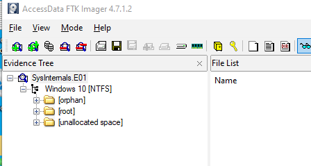
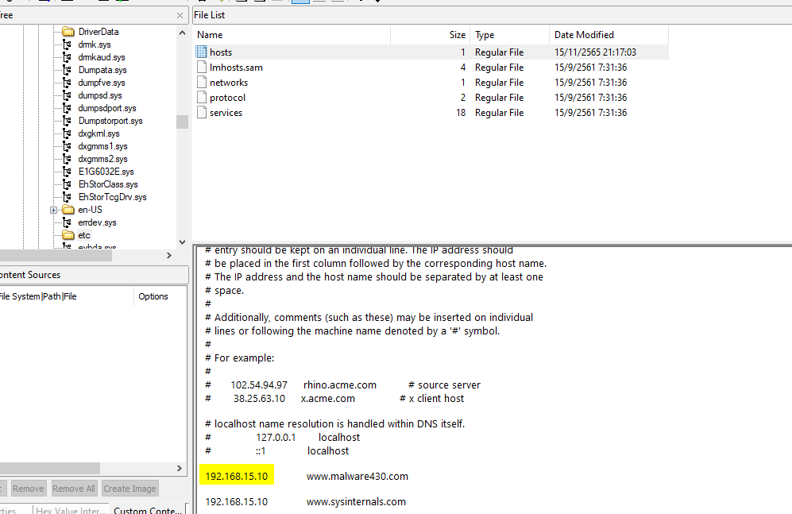

# [CyberDefenders - Sysinternals](https://cyberdefenders.org/blueteam-ctf-challenges/sysinternals/)
Created: 27/02/2024 10:40
Last Updated: 27/02/2024 13:16
* * *
>Category: Endpoint Forensics
>Tags: Windows, Disk, FTK, T1496, T1071, T1059.001, T1204.002
* * *
**Scenario:**
A user thought they were downloading the SysInternals tool suite and attempted to open it, but the tools did not launch and became inaccessible. Since then, the user has observed that their system has gradually slowed down and become less responsive.

As a soc analyst, analyze the artifacts and answer the questions.

**Helpful Tools:**
- [Registry Explorer](https://ericzimmerman.github.io/#!index.md)
- [Event Log Explorer](https://eventlogxp.com/)
- [AppCompatCachParser](https://www.sans.org/tools/appcompatcacheparser/)
- [VirusTotal](https://www.virustotal.com/)
- [Web Cache View](https://www.nirsoft.net/utils/ie_cache_viewer.html)
- [FTK Imager](https://www.exterro.com/ftk-imager#:~:text=FTK%C2%AE%20Imager%20is%20a,(FTK%C2%AE)%20is%20warranted.)
- [Autopsy](https://www.autopsy.com/)
* * *
## Questions
> Q1: What was the malicious executable file name that the user downloaded?

The evident file I got to work with is `E01` file which can be opened using FTP Imager


After opened the evidence file it's obvious that the system I've investigated is the Windows system

The question asked for a file name that user downloaded so It might be on the Downloads folder of a specific user and the scenario told us that user thought they were downloading sysinternals tool suite so the name might be close to the legitimate one

Which I've found it on the Public user

```
Sysinternals.exe
```

> Q2: When was the last time the malicious executable file was modified? 12-hour format
```
11/15/2022 09:18:51 PM
```

> Q3: What is the SHA1 hash value of the malware?

I exported the file hash list and submitted 

But It's not correct so this file might have been modified after executed, the only artifacts that could be useful for this case is the **AmCache**

AmCache Hive serves as a database that stores information about executed applications and files on a Windows system. The primary purpose of the AmCache Hive is to assist in the tracking and retrieval of application and file execution data.
which is store locally on `C:\Windows\appcompat\Programs\Amcache.hve`

After Extracted it, We can use [AmcacheParser](https://ericzimmerman.github.io/#!index.md) from Eric Zimmerman's Tools to parse Amcache hive.

**Before you download Eric Zimmerman's Tools (EZ Tools), You need to know which .NET framework version that you currently have*

*You can use this command in cmd.exe to find your .NET framework version*
```
reg query "HKLM\SOFTWARE\Microsoft\NET Framework Setup\NDP" /s
```

Which in my case I have .NET 4 so I downloaded EZ tools for .NET4 system

Now it's time to parse the hive!

I used `-f` to specify the hive and `--csv` to save result as CSV formatted.

These are the results! Looking at the file size, only UnassociatedFileEntries that contained information about the executable file that we interested

So I started with UnassociatedFileEntries since the file was downloaded 

There it is SHA1 of the malware

```
fa1002b02fc5551e075ec44bb4ff9cc13d563dcf
```

> Q4: What is the malware's family?

From the previous question, I've got a hash of the malware so its [VIRUSTOTAL](https://www.virustotal.com/gui/file/72e6d1728a546c2f3ee32c063ed09fa6ba8c46ac33b0dd2e354087c1ad26ef48) TIME~

The popular threat label is deyma but it's not the right answer..

So I tried Rozena and It was the right answer


[Rozena](https://www.gdatasoftware.com/blog/2018/06/30862-fileless-malware-rozena) malware is a fileless malware which leverages on exploits to run malicious commands or launch scripts directly from memory via legitimate system tools - G DATA

> Q5: What is the first mapped domain's Fully Qualified Domain Name (FQDN)?

This answer could be easily obtained from the VirusTotal


```
www.malware430.com
```

But there is another way to get the answer by reading the PowerShell Command History at
`C:\Users\IEUser\AppData\Roaming\Microsoft\Windows\PowerShell\PSReadLine\ConsoleHost_History.txt`

Which we can also see which commands that were executed before that too

> Q6: The mapped domain is linked to an IP address. What is that IP address?

Looking at the PowerShell Command History, We can see that malware added the C2 domain to the host file and we can also see that what IP it was used 

```
192.168.15.10
```

Or we can navigate to the host file at
`
C:\Windows\System32\drivers\etc\hosts
` directly


> Q7: What is the name of the executable dropped by the first-stage executable?

I didn't want to extract the malware to analyze on my work machine so I searched the hash on Any.run and found this [report](https://app.any.run/tasks/d6109eee-017c-4557-9f24-66484291253b/) really helpful


So after the malware was run, it downloaded `VMWAREUPDATE.EXE` from C2 server and possibly renamed it to `vmtoolsIO.exe` then spawned cmd to install it and start a service name `VMwareIOHelperService` and config itself to stay persistence by running every system start-up


```
vmtoolsIO.exe
```

> Q8: What is the name of the service installed by 2nd stage executable?

The answer could be obtained from the previous question
```
VMwareIOHelperService 
```

> Q9: What is the extension of files deleted by the 2nd stage executable?

I went to Recycle Bin first and found nothing but I knew for sure that the malware were already executed

I didn't see it on Amecache and I thought it have nothing to do with deleted file but then luckily I remember that Prefetch Files were there

**What is Prefetch?**
Windows creates a prefetch file(.pf) when an application is run from a particular location for the very first time.
which are stored in `C:\Windows\Prefetch`

Or if you prefer ChatGPT, there you go


There we go
```
pf
```


* * *
