# [CyberDefenders - The Crime](https://cyberdefenders.org/blueteam-ctf-challenges/the-crime/)
Created: 28/05/2024 18:04
Last Updated: 31/05/2024 21:01
* * *
>Category: Endpoint Forensics
>Tags: Android, ALEAPP, sqlitebrowser
* * *
**Scenario**:
We're currently in the midst of a murder investigation, and we've obtained the victim's phone as a key piece of evidence. After conducting interviews with witnesses and those in the victim's inner circle, your objective is to meticulously analyze the information we've gathered and diligently trace the evidence to piece together the sequence of events leading up to the incident.

**Tools**:
- [ALEAPP](https://github.com/abrignoni/ALEAPP) 
- [sqlitebrowser](https://sqlitebrowser.org/dl/)

**Resources**:
[Android-Forensics-References](https://github.com/RealityNet/Android-Forensics-References)
* * *
## Questions
> Q1: Based on the accounts of the witnesses and individuals close to the victim, it has become clear that the victim was interested in trading. This has led him to invest all of his money and acquire debt. Can you identify which trading application the victim primarily used on his phone?

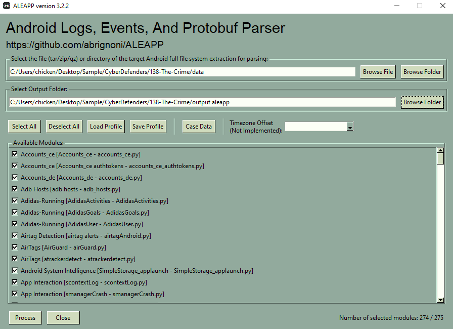
๊Using [ALEAPP](https://github.com/abrignoni/ALEAPP) will make life easier, specify folder that we just extracted from zip file and output folder then click process
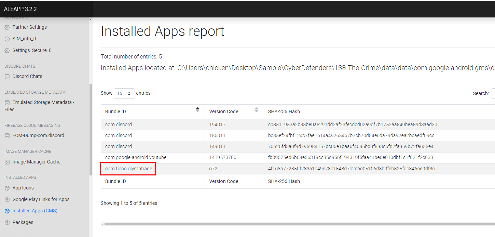
After a while, open report once it finished and go to Installed Apps then you will see that this phone only has 1 trading app

Which is Olymp Trade
```
Olymp Trade
```

> Q2: According to the testimony of the victim's best friend, he said, "While we were together, my friend got several calls he avoided. He said he owed the caller a lot of money but couldn't repay now". How much does the victim owe this person?

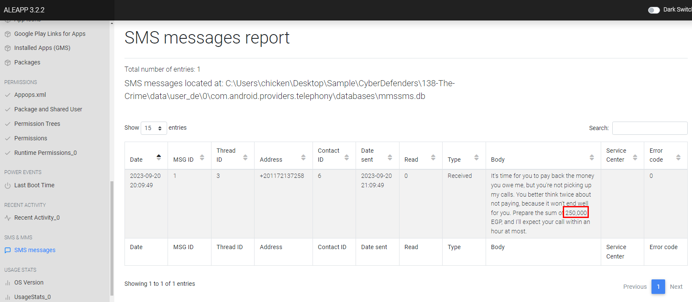
If sevaral calls were avoided then the debt owner often go to SMS message and after examined SMS message, look like victim owned someone large amount of money
```
250000
```

> Q3: What is the name of the person to whom the victim owes money?

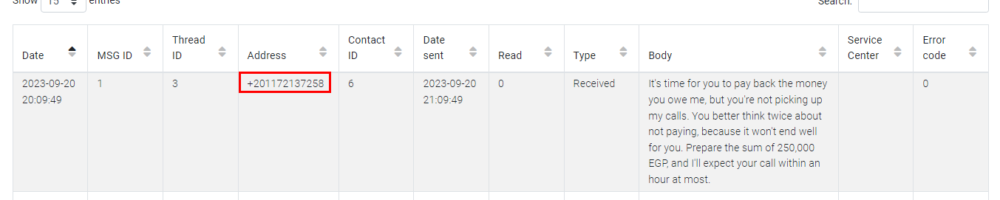
We got debt owner number so we can use this to find his name in Contacts
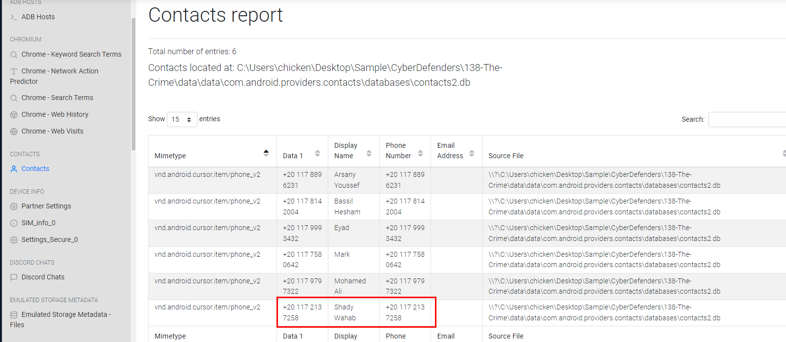
```
Shady Wahab
```

> Q4: Based on the statement from the victim's family, they said that on September 20, 2023, he departed from his residence without informing anyone of his destination. Where was the victim located at that moment?

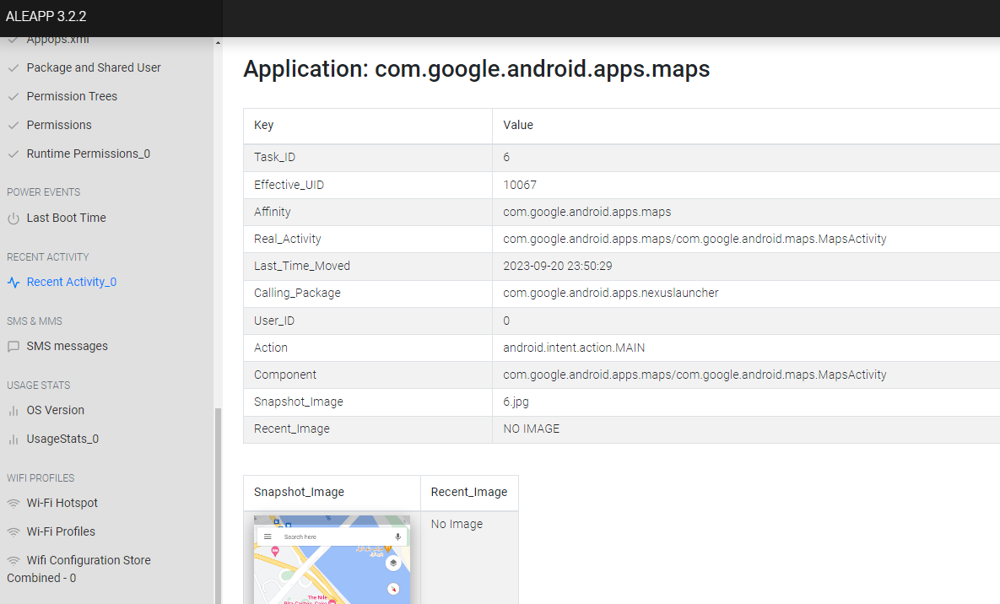
I checked Recent Activity then I found that victim used Google Maps which also has Snapsnot image too
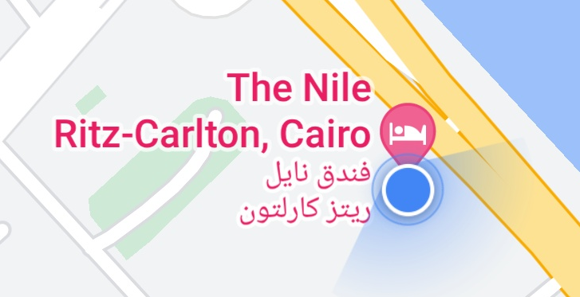
We can see that victim was stayed inside this hotel
```
The Nile Ritz-Carlton
```

> Q5: The detective continued his investigation by questioning the hotel lobby. She informed him that the victim had reserved the room for 10 days and had a flight scheduled thereafter. The investigator believes that the victim may have stored his ticket information on his phone. Look for where the victim intended to travel.

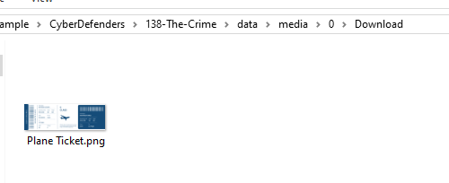
ALEAPP result didn't get me any result so I went to media folder and just as I guessed, it was saved under Download folder
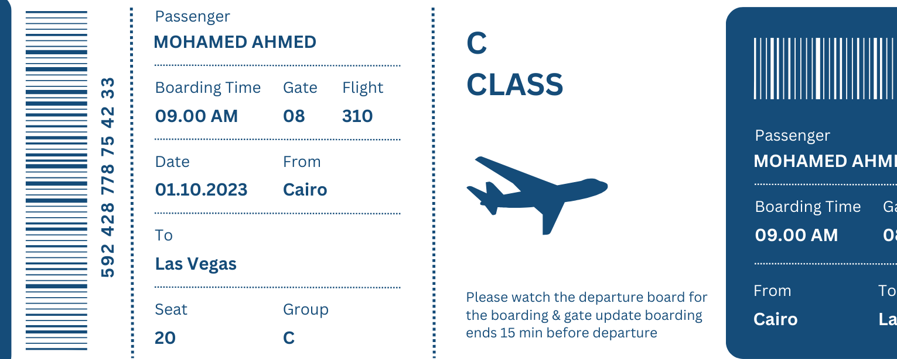
Victim intented to travel in Las Vegas
```
Las Vegas
```

> Q6: After examining the victim's Discord conversations, we discovered he had arranged to meet a friend at a specific location. Can you determine where this meeting was supposed to occur?

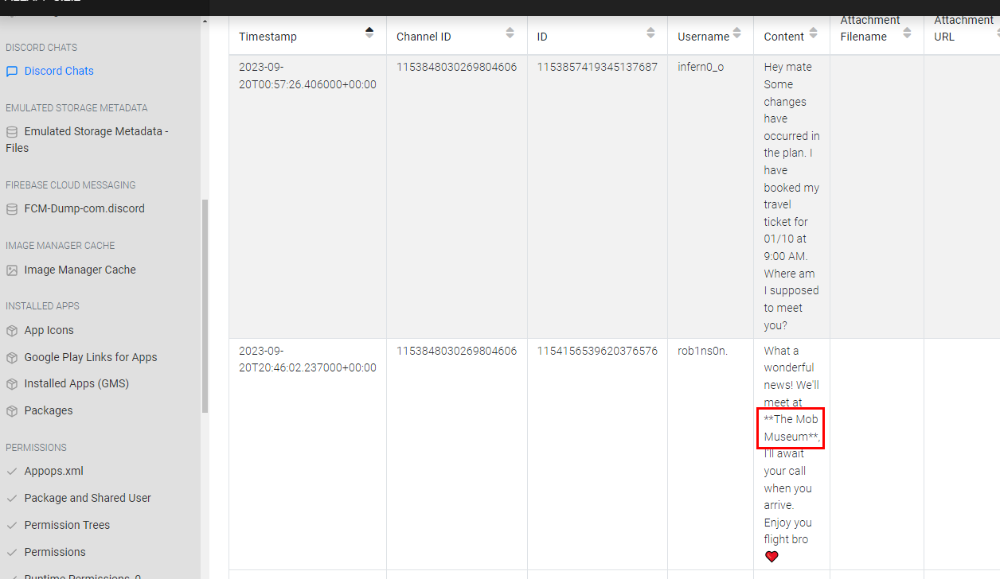
Go back to ALEAPP, it caught discord chats for us and look like victim had an appointment in The Mob Museum
```
The Mob Museum
```

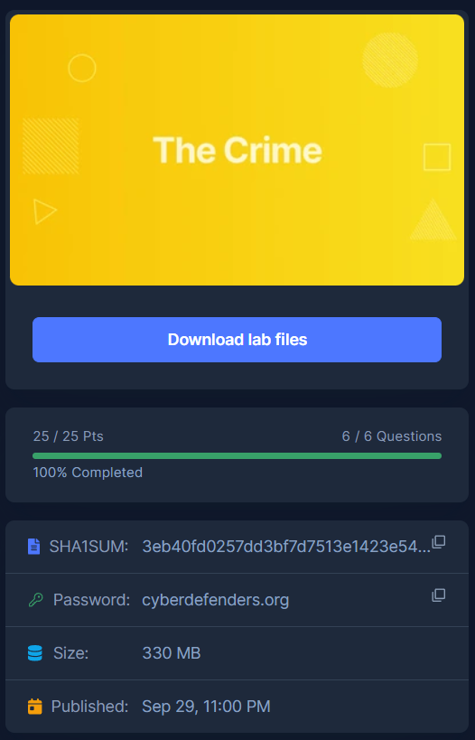
* * *