# [CyberDefenders - Ulysses](https://cyberdefenders.org/blueteam-ctf-challenges/ulysses/)
Created: 23/05/2024 19:05
Last Updated: 13/06/2024 12:19
* * *
>Category: Endpoint Forensics
>Tags: Memory Forensic, Disk Forensic, Volatility, Autopsy, T1498, T1048, T1071, T1110, T1133, T1059, T1190
* * *
**Instructions**:
- Uncompress the lab (pass: **cyberdefenders.org**), investigate this case, and answer the provided questions.
- Use the [latest version of Volatility](https://github.com/volatilityfoundation/volatility), place the attached Volatility profile "**Debian5_26.zip**" in the following path *volatility/volatility/plugins/overlays/linux*, and verify the profile is listed there as in the following [screenshot](https://cyberdefenders.org/static/img/vol.png).
 
* * *
A Linux server was possibly compromised, and a soc analyst is required in order to understand what really happened. Hard disk dumps and memory snapshots of the machine are provided in order to solve the challenge.

**Challenge Files**:
- victoria-v8.kcore.img: memory dump done by dd’ing /proc/kcore.
- victoria-v8.memdump.img: memory dump done with memdump.
- Debian5_26.zip: volatility custom Linux profile.
 
**Supportive Tools**:
- [Volatility](https://github.com/volatilityfoundation/volatility)
- [010 Editor](https://www.sweetscape.com/download/010editor/)
- [Autopsy](https://www.autopsy.com/download/)
* * *
## Questions
> Q1: The attacker was performing a Brute Force attack. What account triggered the alert?

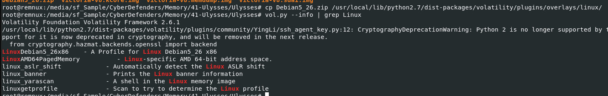
First we need to move zip profile to overlay directory then we can start our investigation

Look like memory file can't be used to solve this question, we gonna need to retrieve log files from disk image
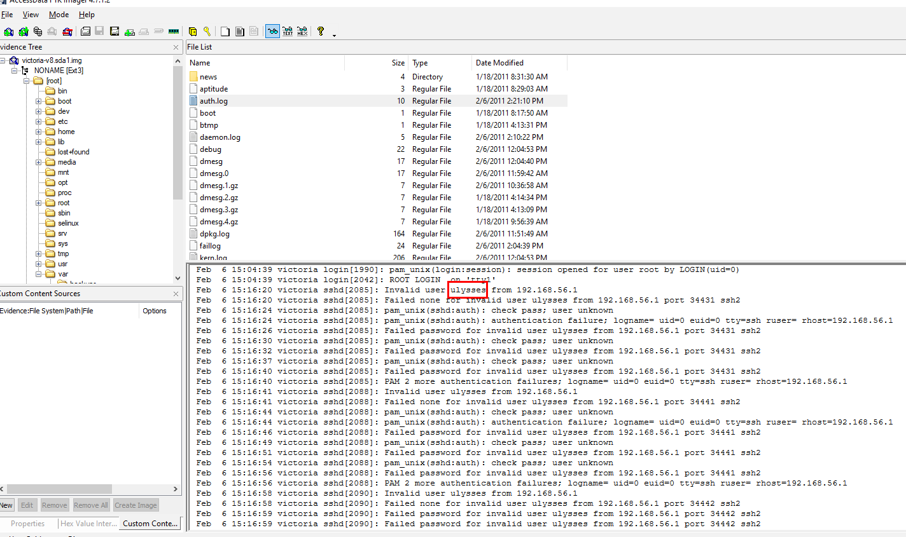
Lucky for us that auth.log is not large so we can catch the right account that was brute forced right away
```
ulysses
```

> Q2: How many were failed attempts there?

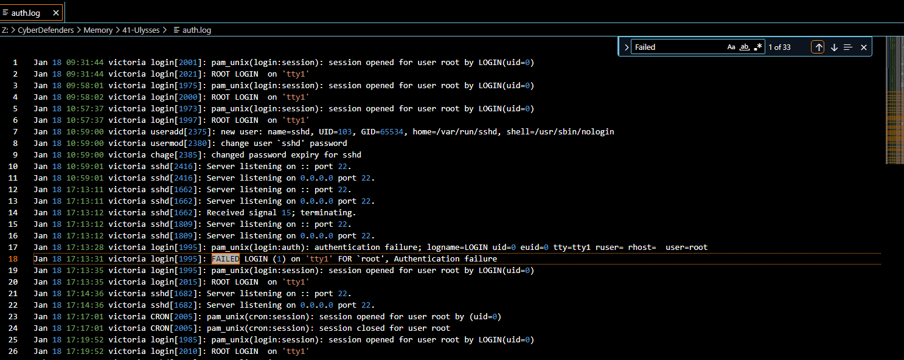
Filtered by "failed" but there are 33 of them which is not the correct answer so we have to minus 1 that not related to brute force attack which is this one
```
32
```

> Q3: What kind of system runs on the targeted server?

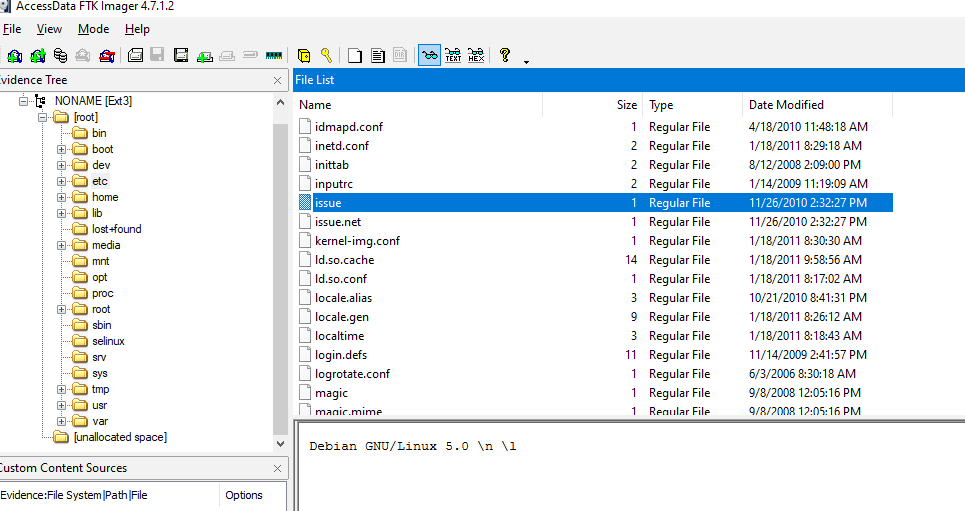
```
Debian GNU/Linux 5.0
```

> Q4: What is the victim's IP address?

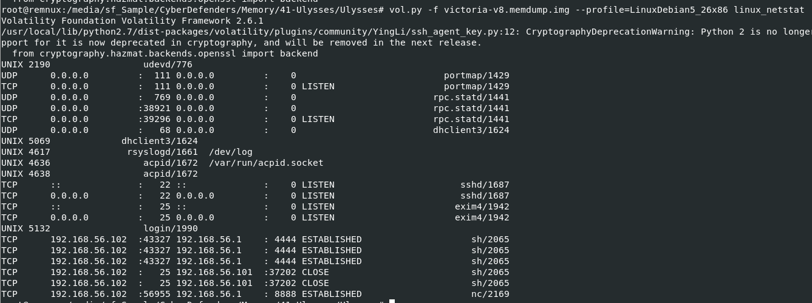
`vol.py -f victoria-v8.memdump.img --profile=LinuxDebian5_26x86 linux_netstat`

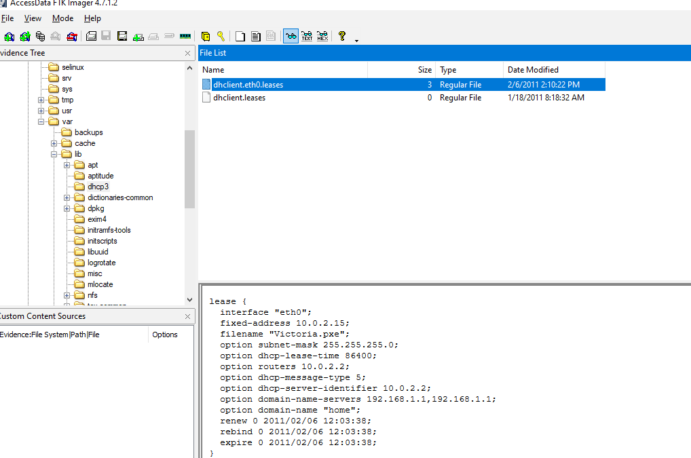
```
192.168.56.102
```

> Q5: What are the attacker's two IP addresses? Format: comma-separated in ascending order

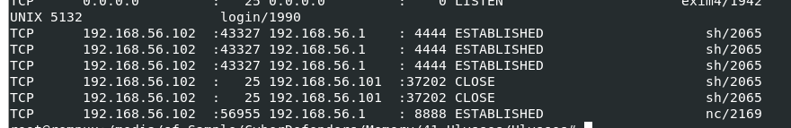
```
192.168.56.1,192.168.56.101
```

> Q6: What is the "nc" service PID number that was running on the server?

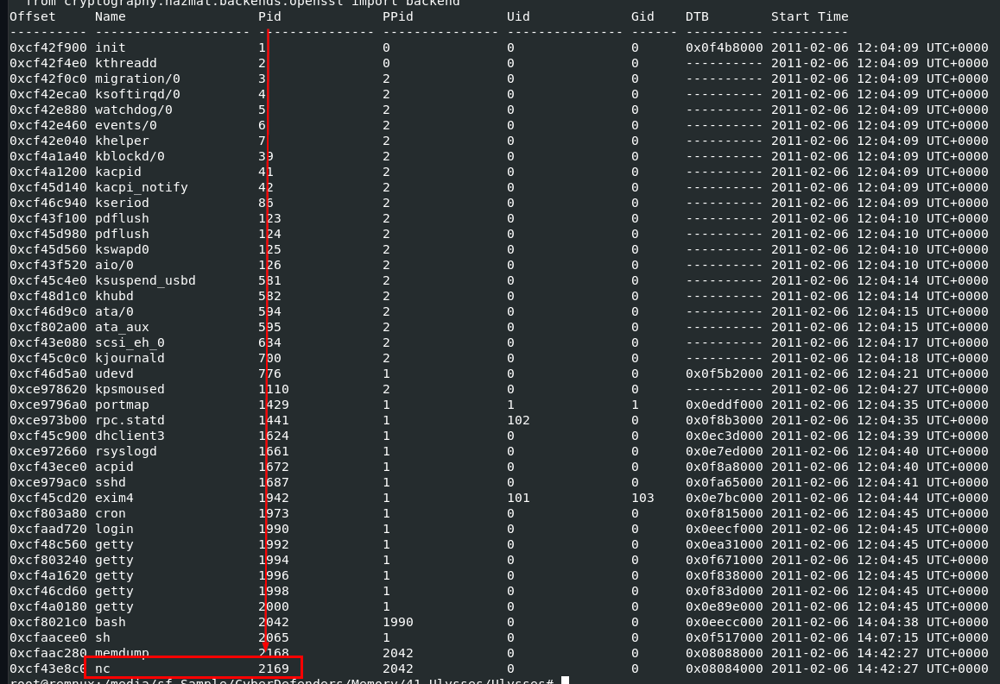
`vol.py -f victoria-v8.memdump.img --profile=LinuxDebian5_26x86 linux_pslist`
```
2169
```

> Q7: What service was exploited to gain access to the system? (one word)

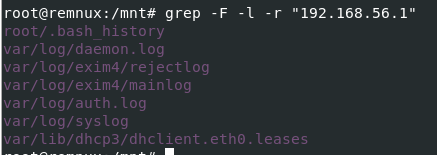
I tried to search relevant information about an attacker IP address using this command `grep -F -l -r "192.168.56.1"`, which landed me with 3 files that caught my interest 
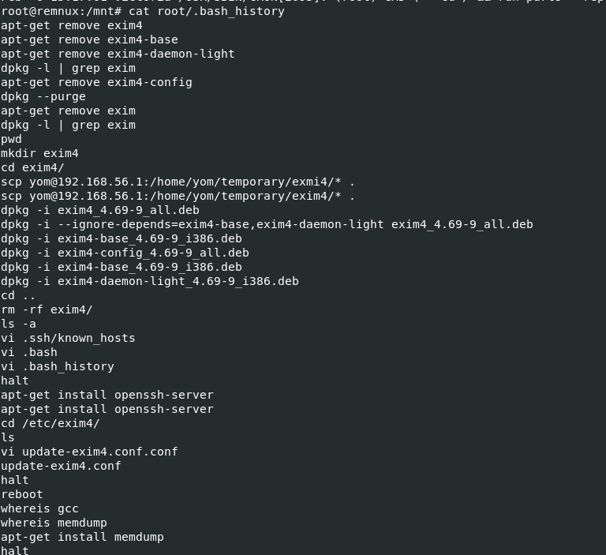
First is root's bash history and as you can see that there are several commands related to exim4 which is a mail traffer agaent on Linux 
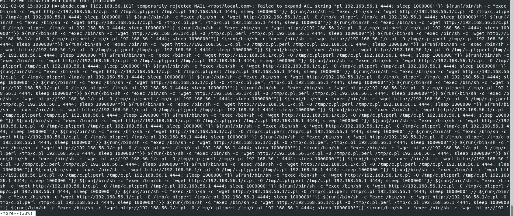
I investigated `mainlog` first, It does look like an attacker exploited RCE vulnerability of exam4 
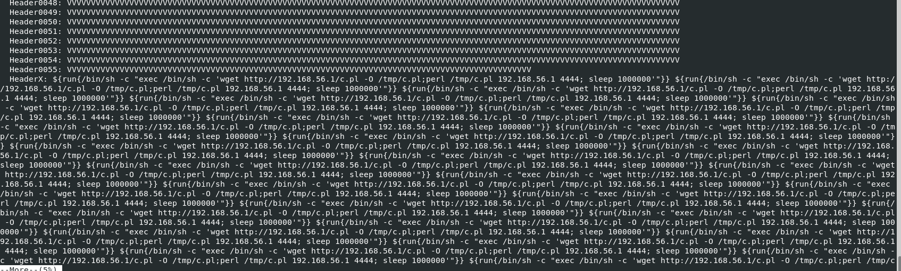
But if you also investigated `injectlog`
```
exim4
```

> Q8: What is the CVE number of exploited vulnerability?

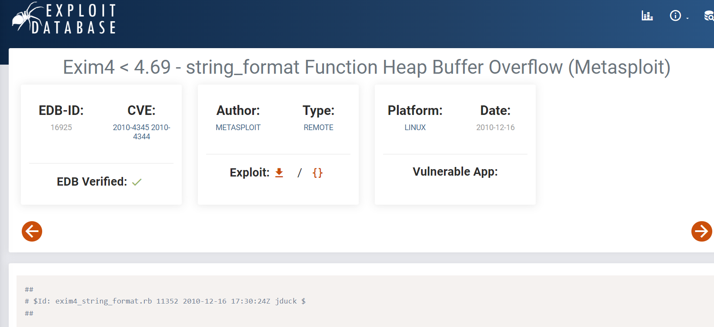
we know the version of exim4 and it results in RCE so we can search for CVE with just this information thus landed me with this exploit database [script](https://www.exploit-db.com/exploits/16925) and it was found along his brother CVE-2010-4345 for local privilege escaltion
```
CVE-2010-4344
```

> Q9: During this attack, the attacker downloaded two files to the server. Provide the name of the compressed file.

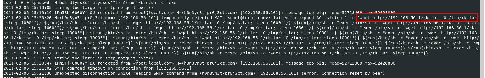
```
rk.tar
```

> Q10: Two ports were involved in the process of data exfiltration. Provide the port number of the highest one.


Result from netstat plugin told us that an attacker made a several connection to infected host
```
8888
```

> Q11: Which port did the attacker try to block on the firewall?

Since we couldn't find anything on bash history so I shifted my attention to tmp directory that we found eariler that an attacker dropped some files here
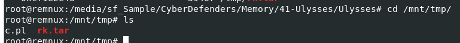
We got a pearl script and tar file on tmp directory 
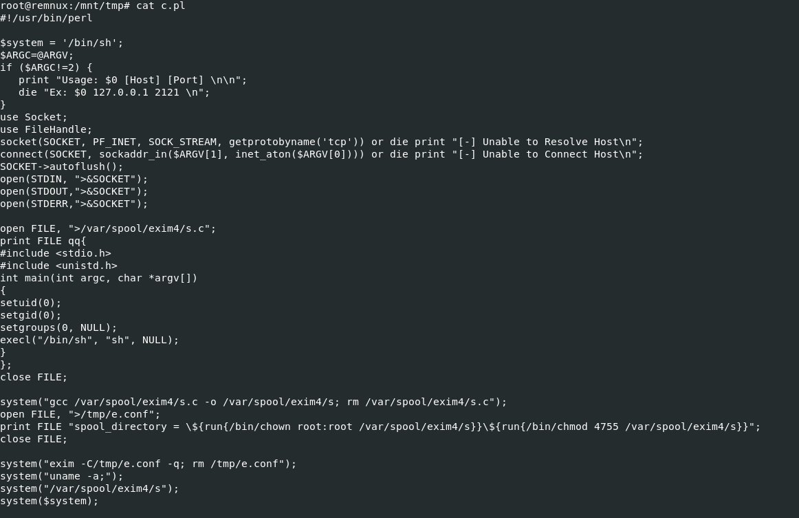
pearl script is an exploitation script for CVE-2020-4345 so its not what we're looking for
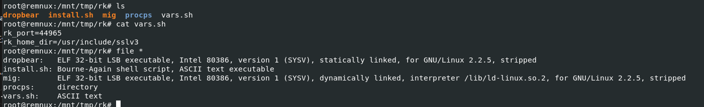
use `tar -xf rz.tar` to extract it then you will have a directory contains 5 files 
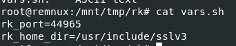
`vars.sh` contains 2 variables and look like this is what we're looking for but we need to find which script that used this file
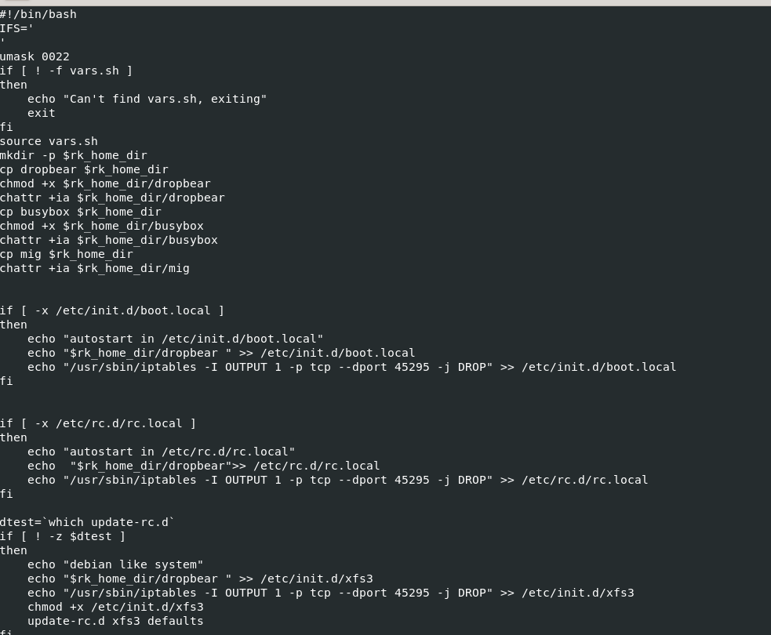
Then what I opened `install.sh`, It was right there 

Command that create a rule on IPTable to drop any packet that coming to port 45295
```
45295
```


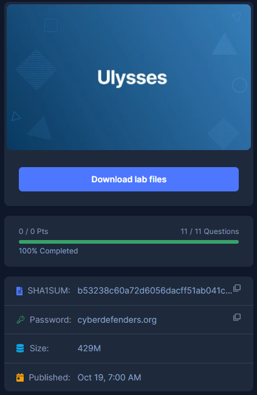
* * *

Special Thanks to this [write-up](https://ahmed-naser.medium.com/ulysses-blue-team-challenge-walkthrough-write-up-5cbe24b6942f) that guided me to finish this lab when i was stucked on Q7.