# [CyberDefenders - UnPackMe](https://cyberdefenders.org/blueteam-ctf-challenges/unpackme/)
Created: 29/05/2024 17:03
Last Updated: 03/07/2024 11:18
* * *
>**Category**: Malware Analysis
>**Tags**: Packed Malware, Stealer, IDA, Ghidra, x64dbg
* * *
**Scenario:**
Welcome to the cybersecurity team at CyberSolutions Inc. Recently, our threat intelligence network has uncovered a digital espionage effort targeting organizations worldwide. At the heart of this campaign is a sophisticated and hitherto unknown piece of malware, which we've codenamed "ShadowSteal." This malware is designed with advanced capabilities to infiltrate systems, evade detection, and exfiltrate sensitive information without leaving a trace.

"ShadowSteal" has been identified in a preliminary cybersecurity sweep and flagged due to its anomalous behavior patterns and the potential threat it poses to our operations and confidential data. Initial findings suggest that "ShadowSteal" is not just another piece of malware; it represents a significant threat due to its ability to steal a wide array of sensitive information. Additionally, "ShadowSteal" is designed to self-delete after completing its data exfiltration process, complicating post-incident analysis and forensics.

As a key member of our cybersecurity response team, your task is to analyze the "ShadowSteal" malware sample thoroughly. You must dissect its components, understand its operational mechanics, and uncover its functionalities. Your analysis will directly inform our defensive strategies, helping us to fortify our defenses, develop detection signatures, and ultimately neutralize the threat posed by "ShadowSteal."

* * *
## Questions
>Q1: Upon initiating your analysis of 'ShadowSteal,' understanding its obfuscation techniques is critical. One tell-tale sign is the file's entropy. Can you determine its value, which hints at whether the malware is packed?

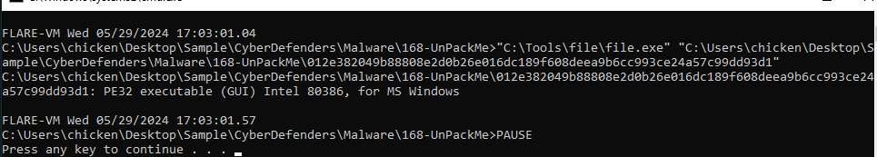

We can see that we got PE32 executable file to work with so we can use tool like DetectItEasy (DIE), pestudio and other tool that could can calculate entropy for each section of this PE32 executable file

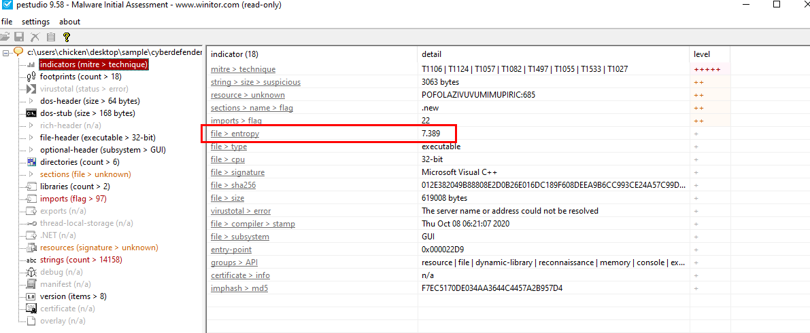

In my case, I used pestudio and it immediately caught this entropy as one of the indicator for me

  
Answer

<pre><code>7.389</code></pre>

>Q2: Before 'ShadowSteal' begins its data theft, it cleverly checks for a mutex to avoid duplicative data collection. This mutex includes a unique string combined with the computer's name. What is the hardcoded string that 'ShadowSteal' uses for this purpose?

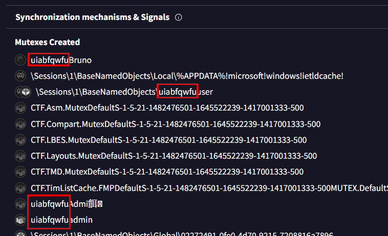

We can make this a little bit easier with VirusTotal which you can see that under "Mutexes Created" there are some strings that keep repeating on these mutexes and that string is the hardcoded string that we are looking for 

- by the way, the sample that we are investigating right now is the Raccoon Stealer malware

  
Answer

<pre><code>uiabfqwfu</code></pre>

>Q3: 'ShadowSteal' employs base64 and RC4 algorithms to safeguard the stolen data and its communication with the control server. Dive into its code to find the RC4 encryption key. What is it?

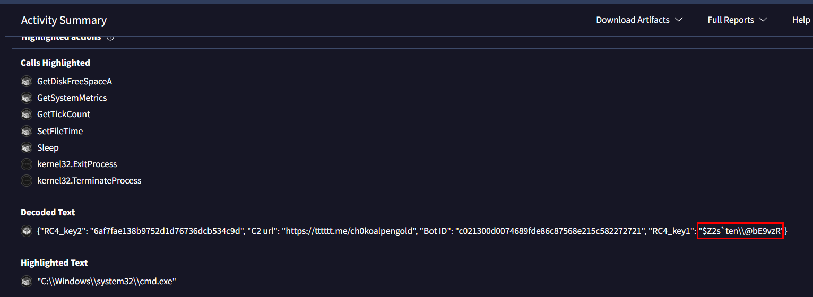

Go to "Decoded Text" and we can see `RC_key1` and `RC_key2` that match RC4 encryption key but the answer of this question is `RC_key1` 

  
Answer

<pre><code>$Z2s`ten\\@bE9vzR</code></pre>

>Q4: In its data collection phase, 'ShadowSteal' compiles a report which, among other things, reveals its version to the attacker. This detail is crucial for our threat intelligence. What version of 'ShadowSteal' are you analyzing?

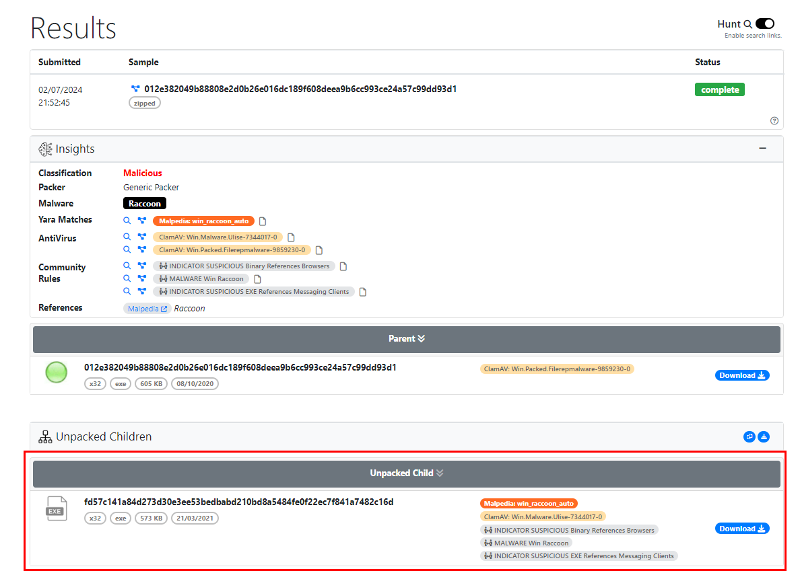

First, we need to unpack this malware and I used [unpac.me](https://www.unpac.me/results/da9c3707-8764-4b22-a92e-084db294aa7c) which is an automated tool for unpacking malware sample 

Its free for now and we just need an account to upload this sample (free plan might be limited of how much submission we could submit and could not make any private submission but for this sample, its okay just to use free plan)

After we got unpacked malware, I searched its file hash on [Recorded Future Triage](https://tria.ge/240324-lzpbaabg39) which fortunately caught version of this raccoon stealer for us

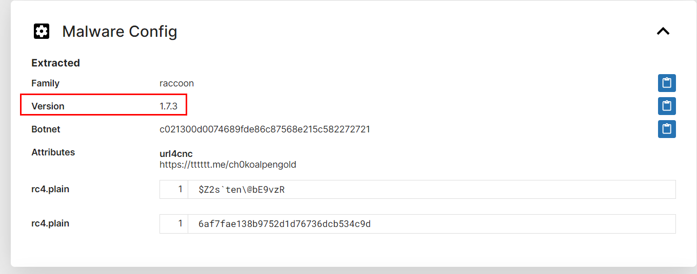

  
Answer

<pre><code>1.7.3</code></pre>

>Q5: Part of ShadowSteal's reconnaissance involves scanning for installed software, a task it accomplishes by querying a specific registry key. Identify the registry key it uses for this purpose.

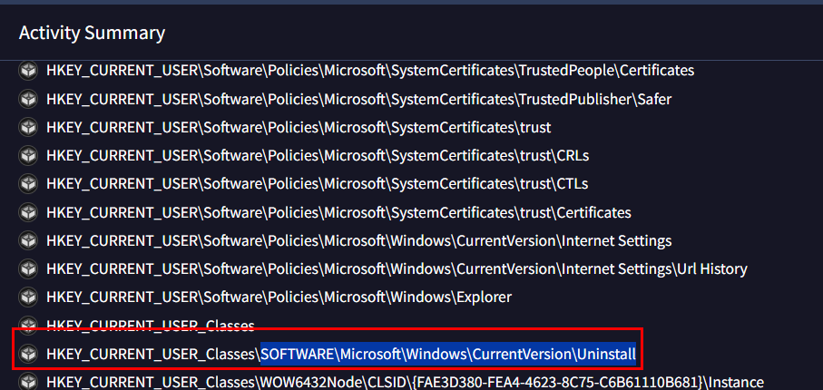

Go back to VirusTotal and you can see that this registry key was queried by this malware and it stores information about installed applications on Windows system.

  
Answer

<pre><code>SOFTWARE\Microsoft\Windows\CurrentVersion\Uninstall</code></pre>

>Q6: 'ShadowSteal' captures a screenshot of the current operating window as part of its information-gathering process. Which function address is responsible for this action?

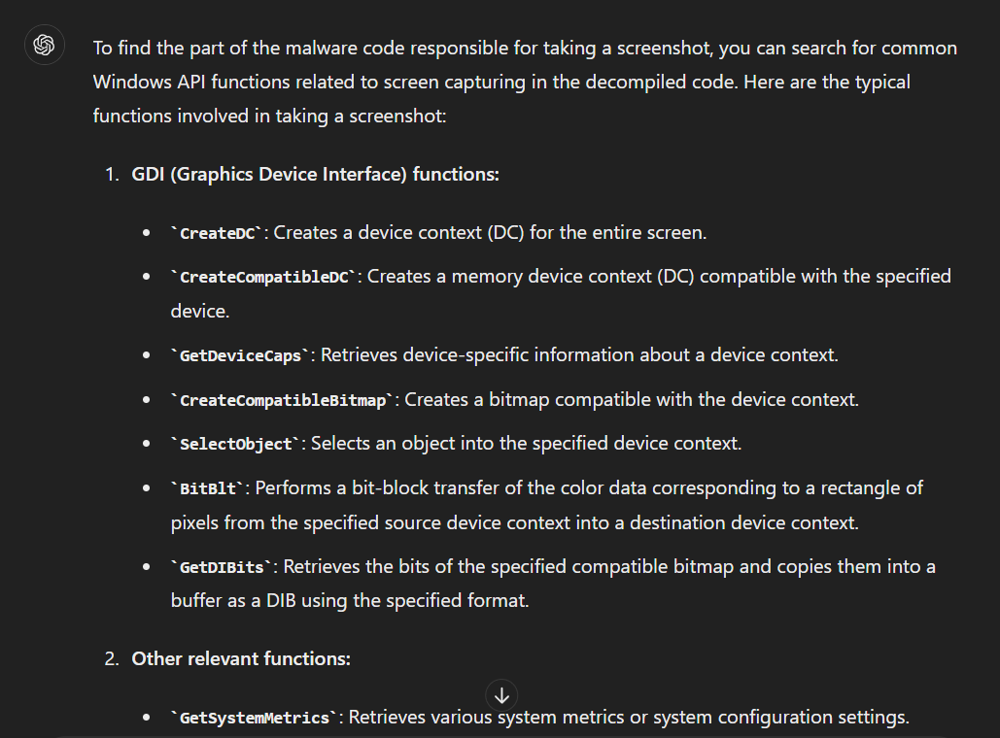

First, we need to know which Windows API could be used to take a screenshot so I let ChatGPT listed some of them for us so we could look out for them when decompiled in Ghidra/IDA

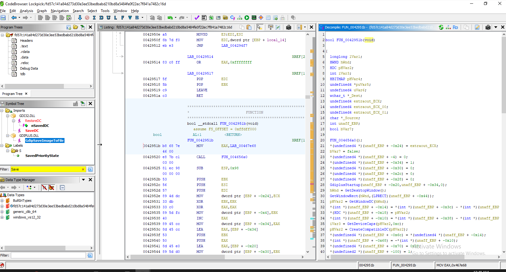

Which you can find most of them inside `FUN_0042951b` function (in Ghidra)

  
Answer

<pre><code>0042951b</code></pre>

>Q7: Once 'ShadowSteal' has fulfilled its mission, it removes all traces of its existence from the infected system. What command does it execute to delete itself?

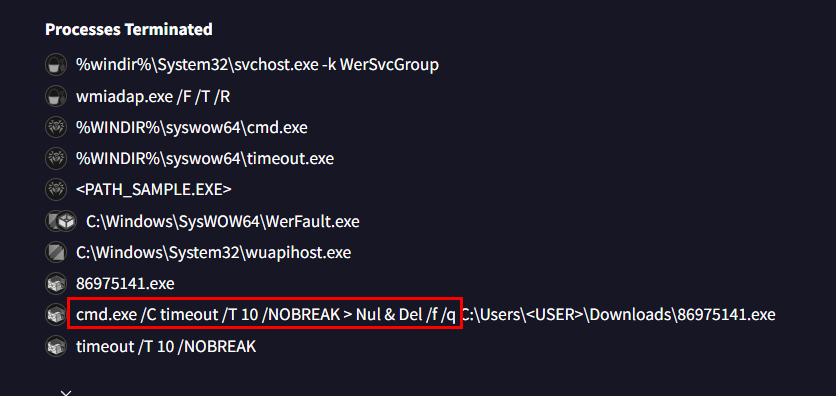

Go back to VirusTotal again for this one then go to process terminated or shell commands, which we can see that `cmd` was used to delete an executable file (which is itself)

  
Answer

<pre><code>cmd.exe /C timeout /T 10 /NOBREAK > Nul & Del /f /q</code></pre>

>Q8: For a comprehensive threat analysis, knowing where 'ShadowSteal' originates from is key. This includes the full path to its build folder on the attacker's computer. Can you provide this path?

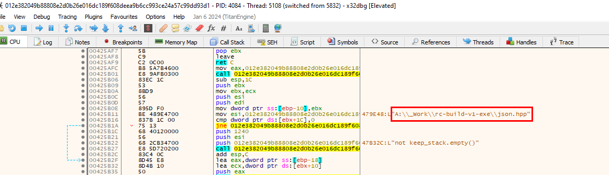

You can search for all strings that were assigned, then you can see this suspicious path and its the one we were looking for

  
Answer

<pre><code>A:\_Work\rc-build-v1-exe\</code></pre>

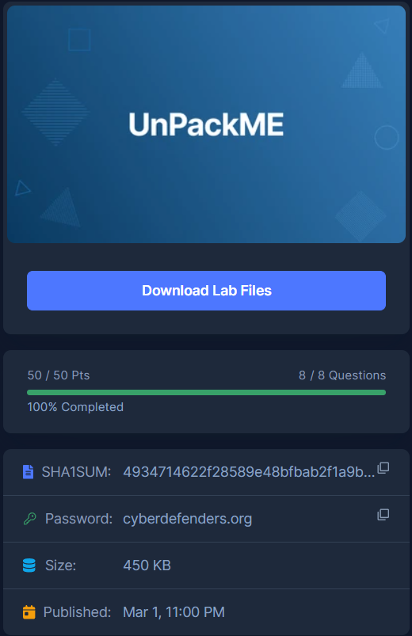
* * *