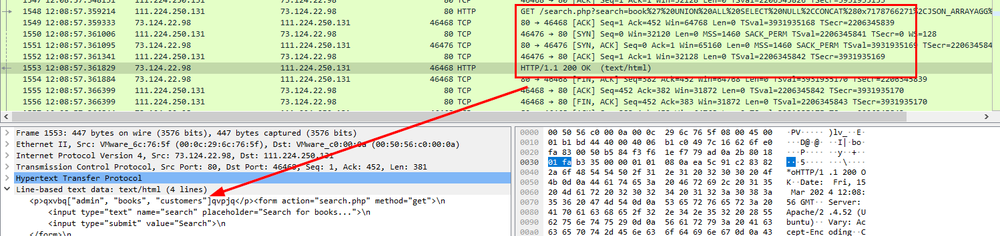

# [CyberDefenders - Web Investigation](https://cyberdefenders.org/blueteam-ctf-challenges/web-investigation/)
Created: 20/03/2024 13:11
Last Updated: 20/03/2024 15:20
* * *
>**Category**: Network Forensics
>**Tags**: PCAP, Wireshark, sql
* * *
**Scenario:**
You are a cybersecurity analyst working in the Security Operations Center (SOC) of BookWorld, an expansive online bookstore renowned for its vast selection of literature. BookWorld prides itself on providing a seamless and secure shopping experience for book enthusiasts around the globe. Recently, you've been tasked with reinforcing the company's cybersecurity posture, monitoring network traffic, and ensuring that the digital environment remains safe from threats.

Late one evening, an automated alert is triggered by an unusual spike in database queries and server resource usage, indicating potential malicious activity. This anomaly raises concerns about the integrity of BookWorld's customer data and internal systems, prompting an immediate and thorough investigation.

As the lead analyst on this case, you are required to analyze the network traffic to uncover the nature of the suspicious activity. Your objectives include identifying the attack vector, assessing the scope of any potential data breach, and determining if the attacker gained further access to BookWorld's internal systems.

**Tools:**
- Wireshark
- Network Miner
* * *
## Questions
> Q1: By knowing the attacker's IP, we can analyze all logs and actions related to that IP and determine the extent of the attack, the duration of the attack, and the techniques used. Can you provide the attacker's IP?

I opened this pcap on Wireshark

There are a lot of HTTP conversations but I noticed this one because its a SQL injection attempt, so we got an attacker
```
111.224.250.131
```

> Q2: If the geographical origin of an IP address is known to be from a region that has no business or expected traffic with our network, this can be an indicator of a targeted attack. Can you determine the origin city of the attacker?


Using [IPLocation](https://www.iplocation.net/ip-lookup), I've found that this IP address is located in Hebei (China)
```
Shijiazhuang
```

> Q3: Identifying the exploited script allows security teams to understand exactly which vulnerability was used in the attack. This knowledge is critical for finding the appropriate patch or workaround to close the security gap and prevent future exploitation. Can you provide the vulnerable script name?


We can see that this php script is likely vulnerable to SQL injection attack
```
search.php
```

> Q4: Establishing the timeline of an attack, starting from the initial exploitation attempt, What's the complete request URI of the first SQLi attempt by the attacker?


I wanted to know the regular query first so If we just queried with just `book`, We got no result

Scroll down a bit more, I saw HTTP status 200 with the same no result

Decoded URL-encoded string, then it made sense why the result is the same as queries with `book`, because it just added `AND TRUE` statement after it.
```
/search.php?search=book%20and%201=1;%20--%20-
```

> Q5: Can you provide the complete request URI that was used to read the web server available databases?

question ask for the web server available database, that mean just True statement is not enough anymore, `UNION` operator might be used to combine result with [sys.databases](https://learn.microsoft.com/en-us/sql/relational-databases/system-catalog-views/sys-databases-transact-sql?view=sql-server-ver16) or [Information_schema](https://dev.mysql.com/doc/mysql-infoschema-excerpt/8.3/en/information-schema-introduction.html)


So I searched `schema` string, then finally obtained the answer
```
/search.php?search=book%27%20UNION%20ALL%20SELECT%20NULL%2CCONCAT%280x7178766271%2CJSON_ARRAYAGG%28CONCAT_WS%280x7a76676a636b%2Cschema_name%29%29%2C0x7176706a71%29%20FROM%20INFORMATION_SCHEMA.SCHEMATA--%20-
```

> Q6: Assessing the impact of the breach and data access is crucial, including the potential harm to the organization's reputation. What's the table name containing the website users data?



Attacker successfully queries all tables of `bookworld_db` database


and the `customers` table contains information about users of this website
```
customers
```

> Q7: The website directories hidden from the public could serve as an unauthorized access point or contain sensitive functionalities not intended for public access. Can you provide name of the directory discovered by the attacker? 


After attacker exploited SQL injection then he/she used gobuster attempting to find directory that supposed to be hidden on this website

Filtered by HTTP status 200, I finally found that attacker got accessed to `/admin/` directory
```
/admin/
```

> Q8: Knowing which credentials were used allows us to determine the extent of account compromise. What's the credentials used by the attacker for logging in?


Knowing an attacker found `/admin/` page, I also found that login.php page and the POST request to the server mean an attacker tried to gain access to this admin page and he/she finally got accessed according to HTTP 302 then went straight to index.php
```
admin:admin123!
```

> Q9: We need to determine if the attacker gained further access or control on our web server. What's the name of the malicious script uploaded by the attacker?


scrolled down a little after an attacker authenticated to an admin page, then look like he/she found an upload directory, but the method is GET so this is the malicious file that likely to be a PHP reverse shell script and attacker uploaded this to server then fetch it to execute the script.

So I wanted to confirmed when the attacker uploaded a file and you need to look for POST method to upload it to webserver so I needed to find which POST method associated with file


which I finally confirmed that on the index.php, attacker uploaded this php reverse shell script to the webserver
```
NVri2vhp.php
```


***