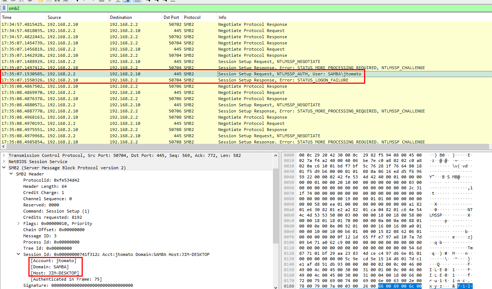
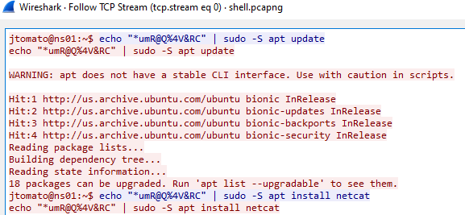
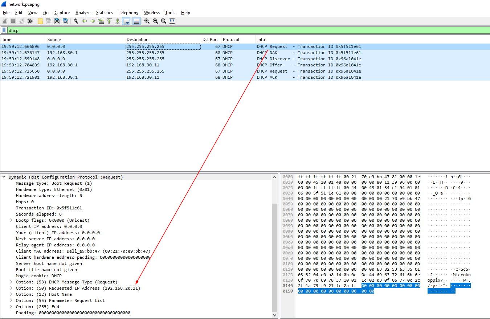
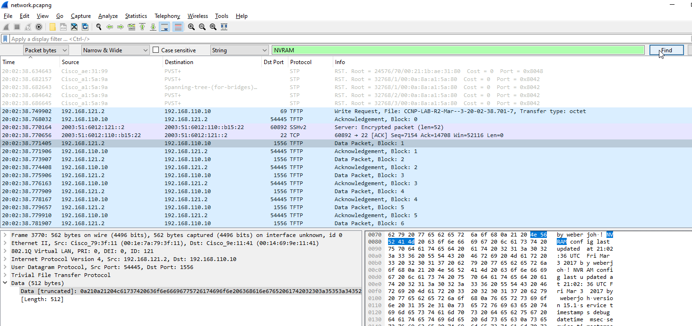
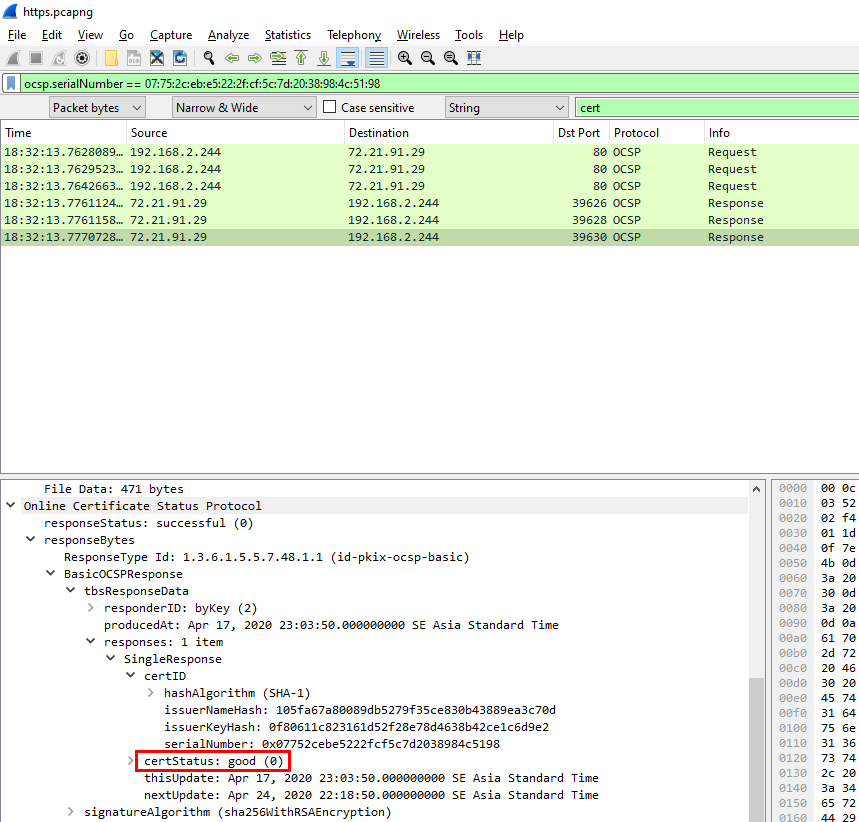
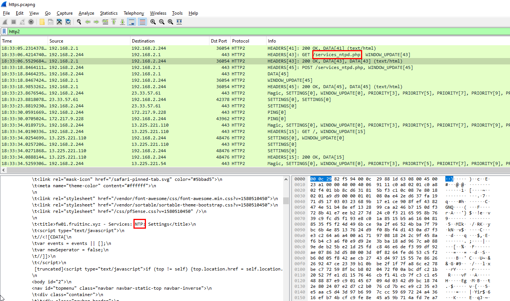
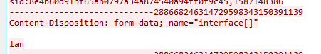

# [CyberDefenders - WireDive](https://cyberdefenders.org/blueteam-ctf-challenges/wiredive/)
Created: 07/03/2024 14:47
Last Updated: 11/03/2024 14:52
* * *
>Category: Network Forensics
>Tags: PCAP, Wireshark, Network, SMB, T1041, T1048, T1005, T1071, T1570, T1059, T1133
* * *
WireDive is a combo traffic analysis exercise that contains various traces to help you understand how different protocols look on the wire where you can evaluate your DFIR skills against an artifact you usually encounter in today's case investigations as a security blue team member.

**Challenge Files**:
- dhcp.pcapng
- dns.pcapng
- https.pcapng 
- network.pcapng 
- secret_sauce.txt 
- shell.pcapng 
- smb.pcapng

**Tools**:
- [BrimSecurity](https://www.brimdata.io/download/)
- [WireShark](https://www.wireshark.org/download.html)
* * *
## Questions
> Q1: File: dhcp.pcapng - What IP address is requested by the client?

Opened dhcp.pcapng with Wireshark and then using `dhcp` as a filter

Now we can see that IP 192.168.2.244 got release 

Then this client asked for this IP address after it got released then client got that IP address from the DHCP server.

If you don't understand what these DHCP Release to DHCP Ack means [ComputerNetworkingNotes](https://www.computernetworkingnotes.com/ccna-study-guide/how-dhcp-works-explained-with-examples.html) made a note that easy to understand, you can check it out! 


```
192.168.2.244
```

> Q2: File: dhcp.pcapng - What is the transaction ID for the DHCP release?


```
0x9f8fa557
```

> Q3: File: dhcp.pcapng - What is the MAC address of the client?


```
00:0c:29:82:f5:94
```

> Q4: File dns.pcapng - What is the response for the lookup for flag.fruitinc.xyz?

First, opened dns.pcapng on Wireshark then filter for `dns` protocol

The last package of this filter is the response, We're looking for
```
ACOOLDNSFLAG
```

> Q5: File: dns.pcapng - Which root server responds to the google.com query? Hostname.

Filter out by google.com and response

The first response is a response from Root server

Used IP Address Lookup and got the right answer
```
e.root-servers.net
```

> Q6: File smb.pcapng - What is the path of the file that is opened?

Opened smb.pcapng on Wireshark then filter packages with `smb2` for SMB2 protocol

I scrolled down to the bottom of this filtered packages

I found that this text file inside HelloWorld directory was opened on the Create Response File package
```
HelloWorld\TradeSecrets.txt
```

> Q7: File smb.pcapng - What is the hex status code when the user SAMBA\jtomato logs in?

Still on `smb2` protocol filter


```
0xc000006d
```

> Q8: File smb.pcapng - What is the tree that is being browsed?

Scrolling up before user tried to opened a file, We can see that there is Tree Connect Request and It got responsed back from smb2 server

```
\\192.168.2.10\public
```

> Q9: File smb.pcapng - What is the flag in the file?

I followed TCP stream when a file is opened to read content of this secret text file

Which is too long to find a flag so I copied all readable text to text cleaner/text formatter than find a specific string

That's a flag
```
OneSuperDuperSecret
```

> Q10: File shell.pcapng - What port is the shell listening on?

Open shell.pcapng on Wireshark

First thing that caught my eyes is the established connection between 192.168.2.5 and 192.168.2.244, Looking at the connection was sent to port 4444 which is a default port of metasploit, its possibly a reverse shell connection.

So I fellow the TCP stream which I proved my hypothesis to be correct


```
4444
```

> Q11: File shell.pcapng - What is the port for the second shell?

From the reverse shell connection, I've seen that the attacker tried to install netcat 

Then use it to send `/etc/passwd` to the attacker machine on port 9999
```
9999
```

> Q12: File shell.pcapng - What version of netcat is installed?
```
1.10-41.1
```

> Q13: File shell.pcapng - What file is added to the second shell
```
/etc/passwd
```

> Q14: File shell.pcapng - What password is used to elevate the shell?

User kept using command `echo` before piping to `sudo` commmand, it could mean that the string that was passed onto `sudo` is the root password that required to execute `sudo` command as root and then use `apt` to install netcat using root priviledge

```
*umR@Q%4V&RC
```

> Q15: File shell.pcapng - What is the OS version of the target system?

When `apt` is ran, it checks system OS and distribution so I can find the answer of this question from the same stream.

```
bionic
```

> Q16: File shell.pcapng - How many users are on the target system?

From the previous question, I knew that content of `/etc/passwd` was sent to an attacker using netcat at port 9999

There it is

```
31
```

> Q17: File network.pcapng - What is the IPv6 NTP server IP?

Opened network.pcapng on WireShark then filter with `ntp`

We can see that there are only 2 packets using IPv6

First packet send to server to tell that this IPv6 address is client.
Second packet send back to client to confirm that this is a server.
```
2003:51:6012:110::dcf7:123
```

> Q18: File network.pcapng - What is the first IP address that is requested by the DHCP client?

filter by `dhcp`

First package request 192.168.20.11 but DHCP server declined then Its discover new IP address then made a request, then it finally obtained an IP address
```
192.168.20.11
```

> Q19: File network.pcapng - What is the first authoritative name server returned for the domain that is being queried?


```
ns1.hans.hosteurope.de
```

> Q20: File network.pcapng - What is the number of the first VLAN to have a topology change occur?

I didn't know anything about Protocol that VLAN is using on so I did some research and found that 
There are 3 protocols to look out for

It might be STP on this pcapng file so I started with STP


Then I inspected STP packet and found that there is a flag that could be used here

Apply as Filter and then changed from False to True

There it is 
```
20
```

> Q21: File network.pcapng - What is the port for CDP for CCNP-LAB-S2?

Read more about [CDP](https://learningnetwork.cisco.com/s/article/cisco-discovery-protocol-cdp-x) (Cisco Discovery Protocol)

I used `cdp` to filter it out rightaway

As you can see that there are only 2 port ID which are GigabitEthernet0/1 and GigabitEthernet0/2
```
GigabitEthernet0/2
```

> Q22: File network.pcapng - What is the MAC address for the root bridge for VLAN 60?

I started by filter `vlan` then select one of STP packet

You can see that we can use Originating VLAN to filter out for VLAN 60

Got it
```
00:21:1b:ae:31:80
```

Altenatively you can use `vlan.id==60` to filter out vlan 60

> Q23: File network.pcapng - What is the IOS version running on CCNP-LAB-S2?

Back to CDP protocol, there is software information on every packet 

```
12.1(22)EA14
```

> Q24: File network.pcapng - What is the virtual IP address used for hsrp group 121?

First filter with `hsrp` ,[HSRP](https://www.geeksforgeeks.org/hot-standby-router-protocol-hsrp/) (Hot Standby Router Protocol)

On hsrp packet, I used group as filter and I could find the answer there

```
192.168.121.1
```

> Q25: File network.pcapng - How many router solicitations were sent?

I didn't know what is router solicitations so I made a query on Google and look like it has something to do with ICMP protocol


Then I found this [post](https://osqa-ask.wireshark.org/questions/19753/ipv6-router-solicitation/) on Wireshark Q&A 

Now applied that filter on pcapng file

We got 3
```
3
```

> Q26: File network.pcapng - What is the management address of CCNP-LAB-S2?

back to `cdp`, you can find management address there

```
192.168.121.20
```

> Q27: File network.pcapng - What is the interface being reported on in the first snmp query?

filter by `snmp` then you can see there are get-request and get-response packets

get-request didn't have the answer so It has to be in get-response

There is it
```
Fa0/1
```

> Q28: File network.pcapng - When was the NVRAM config last updated?

I used Find Packet that looking for NVRAM strgins on packet bytes

After found it, I followed UDP stream to find more information

Luckily the NVRAM config last updated were there

```
21:02:36 03/03/2017
```

> Q29: File network.pcapng - What is the ip of the radius server?

I filtered out by `radius` and found nothing so I used Find Packet to find it for me and it shows the same result as previous question

```
2001:DB8::1812
```

> Q30: File https.pcapng - What has been added to web interaction with web01.fruitinc.xyz?

Searching for web01 strings and found it on TLSv1.2 packet

Which I can't decrypt but I found a [write-up](https://www.petermstewart.net/dfa-ccsc-spring-2020-ctf-wireshark-https-pcapng-write-up/) that can teach us how to decrypt TLS conversation

First go to Preferences

Next find TLS and add (Pre)-Master-Secret log filename and then click OK

Now after follow TLS, we can read the content inside of it now

```
y2*Lg4cHe@Ps
```

> Q31: File https.pcapng - What is the name of the photo that is viewed in slack?

Slack might be opened on the browser and HTTP request might be the one that I was looking for so I used filter `http.host contains "slack"` to find HTTP request that have slack on the host field

And look like there is 1 picture that user sent request to view it
```
get_a_new_phone_today_720.jpg 
```

> Q32: File https.pcapng - What is the username and password to login to 192.168.2.1? Format: 'username:password' without quotes.

I filtered out by the IP address and found that HTTP2 has HTML Form URL Encoded field that has all the form that send to the server

Which we can see in cleartext

```
admin:Ac5R4D9iyqD5bSh
```

> Q33: File https.pcapng - What is the certStatus for the certificate with a serial number of 07752cebe5222fcf5c7d2038984c5198?

I used `ocsp` to filter out for OCSP (Online Certificate Status Protocol)

Luckily the first certificate that i inspected is the certificate that matchs the serialNumber of this question, so I filtered out by using this serialNumber and looking for Response packet

```
good
```

> Q34: File https.pcapng - What is the email of someone who needs to change their password?

I knew that urlencoded-form has some cleartext data that being sent to the server so I used this filter and finally found the answer

```
Jim.Tomato@fruitinc.xyz
```

> Q35: File https.pcapng - A service is assigned to an interface. What is the interface, and what is the service? Format: interface_name:service_name

I started by searching through `http2` protocol then I found this php file caught my eyes 

It is a page that used to setting NTP so the service is NTP

Followed HTTP2 stream, I found that there is an option to select interface so I might need to find what user had submitted

Which is lan

```
lan:ntp
```


* * *
