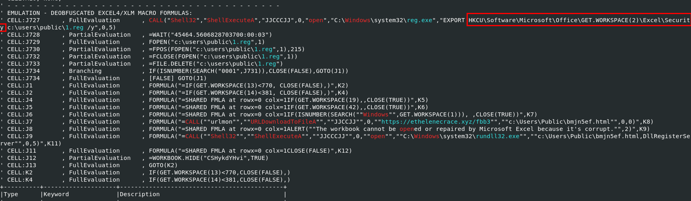
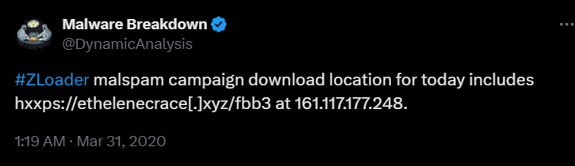

# [CyberDefenders - XLM Macros](https://cyberdefenders.org/blueteam-ctf-challenges/xlm-macros/)
Created: 21/06/2024 00:22
Last Updated: 22/06/2024 02:03
* * *
>Category: Malware Analysis
>Tags: Excel 4 (XLM) Macros, Macro, OLEDUMP, XLMDeobfuscator, Office IDE, REMnux, T1485, T1136.001, T1071, T1083, T1033, T1140, T1059.003
* * *
Recently, we have seen a resurgence of Excel-based malicous office documents. Howerver, instead of using VBA-style macros, they are using older style Excel 4 macros. This changes our approach to analyzing these documents, requiring a slightly different set of tools. In this challenge, you, as a security blue team analyst will get hands-on with two documents that use Excel 4.0 macros to perform anti-analysis and download the next stage of the attack.

**Samples**:
- Sample1: MD5: fb5ed444ddc37d748639f624397cff2a
- Sample2: MD5: b5d469a07709b5ca6fee934b1e5e8e38

**Helpful Tools**:
- REMnux VM
- XLMDeobfuscator
- OLEDUMP with PLUGIN_BIFF
- Office IDE

**Suggested Resources**:
- [Example Excel 4 macro analysis from Hack-in-the-Box 2020 workshop](https://youtu.be/_rlEpPwSIoc?t=6421)
- [Excel 4 macro reference for Get.Workspace](https://0xevilc0de.com/excel-4-macros-get-workspace-reference/)
* * *
## Questions
> Q1: Sample1: What is the document decryption password?


We got 2 microsoft excel sample to investigate and we will have to investigate sample 1 first and step up to sample 2 


First, we will determine if this file is encrypted or not with `msoffcrypto-tool -t -v sample1-fb5ed444ddc37d748639f624397cff2a.bin`, we use `-t` which we can see it is encrypted so we will use `msoffcrypto-crack.py sample1-fb5ed444ddc37d748639f624397cff2a.bin` to find for the password hence the answer of this question

```
VelvetSweatshop
```

> Q2: Sample1: This document contains six hidden sheets. What are their names? Provide the value of the one starting with S.


We can easily obtain this answer by using `olevba` but to expand our knowledge and toolset, lets do it as this challenge was intended to be solved


First, using password we got from the last time to decrypt it then we will have a new file that all contents are decrypted 


Next lets use `oledump.py sample1_decrypt -p /opt/oledump-files/plugin_biff.py --pluginoptions '-x'` to dump all relevant information for us then at the top we can see all sheet information including hidden sheets

```
SOCWNEScLLxkLhtJp
```

> Q3: Sample1: What URL is the malware using to download the next stage? Only include the second-level and top-level domain. For example, xyz.com.


Back to `olevba`, just take a look that IOC this tool caught for us

```
http://rilaer.com
```

> Q4: Sample1: What malware family was this document attempting to drop?


Searching this domain on [urlhaus](https://urlhaus.abuse.ch/browse.php?search=rilaer.com) and you will see which malware family was dropped from this domain

```
Dridex
```

> Q5: Sample2: This document has a very hidden sheet. What is the name of this sheet?


First we need to check if this file is encrypted or not which is not


So we can proceed with `oledump.py sample2-b5d469a07709b5ca6fee934b1e5e8e38.bin -p /opt/oledump-files/plugin_biff.py --pluginoptions '-x'` which we can see that there is only 1 sheet that is very hidden

```
CSHykdYHvi
```

> Q6: Sample2: This document uses reg.exe. What registry key is it checking?



Using `olevba` and go to XLM Macro that was extracted for us, we can see that this macro is using registry key to check microsoft excel specific security option of a system


To find which key is really check, we need to use `strings` then you will found this registry key that related to VBA warning when open macro embbed microsoft excel file


Here is the describe for each value it could represent

```
VBAWarnings
```

> Q7: Sample2: From the use of reg.exe, what value of the assessed key indicates a sandbox environment?


We can see that after it retrieve `VBAWarnings` key value, it will be check with "0001" to check if this sheet will be closed or not

As we can see that "1" mean its potentially mean a sandbox which it need least restrictive to execute malware

```
0x1
```

> Q8: Sample2: This document performs several additional anti-analysis checks. What Excel 4 macro function does it use?


We can see these chains of formula so lets ChatGPT analyze them for us


So it use `GET.WORKSPACE` to retrieve environment information to determine if it should exit or not 

```
GET.WORKSPACE
```

> Q9: Sample2: This document checks for the name of the environment in which Excel is running. What value is it using to compare?
```
Windows
```

> Q10: Sample2: What type of payload is downloaded?


After It passed all tests, this macro will download a file from specific url and run it with `rundll32.exe` which is an executable file designed to run dll file hence the file that will be downloaded is dll 

```
dll
```

> Q11: Sample2: What URL does the malware download the payload from?


```
https://ethelenecrace.xyz/fbb3
```

> Q12: Sample2: What is the filename that the payload is saved as?


```
bmjn5ef.html
```

> Q13: Sample2: How is the payload executed? For example, mshta.exe
```
rundll32.exe
```

> Q14: Sample2: What was the malware family?


I couldn't find this domain on URLHaus so I searched it on google and found someone posted about this on T**X**ITTER


```
zloader
```


* * *
