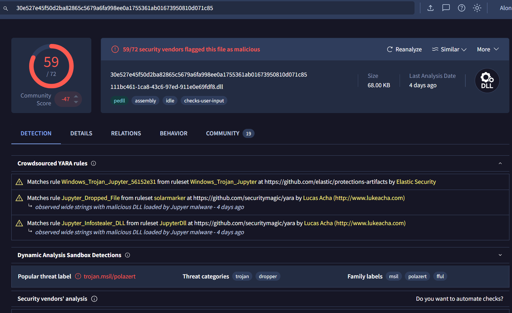
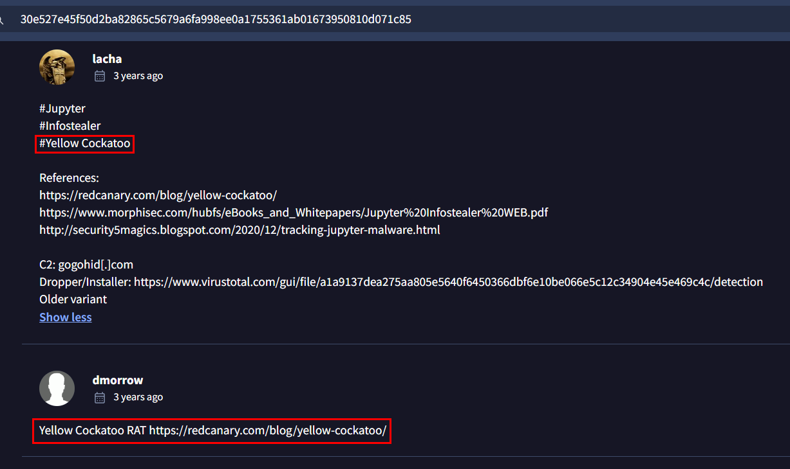
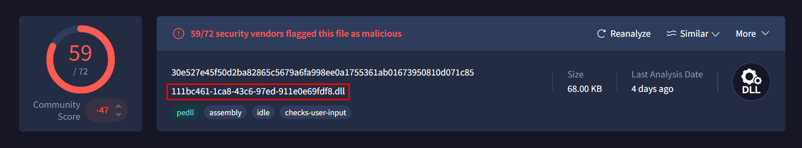
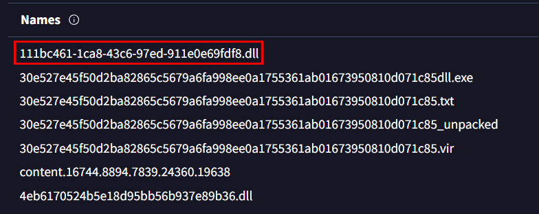
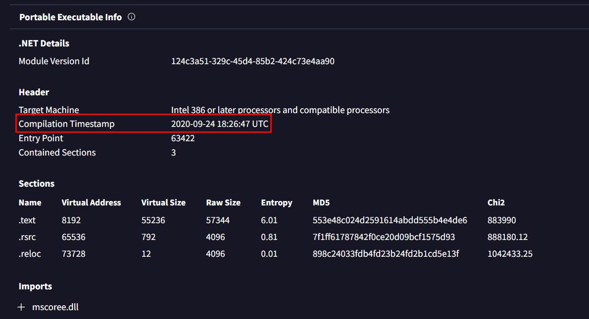
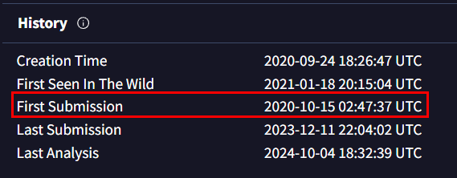
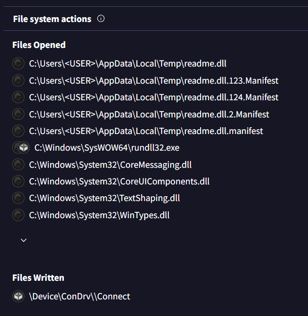
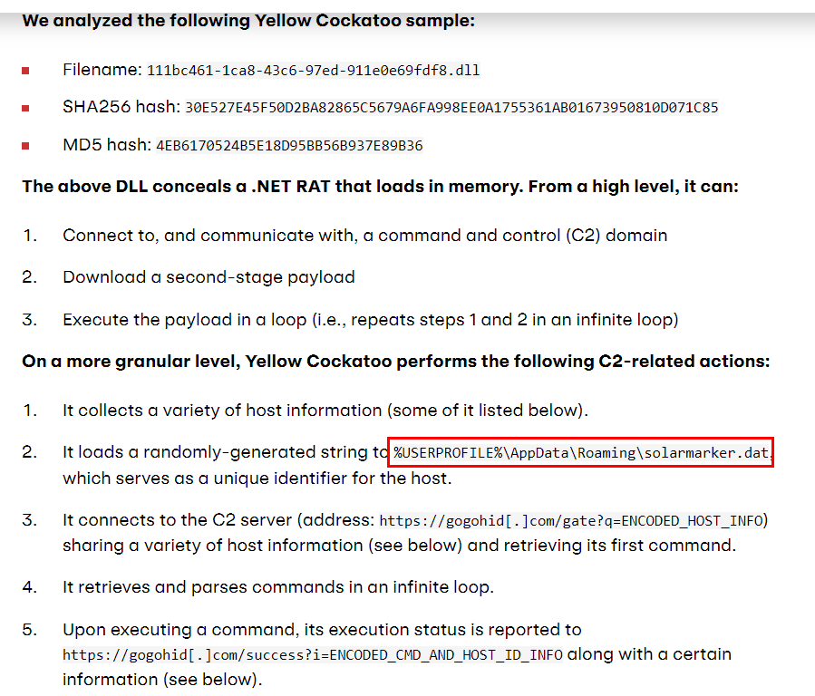
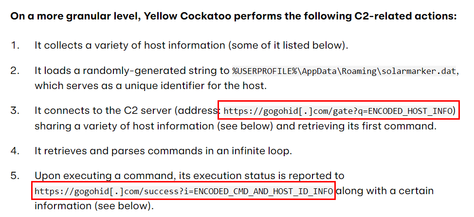
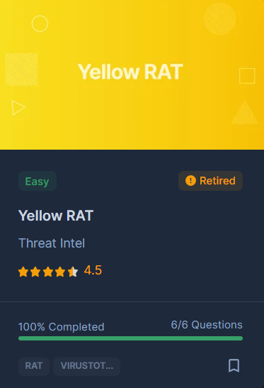

# [CyberDefenders - Yellow RAT](https://cyberdefenders.org/blueteam-ctf-challenges/yellow-rat/)
Created: 08/10/2024 13:44
Last Updated: 09/10/2024 10:03
* * *
>**Category**: Threat Intel
* * *
**Scenario:**
During a regular IT security check at GlobalTech Industries, abnormal network traffic was detected from multiple workstations. Upon initial investigation, it was discovered that certain employees' search queries were being redirected to unfamiliar websites. This discovery raised concerns and prompted a more thorough investigation. Your task is to investigate this incident and gather as much information as possible.

**Tools**:
- VirusTotal

* * *
## Questions
>Q1: Understanding the adversary helps defend against attacks. What is the name of the malware family that causes abnormal network traffic?

This challenge gave us file hash of a malware so we can start by searching it on VirusTotal which we can see that popular threat label of this file is not match the answer format at all but at least we know that this is Jupyter Infostealer

And we could go to "Community" tab to find out the answer since there are so many community comments on this file.

After scrolling for a bit, now we got the name and also reference links to do our own research.

  
Answer

<pre><code>Yellow Cockatoo RAT</code></pre>

>Q2: As part of our incident response, knowing common filenames the malware uses can help scan other workstations for potential infection. What is the common filename associated with the malware discovered on our workstations?

Take a look at file name again, it already matches answer format of this question

We can go to "Names" section in "Details" tab to see other names of this file but there is still only 1 that matches answer format.

  
Answer

<pre><code>111bc461-1ca8-43c6-97ed-911e0e69fdf8.dll</code></pre>

>Q3: Determining the compilation timestamp of malware can reveal insights into its development and deployment timeline. What is the compilation timestamp of the malware that infected our network?

Most PE files often contains their complication timestamp in their PE header so if we keep scrolling down for a bit to "Portable Executable Info" then we will have Most PE files often contains their complication timestamp  timestamp of this file right here

  
Answer

<pre><code>2020-09-24 18:26:47</code></pre>

>Q4: Understanding when the broader cybersecurity community first identified the malware could help determine how long the malware might have been in the environment before detection. When was the malware first submitted to VirusTotal?

Going up to "History" section then we can see that someone submitted this file to VirusTotal almost a month later after its compiled.

  
Answer

<pre><code>2020-10-15 02:47:37</code></pre>

>Q5: To completely eradicate the threat from Industries' systems, we need to identify all components dropped by the malware. What is the file name dropped by the malware in the Appdata folder?

We need to change our intel source since VirusTotal did not catch file dropped by this malware.

We still have threat intel report from [Red Canary](https://redcanary.com/blog/threat-intelligence/yellow-cockatoo/) that already conducted malware analysis for us and here is the file that dropped in Appdata folder

  
Answer

<pre><code>solarmarker.dat</code></pre>

>Q6: It is crucial to identify the C2 servers with which the malware communicates to block its communication and prevent further data exfiltration. What is the C2 server that the malware is communicating with?

Red Canary also noted C2 url for their audience to add them to blacklist so we can use this as the answer of this question too!

  
Answer

<pre><code>https://gogohid.com</code></pre>

* * *
