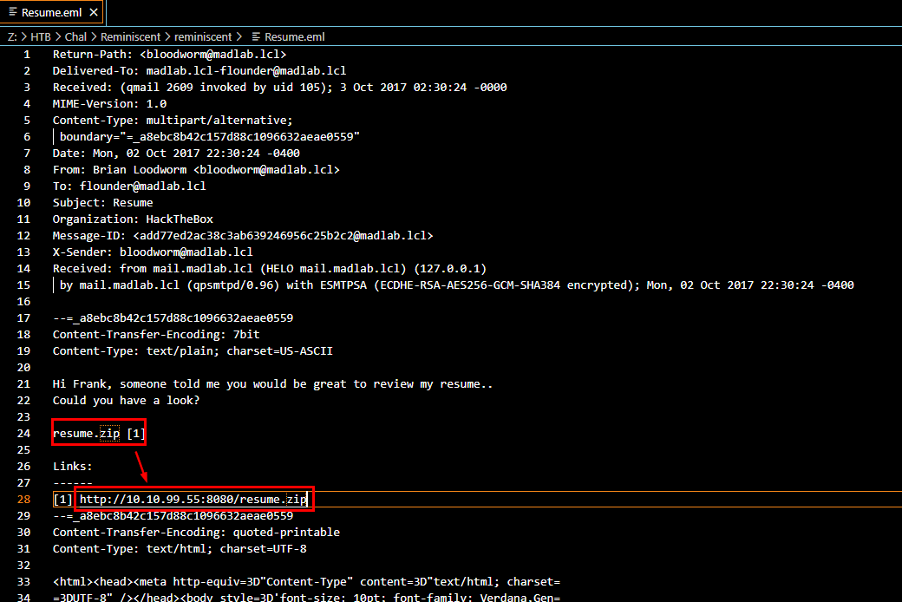
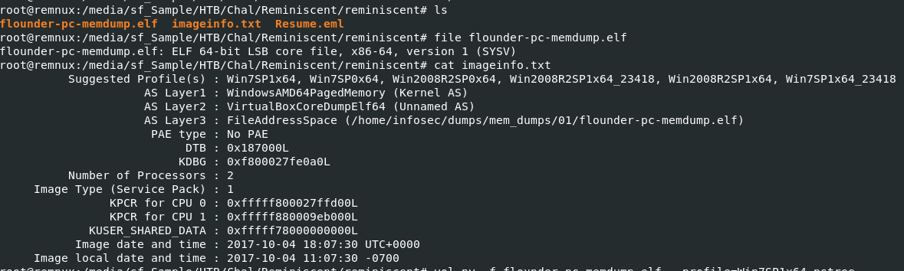
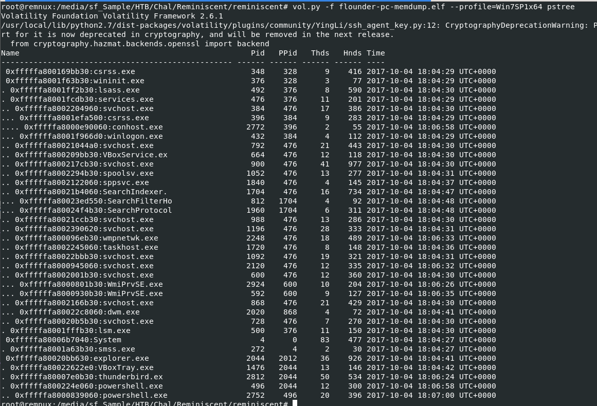
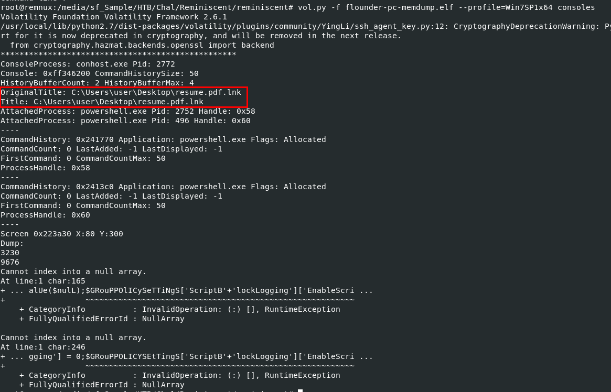
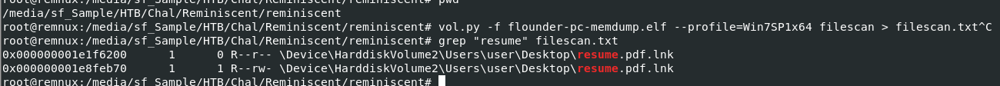
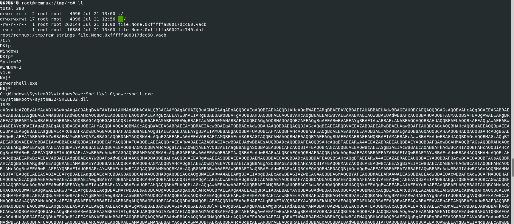
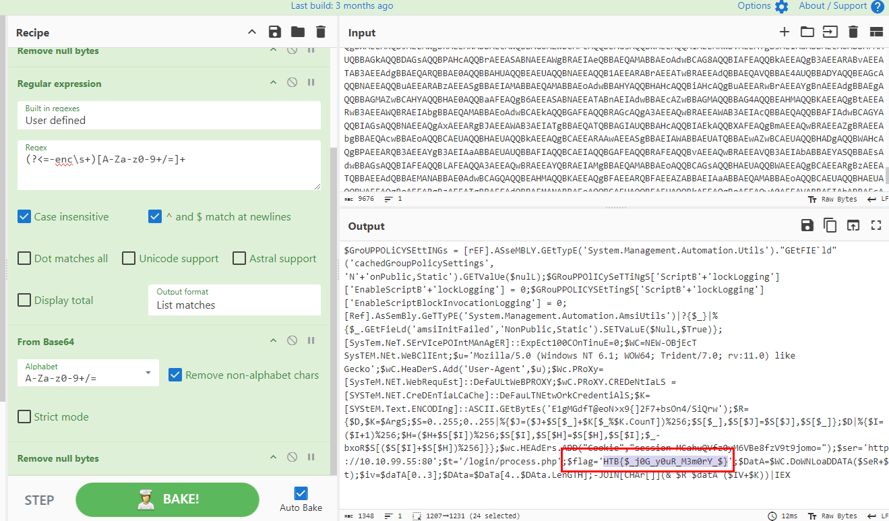

# [HackTheBox - Reminiscent](https://app.hackthebox.com/challenges/Reminiscent)
Created: 21/07/2024 22:19
Last Updated: 22/07/2024 01:20
***
**DIFFICULTY**: Easy
**CATEGORY**: Forensics
**CHALLENGE DESCRIPTION** 
Suspicious traffic was detected from a recruiter&#039;s virtual PC. A memory dump of the offending VM was captured before it was removed from the network for imaging and analysis. Our recruiter mentioned he received an email from someone regarding their resume. A copy of the email was recovered and is provided for reference. Find and decode the source of the malware to find the flag.
***
## Uncovering Phishing Email


Lets start with a phishing mail that recruiter receive, and it just an email telling recruiter review his resume that was sent as an attachment and it is 100% malicious

## Getting an attachment from memory image


Since we do not have other way to get the malicious attachment file other than memory image file (even though it has an `.elf` extension, it is indeed a memory image file)

and luckily for us, `imageinfo.txt` contains result from `imageinfo` plugin of Volatility 2 so we do not have to run `imageinfo` to determine which profile is the most suitable one to examine this memory image



Let's start with `vol.py -f flounder-pc-memdump.elf --profile=Win7SP1x64 pstree` to list the process tree that was running when this memory image was taken. From the result, we can see that there are two powershell.exe processes that stand out.



Then I used `vol.py -f flounder-pc-memdump.elf --profile=Win7SP1x64 consoles` to show any console activities on the system. From this result, we can see that resume.pdf.lnk (which is a Windows Shortcut file famously abused by many malware) spawned the two PowerShell processes we found earlier. Now, we have a filename to search and dump.



Lets do that with `vol.py -f flounder-pc-memdump.elf --profile=Win7SP1x64 filescan | grep "resume"` to find physical address of this file and then use `vol.py -f flounder-pc-memdump.elf --profile=Win7SP1x64 -Q 0x000000001e1f6200 -D /tmp/re/` to dump it 



We can copy this file to open it on Windows, but using `strings` to get base64 encoded string is already enough for this challenge

## What the PowerShell do?


Here my complete recipe on how to get a flag
- "From Base64" which turn into another PowerShell command 
- "Remove null bytes"
- "Regular Expression" with `(?<=-enc\s+)[A-Za-z0-9+/=]+` to get base64 strings
- "From Base64" 
- And lastly "Remove null bytes" again 

Now we can see a flag and full PowerShell script which will disable security features, downloads encrypt data from C2, Decrypt that data with RC4 to get an actual payload and execute it

## Submit the flag

```
HTB{$_j0G_y0uR_M3m0rY_$}
```


***

