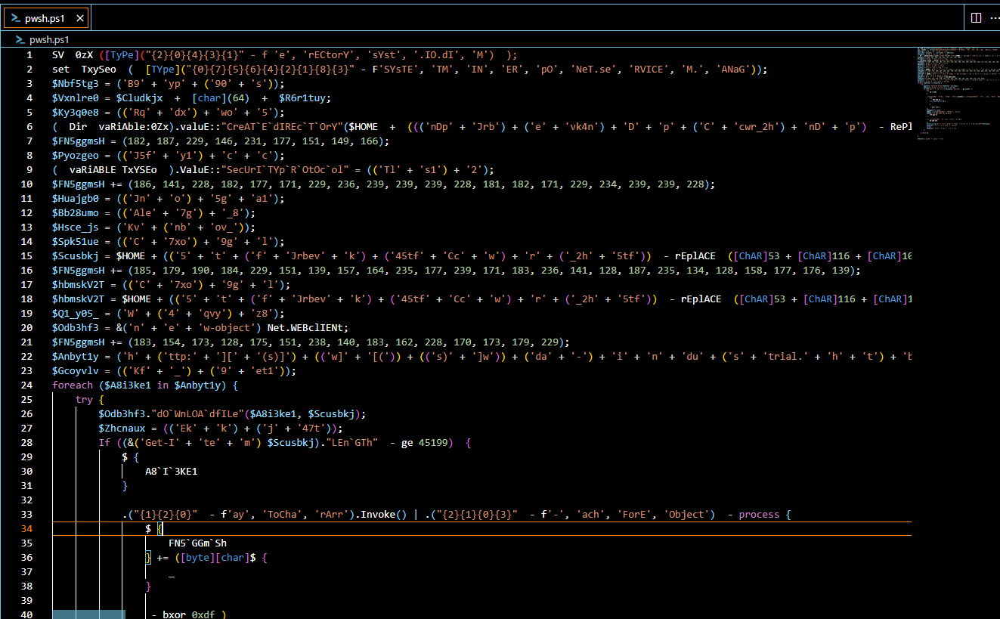

# [HackTheBox - emo](https://app.hackthebox.com/challenges/emo)
Created: 21/07/2024 15:16
Last Updated: 21/07/2024 17:39
***
**DIFFICULTY**: Easy
**CATEGORY**: Forensics
**CHALLENGE DESCRIPTION** 
WearRansom ransomware just got loose in our company. The SOC has traced the initial access to a phishing attack, a Word document with macros. Take a look at the document and see if you can find anything else about the malware and perhaps a flag.
***
## Desparate VBA dumping


After checking file type with `file` then I used `oleid` to determine if there is any VBA macro inside this file and turn out it is


But there are too many codes to deobfuscated which is not match difficulty of this challenge at all so I have to use resort dynamic analysis

## Dynamically get another obfuscated script


Searching filehash on [any.run](https://app.any.run/tasks/0b665e52-32ed-4445-8c2f-ac0d3b0802ed/) then we will come across multiple public report that flagged this doc as Emotet malware and when opened, it will execute another PowerShell script that encoded with base64  


After decoding it, we still have some manual work to de-obfuscate them but its more manageable than VBA Macro we found eariler



We might need a little bit of beautify to do so we can use CyberChef "Generic Code Beautify" and now its less painful when reading them 

And we can see that there are a lot of variables being declared but ultimately, this script will 
- Create a directory
- Set security protocol to TLS 1.2
- Download  a file and execute it

## But where is the flag?


I figured out that there is an array that keep expanding with these numbers and it serves other purpose that is not just making things look more messier 


Keep following this array then we can see that it will be XOR'ed with "0xdf" then add a number to a list again before encoding with base64 but I did not see where this variable (that stored base64 encoded) was called after this operation


So let's copy only the relevant part of the script to inspect the value stored in that variable. It turns out it stores a flag as we can see here

## Submit a flag

```
HTB{4n0th3R_d4Y_AnoThEr_pH1Sh}
```


***
## Script that get me a flag
```
$a = (182, 187, 229, 146, 231, 177, 151, 149, 166);
$a += (186, 141, 228, 182, 177, 171, 229, 236, 239, 239, 239, 228, 181, 182, 171, 229, 234, 239, 239, 228);
$a += (185, 179, 190, 184, 229, 151, 139, 157, 164, 235, 177, 239, 171, 183, 236, 141, 128, 187, 235, 134, 128, 158, 177, 176, 139);
$a += (183, 154, 173, 128, 175, 151, 238, 140, 183, 162, 228, 170, 173, 179, 229);

foreach($i in $a) {
    ${a} += ([byte][char]$i -bxor 0xdf ) 
}

$a += (228);
$b = [System.Convert]::ToBase64String($a);
$c = [System.Text.Encoding]::UTF8.GetString([System.Convert]::FromBase64String($b));
Write-Host $c
```
***