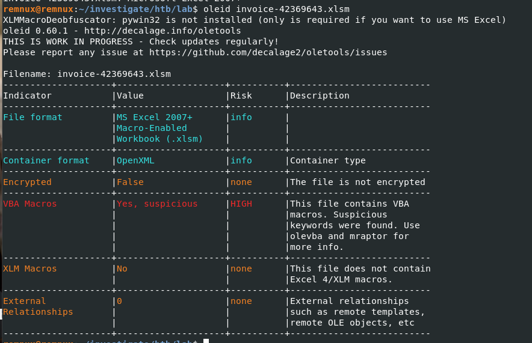
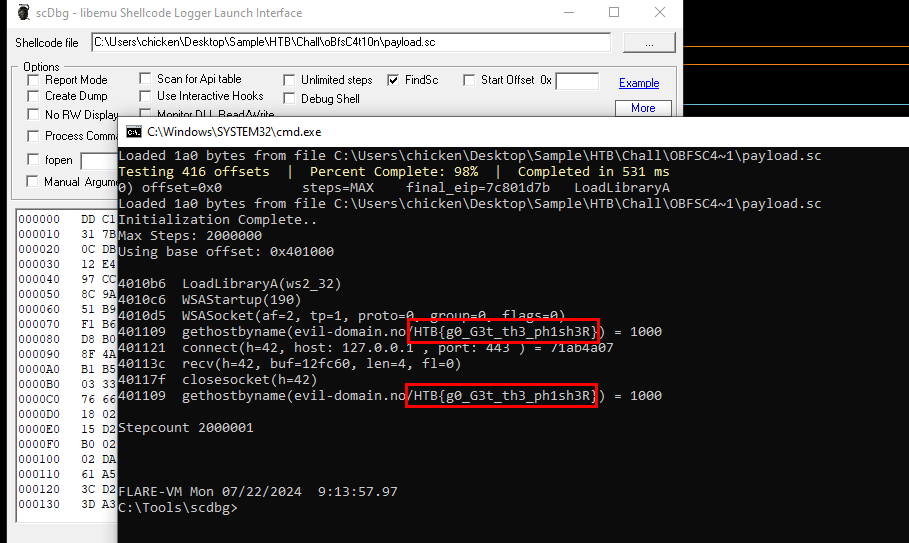

# [HackTheBox - oBfsC4t10n](https://app.hackthebox.com/challenges/oBfsC4t10n)
Created: 22/07/2024 14:34
Last Updated: 22/07/2024 16:53
***
**DIFFICULTY**: Hard
**CATEGORY**: Forensics
**CHALLENGE DESCRIPTION** 
This document came in as an email attachment. Our SOC tells us that they think there were some errors in it that caused it not to execute correctly. Can you figure out what the command and control mechanism would have been had it worked?
***
## Extracting Malicious Document from HTML file


## Analyzing Malicious Document




We can use `olevba` to dump all vba macro to analyze them but I was too lazy for that so I calculated filehash and search for public report of this maldoc


And I eventually found this [gem](https://app.any.run/tasks/9f0785c8-a6d6-4e02-9aab-cc6d028c92ab/) on any.run, when malicious document was opened then `LwTHLrGh.hta` will be dropped in User's Temp folder then it will be executed with `mshta` and as you can see that someone who created this report already uploaded this to [pastebin](https://pastebin.com/CVQTE8KN) and `8d74853d271ec7a12880c4e33591df212628e3cb6a2f4038adad28c4b6891a96` is SHA256 hash of this file so you can search on any sandbox to download this file


After we got a file, it also contains another VBS macro and it was heavily obfuscated so lets focus on it

***Note***: lwlx wrote a good [write-up](https://dev.lwlx.xyz/blog/htb-obfsc4t10n-challenge-writeup/) on this challenge about de-obfuscated macro explanation so it would be the best to read this write-up to learn how this macro works

## Getting some juicy shellcode


After examined de-obfuscated macro then the most interesting part is this `myArray` which contains the data that is written into a block of memory allocated by `AllocStuff`. Each value in `myArray` is written sequentially into this memory block. 

The values in `myArray` are likely to be shellcode so we have to get this out as a file and use `scdbg` to debug it


Lets convert it from Signed Decimal to Hex 


If you are using linux then you can create shellcode file with `xxd` but at the time, I used Flare-VM so I had to use this python script to convert hex to binary data and write it as a file so we can use `scdbg` to debug it



After debugging, we can see that it uses Windows Socket API to resolve domain name which is our flag

## Submit the flag
```
HTB{g0_G3t_th3_ph1sh3R}
```


***

