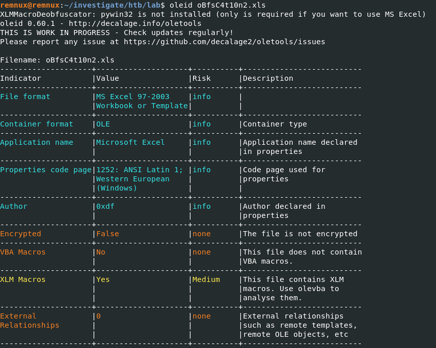
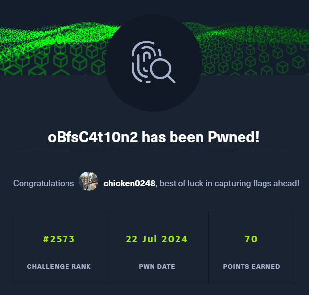

# [HackTheBox - oBfsC4t10n2](https://app.hackthebox.com/challenges/oBfsC4t10n2)
Created: 22/07/2024 17:05
Last Updated: 22/07/2024 19:06
***
**DIFFICULTY**: Hard
**CATEGORY**: Forensics
**CHALLENGE DESCRIPTION** 
Another Phishing document. Dig in and see if you can find what it executes.
***
## What kind of macro we got again!?


By using `oleid`, we can see that this file was embbeded with XLM Macros


Now we can use `olevba` to emulate what this XLM macro will do, which we can see that it will download dll file from C2 server then execute it but what we can also see some parts of a flag right there

## So how do we get a flag?


I saved an output of `olevba` to a text file with `olevba oBfsC4t10n2.xls > olevba.txt` then started analyzed from the top of the result which we can see that a flag will be created using `CONCATENATE` function


So if we just use `grep -i "concat" olevba.txt` then we will see last part of a flag right there

>Flag
```
HTB{n0w_eXc3l_4.0_M4cr0s_r_b4cK}
```


***

