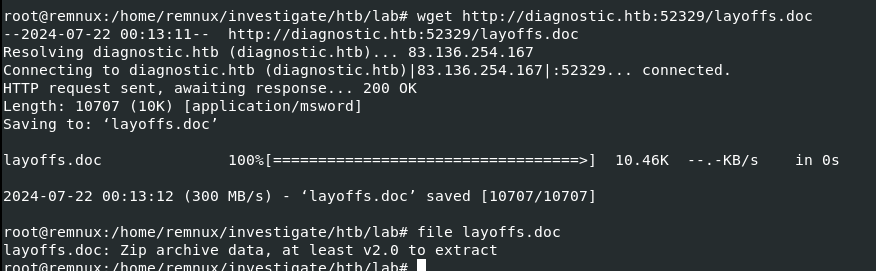

# [HackTheBox - Diagnostic](https://app.hackthebox.com/challenges/Diagnostic)
Created: 22/07/2024 11:11
Last Updated: 22/07/2024 12:16
***
**DIFFICULTY**: Easy
**CATEGORY**: Forensics
**CHALLENGE DESCRIPTION** 
Our SOC has identified numerous phishing emails coming in claiming to have a document about an upcoming round of layoffs in the company. The emails all contain a link to diagnostic.htb/layoffs.doc. The DNS for that domain has since stopped resolving, but the server is still hosting the malicious document (your docker). Take a look and figure out what's going on.
***
## Getting a file from web server


Lets add this IP address and its domain to our `hosts` file so we will not have to deal with IP address when interacting with web server



We can use `wget` or `curl` to download malicious document file from the server like this


Since its a document file then we can use `oleid` from [oletools suite](https://github.com/decalage2/oletools) to find any suspicious indicators from this file and then we can see that it has 1 external relationship indicator right there 

## Malicious Document exploiting what?


We can use `oleobj` from the same suite to show which external entity this file was linked to. which in this case it calling another html webpage on the same host and port (`http://diagnostic.htb:52329/223_index_style_fancy.html`)


I used `curl` to fetch this URL and you can see that there is an exploitation within `script` tag and this is [Follina vulnerability (CVE-2022-30190)](https://blog.qualys.com/product-tech/2022/06/14/detect-the-follina-msdt-vulnerability-cve-2022-30190-with-qualys-multi-vector-edr-context-xdr) which exploiting Microsoft Support Diagnostic Tool (MSDT) to serve PowerShell payload so which mean these base64 strings are PowerShell code that will be executed when user fetch this webpage


But there are 2 parts of base64 strings, this part is the legitimate one (legit in term of an exploitation)


The other one is just a lyric of some song, lets forget about it

## Making some sense to get a flag


Decode first base64 string then we can see that it will download another executable file then execute it and we can see that a file that will be downloaded is a flag of this challenge


So lets execute only just this part so get a flag and submit it!

## Submit the flag

```
HTB{msDt_4s_A_pr0toC0l_h4nDl3r...sE3Ms_b4D}
```


***

